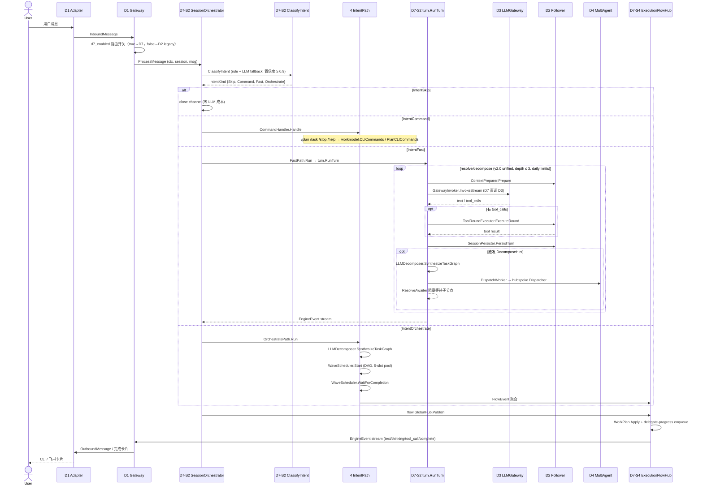

# 端到端请求流（D7 编排层 v2.0 时代）

**Last Updated:** 2026-06-19
**代码锚点：** `gateway.go` → `coordinator/orchestrator.go:ProcessMessage` → `turn/orchestrator.go:RunTurn` → `bridges/llm` + `wave/scheduler.go`
**SoT：** `openspec/specs/d7-orchestration/spec.md` v3.8.0

> **主入口已迁移 D7（v1.0 closure 2026-06-15, PR #36）。** D1 ingress → D7-S2 SessionOrchestrator → 4 IntentKind → 4 真实执行链。D2 QueryLoop legacy 路径**仅作 fallback**，D2→D3 import ban 已被 CI 硬阻断（D7 拥有 LLM 调用权，DM-020）。

---

## 1. 总览时序



---

## 2. D1 Gateway 阶段

**入口：** `internal/layers/communication/capture/gateway.go`

1. 适配器将 IM/CLI 消息转为 `InboundMessage`
2. Gateway 解析会话、注入 `RequestID`、创建 **SERVER** span `gateway.message.receive`
3. **d7_enabled 路由开关**（`devrix.yaml::orchestration.enabled`）：
   - `true`（**默认**）→ 调用 `D7-S2 SessionOrchestrator.ProcessMessage`
   - `false` → 回退到 D2.QueryLoop.Run legacy（DM-20260616-004 标记 DEPRECATED，仅 fallback）
4. 消费 `<-chan *contracts.EngineEvent`，将 `text` / `thinking` / `tool_call` / `permission_required` 转为出站消息
5. 收到 `complete` 时：`buildCompletionSummary(duration, usage, model, ctx_pct)` 生成任务完成卡片

`ctx_pct` 由 D7-S2 在 emit complete 时经 `contracts.ComputeCtxPct` 计算（DM-20260611-008）。

---

## 3. D7-S2 ProcessMessage 管线

**入口：** `internal/layers/orchestration/coordinator/orchestrator.go:ProcessMessage`

| 步骤 | D-S | Activity | 说明 |
|------|-----|----------|------|
| 1 | D7-S2-A01 | Receive | 从 D1 接收 `InboundMessage`，附 RequestID + session 上下文 |
| 2 | D7-S2-A02 | ClassifyIntent | `RuleClassifier` (5 规则) + `LLMClassifier` fallback（5s timeout，置信度 ≥ 0.9）|
| 3 | D7-S2-A03 | Dispatch | `switch IntentKind` v1.1.0+ **正交分发**（DM-20260615-004）：4 case → 4 独立执行函数 |
| 3a | D7-S2-A03 | IntentSkip | `close channel`，零 LLM 成本 |
| 3b | D7-S2-A03 | IntentCommand | `CommandHandler.Handle` → `workmodel.CLICommands` / `PlanCLICommands` |
| 3c | D7-S2-A03 | IntentFast | `FastPath.Run` → `turn.RunTurn` resolve/decompose 循环 |
| 3d | D7-S2-A03 | IntentOrchestrate | `OrchestratePath.Run` → `LLMDecomposer` + `WaveScheduler` |
| 4 | D7-S2-A06 | RunTurnLoop | 仅 IntentFast 路径；调 `D3`（D7 直调）+ 调 D2 Follower |
| 5 | D7-S2-A04 | DispatchWorker | IntentOrchestrate / DecomposeHint 触发时 → `hubspoke.Dispatcher` → D4 Worker |
| 6 | D7-S4 | Publish | `flow.GlobalHub.Publish(FlowEvent)` → WorkPlan 读模型 + IM sink |

**关键设计（DM-020 产权声明）：**
- D7 是**唯一有权决定何时调用 D3** 的域
- D2 拥有"请求 LLM 结果"的权利（通过 `CompressHint`），但不拥有"执行 LLM 调用"的权利
- 该产权通过 `internal/lint/layer/d2_d3_ban_test.go` CI 硬阻断（4/4 白名单已满）

**Path 计数：** D5 observability 记 `path={fast,command,orchestrate,skip}`；D6 PathRegressionProbe 监控 legacy 路径（应趋近 0）。

---

## 4. turn.RunTurn resolve/decompose 循环

**入口：** `internal/layers/orchestration/turn/orchestrator.go:RunTurn`

```
while (有 tool_use 且未 cancel 且 turn < maxTurns):
    1. ContextPreparer.Prepare (D2 Follower) — 组装合法上下文 + CompressHint
    2. LLMInvoker.InvokeStream (D7 直调 D3) — ChatStream
    3. 流式 emit: thinking / text / tool_call
    4. 若有 tool_calls:
         ToolRoundExecutor.ExecuteRound (D2 Follower) — 权限门控 + 沙箱
         SessionPersister.PersistTurn (D2 Follower) — 快照 + transcript + commit
    5. v2.0 unified 检查（PR #85-#87）：
         - FocusHint 命中 → ResolveAwaiter 阻塞等待 focus child
         - DecomposeHint 触发 → LLMDecomposer.SynthesizeTaskGraph
                            → hubspoke.Dispatcher → D4 Worker
         - depth limit（≤ 3, configurable）→ 超限停止 decompose
         - daily limit → 触发 graceful stop
    6. turn++
emit complete
```

**v2.0 unified 新增能力（PR #83-#87）：**
- `task_write` / `task_spawn` / `task_await` 统一 alias（D7-S1 WorkModel v2）
- `WorkItem` + `WorkTree` 统一任务抽象（替代 v1.x PlanTask / WaveTaskNode / BackgroundRun 三模型）
- `RunRegistry` 内联实现（v1.x `RunRegistry` 拆包已取消）
- `FocusHint` + `ResolveAwaiter` 阻塞 await 跑中的子节点

**SubQuery / Fork 状态：** `query/subquery.go`、`fork.go` 已 **DEPRECATED**（DM-20260616-004 queryloop legacy decommission 落地），仅作 fallback；D2 自身保持 `query/loop.go` 239 行的瘦身版本，orchestration 字段已清零（`Hooks` / `Attachments` / `SessionQueue` 4 字段已移除）。

---

## 5. D3 LLM 调用

**D7 直调 D3（D7-S2-A07 InvokeLLM）**：

```
turn/orchestrator.go:RunTurn
  → turn/llm.go:GatewayInvoker.InvokeStream
       → bridges/llm (启动时注入具体 ILLMGateway)
            → llmgateway.ILLMGateway.ChatStream
```

**Span 链（生产路径）：**

```
gateway.message.receive (SERVER)
  └── orchestration.process (INTERNAL)        ← D7-S2 ProcessMessage
        ├── orchestration.classify (INTERNAL)  ← ClassifyIntent
        ├── orchestration.turn (INTERNAL)      ← turn.RunTurn（仅 IntentFast）
        │     └── llm.stream (CLIENT)          ← D3 ChatStream
        │           └── llm.adapter.stream     ← 具体 Provider
        ├── orchestration.orchestrate (INTERNAL) ← IntentOrchestrate
        │     └── orchestration.wave.* (INTERNAL)
        └── orchestration.flow.publish (INTERNAL) ← flow.GlobalHub.Publish
```

> `context.pev.*` span 族已随 PEV 退役（D2-S1 RETIRED 2026-06-13），不再注册于 coverage registry。

**D2→D3 import ban：** `internal/lint/layer/d2_d3_ban_test.go` 维护 4/4 白名单（`{".", "mock", "query", "prepare/compression"}`），全部为 Deprecated fallback 路径，CI 硬阻断任何新增。

---

## 6. 工具执行与权限

```
turn.RunTurn
  → contracts.IToolRoundExecutor（D2 Follower, D2-S18）
       → toolrunner.ToolRunner.Execute
            → sandbox.DefaultCommandPolicy
            → bash / read_file / grep / edit / …
            → tools-terminal surface（5 Surface × LTL-Lite 不变式, DM-20260618-007）：
                 ├─ LSP surface（5 typed method: goToDefinition/findReferences/...）
                 ├─ Bash surface（mvdan.cc/sh v3.x + BashAST fail-closed）
                 ├─ Tracker surface（diff/LRU/async, linter 路由）
                 ├─ FreeFork surface（WorkerContext + Worktree 隔离 + 并发 budget）
                 └─ Verify surface（parser + executor + aggregator）
```

**权限门控：** D2-S3-A01 `permission.Mode`（Plan 模式只读过滤）；D2-S3-A04 `FileAutoApprover`；D4 AgentPermissionGate（D2/D4 共用 `contracts.IPermissionGate`）。

**CRITICAL 工具：** Agent 状态 → `WAITING_PERMISSION`，Gateway 注入用户响应后继续。

**PlanAgent Read-Only Sandbox（DM-20260616-001）：** `workmodel/plan_agent.go::ValidateToolCall` 运行时白名单校验，fail-closed 在 unknown tool。

---

## 7. Delegate / Worker 旁路

Hub-Spoke 委派时，Worker 使用 **独立 session overlay** + **v2.0 unified WorkItem**：

```
D7-S2-A04 DispatchWorker
  → hubspoke.Dispatcher
       ├─ D4 Delegate.Service
       │     └─ FlowBridge → flow.GlobalHub.Publish
       └─ D2 SubQuery (DEPRECATED, fallback)
              └─ 同 QueryLoop, 隔离 WorkDir
                    → Worktree.per-handle wt path (v2.0 unified)
                    → FlowEvent → ORCH Hub → D1 worker_progress 卡片
```

**WaveScheduler（独立调用路径，由 decompose / Plan 触发）：**

```
OrchestratePath.Run / DecomposeHint
  → LLMDecomposer.SynthesizeTaskGraph (D7-S5-A03, 5s timeout + rule fallback)
       → WaveScheduler.Start
            ├─ TaskGraph.ReadyNodes (DAG 拓扑, sorted by id)
            ├─ WorkerPool.Acquire (cursor=1, claude_code=1, subagent=3)
            ├─ ConflictGuard.Allow (by conflict_group mutual exclusion)
            ├─ ContextResolver.Resolve (fresh|resume|upstream)
            └─ WorkerRunner.Run → ArtifactStore
       → WaveScheduler.WaitForCompletion
       → FlowEvent 聚合 → flow.GlobalHub.Publish
```

详见 `openspec/specs/architecture/code-atlas.md` v1.2.0 D-S Index。

---

## 8. 相关配置键

| 键 | 默认 | 影响 |
|----|------|------|
| `orchestration.enabled` (`d7_enabled`) | `true` | D7-S2 主入口 vs D2 QueryLoop legacy fallback |
| `orchestration.classifier.confidence_threshold` | `0.9` | 规则匹配最低置信度；不达回退 LLM |
| `orchestration.classifier.llm_timeout_ms` | `5000` | LLM fallback 超时 |
| `orchestration.turn.max_turns` | `50` | turn.RunTurn 单次会话最大 turn 数 |
| `orchestration.turn.depth_limit` | `3` | resolve/decompose 嵌套深度（v2.0 unified）|
| `orchestration.turn.daily_limit` | — | 单 session 每日任务上限（v2.0 unified）|
| `workmodel.*` | — | Task/Plan 写模型配置（store_dir / mode=v2）|
| `wave.pool_capacity` | `5` | WorkerPool 槽位数（cursor=1, claude_code=1, subagent=3）|
| `wave.conflict_groups` | — | 互斥冲突组 |
| `execution_flow.link_tasks` | `true` | FlowEvent ↔ Task 联动 |
| `execution_flow.im_progress` | `true` | worker_progress 飞书卡片推送 |
| `execution_flow.tool_summary_throttle_ms` | `500` | 快速 tool_call 节流 |

完整列表：`docs/config.md` + `devrix.yaml`。

---

## 9. 进一步阅读

- **D7 SoT**：`openspec/specs/d7-orchestration/spec.md` v3.8.0（2026-06-18）
- **D7 S 层博弈角色**：`openspec/specs/d7-orchestration/d7-domain.md` v1.1.0
- **D2 Follower 契约**：`openspec/specs/d2-context-engine/d7-boundary.md`
- **D-S Index 索引**：`openspec/specs/architecture/code-atlas.md` v1.2.0
- **DSAFT 方法论**：`docs/architecture/dsaft-overview.md` v1.1.0
- **跨层契约**：`docs/architecture/contracts-and-boundaries.md`
- **Tools Terminal Surface**：`openspec/specs/d2-context-engine/spec.md`（5 Surface × LTL-Lite 不变式, DM-20260618-007）
- **Tech Debt**：`openspec/tech-debt/worktree-v2-deferred.md`（TD-WT-01..06）
