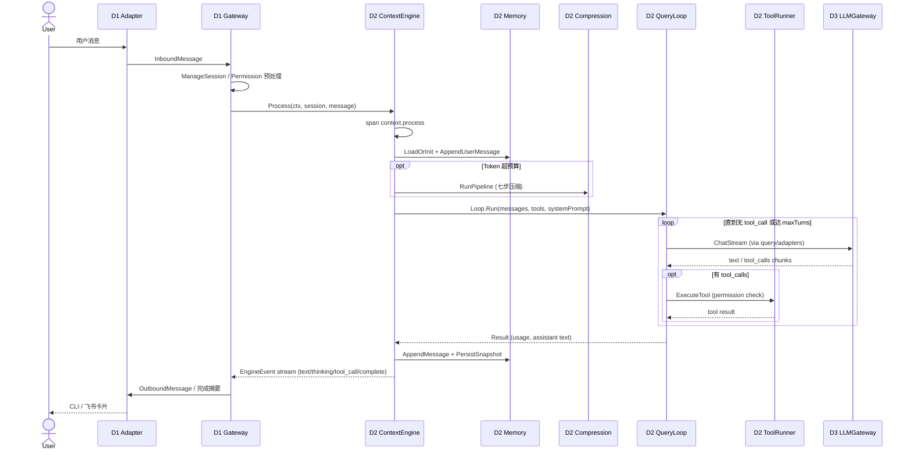

# 端到端请求流（QueryLoop 时代）

**Last Updated:** 2026-06-13  
**代码锚点：** `gateway.go` → `engine.go:runProcess` → `query/loop.go:Run` → `llmgateway`

---

## 1. 总览时序



---

## 2. D1 Gateway 阶段

**入口：** `internal/layers/communication/capture/gateway.go`

1. 适配器将 IM/CLI 消息转为 `InboundMessage`
2. Gateway 解析会话、注入 `RequestID`、创建 **SERVER** span `gateway.message.receive`
3. 调用 `IEngine.Process`（D2），消费 `<-chan *EngineEvent`
4. 将 `text` / `thinking` / `tool_call` / `permission_required` 转为出站消息
5. 收到 `complete` 时：`buildCompletionSummary(duration, usage, model, ctx_pct)` 生成任务完成卡片

`ctx_pct` 由 D2 在 emit complete 时经 `contracts.ComputeCtxPct` 计算（DM-20260611-008）。

---

## 3. D2 Process 管线

**入口：** `ContextEngine.runProcess`（`engine.go`）

| 步骤 | Activity / S | 说明 |
|------|----------------|------|
| 1 | D2-S6 LoadOrInit | 从 `ContextSnapshot` 恢复 `SessionContext` |
| 2 | D2-S9 Bootstrap | 仅 `harness.enabled && 首次 Process`（legacy 可关） |
| 3 | D2-S3 LongTerm Recall | `EnrichWithLongTermRecall` 注入记忆条目 |
| 4 | Append user | 幂等 `requestID` 去重 |
| 5 | D2-S2 Compression | Token 超预算时七步管道；QueryLoop 可 `compress_per_turn` |
| 6 | D2-S9 装配（legacy） | Preflight / Router / SystemPromptBuild — 仅 legacy harness 分支 |
| 7 | **D2-S10 QueryLoop** | **`queryLoop.Run`** — 生产主路径 |
| 8 | D2-S6 Persist | 写回 `sc.Messages`、快照、transcript |

**Path 计数：** `obsruntime.Record(PathQueryLoop)` vs `PathLegacyHarness` — D6 门禁。

---

## 4. QueryLoop 内循环

**入口：** `query.Loop.Run`（`query/loop.go`）

```
while (有 tool_use 且未 cancel 且 turn < maxTurns):
    1. UserContext prepend（若配置）
    2. Plan mode attachments 注入
    3. LLMCaller.Call → D3 ChatStream
    4. 流式 emit: thinking / text / tool_call
    5. 若有 tool_calls:
         PermissionChecker → ToolExecutor → toolrunner
         SessionQueue 通知（background 任务）
    6. LoopHooks.AfterToolRound（可选提前 stop）
    7. turn++
emit complete（或由 engine 补发）
```

**Recovery（TD-QL-01/03）：** 413 → messages-only 压缩重试；overload/5xx → `FallbackLLM`（部分接线）。

**SubQuery / Fork：** `query/subquery.go`、`fork.go` — Explore 只读、sidechain transcript 恢复。

---

## 5. D3 LLM 调用

D2 **不得** import `llmgateway/adapter` 实现包。边界：

```
query/adapters.go  →  llmgateway.ILLMGateway.ChatStream
bridges/llm/       →  进程启动时注入具体 Gateway 实现
```

Span 链（生产路径）：

```
context.process (INTERNAL)
  └── llm.stream (CLIENT)        ← QueryLoop 每轮 LLM
        └── llm.adapter.stream   ← 具体 Provider
```

> `context.pev.*` span 族已随 PEV 退役，不再注册于 coverage registry。

---

## 6. 工具执行与权限

```
QueryLoop
  → contracts.IPermissionGate（D4 AgentPermissionGate 或 Gateway 适配器）
  → toolrunner.ToolRunner.Execute
       → sandbox.DefaultCommandPolicy（D2-S8）
       → bash / read_file / grep / edit / …
```

CRITICAL 工具：Agent 状态 → `WAITING_PERMISSION`，Gateway 注入用户响应后继续。

---

## 7. Delegate / Worker 旁路

Hub-Spoke 委派时，Worker 使用 **独立 session overlay**：

```
D4 Delegate → WorkerEngine.ProcessOverlay
  → ContextEngine.Process(workerLocal=true)
  → 同一 QueryLoop，隔离 WorkDir（D2-S12 Worktree）
  → FlowEvent → ORCH Hub → D1 worker_progress 卡片
```

详见 [code-map.md](./code-map.md) D4-S10 / ORCH-S2。

---

## 8. 相关配置键

| 键 | 默认 | 影响 |
|----|------|------|
| `context_engine.query_loop.enabled` | `true` | QueryLoop vs legacy harness |
| `context_engine.harness.enabled` | 视版本 | Bootstrap / 重装配分支 |
| `context_engine.compression.*` | — | 压缩触发与 autocompact |
| `multi_agent.enabled` | — | Delegate / Worker wiring |

完整列表：`docs/config.md`

---

## 9. 进一步阅读

- DSAFT 编号：[dsaft-overview.md](./dsaft-overview.md)
- 契约与 import 红线：[contracts-and-boundaries.md](./contracts-and-boundaries.md)
- OpenSpec 验收：`openspec/specs/d2-context-engine/spec.md` V6
