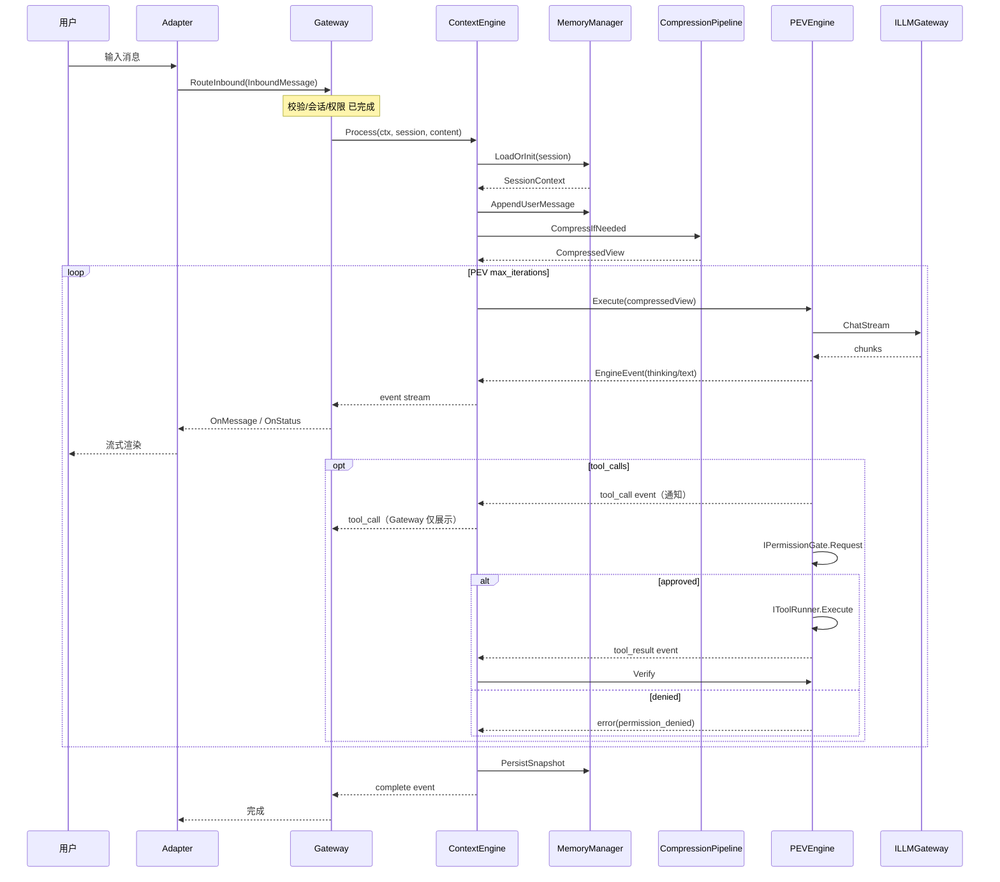
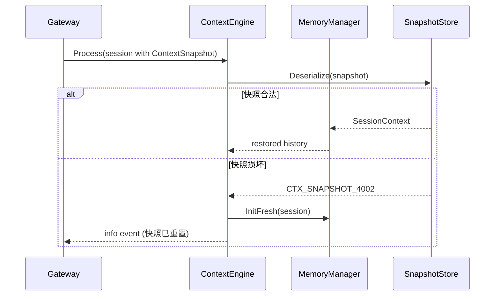

# 上下文引擎详细设计（Layer 2）

**文档类型:** 详细架构设计（遵循 `docs/detail design framework.md`）
**Change ID:** devrix-context-engine
**Demand ID:** DM-20260607-002
**版本:** 1.0.0
**状态:** Ready for S4
**关联 OpenSpec:** `openspec/archive/2026-06-07-devrix-context-engine/`（已归档）；规格 SoT：`openspec/specs/context-engine/spec.md`

---

## 文档索引

| 文档 | 用途 |
|------|------|
| 本文档 | 按六段式框架展开的**可读架构设计**（评审 / onboarding） |
| `openspec/archive/2026-06-07-devrix-context-engine/design.md` | OpenSpec 实施设计（包结构、代码骨架、版本分期） |
| `openspec/specs/context-engine/spec.md` | 验收规格（Gherkin Scenario → L5，canonical） |
| `openspec/specs/context_engine_layer_delta.md` | 层能力 Delta SoT |

---

## ① 架构目标

### 业务目标

| 痛点 | 目标能力 | 用户可感知结果 |
|------|----------|----------------|
| Stub 引擎仅 Echo，无法真正「开发助手」 | 真实对话循环 + 工具调用 | 用户提问后获得 LLM 推理与工具执行结果 |
| 长对话 Token 爆炸、LLM 调用失败 | 七步压缩管道 | 超长会话仍可继续，不丢最近关键上下文 |
| 会话重启丢失历史 | ContextSnapshot 持久化 | `/new` 之前的历史可恢复（同 Session） |
| 工具执行结果不可信 | PEV Execute→Verify | 工具失败后自动重试或明确报错 |
| 通信层四流无内容源 | 引擎统一产出 EngineEvent | CLI/飞书可见 thinking、进度、错误 |

### 技术目标（量化）

| 指标 | V1 目标 | 测量方式 |
|------|---------|----------|
| **压缩延迟** | P99 < 100ms（不含 LLM） | `IObserver.EmitContextCompressed` span |
| **Process 启动** | P99 < 50ms（含快照加载） | Gateway 入站到首 `thinking` 事件 |
| **Token 合规率** | 压缩后 ≤ 预算 95% | TokenCounter 前后对比 |
| **快照恢复成功率** | ≥ 99.9%（合法快照） | 集成测试 + 文件损坏注入 |
| **并发会话** | 单进程 1000 Session 上下文 map | 与通信层 `max_sessions` 对齐 |
| **可用性** | 引擎错误可恢复率 ≥ 95% | `error` 事件 `recoverable=true` 占比 |

### 约束条件

| 类型 | 约束 | 设计响应 |
|------|------|----------|
| **架构** | 不得反向依赖通信层 Adapter | 仅实现 `IContextEngine` |
| **依赖** | LLM/Multi-Agent 可滞后实现 | `ILLMGateway` / `IToolRunner` 接口 + Mock |
| **存储** | V1 文件 JSON，无 SQLite | ShortTerm → `ContextSnapshot` |
| **版本** | V1 无 Plan、无 Autocompact、无 L3 记忆 | 明确 stub / FeatureNotImplemented |
| **测试** | 遵守测试框架规约 | L5-CTX-* + `tests/` 分层 |
| **时间** | 约 86h（见 tasks.md） | 分 6 个 Milestone 交付 |

---

## ② 架构原则

### 设计原则

| 原则 | 上下文引擎落地 |
|------|----------------|
| **高内聚低耦合** | `contextengine` 包内聚 PEV/压缩/记忆；对外仅 `Process` + 依赖接口 |
| **面向失败设计** | Token 超限 → `CTX_EXCEEDED`；快照损坏 → 降级空上下文；PEV 超限 → 保留 partial |
| **数据所有权** | 消息历史归 `SessionContext`；`Session` 只持快照字节；通信层不直接改 history |
| **单向依赖** | L2 → L3/L4/L5 接口；L1 → L2 接口；禁止 L2 import `adapters` |
| **Accept Interfaces, Return Structs** | Go 惯例：依赖注入接口，返回具体 Engine/Memory 结构 |
| **可观测内建** | 每步压缩、PEV 相位通过 `IObserver` 上报 |

### 命名规范

| 类别 | 规范 | 示例 |
|------|------|------|
| 包路径 | `internal/layers/contextengine/{子域}` | `compression/steps/snip.go` |
| 接口 | 领域语义，避免 `I` 与 `Interface` 混用 | `CompressionPipeline`, `MemoryManager` |
| 跨层契约 | 保留 `IContextEngine`（与通信层已有） | 迁移目标：`shared/contracts` |
| 错误码 | `CTX_{DOMAIN}_{序号}` | `CTX_EXCEEDED_4001` |
| 事件类型 | snake_case 字符串 | `tool_call`, `milestone_progress` |
| 配置键 | snake_case YAML | `context_engine.max_context_tokens` |

### 代码风格

- 单文件 ≤ 400 行；压缩每一步独立文件
- 错误必须 wrap：`fmt.Errorf("compress snip: %w", err)`
- 禁止在 `Process` 中外泄 goroutine leak：context 取消时关闭 event channel
- 日志使用 `slog` + `session_id` / `trace_id`（由 Observability 注入）

---

## ③ 业务流程

### 3.1 核心用例：处理用户消息（Happy Path）



**RT 预算（不含 LLM 推理）：**

| 步骤 | 目标 RT |
|------|---------|
| LoadOrInit + Append | < 10ms |
| CompressIfNeeded | < 100ms |
| Snapshot Persist | < 20ms |
| 事件桥接 | < 5ms |

### 3.2 核心用例：会话恢复



### 3.3 异常补偿

| 异常 | 检测点 | 补偿策略 | 幂等 |
|------|--------|----------|------|
| Token 超限 | TokenBlock | 返回 `CTX_EXCEEDED`，不发 LLM | 同消息重试结果一致 |
| LLM 熔断 | ILLMGateway | `CTX_LLM_4004`，recoverable | 用户重发消息 |
| 工具执行失败 | IToolRunner | Verify fail → PEV 重试 | 工具需幂等设计 |
| 权限拒绝 | IPermissionGate | `error` + `recoverable=false` | 用户换指令重试 |
| PEV 超限 | iteration == max | `CTX_PEV_4003`，保留 partial 回复 | — |
| context 取消 | ctx.Done / `/stop` | Gateway.Stop → cancel，不发 complete | — |
| 快照写入失败 | PersistSnapshot | 日志告警，内存态仍可用 | 下次消息重试持久化 |

### 3.4 分支：压缩触发

```
用户消息到达
  → Count(tokens) > CompressionTarget?
       否 → 直接进入 PEV
       是 → 执行步骤 1→5 → Count仍超?
                是 → 步骤 7 TokenBlock → error
                否 → 进入 PEV
```

### 3.5 与通信层四流映射

| 流 | 引擎职责 | 事件类型 |
|----|----------|----------|
| ① 指令流 | 不解析 `/new` 等（Gateway 已处理） | — |
| ② 事件流 | LLM/工具主输出 | thinking, text, tool_call, tool_result, complete, error |
| ③ 任务流 | V3 Plan+Milestone | milestone_progress |
| ④ 信息流 | 压缩/恢复提示 | info |

---

## ④ 领域模型

### 4.1 限界上下文

```
┌─────────────────────────────────────────────────────────────┐
│  Devrix 系统                                                 │
│  ┌─────────────────┐    ┌─────────────────────────────┐   │
│  │ Communication   │    │ Context Engine (本上下文)    │   │
│  │ 会话/适配/路由   │───▶│ 历史/压缩/PEV/快照          │   │
│  └─────────────────┘    └───────────┬─────────────────┘   │
│                                        │                     │
│         ┌──────────────────────────────┼──────────────┐     │
│         ▼              ▼               ▼              ▼     │
│   LLM Gateway    Multi-Agent    Observability   Evolution   │
│   (模型调用)      (工具执行)     (追踪/指标)     (V3+)       │
└─────────────────────────────────────────────────────────────┘
```

**上下文引擎边界：** 管理「会话内认知状态」；不管理 IM 连接、权限 UI、模型路由策略。

### 4.2 聚合根

| 聚合根 | 职责 | 持久化 |
|--------|------|--------|
| **SessionContext** | 消息历史、PEV 状态、Token 预算、压缩视图 | ContextSnapshot |
| Session（通信层） | 会话身份、生命周期、WorkDir | FileSessionStore |

关系：`Session` 1:1 `SessionContext`（引擎域）；通过 `ContextSnapshot` 弱耦合同步。

### 4.3 实体与值对象

```
SessionContext (聚合根)
├── Messages[]          (实体 Message，复用 types.Message)
├── CompressedView[]    (值对象快照)
├── PEVState            (值对象)
├── TokenBudget         (值对象)
├── SystemPrompt        (值对象)
└── CompressionReport   (值对象，最近一次)

WorkingMemory (实体，Process 内)
├── StreamBuffer
├── ActiveTools[]
└── CurrentPEV          (引用)

ShortTermMemory (实体)
├── 与 SessionContext 同构子集
└── 负责序列化

LongTermMemory (V3 聚合，V1 stub)
└── Recall / Store → NotImplemented
```

### 4.4 领域事件（引擎内）

| 事件 | 触发 | 消费者 |
|------|------|--------|
| `context.initialized` | 新会话 | Observer |
| `context.restored` | 快照加载成功 | Observer |
| `context.compressed` | 压缩管道完成 | Observer / Metrics |
| `pev.phase_changed` | Execute/Verify 切换 | Observer |
| `context.snapshot_persisted` | Process 结束 | Observer |
| `context.exceeded` | TokenBlock | Gateway → Adapter 错误展示 |

### 4.5 模型关系图

```
┌──────────────┐       1:1        ┌──────────────────┐
│   Session    │◀────────────────▶│  SessionContext   │
│  (L1 聚合根)  │  ContextSnapshot │   (L2 聚合根)     │
└──────────────┘                   └────────┬─────────┘
                                            │
                    ┌───────────────────────┼───────────────────────┐
                    │                       │                       │
                    ▼                       ▼                       ▼
            ┌──────────────┐        ┌──────────────┐        ┌──────────────┐
            │ PEVState     │        │ TokenBudget  │        │ Message[]    │
            └──────────────┘        └──────────────┘        └──────────────┘
                    │
                    ▼
            ┌──────────────┐
            │ ToolCallRecord│
            └──────────────┘
```

---

## ⑤ 核心链路图

### 5.1 端到端路径（标注 SLA）

```
用户终端
  │ <10ms
  ▼
CLI/Feishu Adapter
  │ <5ms
  ▼
CommunicationGateway.RouteInbound
  │ <50ms  ┐
  ▼        │ 引擎域（本层 SLA）
ContextEngine.Process ─────────────────────────────┐
  ├─ MemoryManager.LoadOrInit          <10ms      │
  ├─ CompressionPipeline.Run           <100ms     │ P99 <200ms
  ├─ PEVEngine.Execute ────────────────────────────┤ (不含 LLM)
  │     └─ ILLMGateway.ChatStream      【外部】   │
  ├─ PEVEngine.Verify                  <20ms      │
  └─ SnapshotStore.Persist               <20ms      │
  │ <5ms                                         ┘
  ▼
Gateway.handleEngineEvents → Adapter 渲染
  │
  ▼
用户看到流式响应
```

### 5.2 瓶颈与优化策略

| 潜在瓶颈 | 占比预估 | 优化 |
|----------|----------|------|
| Token 计数 | 30% | 增量计数、缓存 per-message count |
| 压缩 Snip/Collapse | 40% | 提前触发、异步 V2 |
| 快照 JSON 序列化 | 20% | 精简字段、压缩算法 V2 |
| LLM 等待 | **外部主瓶颈** | 不属于本层 SLA |

### 5.3 单点风险

| 节点 | 风险 | 缓解 |
|------|------|------|
| 内存 SessionContext map | 进程崩溃丢未持久化上下文 | 每 Process 结束强制 Persist |
| 单进程 TokenCounter | 计数偏差 | 与 LLM Gateway 对齐校准（V2） |
| 无 L3 记忆 | 跨 Session 无项目知识 | V3 LongTerm；V1 靠 AGENTS.md |

---

## ⑥ 接口 / API 设计

> 上下文引擎为**进程内模块**，无 HTTP 暴露；「API」指 Go 接口契约与事件协议。

### 6.1 对外契约（L1 → L2）

```go
// 通信层已定义，本层实现
type IContextEngine interface {
    Process(ctx context.Context, session *types.Session, message string) <-chan *EngineEvent
}
```

**EngineEvent 协议（与 `gateway.go` 对齐，SoT）：**

| Type | 必填字段 | Metadata 键 | 说明 |
|------|----------|-------------|------|
| `thinking` | Content | — | 推理中 |
| `text` | Content | `is_complete`: `"false"`/`"true"` | 流式文本；最终块 `true` |
| `tool_call` | ToolName, ToolInput | `tool_name`, `input`, `risk_level` | 通知展示；权限在 L2 `IPermissionGate` |
| `tool_result` | Content, ToolName | `tool_name`, `error` | 工具结果 |
| `status` | Content | `state` | 会话状态 |
| `milestone_progress` | Content | `milestone_id`, `progress`, `task` | V3 |
| `info` | Content | `category` | 压缩/恢复提示 |
| `complete` | — | `usage`, `duration` | 本轮结束 |
| `error` | Content | `code`, `recoverable` | 错误 |

> Gateway 对 `tool_call` **仅展示**；`IPermissionGate` 在引擎内同步审批（见 §6.7）。

### 6.2 下游依赖接口（L2 → L3/L4/L5）

```go
type ILLMGateway interface {
    ChatStream(ctx context.Context, req *LLMRequest) (<-chan LLMChunk, error)
}

type IToolRunner interface {
    Execute(ctx context.Context, call ToolCall) (*ToolResult, error)
}

type IToolRegistry interface {
    ListTools(ctx context.Context, workDir string) ([]ToolSchema, error)
    RiskLevel(toolName string) RiskLevel
}

type IPermissionGate interface {
    Request(ctx context.Context, sessionID, toolName, input string, risk RiskLevel) (approved bool)
}

type IObserver interface {
    EmitContextCompressed(report CompressionReport)
    EmitPEVPhase(sessionID string, phase PEVPhase, iteration int)
    EmitSnapshotRestored(sessionID string, fromBackup bool)
    EmitErrorOccurred(sessionID string, code string, err error)
    EmitPEVIteration(sessionID string, iteration int, phase PEVPhase)
}
```

### 6.3 统一错误结构

与项目信封对齐（进程内 Error → EngineEvent）：

```json
{
  "code": "CTX_EXCEEDED_4001",
  "message": "context token budget exceeded after compression",
  "recoverable": false,
  "trace_id": "..."
}
```

**错误码分层：**

| 层级 | 前缀 | 示例 |
|------|------|------|
| 参数 | CTX_PARAM_ | 空消息（由 L1 拦截） |
| 业务 | CTX_EXCEEDED_ | Token 超限 |
| 系统 | CTX_LLM_ | 模型不可用 |
| 功能 | CTX_MEMORY_ | L3 未实现 |

### 6.4 配置契约（devrix.yaml）

```yaml
context_engine:
  max_context_tokens: 128000
  reserved_output_tokens: 8192
  tool_result_budget: 800
  compression_enabled: true
  pev:
    max_iterations: 3
    verify_mode: basic
  snapshot:
    enabled: true
    backup_dir: "~/.devrix/context"
  system_prompt:
    sources: ["AGENTS.md", ".devrix/AGENTS.md"]
```

### 6.5 快照格式契约（ContextSnapshotV1）

SoT 与 `design.md` §2.4 一致；JSON 字段使用 camelCase：

```json
{
  "version": "ctx-v1",
  "sessionId": "sess_xxx",
  "model": "claude-sonnet",
  "workDir": "/path/to/project",
  "messages": [
    {
      "id": "msg_001",
      "role": "user",
      "content": "hello",
      "timestamp": "2026-06-07T12:00:00Z"
    }
  ],
  "tokenBudget": {
    "maxContextTokens": 128000,
    "reservedOutput": 8192,
    "toolResultBudget": 800,
    "compressionTarget": 115200
  },
  "pevState": {
    "phase": "done",
    "iteration": 0,
    "maxIterations": 3,
    "lastToolCalls": [],
    "verifyResult": { "passed": false, "deviation": 0 }
  },
  "systemPrompt": "You are Devrix...",
  "updatedAt": "2026-06-07T12:00:00Z"
}
```

**存储策略：**
- **主存储（SoT）**：`Session.ContextSnapshot` → SessionStore
- **备份**：`~/.devrix/context/{sessionId}.json`（可选，灾难恢复）
- 先写主存储，再写备份；读取优先主存储

**版本策略：** `version != "ctx-v1"` → `CTX_SNAPSHOT_4002` → 降级初始化 + `info` 事件。

### 6.6 幂等与并发

| 操作 | 幂等键 | 说明 |
|------|--------|------|
| Process | `session.RequestID`（Gateway 设 = `InboundMessage.MessageID`） | 相同 ID 不重复追加 user message |
| PersistSnapshot | `session_id + updated_at` | 覆盖写 |
| Compress | 输入 messages 确定性 | 同步纯函数 |

并发：单 Session 由 Gateway 串行 RouteInbound；ContextEngine 内 `SessionContext` 使用 per-session mutex。

### 6.7 L1-L2 集成契约

| 契约 | 责任方 | 说明 |
|------|--------|------|
| **Permission Gate** | L2 执行，L1 适配 | `IPermissionGate` 注入；Gateway `tool_call` 仅展示 |
| **Process 取消** | L1 Gateway | 实现 `Stopper`；`/stop` → `context.Cancel` |
| **EngineEvent 格式** | L2 emit，L1 消费 | 字段与 Metadata 见 §6.1；L5-CTX-09 契约测试 |
| **流式入历史** | L2 | StreamBuffer 在 `is_complete=true` 时合并为 assistant message |

---

## 附录 A：与 OpenSpec / L5 对照

| 框架章节 | OpenSpec 映射 | L5 测试点 |
|----------|---------------|-----------|
| ① 目标 | proposal.md Goals | — |
| ③ 业务流程 | spec.md Scenarios | L5-CTX-05, 06, 09 |
| ④ 领域模型 | design.md §二 | L5-CTX-01, 02 |
| ⑤ 链路 | design.md §三 Process | L5-CTX-03, 04 |
| ⑥ 接口 | spec.md Gateway Contract | L5-CTX-09, 11 |
| L1-L2 集成 | design.md §3.4 | L5-CTX-11 |
| 压缩 | spec.md Compression | L5-CTX-03, 04, 08 |
| PEV | spec.md PEV | L5-CTX-06, 07 |

完整 L5 清单：`openspec/l5-registry.md` § Layer 2 Context Engine。

---

## 附录 B：版本路线图

| 版本 | ①目标增量 | ③流程增量 | ④模型增量 |
|------|-----------|-----------|-----------|
| V1 | 替换 Stub，压缩 1-5+7 | Execute→Verify | Working+ShortTerm |
| V2 | Autocompact + Token 统一 | Verify commands（executable+args） | 管道 1-4→6→5→7；OpenSpec: `openspec/changes/devrix-context-engine-v2/` |
| V3 | 跨会话记忆 | Plan+Milestone | LongTerm SQLite |

### V2 增量摘要（DM-20260607-003）

| 能力 | 要点 |
|------|------|
| Autocompact | 步骤 6 在 Assembly 前对消息历史做 LLM 摘要；`autocompact.model` 直传 Gateway |
| Token | `shared/contracts.ITokenCounter`；Gateway 实现，L2 注入 |
| Verify | `verify_mode: commands`；`executable`+`args[]`，禁止 shell |
| 可观测 | 独立 `ICompressionObserver`，不破坏 V1 `IObserver` |
| 接线 | 主路径真实 LLM Gateway（L5-CTX-18） |

---

## 附录 C：决策记录

| # | 问题 | 决议 | 状态 |
|---|------|------|------|
| 1 | Token 计数归属 | `shared/contracts.ITokenCounter`；Gateway 实现 | **已决议（V2）** |
| 2 | System Prompt 优先级 | AGENTS.md > .devrix/AGENTS.md > fallback | **已决议** |
| 3 | 权限握手 | IPermissionGate 注入 L2，Gateway 仅展示 | **已决议** |
| 4 | verify_mode 默认 | `basic`；V2 增 `commands` | **已决议** |
| 5 | 快照加密 | V2 不做，维持明文 | **已决议（V2）** |
| 6 | 压缩/Autocompact 异步 | V2 同步；1-4 <100ms，摘要 P99 <30s | **已决议（V2）** |
| 7 | 管道步骤顺序 | 1-4 → 6 → 5 → 7 | **已决议（V2）** |
| 8 | Verify 执行方式 | exec.CommandContext(executable, args...) | **已决议（V2）** |

---

**维护：** 实现阶段变更须同步更新本文档、`openspec/specs/context-engine/spec.md` 与归档包内 `design.md`。
