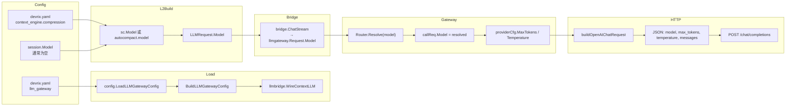

# LLM Gateway：模型名从 yaml 到 HTTP body 全链路

> 补充文档，与 [llm-gateway-design.md](./llm-gateway-design.md) 配套阅读。

本文追踪 Devrix 中 **模型名** 及 **provider 运行时参数**（`max_tokens`、`temperature` 等）从配置文件到出站 HTTP JSON 的完整路径。

---

## 一、链路总览



### 核心文件

| 环节 | 文件 |
|------|------|
| 配置定义 | `devrix.yaml` → `llm_gateway` |
| 配置加载 | `internal/shared/config/llmgateway.go` → `BuildLLMGatewayConfig` |
| 启动装配 | `internal/bridges/llm/context_wiring.go` → `WireContextLLM` |
| L2 入参 | `internal/layers/contextengine/contracts.go` → `LLMRequest` |
| L2→L3 桥 | `internal/bridges/llm/bridge.go` |
| 路由 | `internal/layers/llmgateway/gateway/router.go` |
| 编排 | `internal/layers/llmgateway/gateway/gateway.go` → `Gateway.Stream` |
| HTTP 体 | `internal/layers/llmgateway/adapter/openai_request.go` |
| HTTP 出站 | `internal/layers/llmgateway/adapter/openai_stream.go` |

---

## 二、L3 Request 字段与来源

`internal/layers/llmgateway/contracts.go`：

```go
type Request struct {
    Provider     string   // Gateway 路由后写入
    Model        string   // L2 传入 + 路由/重试可能覆盖
    SystemPrompt string   // L2 LLMRequest.SystemPrompt
    Messages     []types.Message
    Tools        []ToolSchema
    MaxTokens    int      // Gateway 从 provider 配置覆盖
    Temperature  float64  // Gateway 从 provider 配置覆盖
    Stream       bool     // Gateway 强制 true
}
```

| 字段 | 谁决定 |
|------|--------|
| `Model`（L2 侧） | `sc.Model`（← `session.Model`）或压缩/Plan 专用 model 配置 |
| `Provider` / 最终 `Model` | `Router.Resolve` + `model_routing` |
| `MaxTokens` / `Temperature` | `llm_gateway.providers.<provider>`，Bridge **不传**，Gateway 覆盖 |
| `SystemPrompt` / `Messages` / `Tools` | Context Engine / PEVEngine |
| `API Key` / `BaseURL` | provider 配置的 `api_key_env`、`base_url` |

Gateway 出站前补充参数：

```go
// internal/layers/llmgateway/gateway/gateway.go
callReq := *req
callReq.Provider = provider
callReq.Model = callModel
callReq.MaxTokens = providerCfg.MaxTokens
callReq.Temperature = providerCfg.Temperature
callReq.Stream = true
```

---

## 三、路径 A：`session.Model` 为空 → 默认 MiniMax

典型生产路径：`CreateSession` 不设置 `session.Model`，`sc.Model` 为空。

| 步骤 | 位置 | 字段值 |
|------|------|--------|
| 1 | `devrix.yaml` | `default_provider: minimax`, `default_model: MiniMax-M2.7-highspeed` |
| 2 | `LoadLLMGatewayConfig` → `BuildLLMGatewayConfig` | 写入 `LLMGatewayConfig` |
| 3 | `memory.LoadOrInit` | `sc.Model = session.Model` → **空串** |
| 4 | `PEVEngine` | `LLMRequest.Model = ""` |
| 5 | `Router.Resolve("")` | provider=`minimax`, model=`MiniMax-M2.7-highspeed` |
| 6 | `Gateway.Stream` | `callReq.Model = MiniMax-M2.7-highspeed` |
| 7 | provider 配置 | `max_tokens=8192`, `temperature=0.7`, `base_url=https://api.minimaxi.com/v1` |
| 8 | HTTP JSON | `"model":"MiniMax-M2.7-highspeed"` |

`Router.Resolve` 空 model 逻辑（`internal/layers/llmgateway/gateway/router.go`）：

```go
if model == "" {
    provider = r.cfg.DefaultProvider
    resolvedModel = r.defaultModelFor(provider)
    return provider, resolvedModel, nil
}
```

---

## 四、路径 B：显式 `deepseek-v4-flash`（压缩摘要）

| 步骤 | 位置 | 字段值 |
|------|------|--------|
| 1 | `devrix.yaml` | `context_engine.compression.autocompact.model: deepseek-v4-flash` |
| 2 | `model_routing` | `"deepseek-*" → deepseek` |
| 3 | `AutocompactSummarizer` | `LLMRequest.Model = "deepseek-v4-flash"` |
| 4 | `Router.Resolve("deepseek-v4-flash")` | 匹配 `deepseek-*` → provider=`deepseek`, model 保持 `deepseek-v4-flash` |
| 5 | `callReq` | 从 `providers.deepseek` 取 timeout/retry；fallback=`deepseek-v4-pro` |
| 6 | HTTP JSON | `"model":"deepseek-v4-flash"`, `"max_tokens":8192`, `"temperature":0.7` |

Plan 阶段类似，Model 来自 `context_engine.plan.model`（如 `deepseek-v4`），经 `planLLMAdapter` → `ChatStream`。

---

## 五、最终 HTTP body 结构

由 `buildOpenAIChatRequest`（`openai_request.go`）生成：

```json
{
  "model": "deepseek-v4-flash",
  "max_tokens": 8192,
  "temperature": 0.7,
  "stream": true,
  "messages": [
    { "role": "system", "content": "<LLMRequest.SystemPrompt>" },
    { "role": "system", "content": "<CompressedView 内可能还有的 system>" },
    { "role": "user", "content": "用户消息…" },
    { "role": "assistant", "content": "…", "tool_calls": [...] },
    { "role": "tool", "tool_call_id": "call_…", "content": "…" }
  ],
  "tools": [
    { "type": "function", "function": { "name": "read_file", "parameters": {...} } }
  ]
}
```

- `messages` / `tools`：来自 L2 的 `Messages` / `Tools`（经 Bridge 映射）。
- `model` / `max_tokens` / `temperature`：Gateway 路由 + provider 配置最终决定。
- 请求 URL：`{base_url}/chat/completions`，鉴权：`Authorization: Bearer {api_key_env 环境变量}`。

---

## 六、失败重试时的 model 变化

`Gateway.Stream` 内 `retry.Stream` 使用 primary model 与 `providerCfg.FallbackModel`：

| Provider | 主模型 | Fallback |
|----------|--------|----------|
| minimax | `MiniMax-M2.7-highspeed` | `MiniMax-M2.5-highspeed` |
| deepseek | `deepseek-v4-flash` | `deepseek-v4-pro` |

重试时 `callReq.Model` 换成 fallback，HTTP body 中的 `"model"` 随之改变。

---

## 七、配置参考（devrix.yaml 片段）

```yaml
llm_gateway:
  default_provider: "minimax"
  default_model: "MiniMax-M2.7-highspeed"
  model_routing:
    "deepseek-*": deepseek
    "minimax-*": minimax
    "MiniMax-*": minimax
  providers:
    deepseek:
      api_key_env: "DEEPSEEK_API_KEY"
      default_model: "deepseek-v4-flash"
      fallback_model: "deepseek-v4-pro"
      max_tokens: 8192
      temperature: 0.7
    minimax:
      api_key_env: "MINIMAX_API_KEY"
      default_model: "MiniMax-M2.7-highspeed"
      fallback_model: "MiniMax-M2.5-highspeed"
      max_tokens: 8192
      temperature: 0.7

context_engine:
  compression:
    autocompact:
      model: "deepseek-v4-flash"
  plan:
    model: "deepseek-v4"
```

---

## 八、相关文档

- [llm-gateway-pev-message-flow.md](./llm-gateway-pev-message-flow.md) — PEV 迭代内 Messages 如何增长
- [llm-gateway-design.md](./llm-gateway-design.md) — Layer 3 架构设计（SoT 见 `openspec/specs/llm-gateway/spec.md`）
- [context-engine-design.md](./context-engine-design.md) — Layer 2 上下文引擎设计
