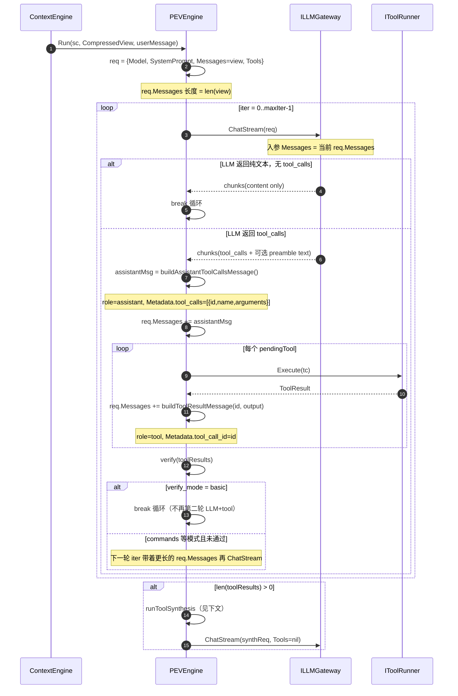

# LLM Gateway：PEV 迭代内 Messages 增长时序

> 补充文档，与 [llm-gateway-design.md](./llm-gateway-design.md)、[context-engine-design.md](./context-engine-design.md) 配套阅读。

本文描述 Context Engine（Layer 2）在 PEV Execute→Verify 循环中，如何组装 `LLMRequest.Messages`，以及单次用户消息可能触发的多次 LLM 调用。

---

## 一、进入 PEV 前的 CompressedView

`ContextEngine.runProcess` 在调用 `pev.Run` 前已准备好 `sc.CompressedView`：

```go
// internal/layers/contextengine/engine.go
view := append([]types.Message{}, msgs...)
if sc.SystemPrompt != "" {
    view = append([]types.Message{{Role: types.MessageRoleSystem, Content: sc.SystemPrompt}}, view...)
}
e.memory.SetCompressedView(sc, view)
```

此时 `sc.CompressedView` 大致为：

| 序号 | Role | 内容来源 |
|------|------|----------|
| 0 | `system` | `sc.SystemPrompt`（`AGENTS.md` + 长期记忆附录） |
| 1…n | `user` / `assistant` / `tool` | 历史 `sc.Messages`（含本轮刚 append 的用户消息） |

**注意**：`PEVEngine` 同时把 `sc.SystemPrompt` 放进 `LLMRequest.SystemPrompt`；Gateway 的 `buildOpenAIChatRequest` 会再生成一条 system 消息。因此 HTTP 体里可能出现两条 system（实现上的重复，不影响下文时序逻辑）。

---

## 二、PEV 主循环时序（含 tool round）

以默认配置 `verify_mode: basic`、`max_iterations: 3` 为例。`basic` 模式下每轮用户消息最多 **1 次 tool round**，然后走 **synthesis** 再调一次 LLM。



### 关键代码位置

- 构建初始 `LLMRequest`：`internal/layers/contextengine/pev_engine.go`（`runExecuteVerifyLoop`）
- 追加 assistant tool_calls：`buildAssistantToolCallsMessage` → `tool_messages.go`
- 追加 tool 结果：`buildToolResultMessage` → `tool_messages.go`
- Synthesis：`runToolSynthesis` + `buildSynthesisMessages` → `pev_synthesis.go`

---

## 三、单次 tool round 后 req.Messages 的形态

假设 LLM 在一次响应里请求 2 个工具 `read_file`、`bash`：

```
[进入 iter 0 前]  view（历史 + 本轮 user）
  +0  [assistant]  content="我先看一下…"  metadata.tool_calls=[read_file, bash]
  +1  [tool]       content="file contents…"  metadata.tool_call_id=call_…_0
  +2  [tool]       content="ls output…"      metadata.tool_call_id=call_…_1
```

`tool_calls` JSON 在 `tool_messages.go` 中序列化为 OpenAI 兼容格式：

```go
// internal/layers/contextengine/tool_messages.go
func buildAssistantToolCallsMessage(sessionID string, calls []ToolCall) types.Message {
    // Metadata: tool_calls = [{id, type:"function", function:{name, arguments}}]
}
func buildToolResultMessage(sessionID, toolCallID, content string) types.Message {
    // Role: tool, Metadata: tool_call_id
}
```

---

## 四、Synthesis 第二轮 LLM（无 Tools）

`basic` 模式下 tool 执行完后 **不会** 用带 tool 历史的 `req.Messages` 再调 LLM，而是单独构造 `synthReq`：

```go
// internal/layers/contextengine/pev_engine.go
synthReq := &LLMRequest{
    Model:        sc.Model,
    SystemPrompt: systemPrompt,
    Messages:     buildSynthesisMessages(view, preamble, toolResults),
    Tools:        nil,
}
```

`buildSynthesisMessages` 把工具结果压成一条 user 消息，**不含** `tool_calls` / `tool_call_id`：

```go
// internal/layers/contextengine/pev_synthesis.go
func buildSynthesisMessages(base []types.Message, preamble string, results []ToolResult) []types.Message {
    msgs := append([]types.Message{}, base...)
    if trimmed := strings.TrimSpace(preamble); trimmed != "" {
        msgs = append(msgs, types.Message{Role: types.MessageRoleAssistant, Content: trimmed})
    }
  // ... 追加 user 消息："以下是工具执行结果，请用自然语言向用户总结…"
    return msgs
}
```

Synthesis 后的 Messages 示意：

```
[base = 原始 view，不含 iter 内的 tool 消息]
  +  [assistant]  preamble（LLM 第一轮说的前言）
  +  [user]       "以下是工具执行结果，请用自然语言向用户总结…" + 各工具输出
```

---

## 五、完整一轮用户消息的 LLM 调用次数（典型）

| 阶段 | 触发条件 | LLM 次数 | Messages 特点 |
|------|----------|----------|---------------|
| 压缩摘要 | token 超预算 + autocompact | 0~1 | 仅 user 摘要 prompt；Model 用 `compression.autocompact.model` |
| Plan | `plan.enabled` + 长任务 | 0~1 | 单条 user；Model 用 `plan.model` |
| PEV iter 0 | 必有 | 1 | view + 可能 tool 消息 |
| Synthesis | 有 tool 结果 | 1 | base view + 合成 user 消息，Tools=nil |

---

## 六、端到端调用栈（简图）

```
Adapter → CommunicationGateway.Process
  → ContextEngine.runProcess
    → PEVEngine.Run → runExecuteVerifyLoop
      → ILLMGateway.ChatStream (L2)
        → llmbridge.Bridge.ChatStream
          → llmgateway.Gateway.Stream (L3)
            → adapter.OpenAIStreamClient → HTTP POST /chat/completions
```

详见 [llm-gateway-model-resolution-trace.md](./llm-gateway-model-resolution-trace.md)。
