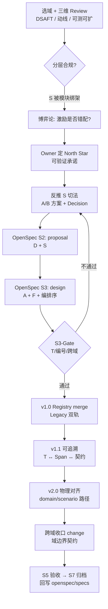

title: DSAFT 架构重构 Playbook
version: "1.0.0"
status: active
last-updated: "2026-06-14"
spec-type: architecture-methodology
parent: dsaft-methodology
related:
  - openspec/specs/project/architecture-design.md
  - openspec/specs/project/review-design.md
  - openspec/specs/project/archiving.md
  - openspec/specs/architecture/code-layout.md

# DSAFT 架构重构 Playbook

> 本文档沉淀 **如何用 DSAFT 方法论展开架构重构讨论并落地**，而非某个具体领域的实现细节。
>
> 实践来源：2026-06-14 Devrix 域重构系列讨论（架构 Review → 博弈论深化 → OpenSpec 规格 → 物理路径对齐）。

---

## 1. 适用场景

当以下任一情况出现时，使用本 Playbook：

- 某域「注册表看起来完整」，但可扩展性 / 可测性 / 用户动线存在系统性疑问
- S 层疑似被**技术模块**或**目录结构**绑架，而非用户价值流
- 实现先于规格，T 与 Span / E2E 脱节，P0 无法在生产验证
- 跨域边界漂移（双写、反向依赖、契约错放）
- 需要从「改代码」升级为「改分层 + 改规格 + 改路径」的结构性重构

---

## 2. 四条分析轴

重构讨论不是「看代码 → 改代码」，而是四条线并行：

```
┌─────────────────────────────────────────────────────────┐
│  分析轴（理解问题）                                        │
│    ① DSAFT 分层合规     — 各层是否各司其职、追溯是否成立    │
│    ② 用户动线           — 用户要完成什么、路径是否可验收    │
│    ③ 博弈论 / 机制设计   — 多方激励是否对齐、边界在哪      │
├─────────────────────────────────────────────────────────┤
│  交付轴（落地问题）                                        │
│    ④ OpenSpec S1–S7     — 规格先行、分阶段、T 锚定变更     │
└─────────────────────────────────────────────────────────┘
```

| 轴 | 核心问题 | 典型产出 |
|----|---------|---------|
| DSAFT 合规 | D/S/A/F/T 是否各司其职？追溯链是否闭合？ | 分层体检报告、根因表 |
| 用户动线 | 用户可验证的承诺是什么？E2E 谁 ownership？ | North Star、S 切法候选 |
| 博弈论 | 开发者局部最优 vs 用户全局最优是否错配？ | 参与者模型、域边界 Decision |
| OpenSpec 交付 | 规格是否先于代码？T 是否锚定变更？ | change 包、归档回写 |

---

## 3. 六阶段讨论流程

### 阶段 1：合规性 Review

**目标：** 回答「注册表完整 ≠ 架构正确」。

**方法：** 用 DSAFT 五层 + 稳定性梯度做体检。

| DSAFT 原则 | 检验问题 |
|-----------|---------|
| DS 抽象 / AFT 具体 | S 是否表达「价值流」，还是误把「模块」当 S？ |
| T 最稳定 | 有 T 无 Span / 无 E2E 证据，P0 是否能在生产验证？ |
| 追溯链 | S→A→F→T 是否闭合，还是实现先于注册表？ |
| 跨域 | 是否出现双写、反向依赖、契约错放？ |

**退出条件：** 识别出 1–3 个**系统性根因**（非单点 bug）。

---

### 阶段 2：博弈论深化（可选但推荐）

**目标：** 把「分层」理解为**激励相容机制设计**。

**参与者映射：**

| DSAFT 层 / 域 | 博弈角色 | 典型目标函数 |
|--------------|---------|-------------|
| S | 子博弈场 / 价值流 | 本场景 E2E 可验收 |
| A | 可观测动作 | 对外契约稳定 |
| F | 内部策略 | 实现可替换 |
| T | 承诺装置 | WHAT 不变，HOW 可变 |
| 跨域 D* | 其他玩家 | 接口稳定、少被拖慢 |
| D5 可观测 | 裁判 / 审计 | Span 覆盖、metric 达标 |

**核心洞察：**

> 开发者局部最优（改某模块最快）≠ 用户全局最优（动线端到端稳定）。
> DSAFT 分层的任务，是让两者尽量指向同一均衡。

**常见错配模式：**

- S 被 Go 包 / 前端 feature 目录 1:1 绑定
- A 层跨平台共用 ID，新平台污染已有 T
- 有 T 无 Span → 生产不可验证（「影子策略」）
- 域边界漂移 → 一个 D 的 S 层膨胀为「万能场景」

---

### 阶段 3：North Star 先行

**目标：** 由业务方 / 架构 Owner **先定领域根本目标**，再反推 S。

**正确路径 vs 错误路径：**

```
错误：现有包结构 → 反推 S → 补文档
正确：用户可验证承诺 → 定 S → A/F 编排 → 目录映射
```

**North Star 应回答：**

1. 用户在这个领域里要达成什么？（一句话）
2. 有哪些**可验证承诺**？（入站 / 出站 / 通道 / 信任等维度）
3. 哪些能力**明确不在**本域 SoT？（Out of Scope → 其他 D）

**S 切法决策：** 当出现多种切 S 方案时，用 Decision 表对比（见 §6），由 Owner 显式选择，不默认「沿用现有编号」。

---

### 阶段 4：规格先行（Registry First）

**目标：** 在 T 锚点建立之前**不改代码**。

**OpenSpec × DSAFT 分工：**

| OpenSpec 阶段 | DSAFT 产出 | 关键约束 |
|--------------|-----------|---------|
| S1 demand | 需求 + AC + L1–L5 映射草案 | 需求 ID 无冲突 |
| S2 proposal | **D + S** | 定 Out of Scope |
| S3 design | **A + F** + Decision + 编排序 | 禁止估时 |
| S3-Gate | Review | Gherkin + sad path + T 映射 |
| S4 tasks / 实现 | F 实现 | 任务标注 T |
| S5 acceptance | T 验收 | P0 全绿 |
| S7 archive | 回写 `openspec/specs/` | 6 产物 + 索引 |

**分阶段终态（推荐）：**

| 版本 | 范围 | 风险 |
|------|------|------|
| v1.0 Registry | S/A/F/T 注册表 + Gherkin + Legacy 双轨 | 低（纯文档） |
| v1.1 Traceability | 契约、Span、acceptance、chain 完整性 | 中 |
| v2.0 Structure | 物理路径、包结构对齐 F 层 | 高（需 T 全绿） |

---

### 阶段 5：S3-Gate 纠偏

**目标：** 设计可被挑战、可被否决；在写代码前闭合争议。

**必查项（摘自 `review-design.md`）：**

- 层归属正确、接口方向正确、跨层依赖最小
- demand → proposal → design → specs 链路完整
- 每个 P0 AC 有 Scenario；happy + sad path 齐全
- **T 层映射完整**；DM ID 无冲突
- 非平凡选择有 **Decision 节**；Grill Review 表有记录

**经典陷阱：S 编号复用**

| 错误 | 正确 |
|------|------|
| 用新语义覆盖旧 S 编号 | **新号段**承载新价值流 |
| 强制改已有测试注释 | **Legacy 双轨**：旧号冻结追溯，新号 Canonical |
| 规格与实现强绑定 | **T 是不变契约**；改 S 不能破坏 IMPLEMENTED T |

**退出条件：** S3-Gate Approved + Owner 确认终态 S 清单与迁移表。

---

### 阶段 6：双锚点对齐（规格 ↔ 物理路径）

**目标：** DSAFT 不只存在于文档，还存在于仓库目录。

```
规格锚点                         物理锚点
openspec/specs/{domain}/    ↔   internal/layers/{domain-slug}/{scenario-slug}/
```

**决策树（摘自 `code-layout.md`）：**

1. 跨域契约 → `internal/shared/contracts/`
2. 属于哪个 D？ → `internal/layers/{domain-slug}/`
3. 属于哪个 S？ → `…/{scenario-slug}/`（查注册表，禁止自造）
4. 域内核（无 S 归属）→ `…/kernel/`
5. 仅启动接线 → `internal/bootstrap/` 或 `cmd/`

**语言规约：** Go 包名遵循 `coding.md` §2.2 — 全小写、无下划线、**package = 目录叶子名**。
当 `code-layout.md` 与 `coding.md` 冲突时，**以 `coding.md` 为权威 SoT**。

**归档约束：** S7 归档时必须回写 `openspec/specs/` 主规格 + `demand-archive-index.md`。

---

## 4. 六条方法论原则（可复用）

### 原则 1：先问「用户可验证承诺」，再问「模块怎么拆」

S 层回答「用户要达成什么」，不是「代码在哪个包」。

### 原则 2：S 与 A 职责分离

| 层 | 回答的问题 | 稳定性 |
|----|-----------|--------|
| S | 用户要达成什么目标？ | 高 |
| A | 对外可观测的动作是什么？ | 中 |
| F | 内部怎么编排？ | 低 |

**策略差异下沉 F**：例如多种路由策略应是「单 A + 多 F」，而非多个并列 USER A。

### 原则 3：T 是安全网

```
L4/F 变更 → 查关联 T → 跑测试 → 规格与代码同步
```

已有 IMPLEMENTED T 是硬约束；重构采用 Legacy 双轨而非暴力改号。

### 原则 4：跨域问题在 D 边界决策

判据：该能力是「本域机制」还是「跨域质量 / 进化」？

- 机制、送达、客观锚点 → 留在本域
- 评级、信誉、惩罚、Judge → 归 D5/D6 等支撑 / 进化域

**不让一个 D 的 S 层膨胀成万能场景。**

### 原则 5：可观测性是 T 的生产延伸

P0 测试点应有 Span 或 acceptance 证据；「有 T 无 Span」视为规格债务。

### 原则 6：分阶段终态，不跳过规格直接改代码

v1.0 闭合 Registry 共识 → v1.1 可追溯 → v2.0 物理结构。每阶段独立 S5/S7。

---

## 5. 多人对焦方法

适用于 Owner + 多 Agent / 多 Reviewer 协作：

```
Owner 定 North Star（业务语言）
    ↓
架构师：DSAFT 分层 + OpenSpec 落地
    ↓
领域专家 / 外部 Review：博弈论、机制设计、边界挑战
    ↓
共识写入 design.md Decision 表 + Grill Review 记录
    ↓
S3-Gate → Owner 确认 → 推进 S4
```

**沉淀要求：** 争议与共识进 `design.md`，不散落在聊天或 IM 里。
可选：`gaming-analysis.md` 等专题分析文档，最终回灌 demand / design。

---

## 6. Decision 记录模板

每个非平凡选择使用下表（置于 design.md）：

```markdown
### Decision: {标题}

| 方案 | 优点 | 缺点 |
|------|------|------|
| A: … | … | … |
| B: … | … | … |

**选择:** {A|B|…}
**理由:** {与 North Star / T 约束 / 跨域边界的关系}
**影响:** {哪些 S/A/F/T、是否 BREAKING、迁移策略}
```

---

## 7. 完整流程图



---

## 8. 检查清单（Quick Reference）

### 启动前

- [ ] 已读 `dsaft-methodology.md` 与目标域现有注册表
- [ ] 明确 Review 范围：单域 or 跨域
- [ ] 已创建 demand.md（DM-YYYYMMDD-NNN）

### S3-Gate 前

- [ ] proposal 只含 D + S；design 含 A + F
- [ ] 每个 Requirement 有 Gherkin + `<!-- T: -->` 注释
- [ ] Legacy 双轨方案已定义（若涉及 S 重组）
- [ ] 跨域边界有 Decision；Out of Scope 已声明
- [ ] `.openspec.yaml` 中 `dsaft_scenarios` / `t_points` 已登记

### S4 前

- [ ] v1.0 Registry 已 merge 至 `openspec/specs/`
- [ ] 每个实现任务关联 T ID
- [ ] 物理路径已在 `code-layout.md` 注册（若 v2.0）

### S7 归档

- [ ] acceptance-report 状态 ACCEPTED
- [ ] change 包移至 `openspec/archive/`
- [ ] `demand-archive-index.md` 已更新
- [ ] 主规格 `openspec/specs/` 已与 delta 同步

---

## 9. 相关文档

| 文档 | 用途 |
|------|------|
| [dsaft-methodology.md](./dsaft-methodology.md) | D/S/A/F/T 定义与追溯规则 |
| [detail-design-framework.md](./detail-design-framework.md) | 六段式详设框架 |
| `openspec/specs/project/architecture-design.md` | S2/S3 产出分工 |
| `openspec/specs/project/review-design.md` | S3-Gate 审查维度 |
| `openspec/specs/project/archiving.md` | S7 归档流程 |
| `openspec/specs/architecture/code-layout.md` | 物理路径注册表 |

---

## 10. 一句话总结

> **用 DSAFT 做分层体检，用用户动线定 North Star，用博弈论查激励错配，用 OpenSpec 把共识写成可追溯的 D/S/A/F/T 注册表；在 T 锚点闭合之前不改代码；最后用双锚点（规格 + 物理路径）把架构从文档落到仓库。**
