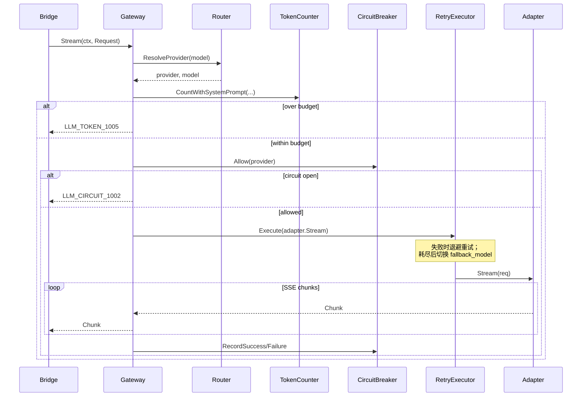

# LLM Gateway Layer Design (Layer 3)

**Change ID:** devrix-llm-gateway
**Demand:** DM-20260607-004
**Layer:** 3 - LLM Gateway
**Status:** S7 Archived (2026-06-07) (pending sign-off)
**Version:** 1.0.0
**Based on:** `openspec/specs/llm_gateway_layer_delta.md`

---

## 一、架构目标

### 1.1 业务目标

| 业务目标 | 量化指标 | V1 |
|---------|---------|-----|
| 统一 LLM 调用接口 | 适配 DeepSeek / MiniMax | ✅ |
| 熔断器保护 | Circuit Breaker 防止级联故障 | ✅ |
| Token 预算控制 | Token 计数与预算检查 | ✅ |
| 可观测性 | Bridge span + `devrix_llm_*` metrics | ✅ |
| 重试与降级 | 指数退避 + `fallback_model`（Retry 职责） | ✅ |

### 1.2 层间边界

```
Layer 2 (Context Engine)              Bridge (internal/bridges/llm)       Layer 3 (LLM Gateway)
─────────────────────────            ─────────────────────────────       ──────────────────────
PEVEngine.Run()
    │
    └──▶ contextengine.ILLMGateway
              │
              └──▶ Bridge.ChatStream() ──▶ gateway.Gateway
                                              ├─ Router (model_routing)
                                              ├─ AdapterRegistry
                                              │   ├─ DeepSeekAdapter
                                              │   └─ MiniMaxAdapter
                                              ├─ CircuitBreaker
                                              ├─ RetryExecutor
                                              ├─ TokenCounter (contracts.ITokenCounter)
                                              └─ observability.Bridge
                                                          │
                                                          ▼
                                                    External LLM APIs
```

**禁止：**

- `internal/layers/llmgateway/` 不得 import `contextengine/` 或 `communication/`
- L3 不得注入 `IToolRegistry` 或填充 `ToolCall.RiskLevel`（L2 职责）

---

## 二、Provider 配置与路由

### 2.1 支持的 Provider

| Provider | Adapter | API 类型 | Base URL |
|----------|---------|----------|----------|
| `deepseek` | DeepSeekAdapter | OpenAI-compatible SSE | `https://api.deepseek.com/v1` |
| `minimax` | MiniMaxAdapter | OpenAI-compatible SSE | `https://api.minimax.io/v1` |

> MiniMax 国内站可配置 `https://api.minimaxi.chat/v1`

### 2.2 配置契约

```yaml
llm_gateway:
  default_provider: "minimax"
  default_model: ""  # 全局默认；空则使用 provider.default_model

  model_routing:
    "deepseek-*": deepseek
    "minimax-*": minimax

  circuit_breaker:
    failure_threshold: 5
    success_threshold: 2
    open_duration: "30s"
    scope: "provider"   # V1 固定 provider；provider:model 预留 V1.1

  providers:
    deepseek:
      type: "deepseek"
      base_url: "https://api.deepseek.com/v1"
      api_key_env: "DEEPSEEK_API_KEY"
      default_model: "deepseek-v4-flash"
      fallback_model: "deepseek-v4-pro"
      timeout: "60s"
      max_tokens: 8192
      temperature: 0.7
      retry:
        max_attempts: 3
        initial_delay: "1s"
        max_delay: "10s"
        backoff: 2.0

    minimax:
      type: "minimax"
      base_url: "https://api.minimax.io/v1"
      api_key_env: "MINIMAX_API_KEY"
      default_model: "minimax-3"
      fallback_model: "minimax-2.7-highspeed"
      timeout: "60s"
      max_tokens: 8192
      temperature: 0.7
      retry:
        max_attempts: 3
        initial_delay: "1s"
        max_delay: "10s"
        backoff: 2.0
```

### 2.3 Provider 路由优先级

```go
// gateway/router.go

func ResolveProvider(model string, cfg LLMConfig) (provider string, resolvedModel string, err error) {
    // 1. model 前缀匹配 model_routing（如 deepseek-v4-flash → deepseek）
    // 2. model 为空 → providers[default_provider].default_model
    // 3. 仍无 provider → llm_gateway.default_provider + 其 default_model
}
```

---

## 三、领域模型

### 3.1 L3 内部类型（llmgateway 包）

```go
// internal/layers/llmgateway/contracts.go

type Request struct {
    Provider     string
    Model        string
    SystemPrompt string
    Messages     []types.Message
    Tools        []ToolSchema
    MaxTokens    int
    Temperature  float64
    Stream       bool
}

type Chunk struct {
    Content   string
    Thinking  string
    ToolCalls []ToolCall   // 仅 ID/Name/Input，无 RiskLevel
    Done      bool
    Usage     TokenUsage
}

type ToolCall struct {
    ID    string
    Name  string
    Input string
}

type TokenUsage struct {
    PromptTokens     int
    CompletionTokens int
    TotalTokens      int
}
```

### 3.2 共享 Token 契约（L2/L3 共同依赖）

```go
// internal/shared/contracts/tokencounter.go

package contracts

type ITokenCounter interface {
    CountText(text string) int
    CountMessages(messages []types.Message) int
    CountWithSystemPrompt(systemPrompt string, messages []types.Message) int
    TruncateToTokens(text string, maxTokens int) string
    EncodingForModel(model string) string
}
```

Gateway `token/counter.go` 实现 `contracts.ITokenCounter`（cl100k_base）。
Gateway 可额外提供 `EstimateRemaining(current, max int) int` 作为包内扩展，**不**放入共享接口。

---

## 四、业务流程

### 4.1 核心用例：ChatStream（L3 内部）



### 4.2 Retry vs Circuit Breaker（职责分离）

| 组件 | 职责 | 触发条件 |
|------|------|----------|
| **RetryExecutor** | 单次请求内重试 + `fallback_model` | 可重试错误（timeout、5xx、parse） |
| **CircuitBreaker** | 跨请求快速拒绝 | 连续失败达 `failure_threshold` |

Retry 全部失败后，Circuit Breaker 记录一次 `RecordFailure`；**不会**由 Circuit 主动切换 fallback。

### 4.3 熔断器状态机

```
Closed ──[failure >= threshold]──▶ Open
                                  │
                          [openDuration elapsed]
                                  ▼
                              HalfOpen
              ┌───────────────────┴───────────────────┐
    [success >= successThreshold]           [failure]
              ▼                                       ▼
          Closed                                   Open
```

---

## 五、目录结构

```
internal/
├── shared/
│   ├── contracts/
│   │   └── tokencounter.go       # NEW: L2/L3 共享
│   ├── config/
│   │   └── llmgateway.go         # NEW: YAML 结构
│   └── errors/
│       └── llm.go                # NEW: LLM_* 错误码
├── bridges/
│   └── llm/
│       ├── bridge.go             # NEW: 实现 contextengine.ILLMGateway
│       └── bridge_test.go
└── layers/
    └── llmgateway/
        ├── contracts.go
        ├── gateway/
        │   ├── gateway.go
        │   ├── router.go
        │   ├── gateway_test.go
        │   └── options.go
        ├── adapter/
        │   ├── registry.go
        │   ├── adapter.go
        │   ├── sse_parser.go     # OpenAI-compatible SSE 解析
        │   ├── deepseek.go
        │   ├── deepseek_test.go
        │   ├── minimax.go
        │   └── minimax_test.go
        ├── breaker/
        │   ├── circuit_breaker.go
        │   ├── circuit_breaker_test.go
        │   └── state.go
        ├── token/
        │   ├── counter.go        # implements contracts.ITokenCounter
        │   └── counter_test.go
        ├── config/
        │   └── loader.go
        └── retry/
            ├── retry.go
            └── retry_test.go
```

---

## 六、接口设计

### 6.1 L3 核心接口

```go
// IGateway L3 内部网关（不暴露给 L2）
type IGateway interface {
    Stream(ctx context.Context, req *Request) (<-chan Chunk, error)
    Close() error
}

type IAdapter interface {
    Stream(ctx context.Context, req *Request) (<-chan *AdapterChunk, error)
    Provider() string
}

type ICircuitBreaker interface {
    Allow(circuitKey string) (bool, error)
    RecordSuccess(circuitKey string)
    RecordFailure(circuitKey string)
    State(circuitKey string) CircuitState
}

type IRetryExecutor interface {
    Execute(ctx context.Context, fn func(model string) error, primary, fallback string, cfg RetryConfig) error
}
```

> V1 **不包含** `ChatComplete`、`IHealthCheck`（见 demand Q7/Q9）。

### 6.2 配置结构

```go
// internal/shared/config/llmgateway.go

type LLMGatewayConfig struct {
    DefaultProvider string
    DefaultModel    string
    ModelRouting    map[string]string
    CircuitBreaker  CircuitBreakerConfig
    Providers       map[string]ProviderConfig
}

type ProviderConfig struct {
    Type          string
    BaseURL       string
    APIKeyEnv     string
    DefaultModel  string
    FallbackModel string
    Timeout       time.Duration
    MaxTokens     int
    Temperature   float64
    Retry         RetryConfig
    Headers       map[string]string
}
```

---

## 七、L2-L3 Bridge 协议

### 7.1 Context Engine 消费接口（不变）

```go
// internal/layers/contextengine/contracts.go

type ILLMGateway interface {
    ChatStream(ctx context.Context, req *LLMRequest) (<-chan LLMChunk, error)
}

type LLMRequest struct {
    Model        string
    SystemPrompt string
    Messages     []types.Message
    Tools        []ToolSchema
}

type ToolCall struct {
    ID       string
    Name     string
    Input    string
    RiskLevel types.RiskLevel  // L2 填充；L3 返回时可为空
}
```

### 7.2 Bridge 实现（唯一允许 import 两层的包）

```go
// internal/bridges/llm/bridge.go

type Bridge struct {
    gw     llmgateway.IGateway
    router llmgateway.Router
}

func (b *Bridge) ChatStream(ctx context.Context, req *contextengine.LLMRequest) (<-chan contextengine.LLMChunk, error) {
    provider, model, err := b.router.Resolve(req.Model)
    if err != nil {
        return nil, err
    }
    internalReq := &llmgateway.Request{
        Provider: provider, Model: model,
        SystemPrompt: req.SystemPrompt,
        Messages: req.Messages, Tools: mapTools(req.Tools),
        Stream: true,
    }
    ch, err := b.gw.Stream(ctx, internalReq)
    if err != nil {
        return nil, err
    }
    out := make(chan contextengine.LLMChunk, 32)
    go func() {
        defer close(out)
        for chunk := range ch {
            select {
            case <-ctx.Done():
                return
            case out <- mapChunk(chunk):
            }
        }
    }()
    return out, nil
}
```

### 7.3 RiskLevel 职责（L2）

L3 返回的 `ToolCall` 不含 `RiskLevel`。L2 `pev_engine.go` 在工具执行前：

```go
risk := tc.RiskLevel
if risk == "" {
    risk = e.toolsReg.RiskLevel(tc.Name)
}
```

### 7.4 main.go 接线

```go
tokenCtr := llmgateway.NewTokenCounter(cfg.LLMGateway)
gw := llmgateway.NewGateway(cfg.LLMGateway, obsBridge, llmgateway.WithTokenCounter(tokenCtr))
llmBridge := llmbridge.New(gw, cfg.LLMGateway)

contextEngine := contextengine.NewContextEngine(contextengine.EngineDeps{
    LLM:          llmBridge,   // 实现 contextengine.ILLMGateway
    TokenCounter: tokenCtr,    // contracts.ITokenCounter
    // ...
})
```

---

## 八、SSE 流式解析契约

Adapter 使用共享 `sse_parser.go` 解析 OpenAI-compatible 流：

| SSE 字段 | 映射 |
|----------|------|
| `choices[].delta.content` | `Chunk.Content` |
| `choices[].delta.reasoning_content` / `thinking` | `Chunk.Thinking` |
| `choices[].delta.tool_calls[]` | 增量合并至 `Chunk.ToolCalls` |
| `choices[].finish_reason` | `Chunk.Done = true` |
| `usage`（末包或独立事件） | `Chunk.Usage` |

**约束：**

- `ctx.Done()` 时关闭 HTTP body，停止向 channel 写入
- channel buffer = 32（背压：adapter goroutine 监听 ctx）
- API Key 缺失：配置加载时 warn；首次调用返回 `LLM_AUTH_1004`（fail-fast 可选配置项）

---

## 九、Observability 集成

注入 `*observability.Bridge`（非独立 Observer 包）：

| Span | 属性 |
|------|------|
| `llm.stream` | `provider`, `model`, `prompt_tokens` |

| Metric | 类型 | Labels |
|--------|------|--------|
| `devrix_llm_tokens_total` | Counter | provider, model, direction |
| `devrix_llm_latency_seconds` | Histogram | provider, model |
| `devrix_llm_errors_total` | Counter | provider, model, error_type |
| `devrix_llm_circuit_breaker_state` | Gauge | provider |

---

## 十、错误处理

| 错误码 | 类型 | 说明 | 可重试 |
|--------|------|------|--------|
| LLM_PROVIDER_1001 | ProviderUnavailable | Provider 不可用 | ✅ |
| LLM_CIRCUIT_1002 | CircuitOpen | 熔断器开启 | ❌ |
| LLM_TIMEOUT_1003 | Timeout | 请求超时 | ✅ |
| LLM_AUTH_1004 | AuthFailed | 认证失败 / Key 缺失 | ❌ |
| LLM_TOKEN_1005 | TokenBudgetExceeded | Token 超限 | ❌ |
| LLM_PARSE_1006 | ParseError | SSE 解析错误 | ✅ |
| LLM_UNSUPPORTED_1007 | UnsupportedProvider | 不支持的 Provider | ❌ |
| LLM_UNSUPPORTED_1008 | UnsupportedModel | 无法路由的 Model | ❌ |

```go
func IsRetryable(err error) bool {
    switch e := err.(type) {
    case *LLMError:
        switch e.Code {
        case "LLM_TIMEOUT_1003", "LLM_PROVIDER_1001", "LLM_PARSE_1006":
            return true
        default:
            return false
        }
    }
    return true // 网络错误默认可重试
}
```

---

## 十一、测试策略

| L5 ID | 描述 | 优先级 | 测试位置 |
|-------|------|--------|----------|
| L5-LLM-01 | DeepSeek 适配器流式响应 | P0 | `adapter/deepseek_test.go` |
| L5-LLM-02 | MiniMax 适配器流式响应 | P0 | `adapter/minimax_test.go` |
| L5-LLM-03 | Circuit breaker 正常关闭 | P0 | `breaker/circuit_breaker_test.go` |
| L5-LLM-04 | Circuit breaker 触发开启 | P0 | 同上 |
| L5-LLM-05 | Circuit breaker 半开→关闭 | P0 | 同上 |
| L5-LLM-06 | Circuit breaker 半开→开启 | P0 | 同上 |
| L5-LLM-07 | Token 计数准确性 | P0 | `token/counter_test.go` |
| L5-LLM-08 | Token 预算检查 | P0 | 同上 |
| L5-LLM-09 | Provider 配置加载 | P0 | `config/loader_test.go` |
| L5-LLM-10 | DeepSeek Fallback 模型切换 | P1 | `tests/integration/llm_fallback_test.go` |
| L5-LLM-11 | MiniMax Fallback 模型切换 | P1 | 同上 |
| L5-LLM-12 | 重试策略执行 | P1 | `retry/retry_test.go` |
| L5-LLM-13 | LLM 调用可观测事件 | P1 | `tests/integration/llm_observer_test.go` |
| L5-LLM-16 | 未知 Provider/Model 报错 | P1 | `gateway/router_test.go` |

---

## 十二、版本分期

| 版本 | 能力 |
|------|------|
| V1 | DeepSeek + MiniMax + Circuit + Token + Bridge + Retry/Fallback |
| V2 | Anthropic/OpenAI + Rate Limiter + HealthCheck |
| V3 | 多模型负载均衡 + A/B Testing |

---

## 十三、设计决策记录

| # | 问题 | 决议 | 状态 |
|---|------|------|------|
| 1 | `ILLMGateway` 实现位置 | `internal/bridges/llm`，L3 不 import L2 | ✅ |
| 2 | `ToolCall.RiskLevel` | L2 `toolsReg.RiskLevel` fallback；L3 不填充 | ✅ |
| 3 | Provider 路由 | `model_routing` 前缀 + `default_provider` | ✅ |
| 4 | Fallback 职责 | RetryExecutor，非 Circuit Breaker | ✅ |
| 5 | `ITokenCounter` | `shared/contracts`，Gateway 权威实现 | ✅ |
| 6 | `ChatComplete` | V1 Out of Scope | ✅ |
| 7 | 可观测 | `observability.Bridge`，metric 前缀 `devrix_llm_*` | ✅ |
| 8 | HealthCheck | V1 Out of Scope | ✅ |
| 9 | MiniMax API | OpenAI-compatible SSE | ✅ |
| 10 | 模型命名 | 用户配置，代码不硬编码枚举 | ✅ |
