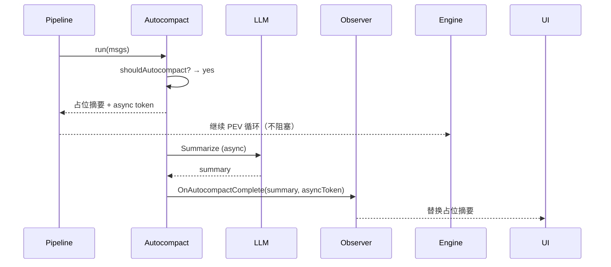

# Proposal: 上下文引擎性能优化

**Change ID:** devrix-context-engine-v4
**Demand ID:** DM-20260608-003
**Parent Change:** devrix-context-engine-v3 (archived)
**Status:** S2 Design
**Author:** Architecture
**Date:** 2026-06-08

---

## 1. Background

Context Engine V3 完成了 Plan + Milestone + LongTerm Memory 三大能力，但在性能方面存在两个可优化点：

1. **Autocompact 同步阻塞**：压缩管道的 Step 6 需要调用 LLM 做对话摘要，10s 超时，同步阻塞整个 PEV 循环
2. **JSON 快照无压缩**：大会话的快照文件可能达到 MB 级别，内存和磁盘占用高

这些问题在短对话中不明显，但在长会话（100+ 轮）中会显著影响用户体验。

## 2. Problem Statement

### 2.1 Autocompact 同步阻塞

```go
// compression/autocompact.go:54-61
timeout := cfg.Timeout  // 默认 10s
runCtx, cancel := context.WithTimeout(ctx, timeout)
defer cancel()

summary, err := summarizeWithRetry(runCtx, summarizer, cfg, middle)
// 这里阻塞整个压缩管道！用户看到"正在思考..."但实际在等摘要
```

**影响：** 用户在压缩期间看到 LLM 无响应，体验差。最坏情况下 10s 超时。

### 2.2 快照无压缩

```go
// snapshot/store.go:41
return json.Marshal(snap)  // 无压缩
```

100 轮对话的快照可达 500KB-2MB（含 tool result），每次保存都全量序列化。备份文件同样无压缩。

## 3. Proposed Solution

### 3.1 Autocompact 异步化

**核心思路：** Autocompact 不再阻塞压缩管道，而是：

1. 先返回一个 **占位摘要**（如 `[压缩中...保留最近 4 轮对话]`）
2. 后台异步执行 LLM 摘要
3. 摘要完成后，通过 Observer 事件通知上层
4. 上层可选择更新对话视图（替换占位摘要）



### 3.2 快照压缩

使用 `github.com/golang/snappy`（Go 官方压缩库，零外部依赖）流式压缩：

```go
import "github.com/golang/snappy"

func (s *Store) Serialize(sc *types.SessionContext) ([]byte, error) {
    snap := toSnapshot(sc)
    raw, err := json.Marshal(snap)
    if err != nil {
        return nil, err
    }
    return snappy.Encode(nil, raw), nil  // 压缩
}

func (s *Store) Deserialize(data []byte) (*types.SessionContext, error) {
    raw, err := snappy.Decode(nil, data)
    if err != nil {
        // 降级：尝试直接 JSON 解析（兼容旧数据）
        raw = data
    }
    // ... json.Unmarshal ...
}
```

Snappy 特点：压缩率 2-4x（对文本），速度 ~500MB/s，适合这个场景。

### 3.3 不改动的部分

- 不修改压缩管道的七步顺序
- 不修改快照的 JSON 格式（Schema 不变）
- 不修改 PEV 引擎的核心循环
- 不引入重量级依赖

---

## 4. Success Metrics

| Metric | Target |
|--------|--------|
| Autocompact 阻塞时间 | < 50ms（仅生成占位摘要） |
| 压缩对 PEV 延迟影响 | 0（异步执行） |
| 快照体积减小 | > 50%（典型会话） |
| 快照解压开销 | < 10ms |
| 旧快照兼容 | 100%（无压缩快照正常读取） |
| L5 测试通过率 | 3/3 P0 |

---

## 5. Risks & Mitigations

| Risk | Impact | Mitigation |
|------|--------|------------|
| 异步摘要竞态 | 可能替换过期对话 | asyncToken 去重，只有最新摘要写入 |
| Snappy 增加编译依赖 | 低 — Go 官方库 | `golang/snappy` 是官方维护的子仓库 |
| 降级路径错误 | 旧快照无法读取 | 先尝试 snappy decode，失败 fallback 到原始 JSON |
| 异步 goroutine 泄漏 | 长期运行 | context 取消传播 + WaitGroup |

---

## 6. 任务估算

| Milestone | 任务数 | 预估 |
|-----------|--------|------|
| M1 Autocompact 异步 | 2 | 5h |
| M2 Snapshot 压缩 | 2 | 2.5h |
| M3 Test | 1 | 4h |
| **合计** | **5** | **~11.5h** |
