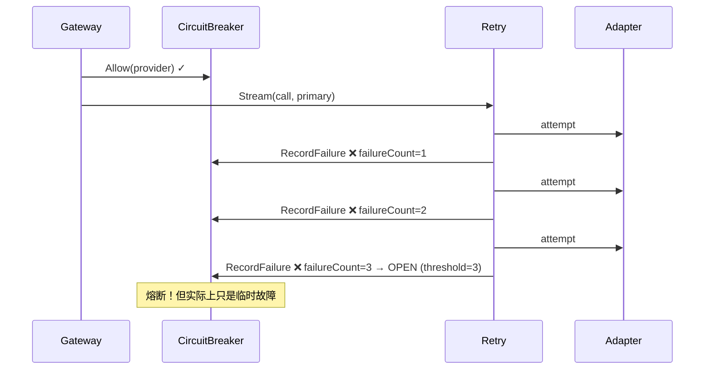

# Proposal: LLM Gateway 可靠性增强

**Change ID:** devrix-llm-gateway-v2
**Demand ID:** DM-20260608-002
**Parent Change:** devrix-llm-gateway (V1, archived)
**Status:** S5 Accepted
**Author:** Architecture
**Date:** 2026-06-08

---

## 1. Background

LLM Gateway V1 实现了 Provider 路由、CircuitBreaker 熔断、Retry 重试、Token 计数四大能力，但在生产可靠性方面存在三个关键缺陷：

1. **CB 与 Retry 独立运作**：Retry 的多次失败会快速累积到 CB 的 failureCount，导致熔断被过早触发
2. **超时不传播 Context**：LLM 调用超时后未取消父 Context，可能导致 goroutine 泄漏
3. **Retry 无 jitter**：指数退避无随机性，多实例部署时可能产生同步重试风暴

## 2. Problem Statement

### 2.1 CB + Retry 冲突



**根因：** `gateway.go:119-124` — Retry 每失败一次，CB 就记录一次 failure。三次重试失败直接触发熔断，即使第 4 次可能成功。

### 2.2 Context 超时不传播

```go
// gateway.go:70 — Stream 使用上层 ctx，但没有强制超时
func (g *Gateway) Stream(ctx context.Context, req *llmgateway.Request) (...) {
    // ctx 可能来自 Context Engine，超时控制不明确
    adapterCh, err := g.retry.Stream(ctx, streamCall, primaryModel, ...)
}
```

当 LLM 调用阻塞时，没有明确的超时取消机制。上层可能已经超时，但 LLM 连接仍然保持。

### 2.3 Retry 无 Jitter

```go
// retry.go:82-99 — 确定性的指数退避
func backoffDelay(cfg sharedconfig.LLMRetryConfig, attempt int) time.Duration {
    delay := float64(initial) * pow(backoff, float64(attempt))
    // 无随机性！多实例同时重试造成风暴
    return time.Duration(delay)
}
```

## 3. Proposed Solution

### 3.1 CB 感知 Retry 状态

**方案：** Retry 层仅对最终结果（所有 attempt 完成后的成功/失败）调用 CB，中间 attempt 的失败不直接报告 CB。

```go
// gateway.go — 修改 Stream 的错误处理
adapterCh, err := g.retry.Stream(ctx, streamCall, primaryModel, ...)
if err != nil {
    g.breaker.RecordFailure(provider)  // 仅最终失败记录
    ...
}
return out, nil  // 成功不在此处记录（由 goroutine 根据流完成状态决定）
```

**Half-Open 探测限制：**

```go
// breaker/circuit_breaker.go — Half-Open 状态限制最多 1 个探测请求
func (b *CircuitBreaker) Allow(circuitKey string) (bool, error) {
    case llmgateway.CircuitHalfOpen:
        if rec.halfOpenInFlight >= 1 {  // 新增：限制探测数
            return false, sharederrors.NewCircuitOpenError(circuitKey)
        }
        rec.halfOpenInFlight++
        return true, nil
}
```

### 3.2 Context 超时传播

Gateway.Stream 增加显式的超时控制：

```go
func (g *Gateway) Stream(ctx context.Context, req *llmgateway.Request) (...) {
    // 如果上层 ctx 无 deadline，补充默认超时
    if _, ok := ctx.Deadline(); !ok {
        var cancel context.CancelFunc
        ctx, cancel = context.WithTimeout(ctx, g.cfg.DefaultTimeout)
        defer cancel()
    }
    // ...
}
```

流式 goroutine 中增加 ctx 取消处理（已部分实现，需完善）。

### 3.3 Retry Jitter

```go
func backoffDelay(cfg sharedconfig.LLMRetryConfig, attempt int) time.Duration {
    // ... existing logic ...
    delay := float64(initial) * pow(backoff, float64(attempt))
    // 添加 jitter: [-25%, +25%]
    jitter := time.Duration(rand.Int63n(int64(delay / 2)))
    delay = delay/2 + jitter
    if delay > float64(maxDelay) {
        delay = float64(maxDelay)
    }
    return time.Duration(delay)
}
```

### 3.4 不改动的部分

- 不修改 IGateway / IAdapter 等公开接口
- 不修改 Provider 配置结构
- 不修改 Router / AdapterRegistry 逻辑
- 不引入外部依赖

---

## 4. Success Metrics

| Metric | Target |
|--------|--------|
| CB 误触发率 | 单次临时故障不触发熔断 |
| 超时取消传播 | LLM 超时 100% 取消 Context |
| Jitter 分布 | 重试间隔随机化（标准差 > 0） |
| Half-Open 探测数 | ≤ 1 |
| L5 测试通过率 | 4/4 P0 |

---

## 5. Risks & Mitigations

| Risk | Impact | Mitigation |
|------|--------|------------|
| CB 延迟感知可能让故障恢复变慢 | 低 — 最终失败仍会触发 CB | Retry 最终失败后立即 RecordFailure |
| 默认超时可能过短 | 低 | 基于 Provider 级别配置，默认 30s |
| Jitter 增加测试不确定性 | 低 | 测试中使用固定种子 |
| Half-Open 限制可能降低吞吐 | 低 | Half-Open 持续时间短（默认 30s） |

---

## 6. 任务估算

| Milestone | 任务数 | 预估 |
|-----------|--------|------|
| M1 CB + Retry 协调 | 2 | 5h |
| M2 Context 超时传播 | 1 | 2h |
| M3 Retry Jitter + Token | 2 | 4h |
| M4 Test | 1 | 3h |
| **合计** | **6** | **~14h** |
