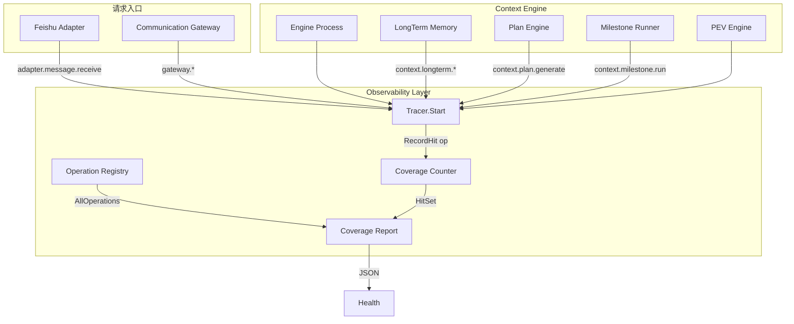
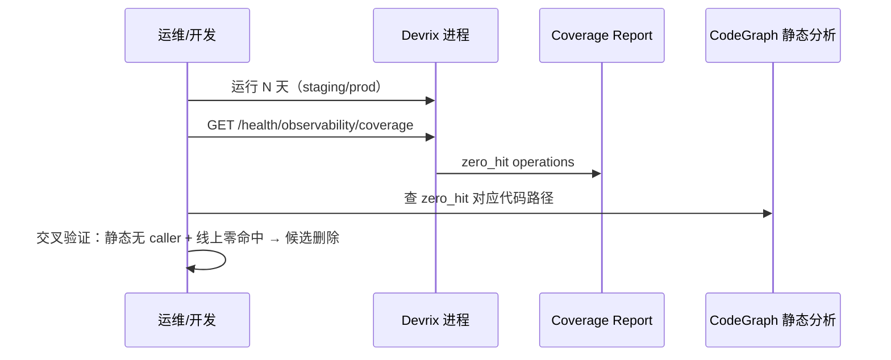

# Design: 可观察层运行时代码染色与 Operation 对账

**Change ID:** devrix-observability-coverage
**Demand ID:** DM-20260607-007
**Version:** 1.3.0
**Date:** 2026-06-07

---

## 1. 架构概览



**核心原则**：染色（命中计数）与导出（Jaeger span）解耦——计数在 `Tracer.Start` 无条件执行，span 导出仍受采样控制。

---

## 2. 核心组件

### 2.1 Operation Registry (`telemetry/registry.go`)

```go
// OperationMeta describes a canonical operation for coverage reconciliation.
type OperationMeta struct {
    Name          string // e.g. context.longterm.recall
    Layer         string // communication | context | llm
    Component     string // gateway | adapter | context_engine | pev_engine | llm_gateway
    SinceVersion  string // observability spec version introducing this op
    Instrumented  bool   // code has span wiring (false = planned only)
}

// AllOperations returns the canonical registry (sorted by name).
func AllOperations() []OperationMeta
```

- **单一数据源**：`names.go` 常量 + `registry.go` 元数据表；新增 Operation 必须同时改两处
- **CI 守卫**：`registry_test.go` 断言每个 `Op*` 常量均在 registry 中登记

### 2.2 Coverage Counter (`telemetry/coverage.go`)

```go
type Coverage struct {
    hits map[string]*atomic.Uint64 // operation -> count
    since time.Time
}

func (c *Coverage) RecordHit(operation string)
func (c *Coverage) Report() CoverageReport
func (c *Coverage) Reset() // 测试用
```

**注入点**：`Tracer.Start` 在创建 span 后、采样判断前：

```go
telemetry.GlobalCoverage().RecordHit(name)
```

使用 `sync.Map` 或预分配 map（registry 已知全集）避免锁竞争。

### 2.3 Tracer 改造

`tracer/tracer.go` 的 `Start` 方法：

1. 校验 `name` 是否在 Registry（未知 operation 记 `devrix.unknown_operation` metric + WARN 日志）
2. `RecordHit(name)` — **不受** `shouldSample` 影响
3. 现有 span 创建逻辑不变

### 2.4 Coverage 报告

```go
type CoverageReport struct {
    Since            time.Time         `json:"since"`
    OperationsTotal  int               `json:"operations_total"`
    OperationsHit    int               `json:"operations_hit"`
    OperationsZeroHit []ZeroHitEntry   `json:"operations_zero_hit"`
    CoverageRatio    float64           `json:"coverage_ratio"`
    Hits             map[string]uint64 `json:"hits,omitempty"` // 可选详细
}

type ZeroHitEntry struct {
    Operation    string `json:"operation"`
    Layer        string `json:"layer"`
    Component    string `json:"component"`
    SinceVersion string `json:"since_version"`
}
```

**Health 集成**（`observability.go`）：

```json
{
  "status": "healthy",
  "components": { "...": "..." },
  "coverage": {
    "operations_total": 17,
    "operations_hit": 5,
    "coverage_ratio": 0.294,
    "zero_hit_count": 12
  }
}
```

完整 `operations_zero_hit` 列表通过 `/health/observability/coverage` 或 CLI 获取。

---

## 3. Span 埋点设计（P0 模块）

### 3.1 补全清单

| 模块 | 文件 | Operation | 关键 Attributes |
|------|------|-----------|-----------------|
| Feishu 入站 | `adapters/feishu.go` | `adapter.message.receive` | `adapter=feishu`, `chat.id`, `message.len` |
| LongTerm Recall | `memory/manager.go` | `context.longterm.recall` | `longterm.topic`, `longterm.entries` |
| LongTerm Store | `memory/manager.go` | `context.longterm.store` | `longterm.topic`, `longterm.auto` |
| Plan Generate | `pev/plan.go` | `context.plan.generate` | `plan.task_id`, `plan.milestone_count` |
| Milestone Run | `pev/milestone_runner.go` | `context.milestone.run` | `plan.task_id`, `milestone.id` |
| Session 生命周期 | `gateway/gateway.go` | `gateway.session.lifecycle` | `session.action=create\|expire`, `session.id`, `adapter` |

### 3.2 埋点模式（复用现有）

各模块通过 `obsBridge` 或注入的 `*observability.Bridge` 调用：

```go
ctx, span := tr.Start(ctx, telemetry.OpContextLongTermRecall,
    tracer.WithSpanKind(tracer.SpanKindInternal),
    tracer.WithSpanAttributes(telemetry.SpanAttrs(telemetry.OpContextLongTermRecall, attrs...)...),
)
defer span.End()
```

Context 传播：子 span 必须从父 `ctx` 派生（与 gateway → engine 模式一致）。

### 3.3 `telemetry/names.go` 扩展

```go
const (
    // v1.2 existing ...
    OpAdapterMessageReceive = "adapter.message.receive"
    OpContextPlanGenerate   = "context.plan.generate"
    OpContextMilestoneRun   = "context.milestone.run"
    OpContextLongTermRecall = "context.longterm.recall"
    OpContextLongTermStore  = "context.longterm.store"
    OpGatewaySessionLifecycle = "gateway.session.lifecycle"
)
```

`LayerAndComponent` 扩展：

- `adapter.*` → `(communication, adapter)`
- `context.plan.*` / `context.milestone.*` / `context.longterm.*` → 沿用 `context_engine` 或 `pev_engine` 规则

---

## 4. Metrics 统一

### 4.1 SessionBridge 迁移

| 现状 | 目标 |
|------|------|
| `communication/metrics/collector.go` 自建 counter/gauge | Gateway 使用 `SessionBridge.ActiveSessions(adapter)` |
| 指标名 `session_active` 不一致 | 统一为 `devrix_active_sessions`（meter 前缀 + instrument） |

迁移步骤：

1. Gateway `initMetrics` 改用 `NewSessionBridge(obs).ActiveSessions(adapterName)`
2. `getOrCreateSession` / `ExpireSession` 调用 Gauge Inc/Dec
3. `collector.go` 标记 deprecated，保留一版本后删除（本变更仅 deprecate + 转发）

### 4.2 权限 Metrics（P1 末尾）

登记 counter 名，实现接线留 tasks T15：

- `permission_decisions_total{decision}`
- `permission_timeouts_total`

---

## 5. 无效代码分析工作流



**判定矩阵**：

| 静态分析 | 线上命中 | 结论 |
|----------|----------|------|
| 无 caller | 零命中 | **高置信闲置**，可立项删除 |
| 有 caller | 零命中 | 可能未启用配置 / 冷路径，需人工确认 |
| 无 caller | 有命中 | 动态调用，静态分析漏报 |
| 有 caller | 有命中 | 正常使用 |

---

## 6. 测试策略

| 层级 | 文件 | 覆盖 L5 |
|------|------|---------|
| 单元 | `telemetry/registry_test.go` | L5-OBS-16 |
| 单元 | `telemetry/coverage_test.go` | L5-OBS-17 |
| 单元 | `tracer/tracer_coverage_test.go` | L5-OBS-17 |
| 集成 | `tests/integration/obs_coverage_test.go` | L5-OBS-13~15, 17 |
| 集成 | `tests/integration/obs_session_bridge_test.go` | L5-OBS-18 |

集成测试模式：驱动 mock 请求触发 longterm/plan/adapter 路径 → 断言 coverage report 中对应 operation `hits > 0`。

---

## 7. 部署与回滚

| 项 | 策略 |
|----|------|
| 配置 | 无需新 YAML；coverage 默认开启 |
| 回滚 | revert 埋点 PR；Registry 新增 op 可保留（无害） |
| 性能 | atomic inc，可忽略；报告为 O(n) n≤30 |
| 数据库 | 无 |

---

## 8. 文件清单（预估）

| 操作 | 路径 |
|------|------|
| 新增 | `internal/layers/observability/telemetry/registry.go` |
| 新增 | `internal/layers/observability/telemetry/coverage.go` |
| 新增 | `internal/layers/observability/telemetry/registry_test.go` |
| 新增 | `internal/layers/observability/telemetry/coverage_test.go` |
| 新增 | `cmd/obs-coverage-report/main.go` |
| 新增 | `tests/integration/obs_coverage_test.go` |
| 修改 | `telemetry/names.go` |
| 修改 | `tracer/tracer.go` |
| 修改 | `observability.go` |
| 修改 | `memory/manager.go`, `pev/plan.go`, `pev/milestone_runner.go` |
| 修改 | `adapters/feishu.go`, `gateway/gateway.go` |

预估变更：**~400 行**（符合单 PR 400 行规约，可分 M1+M2 / M3 两个 PR）。
