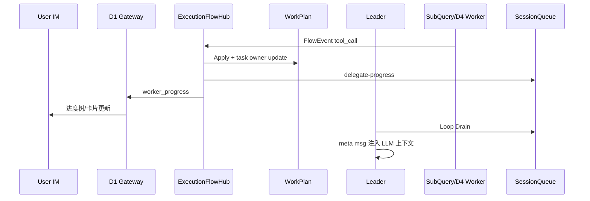
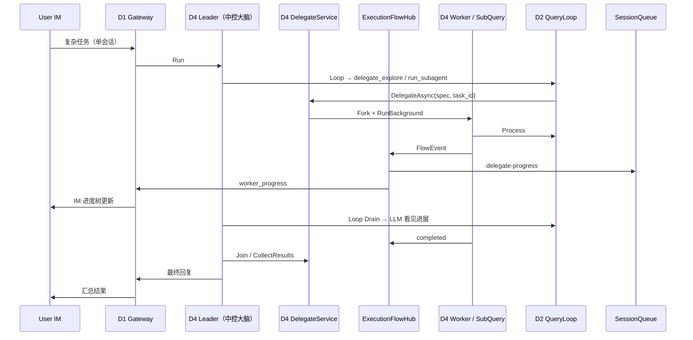

# Design: QueryLoop v2.0 — D4 Hub-Spoke（中控大脑 + 进程内 Worker）

**Demand ID:** DM-20260610-001（延伸）  
**前置:** v1.0/v1.1 QueryLoop 已落地  
**基线 D4:** DM-20260608-005（`docs/multi-agent-design.md` v1.0）  
**原则:** **编排权唯一归属中控大脑**；Worker 仅进程内执行；**用户全程只与大脑对话，中途无需参与**

---

## 1. 架构决策（已确认）

| 决策 | 内容 |
|------|------|
| **Hub-Spoke** | 一个 Devrix **中控大脑**（Leader Agent）决定何时、叫谁、干什么 |
| **双通道感知** | 子 Agent 进展 **同时** 回灌大脑（LLM）与用户 **IM**（只读进度，非第二对话） |
| **无用户中途参与编排** | 用户不选派、不跟 Worker 对话；CRITICAL 权限仍挂主 session |
| **仅进程内** | Worker = InProcess SubQuery / Fork / Background；**v2.0 不包含** CLI AgentTool 外援调度 |
| **无自治 swarm** | 不做 Coordinator 自动认领、不做 Agent 间 Mailbox、不对用户暴露 Team |

### 1.1 委派路径权衡（D2 优先 + D4 按需升级）

| 层级 | 路径 | 依赖 D4 | 典型场景 |
|------|------|---------|----------|
| L0 | 大脑主 Loop 直接调工具 | 否 | 简单单步任务 |
| L1 | **D2 SubQuery**（explore/plan/run_subagent） | **否** | 只读探查、plan 草稿、单路子任务 |
| L2 | D2 并行 SubQuery + Background | **否** | 多个短任务并行/后台 |
| L3 | **D4 Delegate**（Fork Worker） | **是**（`multi_agent.enabled`） | Worktree 隔离、全局限额、长跑 Join、**实时任务流感知** |

**降级规则：** 大脑若选了 L3 但 D4 未启用 → **自动降级为 L1/L2 SubQuery**，同一意图、同一会话，不要求用户改配置。

**性能：** SubQuery 仅 fork `SessionContext` + 嵌套 Loop；D4 Worker 额外承担 Factory/Agent 状态机/Join，仅在 L3 必要时使用。

**与 CC s09–s12 关系：** 只吸收 **运行时原语**（SubQuery、Sidechain、Queue drain、Fork prefix、Worktree），**不**复刻 CC 多 Agent 自治协议。

---

## 2. 问题陈述

| 来源 | 诉求 |
|------|------|
| 产品 | 复杂任务由大脑分解，子任务并行/后台跑，结果汇总后继续 |
| D4 V1 | Agent 状态机、Fork/Join、消息隔离、`IEngine` 委托 L2 |
| QueryLoop v1.x | SubQuery、Sidechain、Queue、Fork prefix、Background |
| CC s12 | Worktree 隔离（可选） |

**冲突点：** 若在 D2/D4 再建 Team + Coordinator + SendMessage，会出现第二颗调度脑，与用户「中控大脑」模型冲突。

**结论：** v2.0 = **ExecutionFlowHub 双通道** + **WorkPlan 读模型** + **D4 Delegate（按需）** + D2 运行时增强；不新增 Team/Coordinator/Mailbox。

---

## 3. 分层职责

```
┌─────────────────────────────────────────────────────────────┐
│ D1 Communication — 用户 ↔ 唯一会话；IM 呈现 WorkPlan 进度树   │
│   · worker_progress / taskflow_update → Renderer（飞书/CLI） │
├─────────────────────────────────────────────────────────────┤
│ Orchestration（v2 读模型包，非顶层 D）— WorkPlan 聚合         │
│   · 汇总 Plan / Task / Milestone / ExecutionFlow             │
│   · ExecutionFlowHub：事件双发 Leader + Gateway              │
├─────────────────────────────────────────────────────────────┤
│ D4 Multi-Agent — Leader Agent（编排权）                       │
│   · Fork / Join / Delegate；Worker 无编排权                   │
├─────────────────────────────────────────────────────────────┤
│ D2 Context Engine — QueryLoop / SubQuery / Task / Plan 写端   │
├─────────────────────────────────────────────────────────────┤
│ D3 LLM Gateway                                               │
└─────────────────────────────────────────────────────────────┘
```

> v3 若 WorkPlan 写模型膨胀，升格为 **D7 Work Orchestration**（见 `design-orchestration-v3.md`）。

**硬约束（继承 D4 Grill 决策）：**

- D4 **只依赖** `contracts.IEngine`，不 import L2 实现包
- Worker 推理 **必须** 走 `Agent.Run → IEngine.Process → QueryLoop`
- 工具/权限 **复用** D2 registry + D1 PermissionManager（经 AgentPermissionGate）
- Fork **保持** 消息隔离 + Join 合并
- **Worker 禁止** 注册 `delegate_*` 工具（permission / tool filter）

---

## 4. CC → 本设计映射（收窄）

| CC (s09–s12) | v2.0 本设计 | 说明 |
|--------------|-------------|------|
| TeamCreate | **Leader.Delegate**（内部 Fork） | 无 Team 聚合根 |
| InProcessTeammate | **Worker Agent**（Fork 子 Agent） | 进程内 goroutine |
| Agent tool spawn | **不采用** | v2.0 仅进程内 |
| SendMessage | **不采用** | Hub 下行 directive + 上行 Join 结果 |
| task-notification drain | **Leader Loop Drain** | notification **只**投递主 AgentID |
| Coordinator auto-claim | **不采用** | 大脑 LLM + `task_*` 工具自行决策 |
| enter/exit worktree | **Worker.WorktreeBinding** | D2-S12 |
| forkSubagent | **Fork cache prefix** | v1.1 已有 |
| Explore/Plan | **delegate_explore / delegate_plan** | 大脑专用工具 |

---

## 5. D4 场景扩展（layering 登记草案）

| Module ID | 场景 | v2.0 职责 |
|-----------|------|-----------|
| D4-S1 Factory | 已有 | 扩展：`CreateWorker(parent, WorkerSpec)` |
| D4-S2 Agent | 已有 | 扩展：`Role=leader|worker`；Worker 编排权关闭 |
| D4-S4 Fork/Join | 已有 | 扩展：异步 Fork + Background Join 回灌大脑 |
| **D4-S10 Delegate** | **新增** | 大脑专用委派 + ExecutionFlow 上报 |
| **ORCH-S1 WorkPlan** | **新增（v2 包）** | 规划/执行读模型聚合 |
| **ORCH-S2 ExecutionFlowHub** | **新增（v2 包）** | 双通道：Leader + IM |
| D4-S6 AgentTool | 已有 | **v2.0 不变、不参与委派路径** |
| ~~D4-S7 Team~~ | — | **不做** |
| ~~D4-S8 Mailbox~~ | — | **不做** |
| ~~D4-S9 Coordinator~~ | — | **不做** |

D2 场景：

| Module ID | 场景 | 职责 |
|-----------|------|------|
| D2-S10 QueryLoop | v1 已有 | Loop / SubQuery / Fork / Streaming |
| D2-S11 Queue | v1.1 已有 | SessionQueue；Leader drain + **delegate-progress** |
| D2-S12 Worktree | **v2.0** | enter/exit、路径解析、清理 |
| **D1-S8 Renderers** | **扩展** | `WorkerProgressRenderer` / 飞书任务树卡片 |

Orchestration（`internal/layers/orchestration/`，v2 不登记顶层 D）：

| Module ID | 场景 | 职责 |
|-----------|------|------|
| ORCH-S1 | WorkPlan | 读模型：Plan + TaskGraph + Milestone + ExecutionFlows |
| ORCH-S2 | ExecutionFlowHub | 统一 FlowEvent；双发 Leader Queue + Gateway |

---

## 6. 核心接口

### 6.1 WorkerSpec（取代 TeammateSpec）

```go
// multiagent/delegate/spec.go

type WorkerSpec struct {
    Role           WorkerRole   // explore | plan | implement
    Directive      string       // 大脑下发的任务描述（InitialInput）
    BuiltinProfile string       // "Explore" | "Plan" | ""
    WorktreeSlug   string       // optional 文件隔离
    MaxTurns       int
    ReadOnly       bool
    Async          bool         // true → Background + notification 回 Leader
}

type WorkerRole string

const (
    WorkerRoleExplore   WorkerRole = "explore"
    WorkerRolePlan      WorkerRole = "plan"
    WorkerRoleImplement WorkerRole = "implement"
)
```

### 6.2 DelegateService（D4-S10，大脑侧）

```go
// multiagent/delegate/service.go

type DelegateService interface {
    // 同步：Fork → Run → Join，结果返回给大脑 tool result
    DelegateSync(ctx context.Context, leader Agent, spec WorkerSpec) (DelegateResult, error)
    // 异步：Fork → RunBackground；Leader 下轮 Loop Drain notification 后继续
    DelegateAsync(ctx context.Context, leader Agent, spec WorkerSpec) (workerID string, err error)
    // 收集已完成 Worker 结果（Join 或 Drain 后调用）
    CollectResults(ctx context.Context, leader Agent, workerIDs []string) ([]DelegateResult, error)
}

type DelegateResult struct {
    WorkerID   string
    Role       WorkerRole
    Summary    string
    Messages   []types.Message // Join 合并后的摘要或完整 buffer（策略可配）
    Error      error
}
```

**与 Factory 关系：** `DelegateService` 内部 `Factory.Create` + `leader.Fork(child)` + 注入 `ParentID`、`SC.AgentID`、Worker 工具白名单。

### 6.3 大脑专用工具（D2 注册，Handler 委托 D4）

| 工具 | 行为 | 用户可见 |
|------|------|----------|
| `delegate_explore` | DelegateSync/Async 或降级 SubQuery | IM 进度树（经 Hub） |
| `delegate_plan` | 同上 | 同上 |
| `delegate_implement` | 标准 Loop 或 SubQuery | 同上 |
| `delegate_status` | 读 WorkPlan / ExecutionFlow 快照 | 否（大脑 Loop 内） |
| `run_subagent` / explore 工具 | L1/L2 SubQuery | IM 进度树（同一 Hub） |

**禁止：** Worker 侧不出现上述工具；不出现 `team_create`、`send_message`。

### 6.4 Worktree（D2-S12 + D4 绑定）

```go
// contextengine/worktree/manager.go
type Manager interface {
    Enter(ctx context.Context, sessionID, slug string) (path string, err error)
    Exit(ctx context.Context, path string, keep bool) error
}
```

Worker 创建时：若 `WorktreeSlug != ""`，`AgentConfig.WorkDir = worktreePath`；Join 后由 Leader 策略 `Exit(keep)`。

### 6.5 ExecutionFlowHub — 子 Agent 进展双通道（v2.0 核心）

**诉求：** SubQuery（L1/L2）与 D4 Worker（L3）的运行时进展，须 **同时** 被：

1. **中控大脑**（Leader LLM 重规划）  
2. **用户 IM**（同一会话内只读进度树/卡片，非第二对话）

#### 6.5.1 统一事件模型

```go
// orchestration/flow/event.go

type ExecutionSource string

const (
    SourceSubQuery  ExecutionSource = "subquery"
    SourceD4Worker  ExecutionSource = "d4_worker"
)

type FlowEventKind string

const (
    FlowForked             FlowEventKind = "forked"
    FlowStarted            FlowEventKind = "started"
    FlowIterating          FlowEventKind = "iterating"
    FlowToolCall           FlowEventKind = "tool_call"
    FlowWaitingPermission  FlowEventKind = "waiting_permission"
    FlowProgress           FlowEventKind = "progress"
    FlowCompleted          FlowEventKind = "completed"
    FlowFailed             FlowEventKind = "failed"
    FlowJoined             FlowEventKind = "joined"
)

type FlowEvent struct {
    SessionID   string
    FlowID      string
    TaskID      string          // 关联 D2 task（delegate 时 brain 传入或自动 task_update owner）
    WorkerID    string          // agent_id / subquery id
    Source      ExecutionSource
    Role        string          // explore | plan | implement | custom
    Kind        FlowEventKind
    Summary     string          // IM + LLM 共用一行摘要
    At          time.Time
    Metadata    map[string]any
}

type ExecutionFlowHub interface {
    Publish(ctx context.Context, ev FlowEvent)
}
```

**事件源：**

| 来源 | Bridge |
|------|--------|
| D2 SubQuery | `SubQueryFlowTap`：Loop `tool_call` / Run 生命周期 |
| D4 Worker | `DelegateFlowBridge`：AgentObserver + EngineEvent tap（节流） |

#### 6.5.2 双通道分发

```
FlowEvent
    │
    ▼
ExecutionFlowHub.Publish
    ├──► WorkPlan.Apply(ev)           // 更新读模型 + 可选 task_update owner/status
    ├──► Leader 通道
    │      SessionQueue Mode=delegate-progress, AgentID=""
    │      → QueryLoop Drain → meta message
    └──► IM 通道
           Gateway EngineEvent Type=worker_progress
           Metadata: render=worker_tree, flow_id, worker_id, source, kind, summary, task_id
           → D1 Renderer → 飞书卡片 / CLI 内嵌状态行
```

**IM 呈现策略（已确认）：**

- **默认：** 主会话 **内嵌进度树**（更新同 thread，非新会话）  
- **可选：** 飞书 **卡片刷新**（`render=worker_card`），由 adapter 配置  
- **节流：** 生命周期事件必推；`tool_call` 默认 500ms 合并  
- **不推：** Worker 全量 token

#### 6.5.3 与 Task 图绑定（已确认）

委派时若带 `task_id`（或 brain 先 `task_create`）：

- `FlowEvent.TaskID` 必填  
- Hub 收到 `FlowStarted` → `TaskManager.SetOwner(session, taskID, workerID)` + status=`in_progress`  
- `FlowCompleted` / `FlowFailed` → `task_update` status  
- WorkPlan 投影：`TaskGraph` 节点下挂 `ExecutionFlow` 子节点 → IM 树形展示

#### 6.5.4 Leader 通道（与 v2 原 DelegateFlow 合并）

```go
const ModeDelegateProgress queue.CommandMode = "delegate-progress"
```

| 字段 | 约定 |
|------|------|
| `Mode` | `delegate-progress` |
| `AgentID` | **空**（Leader main thread drain） |
| `Value` | FlowEvent JSON 或 `<system-reminder>` 摘要 |

大脑工具：`delegate_status` 读 `WorkPlan.Snapshot(sessionID)`。

#### 6.5.5 D1 Gateway 扩展

在 `handleEngineEvent` 增加：

```go
case "worker_progress":
    // 类似 milestone_progress；Metadata render=worker_tree|worker_card
    g.eventHandler.OnMessage(outMsg)
```

新增 `renderers/worker_progress.go`：`WorkerProgressRenderer` 渲染树形/status line。

#### 6.5.6 时序



---

### 6.6 WorkPlan — 规划/执行读模型（v2.0）

**定位：** v2 **不**新建顶层 D7；在 `internal/layers/orchestration/workplan/` 实现 **CQRS 读侧**，写侧仍分散在 D2/D4。

```go
type WorkPlan struct {
    SessionID       string
    PlanArtifact    *PlanSnapshot      // plan 文件路径、plan_mode 状态（来自 D2 SC）
    Tasks           []TaskNode         // 投影 D2 TaskManager
    Milestones      []MilestoneNode    // 投影 D1 TaskFlow / PEV milestone_progress
    ExecutionFlows  []ExecutionFlowSnapshot
    UpdatedAt       time.Time
}

type WorkPlanService interface {
    Snapshot(ctx context.Context, sessionID string) (WorkPlan, error)
    ApplyFlowEvent(ctx context.Context, ev FlowEvent) error
    // 内部订阅：task_* 变更、milestone 事件、FlowEvent
}
```

**谁写、谁读：**

| 写 | 读 |
|----|-----|
| D2 task_* 工具 → TaskManager | Leader `delegate_status` |
| D2 plan_mode → PlanSnapshot | Leader Queue drain 摘要 |
| PEV / milestone → MilestoneNode | D1 Renderer 任务树 |
| ExecutionFlowHub → ExecutionFlows | 用户 IM |

**v3 升格：** 见 `design-orchestration-v3.md`（D7 Work Orchestration）。

---

### 6.7 DelegateFlowTracker（D4 专用，经 Hub 统一出口）

D4 Worker 的 `DelegateFlowBridge` 将 Agent 事件 **转为 FlowEvent** 后 **只** 调用 `ExecutionFlowHub.Publish`，不再单独维护第二套 IM 通道。

```go
type DelegateFlowTracker interface {
    OpenFlow(ctx context.Context, leaderID, sessionID string, spec WorkerSpec, taskID string) (flowID string)
    CloseFlow(flowID string)
}
```

Snapshot / ListActive 由 **WorkPlan** 提供，避免双份状态。

---

## 7. 端到端时序（Hub-Spoke）



**权限：** Worker 触发 CRITICAL 工具时，PermissionManager 仍绑定 **主 session**；用户确认一次，大脑 Loop 恢复，**不**切换到 Worker 会话 UI。

---

## 8. D4 Fork 与 D2 SubQuery 融合

统一路径（与 v1.1 一致，v2.0 加 Worker 约束）：

```
Leader tool: delegate_explore
  → DelegateService.DelegateSync/Async
  → Factory.Create(workerCfg) + leader.Fork(worker)
  → worker.sc.AgentID = worker.ID
  → worker.sc.IsWorker = true          // 禁止再 delegate
  → worker.Run()
       → engine.Process()
            → query.SubQueryRun (BuiltinProfile=Explore|Plan)
            OR 标准 Loop (implement)
  → Join(worker) 或 Queue notification → Leader Drain
```

**Fork cache prefix：** 同一 assistant turn 扇出多个 Worker 时复用 `BuildForkedMessages`（L5-CTX-41）。

**Join 不变：** Worker `TERMINATED` 后 Leader `Join(worker)` 合并 messageBuffer（L5-4-3-01）。

---

## 9. CollaborationMode

| 模式 | v2.0 | 行为 |
|------|------|------|
| `default` / `chain-of-thought` / `iterative-refinement` | 已有 | 单 Agent |
| **`hub-spoke`** | **v2.0 新增** | 注册 `delegate_*` 工具；prompt 含委派策略模板 |
| `supervisor-worker`（原 CC 语义） | **不做** | 由 `hub-spoke` 替代 |
| `peer-review` | V3 | 不在 v2.0 |

```yaml
multi_agent:
  enabled: true                    # L3 D4 Delegate 前置条件
  default_mode: hub-spoke
  delegate:
    enabled: true
    max_workers: 3              # 对齐 MaxChildren
    max_total_agents: 5
    allow_async: true
    flow:
      enabled: true
      progress_queue: true
      im_progress: true           # Gateway worker_progress
      im_render: worker_tree      # worker_tree | worker_card
      event_buffer_size: 32
      tool_summary_throttle_ms: 500

orchestration:
  workplan:
    enabled: true
    link_tasks: true              # FlowEvent ↔ task owner/status
  worktree:
    enabled: true
    base_dir: ~/.devrix/worktrees
```

**Feature gate：** `multi_agent.delegate.enabled=false` 时回退 D4 V1（仅手动 Fork/Join，无 delegate 工具）。

---

## 10. 配置一览

```yaml
context_engine:
  query_loop:
    enabled: true
  subquery:
    fork_subagent_enabled: true
    sidechain_transcript: true

multi_agent:
  delegate:
    enabled: true
    max_workers: 3
    allow_async: true
  worktree:
    enabled: true
    base_dir: ~/.devrix/worktrees
```

---

## 11. 任务重映射（原 T19–T22）

| 原任务 | 新归属 | 交付物 |
|--------|--------|--------|
| T19 TeamCreate / InProcessTeammate | **D4-S10 Delegate** | `multiagent/delegate/` Service + WorkerSpec |
| T20 SendMessage | **删除** | 用 Join + Leader Queue 替代 |
| T21 Coordinator auto-claim | **删除** | 大脑 `task_*` + LLM 决策 |
| T22 Worktree | **D2-S12 + D4 绑定** | worktree.Manager + WorkerSpec.WorktreeSlug |

**建议 PR 顺序（5 PR）：**

1. **PR-A** ORCH ExecutionFlowHub + WorkPlan 骨架 + SubQuery FlowTap
2. **PR-B** D1 worker_progress Gateway + WorkerProgressRenderer
3. **PR-C** D4 DelegateService + Worker 约束 + delegate_* + DelegateFlowBridge → Hub
4. **PR-D** Task 绑定（task_id / owner）+ WorkPlan 投影联调
5. **PR-E** D2 Worktree + Async 降级 SubQuery + L5

---

## 12. L5 测试点（草案）

| ID | Given-When-Then | 优先级 |
|----|-----------------|--------|
| L5-4-10-01 | Leader 调用 delegate_explore 创建 Worker，受 MaxWorkers 限制 | P0 |
| L5-4-10-02 | Worker Run 设置 SC.AgentID，sidechain 隔离 | P0 |
| L5-4-10-03 | Worker **不能**调用 delegate_* 或 Fork | P0 |
| L5-4-10-04 | FlowEvent **进行中** delegate-progress 仅 Leader Drain | P0 |
| L5-4-10-05 | 同事件 worker_progress 到达 Gateway/IM | P0 |
| L5-4-10-06 | SubQuery 与 D4 Worker 共用 FlowEvent schema | P0 |
| L5-4-10-07 | FlowStarted 自动 task owner + in_progress | P0 |
| L5-4-10-08 | D4 未启用 delegate 降级 SubQuery，IM 仍可见 subquery 进度 | P0 |
| L5-4-10-09 | 用户单会话：无第二对话入口 | P0 |
| L5-ORCH-01 | WorkPlan.Snapshot 含 Task + ExecutionFlow | P0 |
| L5-4-12-01 | Worktree enter 后 write 不污染主 WorkDir | P0 |
| L5-4-3-05 | Fork cache prefix 多 Worker 共享（复用 L5-CTX-41） | P1 |

---

## 13. 明确不做（v2.0）

- **不**实现 Team / Mailbox / Coordinator / SendMessage
- **不**用 CLI AgentTool 做 v2.0 委派路径
- **不**让用户与 Worker **对话**或参与编排决策
- **要**让用户在同一会话 **只读** 看见子 Agent 进展（经 ExecutionFlowHub → IM）
- **不**实现 Peer-Review / Vote-Consensus（D4 V3）
- **不**实现 Milestone ↔ Task 双轨（v3.0）
- **不**实现跨 Session 持久化 Worker（v2.1 可选）

---

## 14. 与 D4 文档 V2 路线图对齐

| `multi-agent-design.md` §⑭ | v2.0 本设计 |
|------------------------------|-------------|
| Supervisor-Worker | ✅ 收窄为 **Hub-Spoke**（单大脑） |
| Fork 异步化 | ✅ Background + Leader Drain |
| 完整 COW | ⏸ v2.1 |
| Agent 持久化 | ⏸ v2.1 |

---

## 15. 验收标准

1. SubQuery 与 D4 Delegate 进展经 **同一 Hub** 双发 Leader + IM
2. WorkPlan 快照同时服务 `delegate_status` 与 IM 任务树
3. Worker 进度与 **task_id** 绑定，owner/status 自动更新
4. D4 未启用时 L3 降级 L1/L2，SubQuery 进度仍可见
5. 无用户第二会话、无 Worker 自治领任务
6. `multi_agent.delegate.enabled=false` 时 D4 V1 L5 全绿

---

## 16. 相关文档

| 文档 | 内容 |
|------|------|
| 本文档 | v2.0 Hub-Spoke + ExecutionFlow + WorkPlan |
| `design-orchestration-v3.md` | D7 工作编排域升格草案（v3） |

---

## 17. 下一步（S3）

1. 更新 `demand.md` 延伸 AC（双通道感知 + WorkPlan）
2. `layering.md` 登记 D4-S10、D2-S12、D1-S8 扩展；ORCH 暂记 change 内
3. `tasks.md` v2.0 T19–T24
4. L5-4-10-xx、L5-ORCH-01 写入 `openspec/l5-registry.md`
