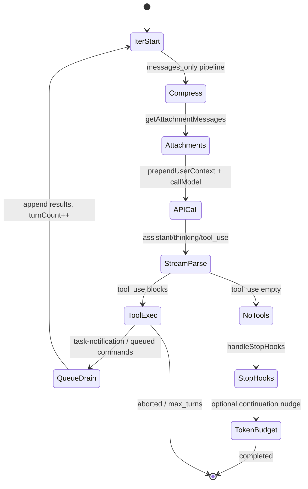

# Design: Devrix Query Runtime — Claude Code Harness 全量对齐

**Change ID:** devrix-queryloop-context  
**Demand ID:** DM-20260610-001  
**Reference:** Claude Code `@anthropic-ai/claude-code` v2.1.88 (`claude-code-source-code/`)

---

## 1. 架构目标

### 1.1 业务目标

- Devrix 主 Agent（Layer 2）与 Claude Code 主 Agent 在**推理语义**上等价：多轮 tool_use、规划模式、子 Agent 隔离、任务图、背景任务通知。
- IM/Feishu 网关（Layer 1）只消费 `EngineEvent` 流，不感知 Harness 内部差异。
- 保留 Devrix 差异化能力（PEV Verify、Milestone DAG、LongTerm SQLite、OTel）作为 **Hook**，不 fork 第二套运行时。

### 1.2 技术目标

| 原则 | Claude Code 实践 | Devrix 目标 |
|------|------------------|-------------|
| 单循环 | `queryLoop` while(true) | `query.Loop` 唯一入口 |
| 工具即插件 | `buildTool()` + dispatch map | `IToolRunner` + registry，Loop 不变 |
| 上下文分层 | system + prependUserContext + messages + attachments | 四层分离 + API 边界注入 |
| 子 Agent 干净上下文 | `runAgent` → 嵌套 `query()` | `SubQuery.Run` 共享 Loop 实现 |
| 压缩在环内 | 每 iteration 前 snip/micro/autocompact | `CompressPerTurn` 默认 true |
| 规划即权限模式 | `permissionContext.mode=plan` | `SessionContext.PermissionMode` |

### 1.3 约束

- Go 实现，不引入 Node/Bun runtime。
- `harness.enabled=false` 保留 V4 bit-identical 路径（回归套件）。
- 单 PR ≤400 行（不含生成代码）；按 version_scope 分 PR。

---

## 2. Claude Code 12 层机制 — Devrix 对标映射

```
CC s01 ──► Devrix query.Loop                    [v1.0 P0]
CC s02 ──► Devrix tool/registry + ToolRunner    [已有，接入 Loop]
CC s03 ──► PermissionMode + Attachments + Plan  [v1.0 P0]
CC s04 ──► SubQuery + forkContext               [v1.0 P0 契约 / v1.1 完整]
CC s05 ──► UserContext + Skill/Memory attach  [v1.0 P0]
CC s06 ──► compression.Pipeline per-turn      [v1.0 P0]
CC s07 ──► tasks disk + ToolSuite register    [v1.0 P0]
CC s08 ──► BackgroundTask + task-notification  [v1.1]
CC s09 ──► TeamCreate / InProcessTeammate      [v2.0 接口预留]
CC s10 ──► SendMessage / mailbox               [v2.0]
CC s11 ──► Coordinator auto-claim              [v2.0]
CC s12 ──► Worktree isolation                  [v2.0]
```

| 机制 | CC 源码锚点 | Devrix 目标包/类型 | 版本 |
|------|-------------|-------------------|------|
| **s01 Loop** | `src/query.ts:queryLoop` | `contextengine/query/loop.go` | v1.0 |
| **s02 Tool** | `src/Tool.ts`, `src/tools.ts` | `contextengine/tool_runner.go`, `multiagent/tool/registry.go` | 已有 |
| **s03 Plan** | `EnterPlanModeTool`, `getPlanModeV2Instructions` | `permission/`, `attachments/plan_mode.go`, `tools/enter_plan_mode` | v1.0 |
| **s04 SubAgent** | `runAgent.ts`, `forkSubagent.ts` | `query/subquery.go`, `multiagent/builtin/explore|plan` | v1.0/v1.1 |
| **s05 Knowledge** | `prependUserContext`, `SkillTool`, CLAUDE.md | `usercontext/`, `attachments/memory.go`, `prompt/loader` | v1.0 |
| **s06 Compress** | compact + snip + micro + collapse | `compression/pipeline.go` 移入 Loop iteration | v1.0 |
| **s07 Tasks** | `TaskCreateTool`, `utils/tasks.ts` | `tasks/` + disk store + tool register | v1.0 |
| **s08 Background** | `LocalAgentTask`, `<task-notification>` | `tasks/background.go`, queue drain in Loop | v1.1 |
| **s09 Teams** | `TeamCreateTool`, `InProcessTeammateTask` | `multiagent/team/` (new) | v2.0 |
| **s10 Protocol** | `SendMessageTool` | `multiagent/mailbox/` | v2.0 |
| **s11 Autonomous** | `coordinatorMode.ts` | `multiagent/coordinator/` | v2.0 |
| **s12 Worktree** | `EnterWorktreeTool` | `contextengine/worktree/` | v2.0 |

---

## 3. 核心运行时：QueryLoop

### 3.1 与 Claude Code queryLoop 的 1:1 语义

对标 `claude-code-source-code/src/query.ts:241-1728`：



**Loop 不变量（与 CC 一致）：**

1. `systemPrompt` + `userContext` + `systemContext` 在 `LoopParams` 中为**不可变**（iteration 间不 reassignment）。
2. `messages` 为**可变 state**；每轮 `append(assistant, tool_results, attachments)`。
3. `prependUserContext` **仅**在 `callModel` 前应用于 API payload，**不**写入 `SessionContext.Messages`。
4. Attachment 在 tool 执行后、下一轮 API 前注入（`getAttachmentMessages` 时机）。
5. `queryTracking`: `{ chainId, depth }` — 主线程 depth=0，SubQuery depth+1。

### 3.2 LoopParams / LoopState

```go
// internal/layers/contextengine/query/types.go

type LoopParams struct {
    SystemPrompt  string
    UserContext   map[string]string   // claudeMd, currentDate, ...
    SystemContext map[string]string   // env, git, ...
    Messages      []types.Message
    Tools         []ToolSchema
    ToolUseCtx    *ToolUseContext     // session, permission, readFileState, agentId
    QuerySource   string              // repl_main_thread | agent:Explore | ...
    MaxTurns      int                 // 0 = unlimited (CC default for main)
    TaskBudget    *TaskBudget         // optional token budget nudge
}

type LoopState struct {
    Messages              []types.Message
    TurnCount             int
    AutoCompactTracking   *AutoCompactTracking
    TaskBudgetRemaining   *int
    QueryTracking         QueryTracking
    Transition            string            // observability: next_turn | reactive_compact | ...
}
```

### 3.3 LoopHooks（Devrix 扩展点 — 不破坏 CC 语义）

```go
type LoopHooks struct {
    BeforeAPICall     func(ctx, *LoopState) error
    AfterToolRound    func(ctx, *LoopState, []ToolResult) error  // PEV Verify 挂这里
    BeforeComplete    func(ctx, *LoopState) (preventContinue bool, err error)  // Stop hooks
    OnCompaction      func(ctx, CompressionReport)
    OnMaxTurns        func(ctx, *LoopState)
}
```

- **PEV Verify**：从「迭代计数器」改为 `AfterToolRound` Hook；`verify_mode=none` 时 Hook 为空操作。
- **Milestone DAG**：每个 milestone 启动**独立** `Loop.Run`（独立 `MaxTurns` + prompt suffix），对标 CC 无 milestone 但等价于多次 SubQuery。

### 3.4 StreamingToolExecutor

对标 CC `StreamingToolExecutor`：tool_use block 流式到达时并行启动 execute，batch 结束后统一 append tool_results。v1.0 可先 sequential，v1.1 对齐 streaming 执行。

---

## 4. 消息模型统一

### 4.1 问题

Devrix 当前 `types.Message` 用 `Metadata["tool_calls"]` JSON 表达 tool_use，Attachment 无一等类型。Claude Code 使用 discriminated union：`user | assistant | attachment`，API 前 `normalizeMessagesForAPI`。

### 4.2 目标模型

```go
// internal/shared/types/conversation.go (new)

type ConversationMessage interface {
    conversationMessage() // sealed
}

type UserMessage struct {
    UUID    string
    Content []ContentBlock  // text | tool_result | image | ...
    IsMeta  bool            // attachment 渲染结果、UserContext prepend
    Origin  string
}

type AssistantMessage struct {
    UUID    string
    Content []ContentBlock  // text | thinking | tool_use
}

type AttachmentMessage struct {
    UUID       string
    Attachment AttachmentPayload
}

type AttachmentPayload struct {
    Type string // plan_mode | plan_mode_exit | memory | task_notification | ...
    // typed fields via json.RawMessage or union struct
}
```

**迁移策略（v1.0）：**

- 保留 `types.Message` 作为 persisted snapshot 格式（`ctx-v1` 兼容）。
- 新增 `conversation` 包作为 Loop 内部模型；入口/出口 adapter 转换。
- v1.2 可选 snapshot v2 原生存储 union 类型。

### 4.3 Attachment → UserMessage 渲染

对标 `messages.ts:getPlanModeInstructions` / `attachmentToUserMessages`：

- `attachments.Registry.Collect()` → `[]AttachmentPayload`
- `attachments.Render(a)` → `[]UserMessage{IsMeta: true}`
- Plan mode 5-phase workflow 模板移植自 CC `getPlanModeV2Instructions`（Go `text/template`）

**Throttle：** `plan_mode` full/sparse 每 N  attachment（CC `PLAN_MODE_ATTACHMENT_CONFIG`）。

---

## 5. 上下文组装四层

```
┌─────────────────────────────────────────────────────────────┐
│ Layer A: SystemPrompt (stable per turn, cache-friendly)      │
│   harness.SystemPromptAssembler → devrix_core + session_ctx  │
│   + appendSystemContext(env)                                 │
│   不含 AGENTS.md 全文（prepend 模式）                         │
├─────────────────────────────────────────────────────────────┤
│ Layer B: UserContext (API boundary only, NOT in state)       │
│   usercontext.Provider → prependUserContext(messages)        │
│   { claudeMd, currentDate, workDir }                         │
├─────────────────────────────────────────────────────────────┤
│ Layer C: Messages (mutable state, compressed per turn)       │
│   user/assistant/tool_result history                         │
├─────────────────────────────────────────────────────────────┤
│ Layer D: Attachments (meta user, injected between rounds)    │
│   plan_mode, memory, routing, task_notification, ...         │
└─────────────────────────────────────────────────────────────┘
```

### 5.1 SystemPromptAssembler 调整

现有 [system_prompt_assembler.go](devrix/internal/layers/contextengine/harness/system_prompt_assembler.go) 四层保留：

| Layer | 内容 | CC 对标 |
|-------|------|---------|
| L0 | devrix_core template | main system prompt |
| L1 | session_context (date, workdir, sessionId) | env details |
| L2 | workspace_guidance | tool usage hints |
| L3 | loaded_context XML | **仅** longterm memory + bootstrap + routing；**不含** AGENTS.md（prepend 模式） |

### 5.2 UserContext Provider

对标 `context.ts:getUserContext` + `api.ts:prependUserContext`：

```go
func (p *Provider) Get(ctx context.Context, sc *SessionContext) (map[string]string, error)
func PrependForAPI(msgs []ConversationMessage, uc map[string]string) []ConversationMessage
```

- `claudeMd`：walk workDir 加载 AGENTS.md / .devrix/AGENTS.md（复用 prompt.Loader）
- SubQuery `OmitAgentsMD`：Explore/Plan agent 剥离 claudeMd（CC `runAgent.ts:390-398`）

### 5.3 压缩时机变更

**现状：** [engine.go](devrix/internal/layers/contextengine/engine.go) Process 入口跑一次 Pipeline。

**目标：** 对标 CC — Loop **每 iteration** 开头：

```
messagesForQuery = getMessagesAfterCompactBoundary(state.messages)
→ toolResultBudget → snip → microcompact → collapse → autocompact
→ (不 assemble system 进 messages)
→ API call
```

Process 入口仅做 `ShouldCompress` 预警 + token block 前置检查（可选）。

---

## 6. PermissionMode 与 Plan Mode（s03 全量）

### 6.1 PermissionMode 枚举

```go
type PermissionMode string

const (
    PermissionDefault       PermissionMode = "default"
    PermissionPlan          PermissionMode = "plan"
    PermissionAcceptEdits   PermissionMode = "accept_edits"
    PermissionBypass        PermissionMode = "bypass" // admin only
    PermissionBubble        PermissionMode = "bubble" // subagent → parent terminal
)
```

存储于 `SessionContext.PermissionMode` + `PrePlanMode`（对标 `prepareContextForPlanMode`）。

### 6.2 工具

| 工具 | CC 对标 | 行为 |
|------|---------|------|
| `enter_plan_mode` | EnterPlanModeTool | mode→plan；禁止 agentId 上下文调用 |
| `exit_plan_mode` | ExitPlanModeV2Tool | 用户审批；注入 plan_mode_exit attachment |
| `todo_write` | TodoWriteTool | 内存 checklist（tasks.mode=v1） |
| `task_create/update/get/list` | TaskCreateTool... | 磁盘任务图（tasks.mode=v2） |

### 6.3 Plan Mode 5-Phase Workflow

Attachment 注入（非改 system prompt），对标 CC Phase 1–5：

1. **Explore** — 仅 `subagent_type=Explore`，可并行 N 个（配置 `plan.explore_agent_count`）
2. **Plan** — `subagent_type=Plan`，传入 Phase 1 上下文
3. **Review** — 主 Agent 读关键文件 + ask_user（Devrix：飞书确认或 CLI）
4. **Final Plan** — 仅写 plan 文件（`~/.devrix/plans/{sessionId}.md`）
5. **Exit** — `exit_plan_mode` 请求审批

### 6.4 ToolPool 按 Mode 过滤

对标 CC `assembleToolPool(permissionContext)` + Explore `disallowedTools`：

| Mode | 可见工具 |
|------|----------|
| plan | Read, Grep, Glob, Bash(只读), Agent(Explore/Plan only), Write(plan file only) |
| accept_edits | + Write, Edit |
| default | 全量（经 harness ToolPoolFilter） |

---

## 7. SubQuery 与子 Agent（s04 全量）

### 7.1 SubQuery.Run

对标 `runAgent.ts:748-806` 嵌套 `query()`：

```go
type SubQueryParams struct {
    AgentDefinition   AgentDefinition
    PromptMessages    []ConversationMessage
    ForkContextMessages []ConversationMessage // optional: 父 messages 全量
    QuerySource       string
    MaxTurns          int
    Model             string
    Override          *SubQueryOverride // systemPrompt, tools exact, thinking
}

func SubQueryRun(ctx context.Context, params SubQueryParams, deps LoopDeps) (*SubQueryResult, error)
```

**initialMessages 组装（CC 一致）：**

```
initialMessages = filterIncompleteToolCalls(forkContextMessages) + promptMessages
```

### 7.2 Fork 路径（prompt cache 优化）

对标 `forkSubagent.ts:buildForkedMessages`：

- 保留父 assistant 全 tool_use blocks
- 所有 tool_result 用**相同 placeholder** 文本
- 末尾追加 per-child directive（唯一差异块 → cache hit）

配置 `fork_subagent.enabled`（CC `FORK_SUBAGENT` feature）。

### 7.3 内置 Agent

| Agent | CC 对标 | Model | omitClaudeMd | Tools |
|-------|---------|-------|--------------|-------|
| Explore | exploreAgent.ts | haiku/fast | true | read-only search |
| Plan | planAgent.ts | inherit | true | read-only + plan output |
| Verify | verification agent | inherit | false | Devrix 扩展 |

实现于 `multiagent/builtin/`，通过 SubQuery 调用同一 Loop。

### 7.4 Sidechain Transcript

对标 `recordSidechainTranscript`：

- 路径：`~/.devrix/sessions/{sessionId}/subagents/{agentId}.jsonl`
- 每 message O(1) append；resume 时可重建 SubQuery state
- `agentId` 非空时 Loop 跳过主线程 task summary / tool use summary

---

## 8. 任务与背景（s07 + s08）

### 8.1 持久化 Task 图

对标 `utils/tasks.ts` 文件布局：

```
~/.devrix/tasks/{taskListId}/
  task_001.json
  task_002.json
  high_water_mark
```

- `taskListId` = sessionId 或 teamName（leader 设置）
- 字段：id, subject, description, status, owner, blocks, blockedBy, metadata
- 工具：create/update/get/list/delete + hooks（TaskCreated event）

### 8.2 Background Task + Notification

对标 `LocalAgentTask` + queue drain（CC `query.ts:1560-1578`）：

- `run_in_background=true` → async SubQuery，注册 `BackgroundTask`
- 完成 → enqueue `task-notification` 到 session queue
- Loop 每轮 drain：`mode=task-notification && agentId match`

v1.1 实现；v1.0 预留 `QueueDrainer` 接口。

---

## 9. Teams / Worktree（s09–s12，v2.0 设计预留）

仅定义接口，实现排 v2.0：

```go
// multiagent/team/
type TeamManager interface {
    Create(ctx, name string, members []TeammateSpec) (*Team, error)
    SpawnInProcess(ctx, spec TeammateSpec) (TeammateHandle, error)
}

// multiagent/mailbox/
type SendMessageTool struct { /* request-response */ }

// multiagent/coordinator/
type Coordinator interface {
    IdleCycle(ctx) // scan tasks, auto-claim
}

// contextengine/worktree/
type WorktreeManager interface {
    Enter(ctx, slug string) (path string, err error)
    Exit(ctx, path string, keep bool) error
}
```

CC 源码锚点：`swarm/`, `coordinator/coordinatorMode.ts`, worktree tools。

---

## 10. Process 端到端时序（v1.0 目标）

```mermaid
sequenceDiagram
    participant GW as Gateway
    participant CE as ContextEngine
    participant Boot as HarnessBootstrap
    participant ASM as SystemPromptAssembler
    participant Loop as QueryLoop
    participant LLM as ILLMGateway
    participant TR as IToolRunner

    GW->>CE: Process(session, userMessage)
    CE->>CE: LoadOrInit snapshot
    CE->>Boot: Run first turn only
    CE->>CE: AppendUserMessage
    CE->>ASM: Build 4-layer system
    CE->>Loop: Run(params, hooks)
    loop each turn
        Loop->>Loop: Compress messages
        Loop->>Loop: Collect attachments
        Loop->>LLM: ChatStream prepend UC
        LLM-->>Loop: tool_use / text
        alt tool_use
            Loop->>TR: Execute tools
            TR-->>Loop: tool_results
        end
    end
    Loop-->>CE: LoopResult
    CE->>CE: Hooks.Verify optional
    CE->>CE: Persist snapshot + transcript
    CE-->>GW: EngineEvent stream
```

---

## 11. 与现有 Devrix 模块关系

| 模块 | 重构后角色 |
|------|-----------|
| [pev_engine.go](devrix/internal/layers/contextengine/pev_engine.go) | 薄封装：Plan/Milestone 编排 + 调用 Loop + Verify Hook |
| [context_assembler.go](devrix/internal/layers/contextengine/context_assembler.go) | **删除**（由 Assembler + Loop 替代） |
| [tasks/plan_mode.go](devrix/internal/layers/contextengine/tasks/plan_mode.go) | 逻辑并入 PermissionMode + Attachment；CLI 调 API |
| [compression/pipeline.go](devrix/internal/layers/contextengine/compression/pipeline.go) | 由 Loop 每轮调用；去掉 step5 assemble system |
| [multiagent/tool/cli_adapter.go](devrix/internal/layers/multiagent/tool/cli_adapter.go) | 实现 `AgentTool` 接口；内部可不改（v3.0 可选 SubQuery 替换） |
| [memory/longterm.go](devrix/internal/layers/contextengine/memory/longterm.go) | Recall → Attachment provider + Assembler L3 |

---

## 12. 配置 Schema（devrix.yaml）

```yaml
context_engine:
  query_loop:
    enabled: true
    max_turns: 0              # 0=unlimited
    compress_per_turn: true
    streaming_tool_exec: false  # v1.1 true

  user_context:
    mode: prepend               # prepend | system | both

  attachments:
    enabled: true
    plan_mode_full_every: 5     # full/sparse cycle

  permission:
    default_mode: default
    plan:
      explore_agent_count: 3
      plan_agent_count: 1
      plan_file_dir: "~/.devrix/plans"

  tasks:
    mode: v2                    # v1=todo_write, v2=task_*
    store_dir: "~/.devrix/tasks"

  subquery:
    fork_subagent_enabled: false
    sidechain_transcript: true
    default_subagent_max_turns: 50

  # 保留现有
  harness: { ... }
  compression: { ... }
  pev:
    verify_mode: basic
    # max_iterations 废弃 → query_loop.max_turns + hooks
```

---

## 13. 文件清单（v1.0）

### 新增

| 路径 | 职责 |
|------|------|
| `contextengine/query/loop.go` | QueryLoop 主循环 |
| `contextengine/query/types.go` | LoopParams/State/Hooks |
| `contextengine/query/subquery.go` | SubQuery 入口 |
| `contextengine/query/queue.go` | Queue drain 接口 |
| `contextengine/usercontext/provider.go` | Get + PrependForAPI |
| `contextengine/attachments/registry.go` | Collect + Render |
| `contextengine/attachments/plan_mode.go` | 5-phase 模板 |
| `contextengine/attachments/memory.go` | LongTerm recall |
| `contextengine/permission/mode.go` | PermissionMode 转换 |
| `contextengine/permission/toolpool.go` | Mode→Tools 过滤 |
| `contextengine/tools/enter_plan_mode.go` | 工具实现 |
| `contextengine/tools/exit_plan_mode.go` | 工具实现 |
| `contextengine/conversation/adapter.go` | Message ↔ Conversation |
| `contextengine/transcript/sidechain.go` | SubAgent jsonl |
| `shared/types/permission.go` | PermissionMode 枚举 |
| `multiagent/builtin/explore.go` | Explore agent |
| `multiagent/builtin/plan.go` | Plan agent |

### 修改

| 路径 | 变更 |
|------|------|
| `contextengine/engine.go` | Process → Loop；压缩下沉 |
| `contextengine/pev_engine.go` | 委托 Loop + Hooks |
| `harness/system_prompt_assembler.go` | AGENTS.md 剥离选项 |
| `compression/pipeline.go` | 可选跳过 assemble |
| `tasks/task_manager.go` | 磁盘持久化 |
| `shared/types/context.go` | PermissionMode, PlanFilePath |
| `devrix.yaml` | 新配置段 |

### 删除（v1.0 末）

| 路径 | 原因 |
|------|------|
| `contextengine/context_assembler.go` | 重复 |

---

## 14. L5 测试点

| ID | Given-When-Then | 优先级 |
|----|-----------------|--------|
| L5-CTX-34 | 多轮 tool_use 直至无 tool；turnCount 递增 | P0 |
| L5-CTX-35 | UserContext prepend 不在 snapshot Messages 中 | P0 |
| L5-CTX-36 | plan_mode attachment full/sparse throttle | P0 |
| L5-CTX-37 | plan mode 拒绝 Write 非 plan 文件 | P0 |
| L5-CTX-38 | task_create 磁盘持久 + list 一致 | P0 |
| L5-CTX-39 | harness.enabled=false V4 回归 | P0 |
| L5-CTX-40 | SubQuery Explore omitClaudeMd + read-only tools | P1 |
| L5-CTX-41 | Fork subagent placeholder tool_results 一致 | P1 |
| L5-CTX-42 | sidechain transcript resume 重建 messages | P1 |

---

## 15. 分阶段交付（完整路线图）

### v1.0 — CC s01–s07 对齐（P0，6–8 PR）

1. conversation adapter + query.Loop 骨架
2. usercontext + Assembler 剥离 AGENTS.md
3. attachments registry + plan_mode
4. permission mode + enter/exit tools + toolpool filter
5. task disk + tool register
6. PEVEngine → Loop 切换 + engine Process 改造
7. builtin Explore/Plan SubQuery
8. 测试 + 删 legacy assembler

### v1.1 — s04/s08 深化

- Fork subagent + cache-safe params
- StreamingToolExecutor
- BackgroundTask + task-notification queue drain
- Tool use summary（Haiku side query）

### v2.0 — s09–s12

- TeamCreate / SendMessage / Coordinator / Worktree
- 对标 CC swarm 包

### v3.0 — Devrix 超越层（在 CC 对齐之上迭代）

> 放在后面，不阻塞对齐。

| 能力 | 说明 |
|------|------|
| **PEV Verify 增强** | Loop Hook 上叠加 commands/semantic verify，比 CC 更严格的 L5 契约校验 |
| **Milestone + Task 双轨** | CC Task 图 + Devrix Milestone DAG 互操作（milestone ↔ task blocks） |
| **Feishu 流式 UX** | EngineEvent 与 Attachment 类型映射到 IM 卡片语义层 |
| **L5 测试网** | 每个 L4 能力自动关联集成测试；Plan Mode 场景 E2E |
| **Unified Observability** | queryChainId 贯穿 OTel → Feishu debug 卡片 |
| **Multi-model routing** | Plan/Explore 用 fast model，主 Agent 用 strong model（CC 部分硬编码，我们配置化） |

---

## 16. 回归风险

| 区域 | 风险 | 缓解 |
|------|------|------|
| MiniMax tool_call_id | 多轮 tool 消息格式 | conversation adapter 统一 normalize；保留 synthesis fallback |
| Snapshot ctx-v1 | 新字段 PermissionMode | 可选字段，缺省 default |
| PEV max_iterations 用户 | 行为变化 | 文档 + 配置迁移：`pev.max_iterations` → `query_loop.max_turns` |
| harness.enabled=false | 双路径 | CI 双套 L5 |

---

## 17. 参考源码索引

| 主题 | 文件 |
|------|------|
| 主循环 | `claude-code-source-code/src/query.ts` |
| SubAgent | `claude-code-source-code/src/tools/AgentTool/runAgent.ts` |
| Fork | `claude-code-source-code/src/tools/AgentTool/forkSubagent.ts` |
| Attachment | `claude-code-source-code/src/utils/attachments.ts` |
| Plan 指令 | `claude-code-source-code/src/utils/messages.ts` (getPlanModeV2Instructions) |
| UserContext | `claude-code-source-code/src/context.ts`, `src/utils/api.ts` |
| Plan 工具 | `claude-code-source-code/src/tools/EnterPlanModeTool/` |
| Task | `claude-code-source-code/src/tools/TaskCreateTool/` |
| Explore/Plan | `claude-code-source-code/src/tools/AgentTool/built-in/` |
