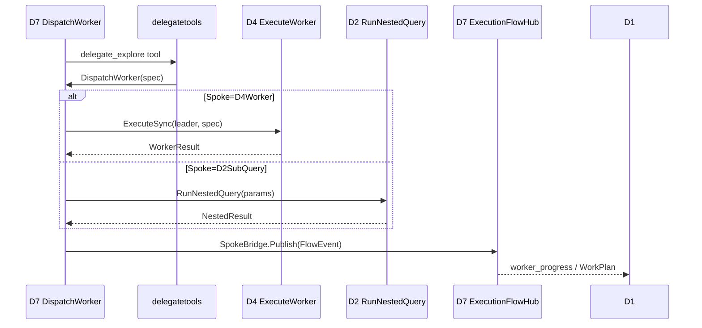

# D4 Multi-Agent — S 层重构 Design

**Change ID:** devrix-d4-sa-refine  
**Demand ID:** DM-20260614-018  
**阶段:** S3 Design  
**版本:** v1.0  
**状态:** Draft — 待 S3-Gate  
**关联:** `gaming-analysis.md`；`proposal.md` §4 R1 决议

---

## 1. 概述

### 1.1 设计目标

| 目标 | 描述 |
|------|------|
| S 切法 | 按 Agent 执行原语价值流（供给→运行→隔离→执行 Worker→外化），非按 Go 子包 |
| Hub-Spoke | **全归 D7**（R1 D7-1）；D4/D2 仅纯执行 Follower |
| Legacy 双轨 | S1–S10 冻结；S11–S16 Canonical |
| D4 Thin | 无 `hub.Publish`、无 Spoke 选择、无 delegate_* 路由 |
| 跨域 | `d4-domain.md` + `d4-d7-boundary.md` 双向引用 |

### 1.2 版本范围

| 版本 | 范围 |
|------|------|
| v1.0 | Registry + Gherkin + Legacy 映射 + Hub-Spoke 边界规格 |
| v1.1 | Span 归 D5；`orchestration.flow.*` 统一；D6 增 3 probe |
| v2.0 | D7 `hubspoke/` 收敛 + D2 `flow_report` 迁出 + D4 物理路径（**并入本 change**） |

---

## 2. Decision 记录

### Decision: S 切法

| 方案 | 优点 | 缺点 |
|------|------|------|
| A: 5+1 价值流 S11–S16 | 对齐 North Star；与 D2/D3 同型 | 双轨表 |
| B: 保留 module S 微调 | 改动小 | 不解决技术 S 绑架 |

**选择:** A  
**理由:** Playbook 原则 1  
**影响:** registries + layering；v1.0 无代码

### Decision: S 编号

| 方案 | 选择 | 理由 |
|------|------|------|
| 复用 S10 扩展 Delegate 语义 | 拒绝 | Hub-Spoke 迁 D7，S10 语义作废 |
| 新号段 S11–S16 | **采用** | 与 D2 S15–S20 模式一致 |
| 重编 S1–S9 | 拒绝 | BREAKING T |

### Decision: Hub-Spoke 归属（R1 D4）

| 方案 | 选择 | 理由 |
|------|------|------|
| D7-1 全归 D7 | **采用（Owner R1）** | 三 Spoke 写侧统一；D4 不拥有编排 |
| D7-2 折中 | 拒绝 | 规格与代码双头持续 |
| D4-1 维持 S10 | 拒绝 | 与 R1 相悖 |

**影响:** D4-S10 从 D4 删除；D7-S2/S4 扩展 A/F；v2.0 迁 `bridge`/`dispatch`/`flow_report`

### Decision: D4-S14 命名（R1 D6）

| 方案 | 选择 | 理由 |
|------|------|------|
| ExecuteWorker | **采用** | 委派词汇归 D7；与 RunAgentLoop 对称 |
| RunDelegatedWorker | 拒绝 | Leader 词汇泄漏进 D4 S |

### Decision: D2 SubQuery Flow 发布（R1 D5）

| 方案 | 选择 | 理由 |
|------|------|------|
| 留 D2 `flow_report.go` | 拒绝 | Hub-Spoke 写侧应统一 D7 |
| 迁 D7 `hubspoke/subquery_bridge.go` | **采用** | 与 D4 FlowBridge 同质 |

**影响:** D2 `SubQueryParams.FlowHub` 删除；D2-S19 收窄为纯嵌套执行

### Decision: S8 Observability

| 方案 | 选择 | 理由 |
|------|------|------|
| 留 D4 S8 | 拒绝 | D5 是 Span/Metric SoT |
| 迁 D5 + D4 thin emit hook | **采用** | Playbook 原则 4 |

### Decision: v2.0 交付（R1 D7）

| 方案 | 选择 | 理由 |
|------|------|------|
| 独立 D7 change | 拒绝（Owner） | 边界一次闭合 |
| 并入本 change v2.0 slice a–e | **采用** | 避免规格/代码长期失步 |

---

## 3. S 层定义（Canonical）

### D4-S11: ProvisionAgent

| 属性 | 值 |
|------|---|
| North Star 承诺 | C1：按配额创建 Agent/Worker，注入协作模式 |
| 触发 | D7 bootstrap / Factory 调用 |
| 涉及 Legacy | S1 Factory, S4 Collaboration, S7 Builtin（注册面） |
| 涉及 A | CreateAgent, EnhancePrompt, RegisterBuiltin |

**Gherkin:**

```gherkin
# <!-- T: D4-S11-A01-T01 --> (maps D4-S1-A01-T01)
Scenario: AgentFactory 创建 Agent 实例
  Given valid AgentConfig with session_id
  When AgentFactory.Create is called
  Then a new Agent is returned in CREATED state
  And Agent.ID is non-empty UUID

# <!-- T: D4-S11-A01-T05 --> (maps D4-S1-A01-T05)
Scenario: max_total_agents 会话级限额
  Given session already at max_total_agents
  When Create is called again
  Then AGT_FACTORY error is returned
  And no new Agent is created

# <!-- T: D4-S11-A02-T01 --> (maps D4-S4-A01-T01)
Scenario: CoT prompt 增强
  Given CollaborationMode chain-of-thought
  When BuildPromptForMode runs
  Then system prompt contains step-by-step instruction

# <!-- T: D4-S11-A01-T02 sad -->
Scenario: 拒绝缺少 session_id 的配置
  Given AgentConfig without session_id
  When Create is called
  Then validation error is returned
```

### D4-S12: RunAgentLoop

| 属性 | 值 |
|------|---|
| North Star 承诺 | C2：Agent 主循环可取消；CRITICAL 工具等权限 |
| 触发 | Agent.Run |
| 涉及 Legacy | S2 Agent |
| **禁止** | hub.Publish；delegate_* 路由 |

**Gherkin:**

```gherkin
# <!-- T: D4-S12-A01-T01 --> (maps D4-S2-A01-T01)
Scenario: Agent 生命周期合法状态转换
  Given Agent in CREATED
  When Run then complete
  Then state transitions CREATED→RUNNING→ITERATING→TERMINATED

# <!-- T: D4-S12-A02-T02 --> (maps D4-S2-A02-T02)
Scenario: AgentPermissionGate 批准与拒绝
  Given CRITICAL tool_call pending
  When ResolvePermission granted
  Then Agent returns to ITERATING
  When ResolvePermission denied
  Then Agent becomes TERMINATED with AGT_PERMISSION_DENIED

# <!-- T: D4-S12-A02-T03 sad -->
Scenario: 权限超时终止 Agent
  Given permission request pending 60s
  When timeout elapses
  Then Agent becomes TERMINATED with AGT_PERMISSION_TIMEOUT

# <!-- T: D4-S12-A01-T03 --> (maps D4-S3-A01-T03)
Scenario: Agent 超时自动终止
  Given Agent Timeout exceeded
  When Run exceeds limit
  Then TERMINATED with AGT_LIFECYCLE_TIMEOUT
```

### D4-S13: IsolateAndMerge

| 属性 | 值 |
|------|---|
| North Star 承诺 | C3：Fork/Worker 执行不污染父 Session |
| 涉及 Legacy | S3 ForkJoin, S9 SessionView, S2-A03 WorkerEngine |

**Gherkin:**

```gherkin
# <!-- T: D4-S13-A01-T05 --> (maps D4-S3-A01-T05)
Scenario: Fork metadata 不污染父 Session
  Given parent session with metadata
  When child Fork writes via SessionView
  Then parent metadata unchanged

# <!-- T: D4-S13-A02-T07 --> (maps D4-S3-A02-T07)
Scenario: Join 去重 tool_call_id
  Given child completed with duplicate tool_call messages
  When Join runs
  Then parent buffer has deduplicated messages

# <!-- T: D4-S13-A01-T06 -->
Scenario: 并发 Fork 三子 Agent Join 一致性
  Given three concurrent child Agents
  When all complete and Join
  Then parent message order is stable

# <!-- T: D4-S13-A03-T01 sad -->
Scenario: Worker 不能 Fork
  Given Agent with ParentID set
  When Fork is called
  Then AGT_INVALID_CONFIG error
```

### D4-S14: ExecuteWorker

| 属性 | 值 |
|------|---|
| North Star 承诺 | C4：给定 WorkerSpec，fork→run→join 返回结果 |
| 调用方 | **D7** `SpokeDispatcher`（非 Leader 工具直连） |
| 涉及 Legacy | S10 Delegate（**仅执行面**） |
| **禁止** | DelegateOrFallback；FlowBridge；async 策略决策 |

**Gherkin:**

```gherkin
# <!-- T: D4-S14-A01-T01 --> (maps D4-S10-A01-T01)
Scenario: ExecuteWorker 同步执行 Worker
  Given D7 dispatched WorkerSpec with leader Agent
  When ExecuteSync runs
  Then child Worker is forked and Run completes
  And result is joined to leader

# <!-- T: D4-S14-A01-T05 --> (maps D4-S10-A01-T05)
Scenario: Worker 在 worktree 沙箱执行
  Given WorkerSpec with worktree_slug
  When ExecuteSync runs
  Then worktree is entered before Run
  And worktree is cleaned on exit

# <!-- T: D4-S14-A01-T03 --> (maps D4-S10-A01-T03)
Scenario: Worker 不能 delegate 或 Fork
  Given Worker Agent from ExecuteSync
  When delegate_* or Fork attempted
  Then operation is rejected

# <!-- T: D4-S14-A01-T06 --> (maps D4-S10-A01-T06)
Scenario: ExecuteAsync 返回 worker_id
  Given async WorkerSpec
  When ExecuteAsync runs
  Then worker_id returned immediately
  And Worker runs in background
```

### D4-S15: InvokeExternalAgent

| 属性 | 值 |
|------|---|
| North Star 承诺 | C5：CLI/Cursor 子进程 Agent Tool Session 隔离 |
| 涉及 Legacy | S6 AgentTool |

**Gherkin:**

```gherkin
# <!-- T: D4-S15-A02-T02 --> (maps D4-S6-A02-T02)
Scenario: CLI 适配器启动子进程并解析 stream-json
  Given CLI AgentTool registered
  When Execute with valid request
  Then subprocess starts and events stream

# <!-- T: D4-S15-A02-T07 --> (maps D4-S6-A02-T07)
Scenario: 不同 Session 的 Agent Tool 隔离
  Given two D1 sessions
  When both invoke CLI tool
  Then subprocesses do not share state

# <!-- T: D4-S15-A02-T03 sad -->
Scenario: CLI 超时终止子进程
  Given execution exceeds timeout
  When watchdog fires
  Then subprocess is killed
```

### D4-S16: ConfigureAgents

| 属性 | 值 |
|------|---|
| North Star 承诺 | C6：multi_agent 配置加载与校验 |
| 涉及 Legacy | shared/config/multiagent.go |

**Gherkin:**

```gherkin
# <!-- T: D4-S16-A01-T01 -->
Scenario: 默认 multi_agent 配置合法
  Given empty MultiAgentFileConfig
  When BuildMultiAgentConfig runs
  Then MaxChildren defaults to 3
  And DefaultTimeout is positive

# <!-- T: D4-S16-A01-T02 sad -->
Scenario: 非法 MaxChildren 被拒绝
  Given MaxChildren negative
  When validation runs
  Then error returned
```

---

## 4. D7 Hub-Spoke 扩展（Canonical 草案，v1.0 规格）

> Hub-Spoke **不属于 D4**；本节供 `d4-d7-boundary.md` 与 D7 registry 增量同步。

### D7-S2 新增 A

| A ID | Name | 职责 | v2.0 代码 |
|------|------|------|----------|
| D7-S2-A04 | DispatchWorker | 解析入口、选 Spoke、调 Executor | `hubspoke/dispatch.go` |
| D7-S2-A05 | RouteDelegateTools | delegate_* 工具注册与执行入口 | `delegatetools/`（已有） |

### D7-S4 新增 A

| A ID | Name | 职责 | v2.0 代码 |
|------|------|------|----------|
| D7-S4-A04 | BridgeAgentSpoke | D4 AgentEvent→FlowEvent | `hubspoke/agent_bridge.go` |
| D7-S4-A05 | BridgeSubQuerySpoke | D2 SubQuery emit→FlowEvent | `hubspoke/subquery_bridge.go` |
| D7-S4-A06 | NotifyLeaderAsync | async Worker 完成 enqueue | `hubspoke/async.go` |

### D7 Hub-Spoke 编排序

```text
D7-S2 DispatchWorker(spec)
  1. ResolveLeader(session) — optional
  2. SelectSpoke(spec) → D4Worker | D2SubQuery | D2Background
  3. BindSpokeBridge(spoke_type)
  4. Executor.Run(ctx, spec)     ← D4 ExecuteWorker 或 D2 RunNestedQuery
  5. SpokeBridge.Publish(events) ← 唯一 hub.Publish 出口
  6. D7-S4 WorkPlan.Apply + sessionqueue + imsink
```

---

## 5. A 层（D4 Canonical）

| A ID | Name | Canonical S | Legacy 映射 | Code（v1.0） |
|------|------|-------------|-------------|-------------|
| D4-S11-A01 | CreateAgent | S11 | S1-A01 | `factory/factory.go` |
| D4-S11-A02 | EnhancePrompt | S11 | S4-A01 | `collaboration/prompt.go` |
| D4-S11-A03 | RegisterBuiltin | S11 | S7-A01 | `builtin/agents.go` |
| D4-S12-A01 | RunAgentLoop | S12 | S2-A01 | `agent/lifecycle.go` |
| D4-S12-A02 | ResolvePermission | S12 | S2-A02 | `agent/perm_gate.go` |
| D4-S13-A01 | ForkAndJoin | S13 | S3-A01/A02 | `agent/forkjoin.go` |
| D4-S13-A02 | ManageSessionView | S13 | S9-A01 | `sessionview/sessionview.go` |
| D4-S13-A03 | WrapWorkerEngine | S13 | S2-A03 | `agent/worker_engine.go` |
| D4-S14-A01 | ExecuteWorker | S14 | S10-A01（执行面） | `delegate/service.go` → v2.0 `execute/` |
| D4-S15-A01 | RegisterExternalTool | S15 | S6-A01 | `tool/registry.go` |
| D4-S15-A02 | ExecuteExternalTool | S15 | S6-A02 | `tool/cli_adapter.go`, `cursor_adapter.go` |
| D4-S15-A03 | ParseStreamOutput | S15 | S6-A03 | `tool/stream_json.go` |
| D4-S16-A01 | LoadAgentConfig | S16 | config | `shared/config/multiagent.go` |
| D4-S0-A01 | KernelContracts | kernel | S5 Observer | `contracts.go`, `observer/` |

**Out of Scope A（迁 D7，v2.0）：**

| Legacy A | 当前位置 | 目标 |
|----------|----------|------|
| DelegateOrFallback | `delegate/service.go` | D7-S2-A04 |
| BridgeFlowEvents | `delegate/bridge.go` | D7-S4-A04/A05 |
| publishSubQueryFlow | `nested/flow_report.go` | D7-S4-A05 |
| RecordForkPolicyMetrics | `observability/metrics.go` | D5 |

---

## 6. F 层（Canonical 摘要）

| Canonical S | 关键 F | Legacy F |
|-------------|--------|----------|
| S11 | Create, CreateWithView, ValidateMode, BuildPrompt | S1/S4/S7 F |
| S12 | ExecuteRun, RequestPermission, Terminate, Wait | S2 F |
| S13 | CreateFork, ForkSessionView, JoinResult, DedupToolCalls, NewWorkerEngine | S3/S9/S2-A03 F |
| S14 | ExecuteSync, ExecuteAsync, EnterWorktree | S10-A01 F01/F02（无 F03 fallback） |
| S15 | RegisterTool, ExecuteCLI/Cursor, ParseStreamJSONLine | S6 F |
| S16 | BuildMultiAgentConfig, ValidateDelegateConfig | config F |

---

## 7. T 层 Legacy → Canonical 映射

| Legacy T ID | Canonical T ID | Canonical S | 备注 |
|-------------|----------------|-------------|------|
| D4-S1-A01-T01 | D4-S11-A01-T01 | S11 | |
| D4-S1-A01-T05 | D4-S11-A01-T05 | S11 | |
| D4-S2-A01-T01 | D4-S12-A01-T01 | S12 | |
| D4-S2-A02-T02 | D4-S12-A02-T02 | S12 | |
| D4-S3-A01-T01 | D4-S13-A01-T01 | S13 | |
| D4-S3-A01-T05 | D4-S13-A01-T05 | S13 | |
| D4-S3-A02-T07 | D4-S13-A02-T07 | S13 | |
| D4-S10-A01-T01~T07 | D4-S14-A01-T01~T07 | S14 | 执行面 |
| D4-S10-A01-T07 (fallback) | **D7-S2-A04-Txx** | D7-S2 | 派发矩阵 |
| D4-S10-A02-T08~T11 | **D7-S4-A04-Txx** | D7-S4 | Flow/IM |
| D4-S6-A02-T02 | D4-S15-A02-T02 | S15 | |
| D4-S8-A01-T01 | **D5-AGENT-Txx** | D5 | 迁出 |
| D4-S0-A01-T01~T04 | D4-S0-A01-T01~T04 | CROSS | 保持 |

> v1.0：**不修改**测试 `// T:` 注释。

---

## 8. Legacy Module Index（D4-S1–S10）

| S ID | Module | Status | Canonical / 备注 |
|------|--------|--------|------------------|
| D4-S1 | Factory | Legacy | → S11 |
| D4-S2 | Agent | Legacy | → S12, S13（WorkerEngine） |
| D4-S3 | ForkJoin | Legacy | → S13 |
| D4-S4 | Collaboration | Legacy | → S11 |
| D4-S5 | Observer | Legacy | → kernel |
| D4-S6 | AgentTool | Legacy | → S15 |
| D4-S7 | Builtin | Legacy | → S11（注册）+ **D7 fallback 执行路由** |
| D4-S8 | Observability | Legacy | → **D5** |
| D4-S9 | SessionView | Legacy | → S13 |
| D4-S10 | Delegate | Legacy | 执行面 → S14；编排面 → **D7-S2/S4** |

---

## 9. 物理路径

### D4（`code-layout.md §4.4`）

| Canonical S | scenario-slug | v1.0 当前 | v2.0 目标 |
|-------------|---------------|----------|-----------|
| S11 | `provision` | `factory/`, `collaboration/`, `builtin/` | `multiagent/provision/` |
| S12 | `run` | `agent/`（lifecycle, state, perm） | `multiagent/run/` |
| S13 | `isolate` | `forkjoin`, `sessionview/`, `worker_engine` | `multiagent/isolate/` |
| S14 | `execute` | `delegate/service.go` | `multiagent/execute/` |
| S15 | `external` | `tool/` | `multiagent/external/` |
| S16 | `configure` | `shared/config/multiagent.go` | `multiagent/configure/` |
| kernel | `kernel` | `contracts.go`, `observer/` | `multiagent/kernel/` |

### D7 Hub-Spoke（v2.0 并入本 change）

| 组件 | v1.0 当前 | v2.0 目标 |
|------|----------|-----------|
| delegatetools | `orchestration/delegatetools/` | 保持 |
| Dispatch + Fallback | `multiagent/delegate/service.go` | `orchestration/hubspoke/dispatch.go` |
| Agent FlowBridge | `multiagent/delegate/bridge.go` | `orchestration/hubspoke/agent_bridge.go` |
| SubQuery Flow | `contextengine/nested/flow_report.go` | `orchestration/hubspoke/subquery_bridge.go` |
| WorkPlan / Hub | `orchestration/flow/`, `workplan/` | 保持 |

### D2（v2.0-c 补丁）

| 变更 | 说明 |
|------|------|
| 删除 `SubQueryParams.FlowHub` | Hub 由 D7 注入 Bridge |
| `nested/subquery.go` | 仅 RunNestedQuery，无 Publish |

---

## 10. D4 编排序（Canonical）

```text
# 根 Agent 路径（D7 路由到 D4 Leader）
D4-S11 ProvisionAgent → Create + EnhancePrompt
D4-S12 RunAgentLoop → lifecycle + permission
  └─ [optional] D4-S13 Fork/Join（用户 / 工具触发，非 Hub-Spoke）

# Worker 路径（D7 DispatchWorker → D4 ExecuteWorker）
D7-S2 DispatchWorker
  └─ D4-S14 ExecuteWorker
        Fork → Run (D4-S12 loop via WorkerEngine) → Join
        D4-S13 Isolate（SessionView + worktree）

# 外化路径
D4-S15 InvokeExternalAgent（独立 Tool 面）
```

---

## 11. Grill Review 记录

| 议题 | 结论 |
|------|------|
| Hub-Spoke 全归 D7 vs 折中 | **R1: 全归 D7** |
| D4-S14 命名 | **ExecuteWorker** |
| S10 Delegate 是否保留为 D4 S | **否**；拆 S14 + D7 |
| Builtin fallback 归属 | 执行仍可调 D2 SubQuery；**路由在 D7** |
| v2.0 独立 D7 change | **否**；slice a–e 并入本 change |
| v1.0 是否改 delegate/service.go | **否** |

---

## 12. D7 关系 — 接口契约（SoT）

> 跨域 SoT：`openspec/specs/d4-multi-agent/d7-boundary.md`（v1.0 新建）

### 12.1 Stackelberg 分工

| | D7 Leader | D4 Follower |
|---|-----------|-------------|
| 决定 | 派哪个 Spoke、async/sync、fallback | — |
| 执行 | 调 `WorkerExecutor` / `NestedExecutor` | Provision / Run / Isolate / Execute |
| 进度 | **唯一** FlowEvent Publish | AgentEvent → D7 Bridge（v2.0 前临时在 D4 bridge） |
| 不保证 | 结论质量（D6） | 任务结构（D7-S5） |

### 12.2 运行时调用链（目标态）



### 12.3 契约面

| 契约 | 方向 | 说明 |
|------|------|------|
| `WorkerExecutor` | D7 → D4 | `ExecuteSync` / `ExecuteAsync` |
| `NestedExecutor` | D7 → D2 | `RunNestedQuery`（无 FlowHub） |
| `SpokeDispatcher` | D7 内部 | 选 Spoke + 绑 Bridge |
| `ExecutionFlowHub` | D7 内部 | WorkPlan + IM + sessionqueue |
| `AgentObserver` | D4 → D7 Bridge | v2.0：不直连 Hub |

**禁止：**

- D4 import `orchestration/flow` 发布（v2.0 后）
- D2 `nested` 直接 `hub.Publish`（v2.0-c 后）
- Worker 调用 `delegate_*`（D4-S14 sad path T）

**WorkerExecutor 反僭越契约（双边共识 G-04）：**

```go
// WorkerExecutor 的隐式契约（v1.0 规格登记，v2.0 lint 强制）：
// - ExecuteSync/ExecuteAsync 不得调用 delegatetools 或选择 Spoke
// - 返回的 WorkerResult 不得包含 FlowEvent（FlowEvent 是 D7 SpokeBridge 的职责）
// - Worker 的 Agent Lifecycle 不得 Publish 到 ExecutionFlowHub
// - ExecuteWorker 错误必须透传，不得吞掉 D7 期望的编排信号
```

**Follower 合理拒绝权（双边共识 Q1 — Follower Veto）：** D4-S12 PermissionGate 可在 WorkerSpec 含非法参数（如 worktree 路径指向敏感目录、工具白名单越界）时拒绝执行。这不是编排僭越，而是机制约束——与 D2-S18 Tool Permission Gate 同构。

### 12.4 跨域迁移表（v2.0 slice）

| Slice | 组件 | 从 | 到 |
|-------|------|-----|-----|
| a | SpokeBridge 接口 | — | `orchestration/hubspoke/bridge.go` |
| b | FlowBridge + Dispatch | D4 `delegate/` | D7 `hubspoke/` |
| c | flow_report | D2 `nested/` | D7 `hubspoke/subquery_bridge.go` |
| d | D4 scenario-slug | `multiagent/*` | `provision/run/isolate/execute/external/` |
| e | re-export 清理 + T 全绿 | — | — |

---

## 13. 依赖规则（import lint 目标，v1.1）

```text
✅ D7 → D4（WorkerExecutor）
✅ D7 → D2（NestedExecutor via interface）
✅ D4 → D2（IEngine.Process）
✅ D4 → shared/contracts
❌ D4 → orchestration（v2.0-b 后禁止 flow.GlobalHub）
❌ D2 nested → orchestration/flow（v2.0-c 后）
```

---

**Revision History**

| 版本 | 日期 | 变更 |
|------|------|------|
| 0.1 | 2026-06-14 | 初稿：S11–S16 + D7 Hub-Spoke 扩展 + v2.0 slice + R1 决议合入 |
| 0.2 | 2026-06-15 | 双边共识落盘：WorkerExecutor 反僭越契约 + Follower Veto 合理拒绝权 |
