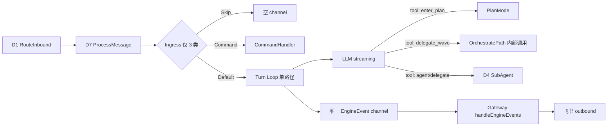

# D7 Loop-First 路由（Clawcode 对齐）

## 1. 原始需求

> 希望采用 Clawcode 方案：入站消息默认进入 **单 Turn Loop**，由 LLM 在 loop 内通过 **Tool 描述** 决定是否 Plan / Delegate / Wave，而不是 D7 RuleClassifier 在 ingress 硬分叉到 OrchestratePath。请结合 Devrix 代码现状给出可落地方案。

## 2. 背景与动机

### 2.1 现状（DM-20260615-004 之后）

`ProcessMessage` 在 ingress 做 **规则分类 + 置信度阈值**，4 条正交路径：

| IntentKind | 执行链 |
|---|---|
| `IntentSkip` | 空 channel |
| `IntentCommand` | `CommandHandler` |
| `IntentFast` | `FastPath` → `TurnOrchestrator.RunTurn` |
| `IntentOrchestrate` | `OrchestratePath` → TaskGraph + Wave |

「简单 vs 复杂」由 **RuleClassifier + FastPathThreshold(90)** 决定，**不经过 LLM**。

### 2.2 已暴露问题（2026-06-16 飞书验收）

| 现象 | 根因 |
|---|---|
| 「你好」触发 `plan_formed` / `wave_started` / `"started"` | CJK greeting 未命中 fast pattern → confidence 70 → 降级 Orchestrate |
| 同一条 IM 回复重复 | `ProcessMessage` channel + `EventPublisher.sink` + Agent `EngineEventSink` 多路投递 |
| 规则与语义脱节 | 短句复杂任务走 FastPath；长句简单问候可能走 Wave |

### 2.3 Clawcode 对照

Clawcode **不在 ingress 做 Intent 硬路由**：

- 所有用户输入 → **QueryEngine 单 loop**
- 复杂度由 **Tool prompt** 引导（`EnterPlanMode`、`AgentTool` whenToUse、Coordinator 可选）
- `/command` 仍走显式 slash 处理（类比 Devrix `IntentCommand`）

Devrix **已具备** Clawcode loop 内核：`TurnOrchestrator.RunTurn`（DM-20260614-020），但 ingress 仍强制 Orchestrate 分叉，与 Clawcode 哲学冲突。

## 3. 目标方案摘要（Loop-First）

**核心原则：**

1. **Ingress 只做确定性预处理**：空消息、slash 命令、默认 Turn
2. **Wave / Plan 由 LLM tool call 触发**，不在 Classify 阶段自动进入
3. **EngineEvent 单投递路径**：Turn channel 为唯一主路径；sink 仅 out-of-band（flow hub / worker_progress）
4. **可回滚**：`coordinator.routing_mode=rule_orchestrate|loop_first` 配置开关

## 4. L1–L5 映射

| 层级 | ID / 名称 | 说明 |
|---|---|---|
| **L1** | `orchestration` | D7 编排域 |
| **L2** | `inbound-harness-routing` | IM/CLI 入站 → 执行 harness 选型 |
| **L3-BE** | `D7-S2-A01` ProcessMessage | Session Orchestrator 入口 |
| **L3-BE** | `D7-S2-A06` RunTurn | Turn 主循环（Clawcode loop 对齐） |
| **L3-BE** | `D1-S13-A03` DispatchToAgent | Gateway 事件投递（IM） |
| **L4** | `D7-S2-F01` ingress_classify | 缩为 Skip/Command/Default |
| **L4** | `D7-S2-F02` turn_tool_surface | Turn 内编排 tool（plan / wave / agent） |
| **L4** | `D7-S2-F03` event_single_delivery | 单 channel 投递契约 |
| **L4** | `D1-S16-F01` deliver_conclusion | IM 结论文本出站 |
| **L5** | 见 §6 | Given-When-Then 验收锚点 |

## 5. 澄清 Q&A

| # | 问题 | 决议 |
|---|---|---|
| Q1 | 是否完全删除 RuleClassifier？ | **否**。保留 Skip/Command 规则；`IntentOrchestrate` ingress 路由 **deprecated**，Shadow 仅观测 |
| Q2 | OrchestratePath / Wave 是否保留？ | **是**。改为 **tool 触发**，不删 WaveScheduler |
| Q3 | FastPathThreshold 如何处理？ | `loop_first` 模式下 **忽略**；保留配置供 `rule_orchestrate` 回滚 |
| Q4 | 性能 SLO（classify ≤1ms）？ | Ingress 规则更少，SLO **不变或更好**；Turn 首 token 延迟与现 FastPath 相同 |
| Q5 | 与 DM-20260615-004 关系？ | 004 建立正交路径；本需求 **反转 ingress 路由策略**，路径实现 **复用** |
| Q6 | IM 重复投递是否在本需求范围？ | **是 P0**。单路径投递为 Loop-First 交付门禁 |

## 6. L5 测试点（验收锚点）

### D7-S2-L5-01 — 问候语走 Turn，不触发 Wave（P0）

- **Given** `routing_mode=loop_first`，Devrix 已启动，飞书 WebSocket 已连接
- **When** 用户发送「你好」
- **Then** 日志无 `plan_formed` / `wave_started`；有且仅有 1 次 `handleEngineEvents` 消费 Turn channel；飞书收到 **1 条** assistant 回复

### D7-S2-L5-02 — 复杂目标由 LLM 调 tool 才进 Wave（P0）

- **Given** `routing_mode=loop_first`，Turn tool surface 已注册 `delegate_wave`
- **When** 用户发送「调查 auth 模块延迟并给出 refactor 方案」（integration stub LLM 返回 `delegate_wave` tool_call）
- **Then** `OrchestratePath.Run` 被调用 1 次；Wave 完成后用户收到汇总 text；ingress **未**出现 `IntentOrchestrate`

### D7-S2-L5-03 — Slash 命令仍零 LLM（P0）

- **Given** `routing_mode=loop_first`
- **When** 用户发送 `/task list`
- **Then** 走 `CommandHandler`；Turn LLM **未被调用**（span / mock 断言）

### D7-S2-L5-04 — EngineEvent 单投递（P0）

- **Given** 任意 Turn 产生 N 个 `text` 事件
- **When** Gateway 处理该 turn
- **Then** 每个 event type+content 组合 `handleEngineEvent` **恰好 1 次**；`PublishEngineEvent` 计数为 0（Turn 流内）

### D7-S2-L5-05 — Plan tool 门控（P1）

- **Given** Turn 注册 `enter_plan_mode` tool，LLM 返回 enter_plan tool_call
- **When** 用户目标含架构歧义（stub prompt）
- **Then** `PlanMode.Enter` 调用 1 次；未自动进入 Wave

### D7-S2-L5-06 — 配置回滚 rule_orchestrate（P1）

- **Given** `routing_mode=rule_orchestrate`（legacy）
- **When** 发送短单行非 greeting 消息（confidence 70）
- **Then** 行为与 DM-20260615-004 一致（可降级 Orchestrate）

## 7. 验收标准（AC）

| ID | 标准 | 优先级 |
|---|---|---|
| AC1 | `loop_first` 模式下 ingress 仅 Skip / Command / Turn 三路 | P0 |
| AC2 | 「你好」满足 L5-01（真机或 integration 等价） | P0 |
| AC3 | L5-04 单投递；FastPath/Orchestrate emit **不** mirror 到 sink | P0 |
| AC4 | `delegate_wave`（或等价 tool）触发 OrchestratePath，ingress 不自动 Orchestrate | P0 |
| AC5 | `/task`、`/plan` 等命令路径零回归（L5-03） | P0 |
| AC6 | `routing_mode` 配置 documented + 默认 `loop_first` | P1 |
| AC7 | ShadowClassifier 继续 tail-only 观测，**不改变** loop_first 路由 | P1 |
| AC8 | `go test -race ./internal/layers/orchestration/... ./internal/layers/communication/capture/...` 全绿 | P0 |
| AC9 | `openspec/specs/d7-orchestration/` delta 合入（S5 后 S6 前） | P0 |

## 8. 范围

### In Scope

- Ingress 路由策略变更（classifier + orchestrator）
- Turn tool surface 扩展（plan / wave delegate）
- 单路径 EngineEvent 投递修复
- Config、metrics、L5 测试、spec delta

### Out of Scope

- Clawcode Coordinator Mode 完整移植（`CLAUDE_CODE_COORDINATOR_MODE` 等价物）→ 后续 change
- LLM 做 ingress 分类（v1.1 shadow 已存在，本需求不启用为路由）
- 飞书 Cardkit streaming 行为变更
- 删除 WaveScheduler / TaskDecomposer

## 9. 依赖与约束

| 类型 | 内容 |
|---|---|
| 依赖 | DM-20260614-020 TurnOrchestrator；DM-20260615-004 正交路径；DM-20260616-001 gap fixes（部分需 revert sink restore） |
| 约束 | `ProcessMessage` 外部签名不变 |
| 约束 | `IntentKind` 枚举暂不删除（deprecated 标记） |
| 约束 | 单 PR ≤400 行（不含 generated）；可分 Phase 1/2 两个 PR |
| 约束 | 合入前更新 `openspec/specs/d7-orchestration/` |

## 10. 风险

| 风险 | 缓解 |
|---|---|
| LLM 该 delegate 时直接回答 | Tool prompt 对齐 clawcode EnterPlanMode/AgentTool；D6 eval 探针 |
| LLM 过度 delegate_wave | Tool 描述强调「多步/并行/跨文件」；integration 断言 |
| 004 行为回归 | `rule_orchestrate` 配置回滚 + L5-06 |
| sink restore（326774a）再次引入双投递 | AC3 + L5-04 CI 门禁；code review checklist |

## 11. 建议实施分期

| Phase | 内容 | PR 粒度 |
|---|---|---|
| **P1** | 单投递修复 + ingress 默认 Turn + 移除 threshold 降级 | ~200 行 |
| **P2** | `delegate_wave` / `enter_plan_mode` tool + prompt + integration | ~300 行 |
| **P3** | 配置开关、metrics、文档、Shadow 对照 | ~150 行 |
