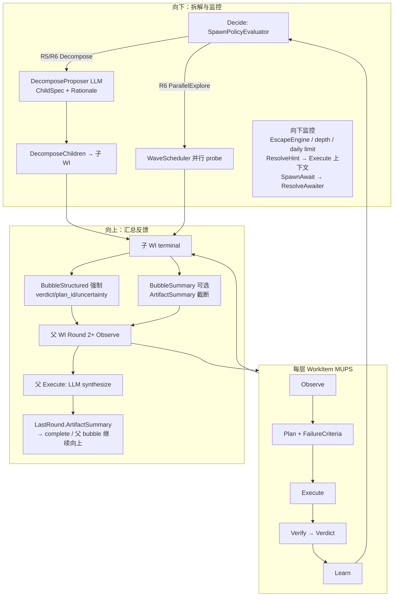
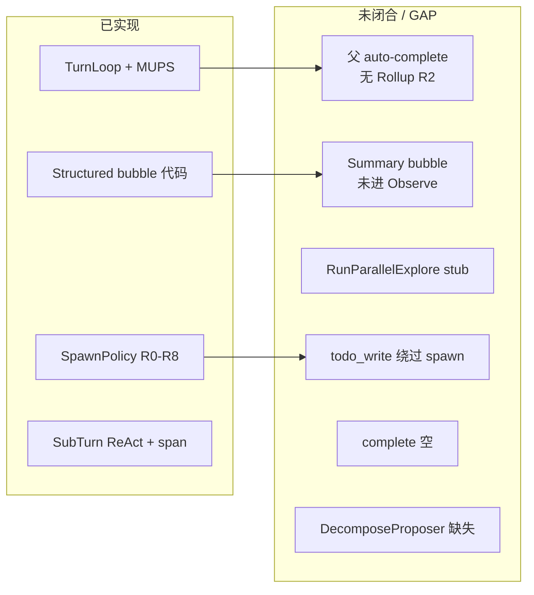
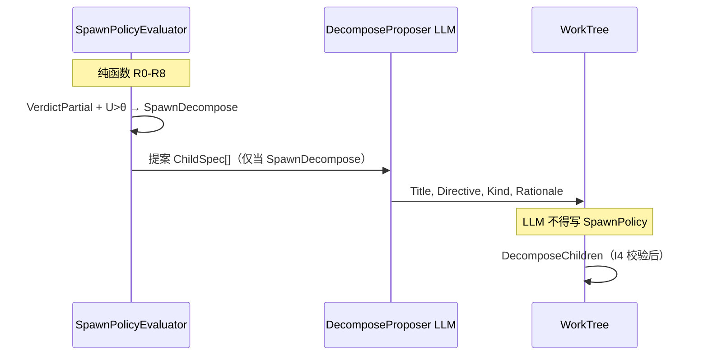
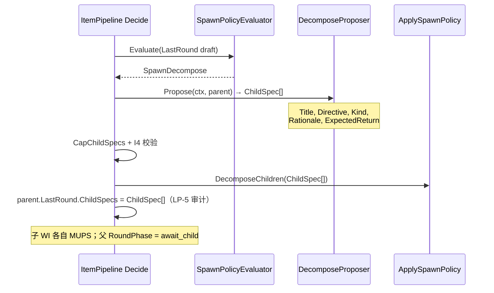
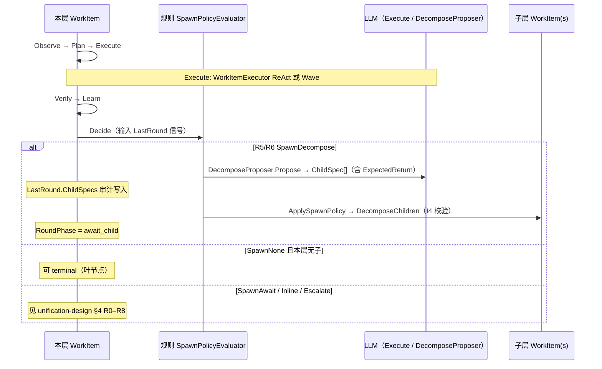
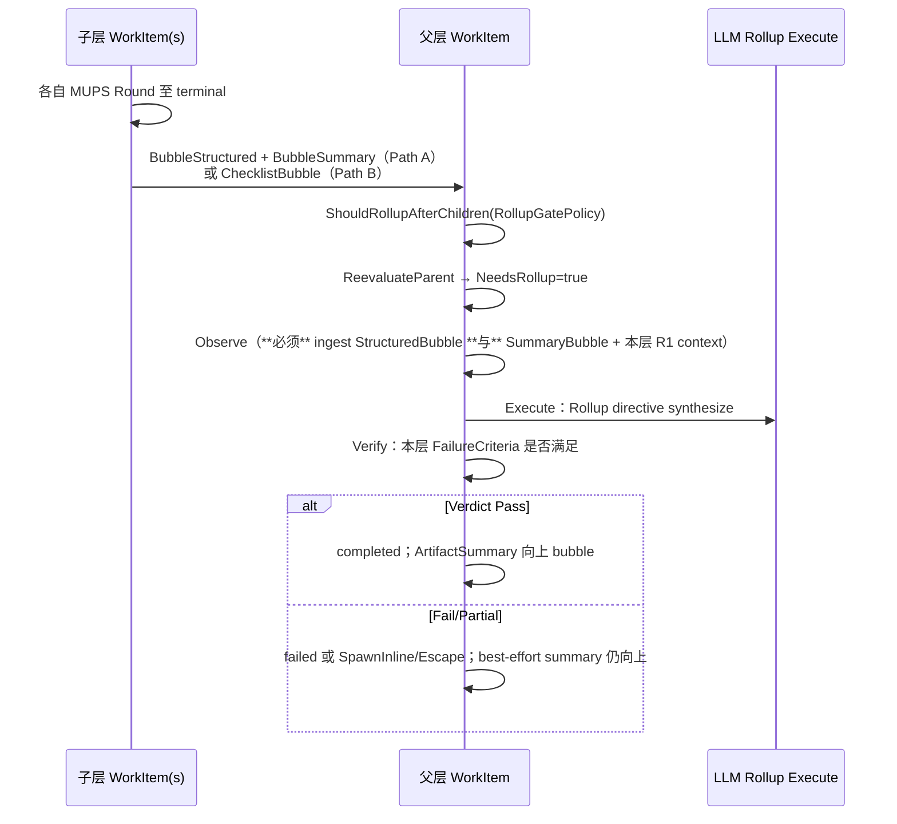
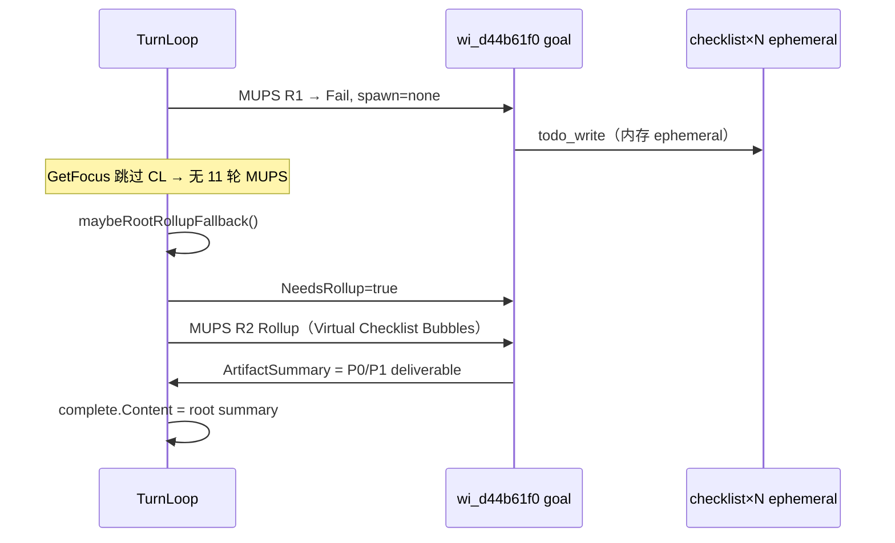
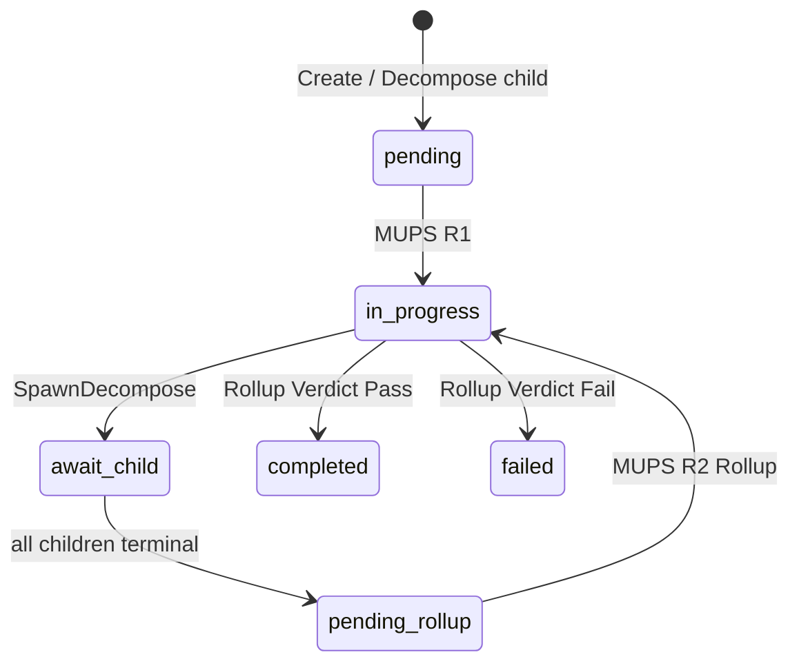

# Design: D7 WorkItem Rollup 闭环

**Change ID:** `devrix-d7-workitem-rollup-pipeline`  
**Demand ID:** DM-20260627-001  
**Status:** S3_Design — **R1 决议已冻结，S4 开发中**  

**Parent SoT:**

- `openspec/specs/d7-orchestration/workitem-pipeline-unification-design.md` (G1–G5)  
- `openspec/specs/d7-orchestration/workitem-context-graph-design.md` (CG1–CG5, §6 bubble)

---

## 1. 设计对比总览

### 1.1 链路对比（Session 级）

**目标态（Target）**

```
用户消息
  → ProcessMessage → RunSessionTurnLoop
       loop:
         focus ← GetPipelineFocus
         round ← RunItemPipeline(focus)     // 每 WI 一轮完整 MUPS
         ApplySpawnPolicy                   // 规则 spawn
         [子树运行 / Wave 并行]
         ReevaluateParent                   // 更新 uncertainty；触发 rollup 门控
         until HasOpenWork == false
  → complete(Content = root deliverable)
```

**现状（Current）**

```
用户消息
  → RunSessionTurnLoop
       loop:
         focus ← GetPipelineFocus（串行）
         round ← RunItemPipeline（Plan 恒 1 Step）
         LLM 侧 todo_write / free_fork（绕过 spawn）
         ReevaluateParent → 父直接 completed  // ← 断点
         until HasOpenWork == false
  → complete(Content = "")                  // ← 断点
```

### 1.2 单 WorkItem MUPS 对比

| 相位 | 目标态 | 现状 |
|------|--------|------|
| **Observe** | directive + prior + **子 structured + summary bubbles** | directive + prior；子 bubble **几乎不触发**（父无 R2） |
| **Plan** | PlanKind 按任务；N Step（explore）；**FailureCriteria 可证伪** | 恒 `commitment_plan` + 1 Step + `exit_code==0` |
| **Execute** | ReAct **或** Wave 并行 Channel | 仅 WorkItemExecutor ReAct max 5 |
| **Verify** | 对照 FailureCriteria；PlanKind 路由 | `verifyArtifact`：ExitCode only |
| **Learn** | Reputation | ✅ |
| **Decide** | SpawnPolicyEvaluator R0–R8 | ✅ 规则有；**常被工具绕过** |

---

## 2. 架构图（目标态 — 含向上/向下）



---

## 3. 现状断点图（Current — 标注 Gap）



---

## 4. 每层 WorkItem 四问契约（设计 SoT）

每一层 WorkItem 在 **Decide 之前** 必须在 `WorkItemPipelineRound` 上能回答：

| 四问 | 字段/机制 | 目标态要求 | 现状 |
|------|-----------|------------|------|
| **① 为何拆 sub？** | `SpawnRationale` + `ChildSpecs[].Rationale` + `DecomposeRationale` | 规则层：`SpawnRationale`（R5/R6…）；LLM 层：DecomposeProposer 填 `ChildSpec` | 仅规则短句；LLM 拆解 **不在 LastRound** |
| **② 解决什么问题？** | `ChildSpec.Directive` + `ExpectedReturn` / `Plan.FailureCriteria` | 每个子 WI directive = 自包含 hypothesis + 验收标准；`ExpectedReturn` = 向上 bubble / rollup 可核对约束（见 §4.3） | todo 文案 / fork prompt；**无 FailureCriteria 下发** |
| **③ 如何验收？** | `Verify` ← `Plan.FailureCriteria` + `Artifact` | Pass/Fail/Partial 可复现；review 类含结构约束 | 仅 `exit_code==0`；max_iters → Fail |
| **④ 向上反馈什么？** | `ContextBubbleKind` + `ArtifactSummary` | 见 §5 | structured 元数据 only；summary 给用户 text 流 |

### 4.1 LLM 与规则分工（G3，不可妥协）



**现状违背点：** `todo_write` / `free_fork` 在 Execute 阶段创建 work，**无** `LastRound.SpawnPolicy==decompose` 前置。

**目标态 Decide 顺序（Decompose 数据流 — 须在 `ApplySpawnPolicy` 之前完成 LLM 提案）：**



- **`DecomposeProposer.Propose`** 仅在 `SpawnPolicy==SpawnDecompose` 时调用；**不得**在 `ApplySpawnPolicy` / `DecomposeChildren` 之后补写 ChildSpec。  
- **`LastRound.ChildSpecs[]`** 持久化于父 WI，供 Jaeger / 验收审计「本轮声明了哪些子目标」（G2）；与 `SpawnRationale` 并列。  
- Phase 1 Path B 无此字段；Phase 2 Path A 为 **P1 验收硬门禁**。

### 4.3 FailureCriteria 向下传递契约（四问② 下游）

父层 Plan 的 `FailureCriteria` 须 **可下发、可复验**，形成 **parent template → child Directive → child Verify** 链：

| 阶段 | 载体 | 规则 |
|------|------|------|
| **父 Plan（Round N）** | `Plan.FailureCriteria[]` | 模板按 `PlanKind` / 任务类型（review 类：章节、覆盖度、长度） |
| **Decompose 下发** | `ChildSpec.Directive` 后缀 + `ChildSpec.ExpectedReturn` | Proposer 将父 FC **转写为自然语言验收句**（非 JSON schema）；`ExpectedReturn` 声明子层 Execute 完成后父 Rollup 可核对的 **文本约束**（对齐 CG4 — 见 §6.2） |
| **子 Plan（Round 1）** | 子 WI `Plan.FailureCriteria` | 由 orchestrator **从父模板实例化**（复制 + 子域 scope 替换）；不得空 FC |
| **子 Verify** | `Verify` ← `Artifact` + `FailureCriteria` | Pass/Fail/Partial 可复现；Phase 1 仍可用 ExitCode 兜底，但 FC 须写入 Plan 供 Phase 3 LLM Verifier |
| **父 Rollup Verify（Round N+1）** | 父 rollup `FailureCriteria` + 子 `ExpectedReturn` 对照 | rollup FC 含 `child_coverage`；可选核对子 `ExpectedReturn` 是否在 `ArtifactSummary` 中体现 |

**现状断点：** 父 FC 不进入子 Plan/Directive；`ExpectedReturn` 字段不存在；rollup 仅 heuristic len/P0/P1。

### 4.2 层级闭环模型（Layer Closure — 与 G1–G5 对齐）

> **核心命题：** WorkTree 的**每一层**（每个 `WorkItem`）不是「跑完 Execute 就结束」，而是一个 **「本层 MUPS →（规则）是否开下一层 → 下一层收敛 → 回到本层汇总验收 → 向上 bubble」** 的闭环单元。  
> **大模型**负责内容侧（Execute / Decompose 提案 / Rollup synthesize）；**规则**负责结构侧（SpawnPolicy、Verify 门控、状态迁移、depth/budget）。

#### 4.2.0 用户模型（Declare → Await → Verify → Rollup）

与 §4.2 层级闭环一一对应，便于验收叙述：

```
1. Declare  — 父 Decide：SpawnDecompose → DecomposeProposer 声明 N 个 ChildSpec（Directive + ExpectedReturn + Rationale）
2. Await    — 父 RoundPhase=await_child；TurnLoop 调度各子 WI 独立 MUPS
3. Verify   — 每个子 WI 按 FailureCriteria（自 §4.3 下发）Verify → terminal；StructuredBubble + SummaryBubble 就绪
4. Rollup   — ShouldRollupAfterChildren(RollupGatePolicy) → 父 R2+ Observe(双 bubble) → Execute(synthesize) → Verify → 向上 bubble
```

**不是**「子全 completed 父即 completed」；**而是** 步骤 3 全部 terminal 且门控满足后，才进入步骤 4 的 LLM 汇总。

#### 4.2.1 三层职责（对应「是否拆 sub / 是否完成 / 向上反馈」）

| 职责 | 问句 | 责任主体 | 主要机制 | 发生轮次 |
|------|------|----------|----------|----------|
| **向下探索** | 要不要开下一层 WorkTree？ | **规则为主** | `SpawnPolicyEvaluator` R0–R8 → `SpawnDecompose` / `ParallelExplore` / `None` / `Await` | 本层 Round **N** 的 **Decide** |
| | 下一层各自做什么？ | **规则 + LLM** | R5/R6 时 `DecomposeProposer` → `ChildSpec[]`；`FailureCriteria` 下发到子 Plan/Directive | Decide 之后 |
| **本层验收** | 结合子层结果，本层工作是否已完成？ | **规则 + LLM** | 子 terminal → **Rollup Round N+1**：Observe(子 bubble) → Execute(synthesize) → **Verify**(FailureCriteria) | 本层 Round **N+1**（Rollup） |
| | 本层自身 Execute 是否达标？ | **规则为主** | Round N 的 Verify（目标：FailureCriteria；现状：ExitCode） | Round **N** |
| **向上反馈** | 向父层传递什么？ | **规则格式 + LLM 内容** | `BubbleStructured`（强制）+ `BubbleSummary` / `ChecklistBubble`（Path B）→ 父 Observe | 子 terminal + 父 Rollup 后 |

**不是：** 每层一个 autonomous agent **独自**决定拆树或宣布完成。  
**而是：** 每层一个 **规则驱动的 MUPS 状态机**，在 Execute / DecomposeProposer / Rollup synthesize 等节点调用 LLM 产内容。

#### 4.2.2 单轮时序（Round N — 本层首次或重试）



#### 4.2.3 子层收敛后的父层闭环（Round N+1 — Rollup，本 change 核心）

SoT §3.1：**「子 terminal → ReevaluateParent → decide **或** completed」** — 其中 **decide** 在本 change 中具化为 **Rollup Round**（不是 silent `completed`）。



#### 4.2.4 规则 vs LLM 边界（G3 不可妥协）

| 相位 | 规则（必须可单测） | LLM（提案 / 执行） |
|------|-------------------|-------------------|
| 向下：拆不拆 | `SpawnPolicyEvaluator` | 仅 `SpawnDecompose` 时：`DecomposeProposer` |
| 向下：子任务定义 | depth≤3、max children≤7、`FailureCriteria` 模板 | `ChildSpec.Directive` / Title / Rationale / **ExpectedReturn** |
| 本层 Execute | Channel 路由、max_iters、Escape | ReAct 工具调用、Artifact 正文 |
| 本层 / Rollup Verify | `VerdictKind`、ExitReason、FailureCriteria 路由（Phase 1 起 rollup 启发式） | Phase 3 可选 LLM Verifier |
| 向上 bubble | CB0/CB3 格式、截断预算 | Summary / synthesize 正文 |

#### 4.2.5 多层链式向上（L2 → L1 → L0）

每层**只向直接父** bubble；Root deliverable 由链式 Rollup 间接获得（详见 §5.10）：

```
L2(leaf) ──structured+summary──► L1 ──Rollup R2──► L1.ArtifactSummary
L1 ──structured+summary──► L0(root) ──Rollup R2──► complete.Content
```

#### 4.2.6 Path A / Path B 在层级闭环中的位置

| 路径 | 触发 | 向下探索 | 本层 Rollup 输入 | 四问 ①②③ |
|------|------|----------|------------------|-----------|
| **Path A**（规则内） | `SpawnDecompose` + implement/explore 子 terminal | DecomposeProposer + 子 MUPS | 子 `ArtifactSummary` + structured | **可闭合**（Phase 2 补 Proposer） |
| **Path B**（compat） | root + `SpawnNone` + ephemeral checklist | **绕过** I4（todo_write） | Virtual `ChecklistBubble` + root R1 context | **①②③ 弱**；④ 可闭合 |
| **Path C**（未实现，见 §12 建议） | open-ended + 无 checklist | 无 | 仅 root R1 + prior | 兜底交付 |

Path B 是 **G3 的 compat 例外**（交付优先）；Phase 2 用 DecomposeProposer + 工具门禁偿还技术债。见 proposal OQ-4 决议。

#### 4.2.7 与 G1–G5 映射

| 目标 | 层级闭环中的体现 |
|------|------------------|
| **G1** 不确定问题可递归探索 | Round N Decide → SpawnDecompose / ParallelExplore → 子层 |
| **G2** 信号可传递、可审计 | `WorkItemPipelineRound` LP-5 血缘；Spawn 仅由 round 驱动 |
| **G3** LLM 参与但不独断 | §4.2.4 边界表；I4/I5 不变式 |
| **G4** WorkTree 唯一 SoT | 子层 = WorkItem 持久化；Wave 仅为 Execute 投影（Phase 2） |
| **G5** Turn Loop 是 session 时钟 | `RunSessionTurnLoop` 驱动各层 focus；Rollup 占额外 iter |

#### 4.2.8 本 change 闭合点与实现前置（S4 必读）

层级闭环要落地，除 Rollup / Bubble 外还须满足：

| 前置 | 原因 | 任务映射 |
|------|------|----------|
| **`ReopenForRollup`** | terminal `failed/completed` + `Locked=true` 时无法同 WI 跑 R2 | tasks T01 + **待增 T-Reopen** |
| **TurnLoop：`focus==nil` → Fallback → continue** | R1 后 focus 立刻 nil 会 `break`，Path B 进不去 | tasks T14 + **待增 T-FallbackOrder** |
| **GetFocus 跳过 ephemeral checklist** | 避免 trace 类 N× 子层假 MUPS | tasks T11 |
| **Phase 1 rollup Verify 策略** | FailureCriteria 与 `verifyArtifact` 能力对齐 | tasks T06 + **待增 T-RollupVerify** |

**现状断点（与 §3 对照）：** 缺 Rollup R2 → 本层验收与向上反馈皆断；缺 DecomposeProposer → 向下探索靠工具 bypass。

---

## 5. 向上传播（Child → Parent）

### 5.1 Bubble 级别（CG4）

| 级别 | 载荷 | 产生 | 消费 | Phase |
|------|------|------|------|-------|
| **BubbleStructured** | `verdict_kind`, `plan_id`, `verdict_id`, `uncertainty`, `spawn_policy`, `observation_ids` | 子 `LastRound` | 父 **下轮 Observe**（CB0 强制） | 1 ✅已有代码 / 需父 R2 |
| **BubbleSummary** | `ArtifactSummary` 截断（如 2k runes） | `ContextBubbleEvaluator` + 子 Execute | 父 Observe → Plan/Execute | **1 本 change 实现** |
| **BubbleKeyMessages** | 失败 explore 关键轮次 | CB4 + Proposer | 父 MaterializeContext | 2 |
| **BubbleFullTail** | Execute 全量 tail | budget 内 | 父 Execute | 2+ |

### 5.2 结构化语句格式（已有）

```
structured_child_bubble: child=wi_xxx; verdict=pass; plan=plan_...; uncertainty=0.31; spawn=none
```

### 5.3 Summary 语句格式（新增）

```
summary_child_bubble: child=wi_xxx; len=1842; preview="<ArtifactSummary 截断>"
```

### 5.4 父 Rollup Round — 双路径触发（Phase 1）

#### Path A：Decompose 父节点（规则内）

```
∀ child ∈ direct_non_checklist_children(parent):
  child.Status ∈ {completed, failed, cancelled}
∧ parent.LastRound.SpawnPolicy ∈ {decompose, await}
∧ parent.RoundPhase != rollup_done
→ parent.Status = pending, NeedsRollup = true
→ GetPipelineFocus 再次选中 parent（boost 优先级）
```

#### Path B：Root Session Rollup Fallback（trace 类 bypass 路径）

当 LLM 用 `todo_write` 拆解、规则给出 `SpawnNone` 时，仍须闭合交付：

```
session 将关闭（HasOpenWork 对非 ephemeral 为 false）
∧ root = session goal（ParentID==""）
∧ root.LastRound 已存在（RoundNo ≥ 1）
∧ root.NeedsRollup == false && root rollup 未完成
∧ ∃ direct child: Kind==checklist && Ephemeral==true（≥1 条）
∧ 无 pending/running 非 checklist 子项
→ root.Status = pending, NeedsRollup = true, RollPhase = idle
→ **不对 checklist 跑 MUPS**（GetFocus 已排除 ephemeral）
→ 下一轮仅 root Rollup MUPS R2+
```

**设计意图：** 覆盖 trace `58e6c55d…` — root fail + spawn none + 11 checklist，无需等待 Phase 2 DecomposeProposer。



**父 Round 2+ Observe 输入（T05 / A51 闭合 — 双 bubble 强制）：**

Rollup Observe **必须** materialize 两类子向上信号（Path A decompose 父；Path B checklist 见 §5.8）：

| 输入 | 语句 | 强制？ | 来源 |
|------|------|--------|------|
| **StructuredBubble** | `structured_child_bubble: child=…; verdict=…; …` | **是**（CB0） | 子 `LastRound` LP-5 元数据 |
| **SummaryBubble** | `summary_child_bubble: child=…; len=…; preview="…"` | **是**（当子 `ArtifactSummary` 非空） | 子 Execute 产出；CB3 截断 |
| ChecklistBubble | `checklist_child_bubble: …` | Path B 替代 Summary | ephemeral checklist `Directive` |

**完整 Observe 上下文清单：**

1. Session prior + AdaptivePrior  
2. ∀ direct **非 checklist 子** terminal：**StructuredBubbleStatement + SummaryBubbleStatement**（二者缺一不可；空 summary 时仅 structured，见 A51 场景）  
3. ∀ direct **ephemeral checklist 子**（Path B）：`ChecklistBubbleStatement`（见 §5.8）  
4. Root R1 自身 `ArtifactSummary`（作 parent context，非 deliverable）  
5. FocusHint：`Resolve: rollup synthesize — N children, M checklist, M pass, K fail`

> **Gap 闭合：** 现状 `CollectStructuredChildBubbles` 已有；`SummaryBubbleStatement` **未进 Observe** — tasks **T05**（S4 P0）为显式闭合项。

**父 Round 2+ Plan：**

- `PlanKind`: `CommitmentPlan`（OQ-2 可复用）  
- `FailureCriteria`: 按任务类型模板，review 类示例：  
  - `artifact.summary` contains `P0` section  
  - `artifact.summary` len ≥ 500  
  - `child_coverage`: all direct children referenced  
- **单 Step** Execute：WorkItemExecutor directive = rollup 模板（见 §5.5）

**父 Round 2+ Verify → Decide：**

- Pass → `SpawnNone` → `Status=completed`, `NeedsRollup=false`  
- Partial → `SpawnInline` 或 Escalate（Escape）  
- Fail → `Status=failed` + complete 仍带 best-effort summary

### 5.5 Rollup Directive 模板（示例 — review 类）

```text
你是父 WorkItem「{parent.Title}」的汇总者。以下 {N} 个子任务已结束。

【子任务摘要】
{for each child: wi_id, verdict, artifact_summary_trunc}

请输出最终交付物：
1. Executive Summary
2. P0 / P1 / P2 问题清单（每条含：位置、现象、建议）
3. 未覆盖范围与建议下一步

不要输出规划过程或「我将要 parallel explore」类 meta 文本。
```

### 5.6 Session 出口

```go
// session_turn_loop.go — 目标态
summary := extractSessionDeliverable(taskManager, sessionID)
// 优先 root.LastRound.ArtifactSummary（post-rollup）
emit(..., &EngineEvent{Type: "complete", Content: summary})
```

### 5.8 Virtual Checklist Bubble（Path B 新增）

checklist 子项 **不跑 MUPS**，其 directive 直接作为 rollup 输入：

```
checklist_child_bubble: child=wi_xxx; status=completed|pending|in_progress; directive="<Content 截断>"
```

**产生：** `CollectChecklistChildBubbles(tm, sessionID, parentID)` — 遍历 direct ephemeral checklist。  
**消费：** 父 Rollup Observe → Rollup directive §5.5 的「子任务摘要」段。  
**与 PromoteChecklist 关系：** Phase 1 **不依赖** promote；virtual bubble 只读内存 checklist。Promote 可选用于持久化审计（P1）。

### 5.9 GetFocus 排除 ephemeral checklist

**现状：** `GetReadyItems` 不滤 `Ephemeral`，checklist pending 被选中 → 11× 串行 MUPS（754s）。  
**目标：**

```go
// work_tree.go GetReadyItems — 新增过滤
if item.Ephemeral && item.Kind == WorkKindChecklist {
    continue // 不参与 MUPS focus
}
```

`HasOpenWork`：第一分支 `GetPipelineFocus` 不再返回 ephemeral checklist → 与第二分支一致，session 可在 root R1 后进入 Fallback 检测。

### 5.10 嵌套多层向上（Grandchild → Root）

**规则：** 每层只向 **直接父** bubble；Root 通过 **链式 Rollup** 间接获得：

```
L2 (leaf) ──bubble──► L1 ──rollup R2──► L1.ArtifactSummary
L1 ──bubble──► L0 ──rollup R2──► L0.ArtifactSummary → complete
```

**不**支持孙子跳过中间层直接 bubble 到 root（CG3 跨层拒绝 CL3）。完整层级语义见 **§4.2**。

---

## 6. 向下监控（Parent → Child）

| 机制 | 目标 | 现状 | Phase |
|------|------|------|-------|
| **SpawnPolicy R0** | running children → SpawnAwait | ✅ | — |
| **SpawnPolicy R1** | max depth → SpawnInline | ✅ | — |
| **SpawnPolicy R2** | daily limit → EscalateHuman | ✅ | — |
| **Decompose I4** | 仅 `SpawnDecompose` 可 `DecomposeChildren` | ✅ 代码 / ❌ 常被绕过 | 1 门禁 |
| **ResolveAwaiter** | await RunRef terminal | ✅ RunTurn 路径；TurnLoop 部分 | — |
| **EscapeEngine** | budget/depth 熔断 | ✅ | — |
| **ResolveHint** | LLM 读 spawn/await/decompose 提示 | ✅ 生成；Executor 读入弱 | 1 加强 |
| **FailureCriteria 下发** | Plan → 子 directive 附带验收 | ❌ | 1 模板 |
| **Wave 并行监控** | 5-slot + ConflictGuard + artifact join | ✅ Wave 存在；TurnLoop 未调 | 2 |
| **Checklist 门禁** | ephemeral 不跑 MUPS；不参与 open-work 阻塞 | ❌ GetFocus 仍选 checklist | **1** |
| **Root Fallback** | spawn=none + checklist → root rollup | ❌ | **1** |

### 6.1 向下：Decompose 数据流（目标态）

```
父 LastRound (Partial, SpawnDecompose)
  → SpawnPolicyEvaluator（规则 R5/R6）
  → DecomposeProposer.Propose（**先于** ApplySpawnPolicy）
       ChildSpec[] → 写入 parent.LastRound.ChildSpecs（审计）
  → CapChildSpecs (≤7) + I4 校验
  → ApplySpawnPolicy → DecomposeChildren
  → 子 WI 各自 MUPS（FailureCriteria 从父 Plan 模板实例化，§4.3）
```

### 6.2 ChildSpec 契约（含 ExpectedReturn — Phase 2）

```go
// workmodel/decompose_types.go（Phase 2 新增）
type ChildSpec struct {
    Kind            WorkKind // explore | implement
    Title           string
    Directive       string   // 自包含 hypothesis + When/Then；含 FailureCriteria 自然语言
    Rationale       string   // 四问①：为何本子任务
    ExpectedReturn  string   // 四问④ 预声明：子层 Execute 完成后父 Rollup 可核对的文本约束
}
```

| 字段 | 用途 | CG4 对齐 |
|------|------|----------|
| `Directive` | 子 WI Execute 输入；含 §4.3 下发的验收句 | — |
| `Rationale` | 审计「为何拆此 sub」 | G2 LP-5 |
| `ExpectedReturn` | 父 Rollup Verify / synthesize directive 核对：子 `ArtifactSummary` 应满足的 **纯文本** 约束（如「须含 prepare/ 下 P0 列表 ≥3 条」） | **禁止** free-form JSON schema；与 `BubbleSummary` preview 同级 — **文本可观测句** |

**Example:**

```text
ExpectedReturn: "ArtifactSummary 须列出 prepare/ 包下 ≥3 条 P0，每条含文件路径与现象"
```

Rollup directive 模板（§5.5）可枚举 `{child.ExpectedReturn}` 供 LLM 对照子 summary 是否达标。

---

## 7. 状态机变更（Parent Rollup）

### 7.1 现状

```
子全 completed → ReevaluateParent → parent.Status = completed  // 终止
```

### 7.2 目标

```
子状态变更 → ReevaluateParentAfterChild
  → if ShouldRollupAfterChildren(parent, RollupGatePolicy):
       parent.Status = pending
       parent.NeedsRollup = true
       parent.RoundPhase = idle
     else:
       parent.Status = completed|failed  // 无子、门控未满足、或 rollup 已完成
```

### 7.3 RollupGatePolicy 与 ShouldRollupAfterChildren

父节点在 **await_child** 阶段，当 direct children 状态变化时，由 **`ShouldRollupAfterChildren(parent, policy)`**（`resolve.go`）判定是否触发 Rollup Round。策略来自父 WI 或 session 默认（Phase 1 默认 `best_effort`）。

```go
type RollupGatePolicy string

const (
    RollupGateAllPass      RollupGatePolicy = "all_pass"      // 全部 direct 非 checklist 子 terminal 且 VerdictPass
    RollupGateBestEffort   RollupGatePolicy = "best_effort"   // 全部 terminal（含 fail/cancelled）；仍 rollup，Verify 可 Partial
    RollupGateMinCoverage  RollupGatePolicy = "min_coverage"  // ≥ MinChildCoverageRatio（默认 0.8）子 terminal 即可 rollup
)
```

| Policy | 触发条件（direct 非 checklist 子） | 典型场景 |
|--------|-----------------------------------|----------|
| `all_pass` | `∀ child: terminal ∧ VerdictPass` | 强一致任务（gate 全绿才汇总） |
| `best_effort` | `∀ child: terminal`（pass/fail/cancelled 均可） | **Phase 1 默认**；review 类 trace — 部分子 fail 仍 synthesize P0/P1 |
| `min_coverage` | `terminal_count / child_count ≥ threshold` | 大域 explore；允许少数子 timeout 后强制 rollup |

**求值时机：**

1. **`ReevaluateParentAfterChild`** — 每次子 WI 进入 terminal 时重算；若 policy 满足 → `NeedsRollup=true`（Path A）。  
2. **`maybeRootRollupFallback`** — Path B 专用；等价于 `best_effort` + checklist virtual bubbles（不经过 `RollupGatePolicy` 字段，硬编码 compat）。  
3. **`GetPipelineFocus`** — 仅消费 `NeedsRollup==true`；不重复求值 policy。

**与 §5.4 Path A 谓词关系：** §5.4 的 `∀ child terminal` 对应 **`best_effort`**；Phase 2 可将 `RollupGatePolicy` 持久化于 `WorkItem` 或 `LastRound.SpawnMetadata`。



---

## 8. 代码映射（Phase 1）

| 组件 | 文件 | 变更 |
|------|------|------|
| Rollup Gate | `workmodel/resolve.go` | 修改 `reevaluateParentAfterChild`；新增 `ShouldRollupAfterChildren` + `RollupGatePolicy` |
| NeedsRollup | `workmodel/workitem.go` | 新增字段 + JSON |
| Focus 优先级 + ephemeral 过滤 | `workmodel/work_tree.go` | rollup boost；GetReadyItems 跳过 ephemeral checklist |
| Root Fallback | `sessionorchestrator/session_turn_loop.go` | `maybeRootRollupFallback` before loop exit |
| Virtual Bubble | `workmodel/context_bubble_apply.go` | `ChecklistBubbleStatement` + collector |
| Summary Observe | `sessionorchestrator/item_observe.go` | summary + checklist bubble materialize |
| Rollup directive | `sessionorchestrator/item_pipeline.go` | detect rollup round → 模板 Plan |
| Complete | `sessionorchestrator/session_turn_loop.go` | `extractSessionDeliverable` |
| Checklist 门禁 | `sessionorchestrator/session_turn_loop.go` | HasOpenWork 与 GetFocus 行为一致 |
| Schema | `workmodel/workitem_store.go` | v3 可选 migration |
| 测试 | `workmodel/resolve_rollup_test.go` 等 | 新增 |

## 9. Phase 2 代码映射（登记，非 Phase 1 编码）

| 组件 | 文件 |
|------|------|
| ParallelExplore | `sessionorchestrator/item_parallel_explore.go` |
| Wave 注入 | `sessionorchestrator/item_pipeline.go`, `bootstrap/wire_wave.go` |
| DecomposeProposer | `workmodel/decompose_proposer.go`（新） |
| Plan N Step | `sessionorchestrator/item_pipeline.go` |

---

## 10. 与 trace 案例的对照（增补后 Phase 1 模拟）

| Trace 现象 | 根因 | 增补后 Phase 1 |
|------------|------|----------------|
| 11 串行 MUPS | GetFocus 选 checklist | **GetFocus 跳过 ephemeral → 0 次 checklist MUPS** |
| ~754s | 11× MUPS + free_fork | **~R1+R2 ≈ 2–3min**（仍含 free_fork 侧路，Phase 2 收紧） |
| 父 fail + spawn none | 无 Path B | **Root Fallback → NeedsRollup → R2** |
| complete 空 | hotfix | **post-rollup deliverable 回填** |
| 无 review 结论 | 无 rollup | **R2 synthesize + FailureCriteria（P0/P1 章节）** |
| free_fork×22 产出未汇总 | D4 侧路 | **仍不进入 bubble**（Out of Scope；Phase 2 / 单独 change） |

### 10.1 trace 重放时间线（目标态）

| 阶段 | 耗时（估） | Jaeger |
|------|-----------|--------|
| Root MUPS R1（fail, max_iters） | ~50s | 1× `D7_MUPS_Pipeline` wi_d44b61f0 |
| todo_write → checklist（无 MUPS） | +0s focus | 无额外 pipeline |
| Root Fallback → NeedsRollup | +0s | span `D7_RootRollupFallback`（新增） |
| Root MUPS R2 Rollup | ~60–120s | **2×** `D7_MUPS_Pipeline` 同 wi_id |
| complete(summary) | — | `summary_len ≥ 500` |

**P0 验收预期：** Path B fixture 可满足 demand §4 前三项；free_fork 并行仍属 P1/Out of Scope。

---

## 11. Verification（设计级）

| Check | 命令 / 方法 | Pass |
|-------|-------------|------|
| 单元 | `go test ./internal/layers/orchestration/workmodel/... -run Rollup` | PASS |
| 集成 | `go test ./tests/integration/d7/... -run Rollup` | PASS |
| E2E | trace 重放 fixture（spawn=none + checklist） | root 2× MUPS + complete P0/P1 |
| Jaeger | 手工 `review d2` 或 integration trace | 父 wi 2× MUPS；无 checklist pipeline |

---

## 12. Review 决策状态（2026-06-27 用户确认 — 按 R1 推荐）

| # | 项 | 决议 |
|---|-----|------|
| 1 | Phase 1 含 Path B Root Fallback | ✅ |
| 2 | OQ-4：Virtual Checklist Bubble | ✅ |
| 3 | Rollup FailureCriteria | ✅ **R1-V1-C**：IT stub LLM + 生产轻量 heuristic（len≥500 + P0/P1 + 黑名单） |
| 4 | OQ-1 `NeedsRollup` | ✅ **显式 bool** + LastRound 审计 |
| 5 | OQ-2 Rollup PlanKind | ✅ **复用 CommitmentPlan** + rollup FC 模板 |
| 6 | OQ-3 free_fork | ✅ **Phase 1 不禁止**；文档标非 SoT |
| 7 | R1-V2 Learn | ✅ **Rollup 终局 Verdict** 写 Reputation（覆盖 R1 Fail） |
| 8 | §4.2 层级闭环 + review-r1 三条原则 | ✅ |
| 9 | 验收 | ✅ Path A + Path B **双 fixture**；PR 不写「WorkTree v2 完成」 |
| 10 | FeatureWorkItemRollupEnabled | ✅ 默认 **true** |

### 12.1 Phase 1 冻结默认（用户未答 5 OQ — 2026-06-27）

| # | 开放问题 | Phase 1 决议 |
|---|----------|--------------|
| OQ-RGP | RollupGatePolicy 持久化 | **best_effort only**；`RollupGatePolicyFor` 硬编码默认；**不**写入 WorkItem |
| OQ-MCV | min_coverage 阈值 | **Phase 2**；`RollupGateMinCoverage` 分支返回 false |
| OQ-ER | ExpectedReturn 文本匹配 | **Phase 2**；Phase 1 rollup Verify 保持 heuristic（len + P0/P1 + denylist） |
| OQ-POL | RollupGatePolicy 全量策略 | Phase 1 **仅 ship best_effort**（T03b）；`all_pass` 逻辑存在供单测，生产不启用 |
| OQ-FC | FailureCriteria 向下契约 | Phase 1 子 Plan **可选** footer 模板；子 Verify 仍以 exit_code 为主 — **可接受** |

---

## 13. 终审摘要（TurnLoop × WorkTree × MUPS 主线）

> 完整条文见 **`review-r1.md`**。本节为 S3 归档摘要。

### 13.1 是否在主线上？

**是。** 主线 = 不确定性 → WorkTree 分层 → MUPS 递归（Decide 向下 / Rollup 向上）→ 规则化 Verdict + LP-5 → deliverable。  
TurnLoop / WorkTree / MUPS **三角正交**，与 G1–G5 **一致**（详见 §4.2、review-r1 §2）。

### 13.2 终审评分

| 维度 | 评分 | 备注 |
|------|------|------|
| 设计 SoT 对齐 | 8.5/10 | |
| 可运行系统（change 前/后） | 4 → 6.5/10 | Rollup change 为关键补洞 |
| 逻辑一致性 | 有条件通过 | T1–T7 见 review-r1 §3 |
| 完整性 | 设计完整；实现 ~70%（change 后） | Decompose/Verify/Wave 为剩余里程 |

### 13.3 逻辑张力（须 S4 闭合）

| ID | 问题 | 动作 |
|----|------|------|
| T1 | terminal+Locked 无法同 WI Rollup | `ReopenForRollup`（T01b）+ I3-Rollup |
| T7 | max_iters→Fail→SpawnNone 阻断 R5 | tech-debt / Path C |
| — | focus nil 即 break | T01c Fallback 顺序 |

Path B（Virtual Checklist）= **trace compat**，**不**替代 Path A + DecomposeProposer（终态）。

### 13.4 确定性

- **控制面**（Spawn、状态机、LP-5、Escape）：设计达标；实现受 todo_write/free_fork bypass 削弱。  
- **内容面**（LLM）：故意非确定；Phase 1 验收分 **结构确定**（IT）与 **内容确定**（heuristic 或 stub LLM，择一，R1-V1）。

### 13.5 S4 前三条原则（冻结）

1. 结构确定优先于内容完美。  
2. Path B 不写入 G2/G3 不变式；验收含 Path A fixture。  
3. Verify 口径一次说清（R1-V1）。

**本 change 合入 ≠ WorkTree v2 完成**；合入后更新 unification-design Phase D 并登记 Phase 2/3 里程（review-r1 §1、§4）。

