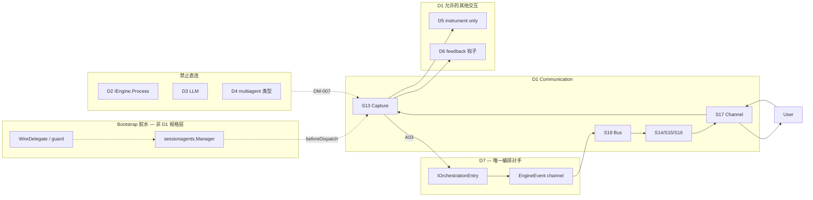
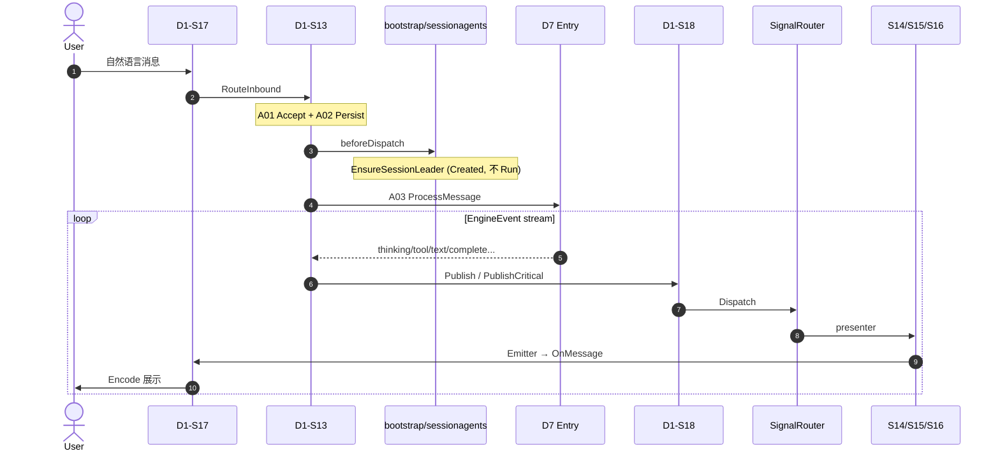

# Design: D1 Communication — DSAFT 完整重构

**Change ID:** `devrix-d1-dsaft-refactor`  
**Demand ID:** DM-20260628-003  
**Version:** 1.0.1  
**Status:** S4_Implement — Phase 2 进行中（§11 Review 已通过 2026-06-26）
**Created:** 2026-06-28

**文档层级：**

| 文档 | 角色 |
|------|------|
| **本文 design.md** | 架构 SoT — S/A 职责、链路、包结构、分 Phase 交付 |
| `demand.md` | North Star + 决策 + LC 承诺 |
| `acceptance-criteria.md` | AC/LC/T 追溯矩阵 |
| `openspec/specs/d1-communication/d1-domain.md` | Canonical 域边界（归档后回写） |
| `terminal-state-guide.md` | 终态时序（归档后同步 F03 等） |

---

## 1. 执行摘要

D1 是 Devrix 的 **Trusted Intermediary**：只管用户可感知的 **进、看、收**，不拥有推理、编排与执行。

重构目标不是「加能力」，而是：

1. **删冗余** — 移除 D1 内不该存在的 D4 生命周期、Legacy D2 路径、God Object gateway
2. **收扩展性** — 保留 DingTalk + 多实例 registry（产品决策）；删除「万能 Gateway」式旁路
3. **对齐终态** — 六条 Canonical 价值流 S13–S18 + 四条用户语言流 + 命令通道
4. **边界仅 D7** — 编排对手只有 `IOrchestrationEntry`；出站只认 `EngineEvent`

**Phase 1（已实现）** 完成 D4 session leader 迁出 capture。  
**Phase 2–4（设计冻结后实施）** Gateway 拆分、Channel DTO 解耦、注册表与 CI 门禁。

---

## 2. DSAFT 分层 — 现状 vs 目标

### 2.1 S 层（价值流）— 已清晰，无需重切

| S | 用户语言 | 系统职责 | 终态判定 |
|---|----------|----------|----------|
| **S13** | 指令流（入站） | 捕获、持久化、dispatch D7 | Jaeger: `D1_Capture_*` → `D7_ProcessMessage` |
| **S14** | 思考流 | thinking → IM 展示 | `signal_kind=thinking` |
| **S15** | 任务流 | tool/worker/milestone 进度 | `signal_kind=task` |
| **S16** | 汇总信息流 | text/complete/error 结论 | `signal_kind=conclusion` + Critical |
| **S17** | 命令通道 + 编解码 | Parse/Encode/连接/实例 | adapter E2E |
| **S18** | 必达（横切） | EventBus 背压 + Critical 不 Drain | drain_test + 生产 complete 卡 |

Legacy D1-S1–S12 **不再扩展**；仅 `layer-delta.md` 追溯。

### 2.2 A 层 — 职责与调用关系（设计 SoT）

#### S13 CaptureUserIntent

| A | 名称 | 输入 → 输出 | 调用者 | 被调用 | 边界 |
|---|------|-------------|--------|--------|------|
| **A01** | AcceptInboundMessage | raw → InboundMessage | S17 adapter | 内联校验 | 不分类意图 |
| **A02** | PersistUserTurn | InboundMessage → store | RouteInbound | sessionStore, transcript | 不写 WorkItem |
| **A03** | DispatchToAgent | content → event_chan | RouteInbound | **D7 ProcessMessage** | 唯一编排出口 |
| **A04** | ResolvePermissionGate | PermissionRequest → bool | adapter / sessionagents | eventHandler | 不算风险 |
| **A05** | ParseCommand | `/new`… → CommandType | S17 adapter 本地 | 可选不调 D7 | 非 LLM 命令归 D7 |

**A03 前置 hook（非 D1 域）：** `bootstrap/sessionagents.EnsureSessionLeader`  
经 `SetBeforeDispatch` 注入；**不得**替代或 bypass A03。

#### S14 PresentThinking

| A | 名称 | 输入 → 输出 | 调用链 |
|---|------|-------------|--------|
| **A01** | EmitThinkingDelta | EngineEvent.thinking → IMOutboundSignal(Thinking) | handleEngineEvent → SignalRouter → thinking.Emit → kernel.Emitter → EventHandler |

#### S15 PresentTaskProgress

| A | 名称 | 输入 → 输出 | 调用链 |
|---|------|-------------|--------|
| **A01** | EmitToolProgress | tool_* / milestone → Task 信号 | SignalRouter → taskprogress.* |
| **A02** | EmitWorkerProgress | worker_progress → Task + Worker 双卡 | taskprogress → S17-F02 encode |

#### S16 DeliverConclusion

| A | 名称 | 输入 → 输出 | 调用链 |
|---|------|-------------|--------|
| **A01** | EmitSummaryChunk | text/info → Conclusion 非终态 | conclusion.EmitText / EmitInfo |
| **A02** | FinalizeReply | complete/error → Critical Conclusion | conclusion.EmitComplete / EmitError → PublishCritical |

#### S17 ConnectChannel

| A | 名称 | 职责 | 保留策略 |
|---|------|------|----------|
| **A01** | ParseFeishuInbound | 飞书 → InboundMessage | ✅ 主路径 |
| **A02** | ParseDingTalkInbound | 钉钉 webhook | ✅ **保留**（决策 #1） |
| **A03** | ParseCLIInbound | stdin | ✅ |
| **A04** | ManageConnection | 连接生命周期 | ✅ |
| **A05** | RegisterInstance | 多 bot 实例 | ✅ **保持现状**（决策 #2） |
| **A06** | CheckRateLimit | 适配器限流 | ✅ |

Encode F 点（F01–F04）横切 S14–S16，见 `f-registry.md`。

#### S18 GuaranteeDelivery

| A | 名称 | F 点 | 行为 |
|---|------|------|------|
| **A01** | DeliverOutboundSignal | F01 Publish | Normal/Low 入队 |
| | | F02 PublishCritical | complete/error 同步 fanout |
| | | F03 Drain | 只 shed Normal/Low |
| | | F04 Compact | 同类合并 |
| | | F05 Reconnect | 通道重建 |

### 2.3 F / T 层

- **F：** 实现细节，登记在 `f-registry.md`；重构 **不改 F 语义**，只改 **物理路径** 与 **import 边界**
- **T：** 验收锚点，登记在 `t-registry.md` + `acceptance-criteria.md`；每个 P0 A 至少 1 个 T

---

## 3. 跨域边界（博弈设计）



| 路径 | 契约 | D1 责任 | 对方责任 |
|------|------|---------|----------|
| D1 → D7 | `IOrchestrationEntry.ProcessMessage` | A03 dispatch | 意图分类、Turn、Wave、WorkItem |
| D7 → D1 | `<-chan *EngineEvent` | S14–S16 渲染 | 产出 typed events |
| D1 → D7 | `Cancel` | StopProcess / 中断 | 取消 in-flight |
| D1 ↔ D5 | OTel span/metric | emit | 持久化 |
| D1 → D6 | feedback 文本解析 | 客观锚点入站 | 信誉计算 |
| bootstrap → D1 | `SetBeforeDispatch` | 调用 hook | EnsureSessionLeader |
| bootstrap → D4 | `sessionagents` | **无** | leader/fork 锚点 |

**Import 门禁（目标态）：**

| 包 | 允许 import | 禁止 import |
|----|-------------|-------------|
| `capture/` | contracts, types, kernel, thinking/taskprogress/conclusion, delivery, D5 | multiagent, orchestration/* |
| `thinking|taskprogress|conclusion/` | kernel, contracts, types | orchestration/*, multiagent |
| `channel/adapters/` | capture API, contracts, types, renderers | orchestration/*（Phase 3 前暂存 wavescheduler/workmodel） |
| `delivery/` | 标准库 + types | D7/D4 |

---

## 4. 四条流 + 命令通道 — 端到端链路

### 4.1 主路径（自然语言指令）



### 4.2 命令通道（会话级 — 不经 D7）

| 命令 | 处理位置 | A | 是否调 D7 |
|------|----------|---|-----------|
| `/new` | feishu / cli adapter | A05 | 否 |
| `/stop` | adapter → StopProcess | A05 + A03 Cancel | Cancel only |
| `/help` | adapter 本地文案 | A05 | 否 |
| `/task …` | cli → workmodel | A05 扩展 | **Phase 3 收拢至 D7 CommandHandler** |

### 4.3 出站信号 taxonomy

| EngineEvent.Type | S | SignalKind | Bus 优先级 |
|------------------|---|------------|------------|
| thinking | S14 | Thinking | Low |
| tool_call, tool_result | S15 | Task | Normal |
| milestone_progress | S15 | Task | Normal |
| worker_progress | S15 | Task | Normal |
| text | S16 | Conclusion（流式） | Normal |
| info | S16 | Conclusion | Normal |
| complete | S16 | Conclusion（终态） | **Critical** |
| error | S16 | Conclusion（终态） | **Critical** |

**单一分叉点：** `capture/signal_router.go` — 新增 event type 必须先改 Router + AC。

---

## 5. 目标包结构（Phase 4 终态）

```
internal/layers/communication/
├── kernel/                 # 域内核（非 S）：Card, Emitter, MessageID
├── capture/                # S13 + 出站编排
│   ├── gateway.go          # Facade：struct、wire、公开 API（≤200 LOC 目标）
│   ├── ingress.go          # S13 A01–A03：RouteInbound
│   ├── session.go          # S13 A02：Create/Get/Expire/ResolveSession
│   ├── outbound.go         # S14–S16 消费：handleEngineEvent(s)
│   ├── dispatch.go         # eventDispatcher + EventBus 桥
│   ├── permission.go       # S13 A04
│   ├── signal_router.go    # S14/S15/S16 分叉（已有）
│   ├── signal/             # turn tracker, anchors
│   ├── transcript/         # S19 持久化（横切）
│   └── store*.go           # SessionStore 实现
├── thinking/               # S14
├── taskprogress/           # S15
├── conclusion/             # S16
├── delivery/eventbus/      # S18
└── channel/                # S17
    ├── adapters/           # feishu, cli, dingtalk（保留）
    ├── connection/         # A04（保留）
    ├── instance/           # A05（保留）
    ├── ratelimit/          # A06
    └── renderers/          # Encode 共享组件

internal/bootstrap/
└── sessionagents/          # D4 leader — 非 D1 域（Phase 1 已落地）
```

### 5.1 Gateway 拆分设计（Phase 2）

**原则：** `CommunicationGateway` 保留为 **唯一对外 Facade**；adapter 与 bootstrap 只依赖 capture 包公开 API，不依赖内部文件。

| 文件 | 迁移的方法（当前 gateway.go） | LOC 预算 |
|------|------------------------------|----------|
| `ingress.go` | `RouteInbound` | ~120 ✅ 已提取 |
| `session.go` | `CreateSession`, `GetSession`, `ResolveSessionByChatID`, `ExpireSession`, `getOrCreateSession`, `cleanupExpiredSessions`, `StartCleanupRoutine` | ~250 |
| `outbound.go` | `handleEngineEvents*`, `handleEngineEvent`, `PublishEngineEvent`, `DeliverOrphanEngineEvent` | ~350 |
| `dispatch.go` | `SetEventBus`, `EventBusEnabled`, eventDispatcher 类型 | ~150 |
| `gateway.go` | struct, ctor, wire setters, `Stop/StopProcess`, `RouteOutbound/Permission/Error`, span helpers | ~200 |

**不拆出 capture 包的类型：**

- `EngineEvent` alias → Phase 2b 改为 `contracts.EngineEvent` 直用，删除 `IContextEngine` alias
- `EventHandler` interface — 保留于 `api.go` 或 `gateway.go`

**并发模型（不变）：**

- 每 session 一次 RouteInbound 启动一个 goroutine 消费 `ProcessMessage` channel
- `activeProcesses` map + `WaitForProcesses` 供测试同步
- EventBus 启用时 producer → bus → consumer → handleEngineEvent

---

## 6. Channel 层设计（保留 + 收敛）

### 6.1 保留项（用户决策）

| 组件 | 理由 | 重构动作 |
|------|------|----------|
| DingTalk adapter | 产品保留 | 无删除；仅随 DTO 统一 Encode 路径 |
| instance/registry | 多 bot 部署 | 无合并；文档明确为 S17-A05 |
| connection/manager | IM 长连接 | 无删除 |
| feishu CardKit + Worker 双卡 | 主 IM 体验 | 无删除 |

### 6.2 Phase 3 解耦 — Presentation DTO

**问题：** `feishu_worker_card.go` import `wavescheduler.WorkerType`；`cli.go` import `workmodel.CLICommands`。

**方案：** 在 `shared/contracts` 增加 **展示 DTO**（非 D7 写模型）：

```go
// contracts/im_present.go（Phase 3 新增）

type WorkerProgressView struct {
    SessionID, TaskID, WorkerID string
    WorkerKind string            // "explore"|"implement"|… — 字符串闭集
    Title, Status string
    ThinkingDelta, OutputDelta string
}

type CLICommandRequest struct {
    RawLine string
    // 解析结果由 D7 CommandHandler 消费（Phase 3b）
}
```

**转换责任：** D7 `GatewaySink` / NotifyGateway 在 **进入 D1 前** 将 FlowEvent → EngineEvent.Metadata 或 WorkerProgressView；D1 adapter **只读 DTO**。

### 6.3 Adapter 与 Gateway 接口（稳定面）

| 接口 | 用途 |
|------|------|
| `capture.CommunicationGateway` 方法集 | RouteInbound, StopProcess, CreateSession, RoutePermission |
| `EventHandler` | OnMessage, OnPermissionRequest, OnError, OnStatus |
| `kernel.Emitter` | presenter 统一出站 |

---

## 7. Bootstrap 组合（composition root）

`cmd/devrix/main.go`  Wiring 顺序（设计约束）：

```text
1. NewCommunicationGateway(store, handler, perm, cfg, transcript)
2. sessionagents.NewManager(factory) — if multiAgent
   ├─ SetPermissionRouter(gw)
   ├─ SetActiveProcessChecker(gw)
   ├─ SetOrphanEngineEventSink(gw.DeliverOrphanEngineEvent)
   └─ gw.SetBeforeDispatch(mgr.EnsureSessionLeader)
3. InitOrchestration → gw.SetOrchestrationEntry
4. initOrchestration → guard observer on sessionagents
5. WireDelegate(..., sessionAgents, ...)
6. StartIM / CLI adapter
```

**规则：** 任何 D4/D6 生命周期 **不得** 回迁入 capture 包。

---

## 8. 验收设计（AC ↔ S/A 全覆盖）

完整矩阵见 `acceptance-criteria.md`。设计冻结时的 **覆盖原则：**

| 原则 | 说明 |
|------|------|
| **每个 P0 A ≥ 1 T** | S13 A03/A04、S16 A02、S18 F02/F03 已有 |
| **每条 LC ≥ 1 L5 或 integration** | signal journey 覆盖 LC-1/2/4 |
| **每条 refactor 边界 ≥ AC-R** | D1-RF-T01..T05 |
| **S17 每 adapter ≥ 1 入站 T** | feishu/dingtalk/cli 已有 |
| **IntentKind 差异不在 D1 测** | D7 负责；D1 只测 EngineEvent 映射 |

**Phase 2 新增 T（设计预留）：**

| T ID | A | 描述 |
|------|---|------|
| D1-RF-T06 | S16-A01 | text delta 独立 signal journey 子用例 |
| D1-RF-T07 | S15-A01 | milestone_progress presenter 单测 |
| D1-RF-T08 | — | gateway 拆分后 ingress/outbound 包级测试锚点不变 |

**CI 门禁（Phase 4）：**

```bash
# scripts/lint-d1-imports.sh
# 失败条件：communication/capture|thinking|taskprogress|conclusion|delivery
#           生产 .go 出现 multiagent 或 orchestration/
```

Phase 3 扩展门禁至 `channel/adapters`（排除 test）。

---

## 9. 分 Phase 交付与退出标准

| Phase | 范围 | 退出标准 | 状态 |
|-------|------|----------|------|
| **1** | sessionagents 迁出 capture | AC-R1..R5 绿；capture 无 multiagent | ✅ |
| **1.5** | AC 文档 + t-registry + guide 同步 | acceptance-criteria.md 完整 | ✅ |
| **2** | Gateway 拆分 + IContextEngine 移除 | gateway facade + 拆分文件；测试锚点不变 | 🔄 进行中 |
| **3** | contracts DTO；channel 零 orchestration import | feishu_worker_card/cli 不 import D7 | ✅ |
| **4** | a-registry legacy 归档；CI import lint | verify-module + lint 脚本 | 待 Phase 3 |

**Phase 2 实施顺序：**

1. `session.go` 迁移 + 测试绿  
2. `outbound.go` + `dispatch.go` 迁移  
3. 删除 `IContextEngine`；testutil 仅用 `IOrchestrationEntry`  
4. 新增 D1-RF-T06/T07  

**不在本 change 范围：**

- D7 内部 MUPS / WorkItem 重构  
- 删除 DingTalk / 单实例化  
- D6 信誉模型变更  
- `/task` 完全迁 D7（Phase 3b，可独立 PR）

---

## 10. 风险与对策

| 风险 | 影响 | 对策 |
|------|------|------|
| Gateway 拆分回归 | 出站事件丢失 | 拆分前锁定 signal journey + coordinator 测试；每步 `go test ./capture/...` |
| sessionagents 与 D7 双写 EngineEvent | 重复展示 | `HasActiveProcess` + orphan sink（AC-R4） |
| CLI `/task` 暂留 workmodel | 边界模糊 | Phase 3 文档标注；DTO + CommandHandler 路线图 |
| Legacy T 指向旧 S1-A04 routeAgent | 误导 | Phase 4 标 SUPERSEDED by D1-RF-T02 |
| 飞书 E2E 无自动化 | P0 生产不可验证 | observability-guide Runbook + 可选 real-device 清单 |

---

## 11. 设计 Review 检查清单

Review 前确认：

- [x] 六 S 与用户四条流 + 命令通道 + 必达映射无歧义  
- [x] A03 唯一 D7 出口；无 D2 fallback 回潮（代码：`ingress.go` 仅 `orchestrationEntry.ProcessMessage`）  
- [x] bootstrap/sessionagents 不进入 D1 注册表 A 层（Phase 1 已落地，a-registry 无 sessionagents）  
- [x] SignalRouter 为出站唯一分叉（`signal_router.go` + `outbound.go` handleEngineEvent）  
- [x] DingTalk + instance registry 明确保留（§6.1）  
- [x] Phase 2–4 退出标准可测试（§9 表 + T06/T07 已加）  
- [x] AC 矩阵每个 P0 A 有 T 或明确 Phase 计划（acceptance-criteria.md §5 缺口已标注 Phase）  
- [x] `acceptance-criteria.md` 与本文 §8 一致  

**Gap 分析摘要（Review 2026-06-26）：**

| 设计项 | 代码现状 | 差距 |
|--------|----------|------|
| capture 零 multiagent | ✅ import_boundary_test 绿 | — |
| ingress 已拆 | ✅ `ingress.go` | — |
| session/outbound/dispatch 拆分 | ✅ Phase 2 本次完成 | gateway.go 324 LOC（span helpers 留 facade，略高于 200 预算） |
| IContextEngine 移除 | ✅ 改用 `contracts.IEngine` | EngineEvent alias 保留（Phase 2b 可选） |
| channel 零 orchestration | ✅ Phase 3 + D1-RF-T09 | — |
| CI import lint | ✅ `scripts/lint-d1-imports.sh` | — |

---

## 12. 修订记录

| Version | Date | Changes |
|---------|------|---------|
| 0.1.0 | 2026-06-28 | Phase 1 摘要 + Phase 2 草图 |
| **1.0.0** | **2026-06-28** | **完整设计：S/A 职责、链路、包结构、边界、AC、分 Phase** |
| 1.0.1 | 2026-06-26 | §11 Review 通过；Gap 表；Phase 2 启动 |
