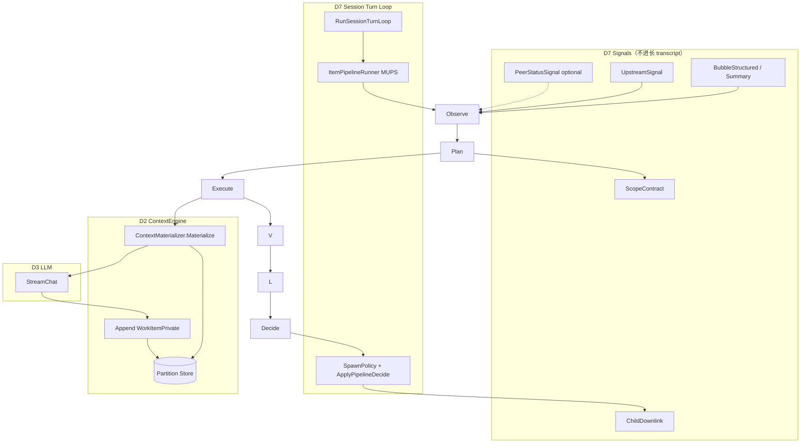
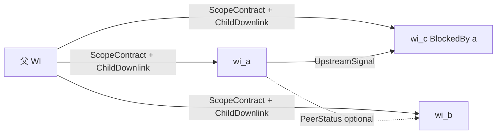
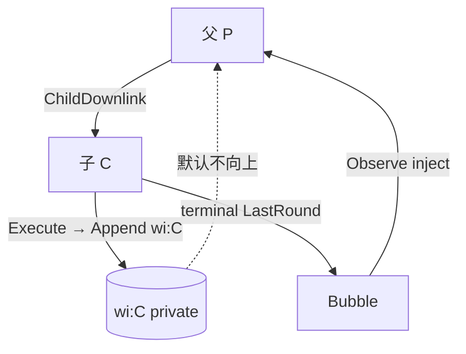
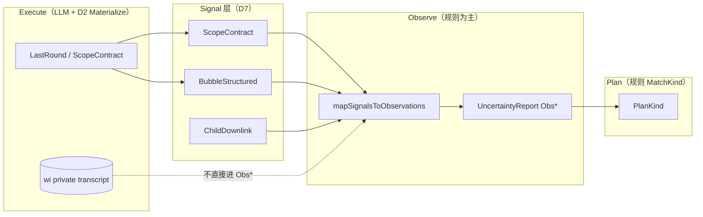
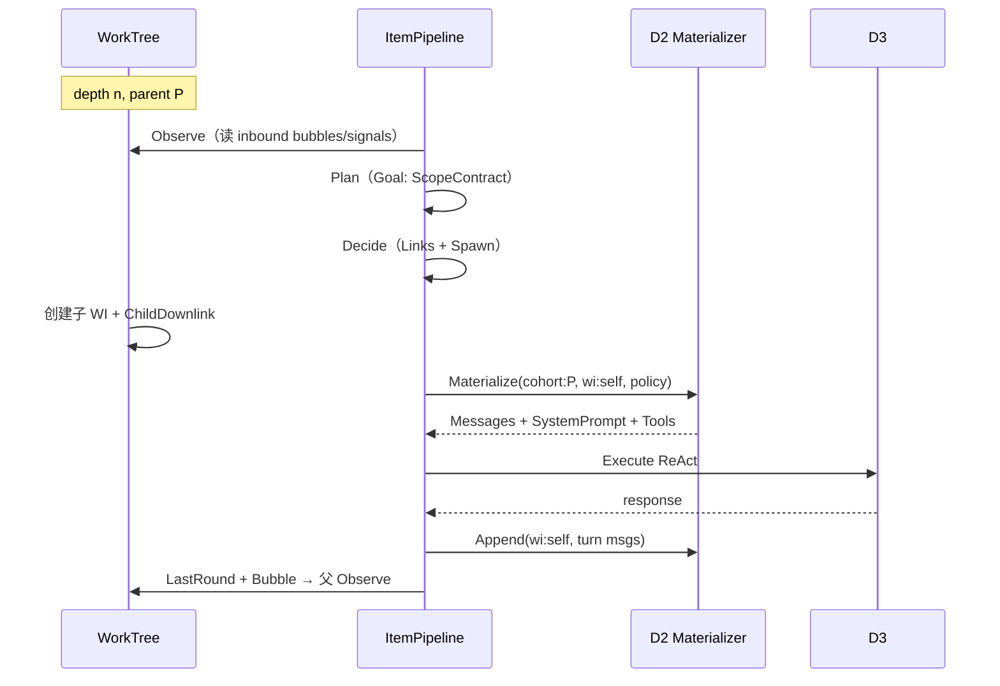

# Design: D7 Layer SubContext

**Change ID:** `devrix-d7-layer-subcontext`  
**Demand ID:** DM-20260627-003  
**Status:** Draft  
**Version:** 0.3.0  
**Parent:** `workitem-context-graph-design.md` v0.3.0 → **v0.4.0（CG2′，ADR-001）**  
**R1:** `review-r1.md`（2026-06-28 冻结）

---

## 1. 设计对比总览

### 1.1 现状 vs 目标

| 维度 | 现状（master + rollup P1） | 目标 |
|------|---------------------------|------|
| Execute context | session `Prepare` | D2 `Materialize(partition)` |
| 同层 sibling | session 单桶（间接共享） | cohort 域 + wi 私有链；**Signal 协作** |
| 父→子 | Directive 字符串 | **ChildDownlink**（Scope + ExpectedReturn） |
| 子→父 | BubbleStructured ✅ | 保持；RollupSynth ✅ |
| Goal 范围 | 无契约 | **ScopeContract** |
| CG2 含义 | 每 WI 隔离 transcript | **同 cohort 共享契约，transcript 默认隔离** |

### 1.2 整体链路图



---

## 2. 每层 WorkTree 的 Context 处理

### 2.1 分层表（SoT）

| 层 | WorkItem 示例 | Partition | Materialize 读 | Execute 写 | Prompt / Tools |
|----|---------------|-----------|--------------|------------|----------------|
| **L0** | Goal | Session + `wi:goal` | 用户消息 + session transcript（压缩） | session + wi:goal | main / 全 tools |
| **L1+** | Explore/Plan/Implement | cohort:`parent` 域 + **`wi:self` 私有** | ChildDownlink + inbound bubbles + **仅 self 链** | **`wi:self` only** | slim hub / kind profile |
| **Rollup** | 父 NeedsRollup | `wi:parent` + RollupSynth | structured child summaries only | wi:parent 一轮 | synth template |
| **Ephemeral** | checklist | 无持久 cohort | 父 bubble + transient | 不写持久 | 最小 |

### 2.2 Materialize 公式

```
MaterializedContext =
  BasePrompt(layer, work_kind, locale)
+ InjectSignals(InboundSignals)
+ LoadPrivateChain(wi:<self>)
+ OptionalPeerStatus(cohort, policy)    // 默认 OFF
→ Compress(token_budget(layer))
→ Tools(tool_profile(work_kind))
```

**Token budget 衰减：** `budget(Ln) = min(MaxContext × 0.5^n, floor_n)`；n = Tree.Depth。

### 2.3 ToolProfile（默认）

| WorkKind | Profile | 说明 |
|----------|---------|------|
| goal | main | 与主 Turn 对齐 |
| explore, plan | readonly | 无 write_file / edit |
| implement | implement | 全写工具 + sandbox 可选 |
| verify | readonly | + verify tools |
| rollup synth | synth | 无 bash |

---

## 3. 同层信号传递设计

### 3.1 原则

1. **默认不传递 ReAct 全文**（LC2）。  
2. **共享 cohort 域**：同一 `ParentID` 下兄弟共享 **ScopeContract**（来自父 ChildDownlink）。  
3. **显式才共享更多信息**：`ContextLinkSpec` + CL 规则，或 `SpawnParallelExplore` 的 PeerStatus。

### 3.2 通道 A — BlockedBy（串行依赖）

```
wi_b.BlockedBy = [wi_a]
```

| 项 | 规范 |
|----|------|
| Signal 名 | `UpstreamSignal` |
| 内容 | `StructuredBubbleStatement(a)` + `ArtifactSummary`（CB3 截断） |
| Materialize | `policy=upstream`; **禁止** load `wi:a` 私有链 |
| 规则 | R2 / `LinkUpstream` 自动写 `ContextLinkRecord`（已有） |

### 3.3 通道 B — 并行 cohort（SpawnParallelExplore，Phase 2）

| Signal | 触发 | 内容 | 进入 B 的 Materialize |
|--------|------|------|------------------------|
| PeerStatusSignal | A **terminal** | `wi_id, verdict, summary≤240 chars` | 可选 inject |
| PeerLiveSignal | — | **禁止** | — |

存储：`cohort:<parent>/signals.jsonl`（append-only 结构化行，非 Message 链）。

### 3.4 通道 C — LLM 提案 Link（Plan → Decide）

沿用 ContextGraph `ContextLinkSpec` + CL0–CL8；**不修改**裁决逻辑，仅规定 Materialize 读取已 materialized 的 link。

### 3.5 同层信号图



---

## 4. 上下层信号传递设计

### 4.1 下行：父 → 子（ChildDownlink）

在 `DecomposeChildren` / `ApplySpawnPolicy` 创建子 WI 时写入：

```go
type ChildDownlink struct {
    ParentWorkItemID string
    ChildWorkItemID  string
    Directive        string
    ScopeIn          []string
    ScopeOut         []string
    ExpectedReturn   string
    FailureCriteria  []plan.FailureCriterion
    ContextPolicy    ContextLinkKind // default fresh
}
```

**Materialize（子 WI 首次 Execute）：** `ForkCohort(parent)` + apply ChildDownlink → system FileScope + user directive。

### 4.2 上行：子 → 父

| 级别 | Kind | 强制 | 消费点 |
|------|------|------|--------|
| 元数据 | BubbleStructured | ✅ CB0 | 父 Observe（已有） |
| 叙事 | BubbleSummary | 可选 CB3 | 父 Observe / Rollup |
| 全文 | BubbleFullTail | 需 CL + budget | 默认 **禁止** |

Rollup（NeedsRollup）：**仅** `buildRollupDirective` 输入（#262），不读子 wi 私有链。

### 4.3 上下层图



---

## 5. Goal 首次 WorkTree：ScopeContract（范围收敛）

### 5.1 为什么要 LLM（或规则）收敛

- 开放型指令（review 整个领域、看 i18n）无边界时，decompose 子 WI **发散、重复、不可验收**。  
- SpawnPolicyEvaluator R5 依赖 uncertainty，但 **uncertainty 无 scope 输入**时阈值失真。

### 5.2 ScopeContract 结构

```yaml
scope_contract:
  goal_statement: string          # 一句话
  in_scope: []string              # 路径/模块
  out_of_scope: []string
  assumptions: []string
  open_questions: []string        # 非空 → 阻断 decompose
  success_criteria: []string
  suggested_decompose: optional   # 仅提案
```

### 5.3 门控规则

| 条件 | SpawnPolicy |
|------|-------------|
| `open_questions` 非空且影响实现 | `SpawnInline` / `ask_user_question` |
| scope 清晰且 uncertainty ≥ θ | `SpawnDecompose` |
| 用户指令极具体（单文件/单函数） | **规则推断** ScopeIn，跳过 LLM scope 轮 |

### 5.4 存储与下行

- 持久：`WorkItem.ScopeContract` 或 `Goal.LastRound.ScopeContract`（Review 待定 Q1）。  
- 下行：父 Goal 的 ScopeContract → 每个 L1 子 WI 的 ChildDownlink.ScopeIn/Out。

### 5.5 ScopeContract 与 ObsUncertainty 的关系

ScopeContract **不是** ObsUncertainty 的别名，而是 **Signal 层专用 schema**。Observe 阶段用 **规则** 映射：

| ScopeContract 字段 | Observe 映射 | Plan 影响 |
|--------------------|--------------|-----------|
| `open_questions` 非空 | **ObsUncertainty**（CatBusiness） | 阻断 SpawnDecompose；MatchKind → ExplorationPlan |
| `in_scope` / `out_of_scope` 已填且无 open_questions | **ObsFact**（cohort meta + evidence=Goal ID） | 允许 decompose |
| 用户指令为命令式（IntentCommand） | **ObsSignal**（已有 classifier 路径） | ProtocolPlan 倾向 |
| Verify/Anomaly 检出偏离 | **ObsDeviation**（CatBusiness 或 CatSystem） | ScenarioPlan 倾向 |

**关键：** ScopeContract 由 **Plan/Execute 结构化产出**；ObsUncertainty **由 Observe 规则写入** UncertaintyReport，不要求 LLM 在 Execute 每轮自报 `kind: ObsUncertainty`。

---

## 6. MUPS Observe 四类 × Execute Context（Signal / Observation 边界）

### 6.1 背景问题

讨论议题：**是否通过 context 要求 LLM 每轮对话将问题收敛到 ObsFact / ObsSignal / ObsDeviation / ObsUncertainty？**

MUPS 中 Observation 4 类是 **Plan 的输入契约**（D7-S8-A15），Plan 通过 `MatchKind(UncertaintyReport)` 路由四类 PlanKind。WorkItem 路径现状：`item_observe.go` **规则生成** Obs*，子 bubble → ObsFact，高 uncertainty → ObsUncertainty。

### 6.2 架构决议（Normative）

| 层级 | 职责 | 产出 | LLM 角色 |
|------|------|------|----------|
| **Execute** | 行动 + ReAct | WorkItemPrivate transcript；**terminal LastRound**；ScopeContract（Goal） | 主 LLM；context **可软引导**结构化块 |
| **Signal** | 跨层/同层协作 | Bubble, ChildDownlink, ScopeContract, PeerStatus | 结构化字段，**非 Obs  taxonomy** |
| **Observe** | 感知 + 分类 | `UncertaintyReport`（Obs* + Strength + Evidence） | **规则为主**；Phase 2 可选 LLM 提案 |
| **Plan** | 结构决策 | PlanKind + FailureCriteria | 规则 MatchKind；LLM 可提案 Plan 内容 |

**拒绝（Phase 1 及默认）：** Execute **每一轮** ReAct 强制输出 Obs* 标签并写入 wi 私有链。

**理由：**

1. **LC2 冲突** — Obs 标签进 transcript = Signal 与全文未分离。  
2. **G3 冲突** — LLM 自报 ObsUncertainty 若直接触发 spawn，等于 LLM 独断。  
3. **语义污染** — ObsFact 要求 evidence + 不可降级；LLM 格式化 ≠ 已验证事实。  
4. **双轨** — 下一轮 Observe 再规则生成 Obs* → 与 transcript 内标签不一致。  
5. **LP-5** — Plan.SourceObservationIDs 无法追溯「LLM 随口说的 ObsFact」。

### 6.3 推荐数据流



### 6.4 Execute Context 模板（Materialize 注入）

**允许（软引导，非 SoT）：**

```markdown
## 交付约定（本轮 WI）
- 若形成可验证结论，在回复末尾用 <conclusion>...</conclusion> 给出。
- 若仍不确定，在 <open_questions>...</open_questions> 列出（每行一问）。
- 不要自行标注 ObsFact/ObsSignal/ObsDeviation/ObsUncertainty；系统会在 Observe 阶段分类。
```

**禁止：**

- 要求每 iter 输出 JSON `{ "observations": [{ "kind": "ObsFact", ... }] }` 并 append 到 wi 链。  
- 将 Obs* 标签作为 SpawnPolicy 的直接输入（须经 Observe → UncertaintyReport）。

### 6.5 Signal → Observation 规则表（Phase 1）

| 输入 Signal | 规则 | 输出 Obs* | Strength 来源 |
|-------------|------|-----------|---------------|
| `ScopeContract.open_questions` 非空 | R-OBS-1 | ObsUncertainty | `1 - item.Uncertainty` 或默认 0.4 |
| `ScopeContract` 完整且无 open_questions | R-OBS-2 | ObsFact（scope 语句） | 0.85 或 prior.Mean |
| `ChildDownlink` + directive | R-OBS-3 | ObsFact | 0.85（已有 item_observe） |
| `BubbleStructured` 子 terminal | R-OBS-4 | ObsFact | 1 - child.UncertaintyMean（已有） |
| `IntentOrchestrate` | R-OBS-5 | ObsSignal | prior.Mean（已有） |
| `item.Uncertainty ≥ θ` | R-OBS-6 | ObsUncertainty | 已有 observationsFromItem |
| Verify Anomaly / tool 硬失败 | R-OBS-7 | ObsDeviation | AnomalyDetector（Phase 2 增强） |

实现位置：扩展 `sessionorchestrator/item_observe.go` + 新 `mapScopeContractToObservations`（Phase 1）。

### 6.6 Phase 2 可选：LLM ObservationProposer

登记，不在 Phase 1 编码：

- **输入：** directive + inbound Signals + prior（**不含** wi 全文 ReAct）。  
- **输出：** `[]ObservationProposal` → **规则引擎**校验 Strength/Evidence/Category → 合并进 UncertaintyReport。  
- **符合 G3：** LLM 提案，规则裁决；对齐 PR-A4 ObserveNode 方向。

### 6.7 与 LC1–LC6 对齐

| LC | 与本节关系 |
|----|------------|
| LC2 | Obs* 不进 Execute transcript；仅 Signal + Observe report |
| LC4 | ScopeContract 是 Signal；ObsUncertainty 门控在 Observe |
| LC6 | 显式定义 Execute / Observe 边界 |

---

## 7. D2 接口（边界）

```go
// contracts/context_materialize.go（建议位置）

type ContextPartition struct {
    SessionID        string
    Kind             PartitionKind // Session | Cohort | WorkItem | Agent
    ParentWorkItemID string        // Cohort
    WorkItemID       string
}

type MaterializePolicy struct {
    Mode        MaterializeMode // Fresh | InheritCohort | Upstream | Resume | RollupSynth
    TokenBudget int
    ToolProfile string
    Locale      string
}

type MaterializeRequest struct {
    Partition ContextPartition
    Policy    MaterializePolicy
    Directive string
    Signals   InboundSignals // ScopeContract, ChildDownlink, bubbles, links
}

type ContextMaterializer interface {
    Materialize(ctx context.Context, req MaterializeRequest) (MaterializedContext, error)
    Append(ctx context.Context, partition ContextPartition, msgs []types.Message) error
}
```

**存储布局（建议）：**

```
~/.devrix/sessions/<sid>/wi/<wi_id>.jsonl      # WorkItemPrivate
~/.devrix/sessions/<sid>/cohort/<parent>.jsonl  # Signal meta only（非 ReAct）
~/.devrix/sessions/<sid>/subagents/<agent>.jsonl # 已有 delegate
```

**D7 禁止：** 直接读 `SessionContext.Messages` 组装 WorkItem LLM 请求（flag=on 时）。

---

## 8. 每层 WorkItem MUPS × Context 时序



---

## 9. 与现有组件映射

| 现有 | 本设计角色 |
|------|------------|
| `ContextScope` / `EnsureContextScope` | 演进为 Cohort + WI partition 注册 |
| `CollectStructuredChildBubbles` | Upstream / 父 Observe 输入 ✅ |
| `ApplyAcceptedContextLinks` | Materialize InboundSignals ✅ |
| `DirectiveForItem(NeedsRollup)` | RollupSynth policy ✅ |
| `WorkItemExecutor.prepareContext` | **替换**为 Materialize |
| `PrepareForTurn` | L0 Goal / 主 Turn 仍用 |
| `wavescheduler.ContextResolver` | Phase 3 合并进 Materializer |
| `subturn applyMode` | Phase 3 映射 MaterializePolicy |

---

## 10. 风险 register

| ID | 风险 | 概率 | 影响 | 缓解 |
|----|------|------|------|------|
| R1 | 同层共享误解为全文共享 | 中 | 高 | 规范 + 测试：A 的 tool result ∉ B materialize |
| R2 | Materialize 延迟 | 中 | 中 | iter 内缓存；轻量 path |
| R3 | CG2 文档/实现不一致 | 中 | 高 | spec_delta 明确修订；feature flag |
| R4 | sandbox + cohort 错配 | 低 | 高 | sandbox_slug → private only |
| R5 | 与 rollup directive 重复 | 低 | 中 | Rollup 禁止读 wi 全文 |
| R6 | 并行 PeerStatus 顺序不确定 | 中 | 低 | terminal-only；按 wi_id 排序 inject |
| R7 | ScopeContract LLM 幻觉 scope | 中 | 中 | Verify 对照 repo；open_questions 阻断 |
| R8 | 存储迁移 | 低 | 中 | 新 partition 增量；旧 session 走 flag=off |
| R9 | Execute 每轮 Obs 标签 | 中 | 高 | 规范禁止 + Materialize 模板 + 单测 wi 链无 Obs* 块 |
| R10 | ScopeContract→Obs 映射遗漏 | 中 | 中 | R-OBS-1..7 表 + item_observe 单测 |
| R11 | ScopeContract pooling | 中 | 高 | Verifier + ScopeConfidence（Phase 2） |
| R12 | 自然语言软抱怨 | 中 | 中 | fuzzy match（Phase 2） |
| R13 | ChildDownlink 越界 | 中 | 高 | Verify hook（T13f 登记） |
| R14 | PeerStatus 串通 | 低 | 中 | 随机化 + 截断（Phase 2） |
| R15 | cohort 池膨胀 | 中 | 中 | cohort_signal_budget_max 8KB |
| R16 | flag 永久 off | 中 | 中 | migration deadline 30d |
| R17 | Scope 漂移 | 中 | 高 | scope_expansion_max_ratio（Phase 2） |

---

## 11. ContextGraph CG2 修订（Normative）

**原 CG2：** 子/sibling 上下文不自动合并；透传须 ContextLinkRecord。

**修订 CG2′：**

- **Transcript 隔离：** 未经批准的 ContextLink，**不得**将其他 WI 的 WorkItemPrivate 链注入 Materialize。  
- **Cohort 域共享：** 同一 Parent 下兄弟 **共享 ScopeContract 与 cohort 元数据**。  
- **Signal 透传：** Bubble、Upstream、PeerStatus、Link 均为 **Signal**，适用原 Link/Bubble 规则。

---

## 12. 开放问题（Review）

| OQ | 问题 | 建议默认 |
|----|------|----------|
| OQ-LC-1 | ScopeContract 持久化字段 | `WorkItem` 嵌入 + LastRound 镜像 |
| OQ-LC-2 | Materialize 是否每 iter 全量 | 首轮全量；后续增量 until budget |
| OQ-LC-3 | cohort jsonl 是否进 git audit | 仅 session 目录，CLI show |
| OQ-LC-4 | 与 DecomposeProposer 合并 timeline | Phase 2；Phase 1 ExpectedReturn **非空** |
| OQ-LC-5 | Execute 软引导块是否默认模板 | **是** — Materialize hub prompt |
| OQ-LC-6 | Phase 2 LLM ObservationProposer | 独立 change（T35） |
| OQ-LC-7 | （reserved） | — |
| OQ-LC-8 | Scope 漂移防御 | Phase 2 — scope_expansion_max_ratio 1.5x |
| OQ-LC-9 | cohort 信号池预算 | T20d — 8KB default |
| OQ-LC-10 | flag 迁移 | 验收后 30 天 depth≥2 强制 on |

**R1 决议全文：** `review-r1.md` · **博弈论：** `game-theory-review.md`

---

## 13. 修订记录

| Version | Date | Changes |
|---------|------|---------|
| 0.1.0 | 2026-06-27 | 初稿：Layer SubContext、Signal 通道、ScopeContract、D2 API、风险 |
| 0.2.0 | 2026-06-27 | §6 Observe 四类 × Execute 边界；LC6 |
| 0.3.0 | 2026-06-28 | R1 冻结；R11–R17；OQ-LC-8/9/10；ADR-001 |
