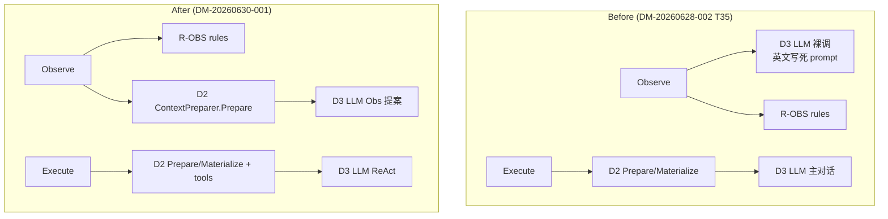

# Design: D7 Observe 统一 LLM 入口

**Change ID:** `devrix-d7-observe-unified-llm-path`  
**Demand ID:** DM-20260630-001

---

## 1. 架构概览



Observe 阶段**可以**调 D3，但**必须先**经 D2 获取 system prompt（含 i18n），再调 D3。禁止裸调 D3。

## 2. 组件变更

| 文件 | 动作 | 说明 |
|------|------|------|
| `llm_observation_proposer.go` | REWRITE | `Prepare` → 拼接本地化 Obs 附录 → `InvokeStream` |
| `bootstrap/wire_item_pipeline.go` | MODIFY | wired `NewLLMObservationProposer(llm, ctx, locale)` |
| `observation_proposer.go` | KEEP | interface + `ValidateObservationProposals` |
| `llm_observation_proposer_test.go` | ADD | 断言 D2 Prepare 先于 D3 |

## 3. Observe LLM 路径（A75）

1. `ContextPreparer.Prepare(sessionID, directive)` → `D2_Context_Process`
2. `systemPrompt = prepared.SystemPrompt + observationTaskAppendix(locale)`
3. `LLMInvoker.InvokeStream` — user 仅含 structured signals（无 wi ReAct transcript）
4. `ValidateObservationProposals` 规则门控 → merge 进 `UncertaintyReport`
5. LLM 失败 fail-safe：rules-only Observe 继续

## 4. Execute 路径（不变）

| WorkItem depth | D2 路径 | Span |
|----------------|---------|------|
| L0 Goal | `ContextPreparer.Prepare` | `D2_Context_Process` |
| depth ≥ 1 / rollup | `Materializer.Materialize` | `D2_Context_Materialize` |

## 5. Jaeger 验收树（首条用户消息，Observe 启用 proposer）

```
D7_MUPS_Pipeline
├── Observe
│   ├── D2_Context_Process    ← Prepare（Observe LLM）
│   └── D3_LLM_Stream         ← Obs 提案（system = D2 zh + Obs 附录）
├── Plan
└── Execute
    ├── D2_Context_Process
    └── D3_LLM_Stream         ← 主 ReAct
```

## 6. 回退策略

- **roll-forward**：关闭 proposer → bootstrap 传 nil（rules-only Observe）
- **rollback**：revert 至 T35 裸 D3 路径（不推荐）
