# Design: MUPS 交付收敛

**Change ID:** `devrix-mups-deliverable-convergence`  
**Demand ID:** DM-20260630-012  
**Status:** Draft

---

## 1. 架构概览

```mermaid
flowchart TB
  subgraph before["Before (review kernel 实测)"]
    O1[Observe rules+LLM Obs] --> P1[DefaultPlanner MatchKind]
    P1 -->|ExplorationPlan| D1[SpawnDecompose 固定 2 子任务]
    D1 --> E1[Execute max_iters=3]
    E1 -->|max_iters| V1[Partial → Completed]
    V1 --> C1[complete = lastArtifactSummary 过渡句]
  end

  subgraph after["After (DM-20260630-012)"]
    O2[Observe G3] --> SP[StrategicPlanProposer LLM]
    SP --> PG[Plan Gate: scope/budget/depth]
    PG --> E2[Execute per plan]
    E2 --> DV[DeliverableVerifier schema]
    DV -->|incomplete| R2[Rollup / Inline retry]
    DV -->|complete| B2[StructuredDeliverable bubble]
    B2 --> SG[SessionDeliverableGate]
    SG --> C2[complete = rollup OR TaskIncomplete]
  end
```



## 2. 组件设计

### 2.1 StrategicPlanProposer（D7-S16-A76）

**文件**：`sessionorchestrator/strategic_plan_proposer.go`（NEW）

**流程**（对称 `LLMObservationProposer`）：

1. `ContextPreparer.Prepare(sessionID, directive)`
2. `systemPrompt += strategicPlanAppendix(locale)` — 要求仅 JSON，字段见 proposal
3. `LLMInvoker.InvokeStream` — **无 tools**
4. `ValidateStrategicPlan(proposal, gateCtx)` — 路径、深度、子节点数、blast radius
5. 映射为 `plan.PlanInput`（Steps / QuantizedKind / scope 写入 ScopeContract）

**Fail-safe**：parse/validate 失败 → `DefaultPlanner.Plan` + 现有 `planQuantizedKind`（当前行为）

### 2.2 ValidateStrategicPlan 门控

| 规则 | 动作 |
|------|------|
| `execution_mode=single` | 强制 1 Step；`MatchKind` 不得因 Goal kind  alone 强制 ExplorationPlan |
| `scope_in` 非空 | 写入/合并 `ScopeContract.InScope`；Decompose 优先按 path 切分 |
| `child_specs` 非空 | 替代 `DefaultDecomposeProposer` 输出 |
| 路径越界 / 不存在 | reject proposal → fallback |
| `react_iters_hint` | 写入 `WorkItemExecContext.MaxIters` override（clamp） |

**不做**：文件数阈值、目录大小启发式 — 这些由 LLM 在 proposal.rationale 中表达，门控只验硬约束。

### 2.3 DeliverableVerifier（D7-S9-A32）

**文件**：`sessionorchestrator/deliverable_verify.go`（NEW）

```go
type DeliverableSchema string

const (
    DeliverableSchemaP0P1FileLine DeliverableSchema = "p0_p1_file_line"
    DeliverableSchemaNotApplicable DeliverableSchema = "not_applicable"
)

func VerifyDeliverable(schema DeliverableSchema, art *wavescheduler.Artifact, expectedReturn string) DeliverableResult
```

**p0_p1_file_line 规则**：

1. `fileLineCitationRE.MatchString(summary)` 至少 1 处
2. 含 `P0` 或 `P1`（大小写不敏感）或 JSON `"severity":"P0"`
3. `stop_reason=max_iters` 且无 citation → `Status=Incomplete`

**集成点**：`verifyArtifactForWorkItem` 在现有 gate 之后调用；rollup 使用 `verifyRollupArtifact` 扩展为检查合并 deliverable。

### 2.4 WorkItem 完成语义

**变更** `pipeline_apply.go`：

```go
func StatusAfterSpawnNone(kind types.VerdictKind, deliverable DeliverableResult) TaskStatus
```

- Pass + deliverable complete → Completed
- Partial + deliverable complete → Completed（部分 findings 合法）
- Partial/Fail + deliverable incomplete → **InProgress**（SpawnInline）或 Failed（重试耗尽）
- `deliverable_schema=not_applicable` → 保留旧映射（非 review 任务）

### 2.5 StructuredDeliverable 向上传播

**Round 字段**：

```go
type DeliverablePayload struct {
    Schema   string            `json:"schema"`
    Findings []DeliverableFinding `json:"findings,omitempty"`
    Raw      string            `json:"raw,omitempty"` // fallback text
}

type DeliverableFinding struct {
    Severity string `json:"severity"` // P0|P1
    File     string `json:"file"`
    Line     int    `json:"line"`
    Message  string `json:"message"`
}
```

**Bubble**：`StructuredBubbleStatement` 追加 `findings_count` + 首条 finding 摘要；Observe 父节点可读具体 signal。

**Rollup**：`DirectiveForGoalPlan` rollup 轮 appendix — 「合并以下 JSON findings，输出单一 p0_p1_file_line 报告」。

### 2.6 SessionDeliverableGate

**变更** `session_turn_loop.go`：

```go
deliverable := workmodel.ExtractSessionDeliverable(tm, sessionID)
summary := deliverable
if summary == "" {
    summary = lastArtifactSummary
}
q := sessionorchestrator.EmitLastTextQualityGate(ctx, sessionID, summary, exitReason)
finalQ := sessionorchestrator.ClassifyLastTextQuality(eventContentFallback)
// emit complete with meta summary, summary_quality, final_quality, summary=summary
```

**优先级**：ExtractSessionDeliverable > lastArtifactSummary > TaskIncompleteMessage

### 2.7 过渡句检测扩展

在 `lastTextQualityMarkers` / `emptyConclusionMarkers` 增加：

- `let me continue`
- `let me read`
- `let me explore`
- `i'll examine`
- `继续探索`
- `继续查看`

短文本（<400 runes）+ marker → `inconclusive`

## 3. 文件映射

| 文件 | 动作 |
|------|------|
| `sessionorchestrator/strategic_plan_proposer.go` | ADD |
| `sessionorchestrator/strategic_plan_proposer_test.go` | ADD |
| `sessionorchestrator/deliverable_verify.go` | ADD |
| `sessionorchestrator/deliverable_verify_test.go` | ADD |
| `sessionorchestrator/item_verify.go` | MODIFY |
| `sessionorchestrator/item_pipeline.go` | MODIFY — read StrategicPlan |
| `sessionorchestrator/session_turn_loop.go` | MODIFY — complete gate |
| `sessionorchestrator/last_text_quality_gate.go` | MODIFY — markers |
| `workmodel/pipeline_apply.go` | MODIFY — Status mapping |
| `workmodel/pipeline_round.go` | MODIFY — DeliverablePayload |
| `workmodel/context_bubble_apply.go` | MODIFY — findings in bubble |
| `workmodel/decompose_proposer.go` | KEEP — fallback only |
| `bootstrap/wire_item_pipeline.go` | MODIFY — wire proposer |
| `tests/integration/d7/d7_deliverable_convergence_test.go` | ADD |

## 4. Jaeger 验收树（review kernel，收敛成功）

```
D7_MUPS_Pipeline
├── Observe (D2 + optional D3 Obs)
├── Plan
│   ├── D2_Context_Process
│   ├── D7_StrategicPlan_Propose    ← NEW
│   └── D7_StrategicPlan_Validate   ← NEW
├── Execute (single or decompose)
│   └── subturn.iteration × N
├── Verify
│   └── D7_Deliverable_Check        ← NEW
├── [Rollup round if decomposed]
└── Session complete
    ├── D7_LastText_Quality_Gate
    └── D1_EmitComplete (valid | task_incomplete)
```

## 5. 回退策略

- **roll-forward**：bootstrap `StrategicPlanProposer=nil` → 纯 rule Plan（当前行为）
- **rollback**：revert PR；DeliverableVerifier 可通过 `deliverable_schema=not_applicable` 禁用

## 6. 与 DM-20260630-011 边界

| 能力 | 011 | 012 |
|------|-----|-----|
| LastTextQualityGate | Turn finalize | + ItemPipeline complete |
| TaskIncompleteMessage | D1 both-bad | + Session deliverable missing |
| DetectEmptyConclusion | marker 4 个 | + 过渡句 marker |
| Materialize span | 已修 | 不重复 |
