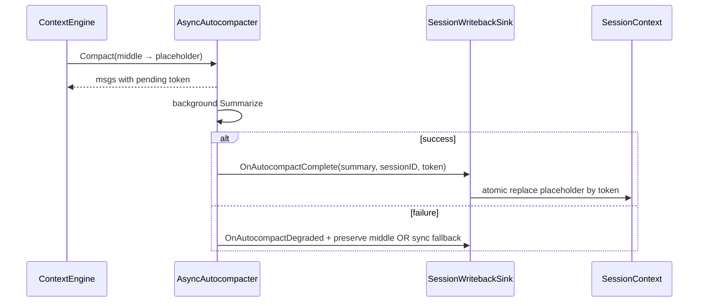

# Design: D2+D7 代码审查硬化

**Change ID:** `devrix-d2-d7-review-hardening`  
**Demand ID:** DM-20260630-013  
**Status:** Draft (S3)

---

## 1. P0 — D2 工具安全

### 1.1 PlanModeWriteParity（RH-D2-01）

**文件**：`enforce/tools/edit_tool.go`

```go
// 在 resolveWorkspacePath 之后、os.ReadFile 之前：
if denied := EnforcePlanModeWrite(ctx, target); denied != nil {
    return denied, nil
}
```

与 `write_file`（`tool_runner.go:151`）对齐。Plan 白名单不变，执行层统一守门。

### 1.2 SymlinkContainment（RH-D2-02）

**文件**：`enforce/tools/tool_runner.go::resolveWorkspacePath`

```
target = filepath.Clean(join(workDir, rel))
real, err := filepath.EvalSymlinks(target)  // 逐级或最终
rel, err := filepath.Rel(workDir, real)
if strings.HasPrefix(rel, "..") → deny
```

**边界**：workDir 本身应为已解析真实路径（bootstrap 阶段 `filepath.EvalSymlinks`）。

### 1.3 AutocompactWriteback（RH-D2-03/04）

**现状断裂**：

```
AsyncAutocompacter → placeholder (pending)
  → goroutine Summarize
  → OnAutocompactComplete → CompressionEventSink.EmitAutocompactComplete
  → NoOpCompressionEventSink（默认）→ 丢弃
```

**目标闭环**：



**实现选项**（S3 决议：**选项 A 为 P0 必达**）：

| 选项 | 说明 |
|------|------|
| **A** | `kernel` 实现 `sessionAutocompactSink`：按 `asyncToken` 替换 `Messages` 中 placeholder |
| **B** | `async.enabled=false` 默认直至 A 完成（config 门控 + 启动 warn） |
| **C** | 失败路径 sync `Autocompacter` 重试（不保留 pending） |

## 2. P0 — D7 并发隔离

### 2.1 PerInvocationEmit（RH-D7-01）

**反模式**（当前）：

```go
// session_turn_loop.go
o.itemPipeline.Emit = emitFn  // 全局 runner 字段，无锁
```

**目标**：

```go
type ItemPipelineRunOpts struct {
    Emit              func(*contracts.EngineEvent)
    UserContextPrepend string
}
func (r *ItemPipelineRunner) Run(ctx, sessionID, focus, userID string, opts ItemPipelineRunOpts) (...)
```

`WorkItemExecutor` 同理：`Execute(ctx, spec, execOpts)` 传 `Emit`，不写字段。

**bootstrap**：`wire_item_pipeline.go` 仍可单例 runner；并发安全靠 per-call opts。

### 2.2 OnReleaseOnce（RH-D7-02）

**文件**：`wavescheduler/scheduler.go`, `wavescheduler/pool.go`

- `NewWorkerPool` 或 `WaveScheduler` 构造时注册 **唯一** release hook → `globalWakeup` channel
- `dispatchLoop` 仅 `select` wakeup，**禁止** `OnRelease` 追加
- 删除 `Start()` 内 no-op hook（`scheduler.go:244`）

## 3. P1 — 错误可观测簇

| 位置 | 改法 |
|------|------|
| `orchestrator.go:431,444` | `if _, err := EnsureGoal(...); err != nil { slog.Warn(...); }` 或 return |
| `session_turn_loop.go:157` | 检查 `AwaitRunningChildren` 返回；非空 emit warning |
| `item_pipeline.go` SetRoundPhase | warn + span attr `phase_write_failed=true` |
| `workmodel/resolve.go` | rollup 路径 propagate 或 warn |
| `turn_state.go` | `EndTurn` delete handle（文档化 WaitTurn 晚到语义） |

## 4. P1 — D2 fail-closed

| 项 | 改法 |
|----|------|
| sandbox disabled | 生产 `enabled=true` 默认；`false` 时 `slog.Warn` + metric `sandbox_disabled` |
| nil bashAST | bootstrap 强制 `NewBuiltinSurfaceWithBashAST`；nil → Deny |
| bash audit | redact 命令中 token 模式；或 truncate 256 runes |
| memory manager | `SetCompressedView` / `EnrichWithLongTermRecall` 持 `messagesMu` |
| microcompact | 跳过 `MessageRoleTool` 与含 `tool_calls` 的消息 |

## 5. P2 — 规约

- `child_downlink.go:34` → `DefaultChildExpectedReturn(parent, directive)`
- `arbitrator.go:338` → i18n key `escape.arbitrator.json_schema`
- `strategic_plan_proposer.go` appendix → `i18n` / `format_hints.go`

## 6. 测试策略

| T 层 | 覆盖 |
|------|------|
| 单元 | symlink escape、plan edit deny、Emit 并发、OnRelease 计数、writeback token |
| 集成 | 两 session 并行 `RunSessionTurnLoop`；async compact 端到端 |
| race | `go test -race` orchestration + contextengine 全包 |

## 7. 可观测性

新增 span / metric（登记 span-registry）：

- `D2_Autocompact_Writeback` — success/degraded/failed
- `D7_ItemPipeline_EmitScope` — session_id on every emit
- `D7_Wave_OnRelease_HookCount` — gauge（应为 1）
