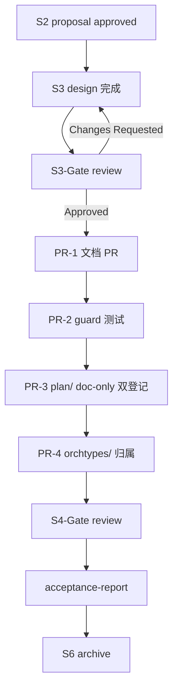
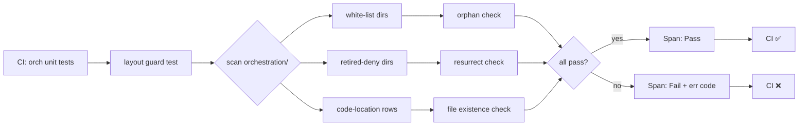

# Design: D7 物理布局对齐 — A 层补全 + S1-S6 代码路径收敛

**Change ID:** `devrix-d7-physical-layout-alignment`
**Demand ID:** DM-20260701-004
**Status:** S3_Design
**Parent Proposal:** `proposal.md`
**Template:** `docs/methodology/detail-design-framework.md`（六段式）
**Created:** 2026-07-01

---

## ① 架构目标

### 业务目标（解决痛点 → 对应 AC）

| 痛点 | 对应 AC |
|------|---------|
| a-registry Canonical 与 ValueFlow 行数不齐（21 vs 47+2） | AC1 |
| a-registry Code Location 未验证可达 | AC2 |
| f-registry Canonical S 段缺失（D7-S3/4/6 大段空白） | AC3 |
| f-registry 仍含历史路径作为 current | AC4 |
| code-layout 仍有 ghost shim | AC5 |
| 无 layout guard，路径漂移可继续发生 | AC6/AC7 |
| plan/ 与 orchtypes/ 未登记归属 | AC8/AC9 |

### 技术目标（量化指标）

| 指标 | 目标值 | 测量方式 |
|------|--------|----------|
| `a-registry.md` Canonical S 段 | ≥ 6 段（S1-S6 全覆盖） | `grep -c "^### D7-S" a-registry.md` |
| `a-registry.md` A 行数 | ≥ 47 + Hardening 2（合计 49 行） | `grep -cE "^\\| D7-S[1-6]-A" a-registry.md` |
| `f-registry.md` Canonical S 段 | ≥ 6 段（S1-S6 全覆盖） | `grep -c "^### D7-S" f-registry.md` |
| `code-layout.md §4.2` ghost 目录命中数 | 0 | `grep -cE "coordinator\|hubspoke" code-layout.md` |
| `internal/layers/orchestration/` 允许目录白名单 | 12 个 | `ls orchestration/` |
| Layout guard 测试数 | ≥ 5 | `internal/layers/orchestration/layout/guard_test.go` count |
| 单 PR 文件改动 | ≤ 400 行 markdown（避免大面积 review；PR-2 新增 4 个 test-only .go 在新 `layout/` 子包，约 480 行 Go 代码） | `git diff --stat` |
| 单 PR 业务代码改动 | PR-1/3/4 = 0 行 .go；PR-2 = 0 业务代码（仅新增 4 个 test-only .go） | `git diff --stat '*.go'` |
| 全量回归 | 24-25 orchestration packages `go test -race -count=1` PASS（具体值由 PR-2 layout guard 重新 baseline，22 是历史估值） | CI |

### 约束条件

- **SemVer**: a-registry v5.3.0→v5.4.0 / f-registry v5.3.0→v5.4.0 / 域 t-registry v4.21.0→v4.22.0 / 根 t-registry v5.11.0→v5.12.0 / code-layout v1.12.0→v1.13.0
- **lite-mode**: d7-orchestration/spec.md ≤ 200 行（不破上限，本 change 不改 spec.md 主文）
- **治理 overlay**: S6 不强制单目录迁移（DM-002 决策）
- **Pure Go 测试**: 0 外部依赖
- **CI 硬阻断**: layout guard 测试失败即阻断

## ② 架构原则

### 设计原则（10 条以内）

| 原则 | 落地方式 | 对应 AC |
|------|----------|---------|
| 1. **注册表权威** | a-registry / f-registry Code Location = `grep -r` 可达的 `.go` 文件 | AC2 |
| 2. **物理镜像规格** | code-layout §4.2 与 `ls orchestration/` 1:1 | AC5 |
| 3. **历史保留** | 历史 A/F/T ID 不重编号；legacy 列保留 | §3 Out of Scope |
| 4. **小步 PR** | 每 PR ≤ 400 行，0 业务代码改动优先 | §4 Success |
| 5. **测试驱动** | layout guard 测试先于任何 git mv 实施 | AC6/AC7 |
| 6. **零行为变更** | 纯文档 + 测试（不含 shim，不改 API） | §3 Out of Scope |
| 7. **跨域解耦** | D1/D2/D3/D4 物理布局域自治，本 change 仅 D7 | §4.2 OOS-5 |
| 8. **lite-mode 兼容** | spec.md ≤ 200 行不动，仅 a/f/code-layout registry 改动 | 约束 |
| 9. **CI 硬阻断** | layout guard 失败 = 不可 merge | AC6/AC7 |
| 10. **可回滚** | 每 PR 独立 commit，独立 revert 即可回滚 | §3 阶段拆解 |

### 命名规范

| 类别 | 模板 | 示例 |
|------|------|------|
| A ID | `D7-S{N}-A{NN}` | D7-S1-A01 |
| F ID | `D7-S{N}-A{NN}-F{NN}` | D7-S1-A01-F01 |
| T ID | `D7-S{N}-A{NN}-T{NN}` 或 `D7-S{N}-A{NN}-F{NN}-T{NN}` | D7-PL-T01 |
| Scenario slug | `小写英文单词` | `workmodel` |
| Error code | `ORCH_<SCOPE>_<NNNN>` | ORCH_LAYOUT_6001 |
| Span op | `D7_Code_Layout_Guard_{Pass,Fail}` | D7_Code_Layout_Guard_Pass |

### 代码风格

- 函数 < 50 行
- 文件 < 800 行
- 嵌套 ≤ 4 层（early return 优先）
- 错误处理用 `internal/shared/errors/` SentinelError
- 不可变：Code Location 字段用 string，不可变；layout guard 失败返回 error 不修改文件

## ③ 业务流程

### 核心流程：PR 落地时序



### 异常补偿

| 失败 | 回滚 | 幂等保障 |
|------|------|----------|
| PR-1 review 不过（行数 / 准确性） | revert commit + 重写 | doc-only，0 代码 |
| PR-2 layout guard 误伤 | allow-list 增项 + 注释 | test-only，0 代码 |
| PR-3 plan/ doc-only 双登记覆盖不全 | revert + 重新登记 a-registry/code-layout | doc-only，0 物理改动 |
| PR-4 orchtypes/ 误改归属 | doc-only revert | 0 物理改动 |

### 分支处理决策树

```text
PR-3 plan/ 收敛方式？
└── Q1 决策：B (doc-only 双登记) → tasks.md step 4.2-4.5
    ├── 0 物理改动
    ├── 0 importer 改
    └── 0 行为变更
```

## ④ 领域模型

### 聚合根（4 个以内）

| 聚合根 | 职责 | 不可变性 |
|--------|------|----------|
| **ARegistryEntry** | a-registry 单行（D7-S{N}-A{NN} + Name + Type + IO + Span + Status + Code Location） | 不可变；Code Location 字段 string |
| **FRegistryEntry** | f-registry 单行（D7-S{N}-A{NN}-F{NN} + ...） | 不可变 |
| **CodeLocation** | `internal/layers/orchestration/<package>/<file>.go:<func>` 三元组 | 不可变；解析为 `(*CodeLocation, error)` |
| **LayoutGuard** | 扫描 orchestration/ 目录树 + 比对白名单 + 比对历史禁止列表 | 受控可变（白名单可配置，但走 git） |

### 限界上下文（包边界图）

```text
internal/layers/orchestration/                  # D7 编排域根
├── workmodel/                (S1)         ✅ 已登记
├── sessionorchestrator/      (S2)         ✅ 已登记
├── wavescheduler/            (S3)         ✅ 已登记
├── executionflow/            (S4)         ✅ 已登记
│   └── verify/               (S4-A50/A06..A09 链)  ✅ 已登记（DM-20260626-005）
├── decisionplanning/         (S5 主体)    ✅ 已登记
├── plan/                     (S5 PlanKind/DefaultPlanner) 🟡 需登记（PR-3 收敛）
├── mups/
│   ├── execute/              (S6 Execute/Verify Channel)  🟡 需补 activity→path 矩阵
│   └── learn/                (S6 LearningAsset/3 Memory)  🟡 需补 activity→path 矩阵
├── escape/                   (S6 EscapeEngine + 5 CB)    🟡 需补 activity→path 矩阵
├── interfaces/               (S6 contract + S1/S6 共享 + Hardening SentinelError)
├── hardening/                (Cross-cutting Discipline Keeper) ✅ 已登记（DM-20260626-003）
├── orchtypes/                (Cross-S 治理包 — 类型/常量/守卫) 🟡 需登记（PR-4）
└── delegatetools/            (S3 触发 F)   ✅ 已登记

🚫 禁止 resurrect（PR-2 guard 守护）：
- coordinator/  (DM-20260619-005 git rm)
- hubspoke/     (DM-20260619-005 git rm)
- observe/      (DM-20260626-002 合并到 mups/ + orchtypes/)
- fastpath.go   (已退役，DM-20260626-008 FastPath 退役)
```

### S6 治理 + 跨 S spillover activity→path 矩阵（Decision Q3 落地；含 S5 Plan/A4 spillover + S4 Verify spillover + S2 Interrupt spillover + Hardening A 覆盖）

> **重要**：以下路径均经 `ls internal/layers/orchestration/` + `find <dir> -name "*.go"` 实测。Activity 编号 `D7-S6-A{NN}` 对应 a-registry v5.4.0；包归属可能跨 S（orchtypes/ 是 Cross-S kernel，D6 决策）。注：A03 (decisionplanning) + A04 (plan) 是 S5 sub-registration 路径，不在下方 8-path 枚举内。

| Activity | Activity 名称 | 物理路径 | 包归属 | 备注 |
|----------|---------------|----------|--------|------|
| D7-S6-A01 | ObserveObservation | `orchtypes/observation.go` + `orchtypes/observation_test.go` | **Cross-S** (orchtypes) | Observation 4 类，定义在 orchtypes 供多 S 共享 |
| D7-S6-A02 | ObserveUncertainty | `orchtypes/uncertainty_coord.go` + `orchtypes/uncertainty_report.go` | **Cross-S** (orchtypes) | UncertaintyReport/Coord 跨 S 共享 |
| D7-S6-A03 | PlanValidate | `decisionplanning/plan_mode.go` + `decisionplanning/plan_mode_test.go` | S5 (decisionplanning) | PlanMode / OpenWorldPolicy |
| D7-S6-A04 | PlanGenerate | `plan/planner.go` | S5 (plan) | DefaultPlanner.Plan（plan/ 包，不在 decisionplanning/）|
| D7-S6-A05 | ChannelCommit | `mups/execute/channel.go` + `mups/execute/commit.go` | S6 (mups/execute) | CommitChannel 1-Step 同步 + IdempotencyKey |
| D7-S6-A06 | ChannelProtocol | `mups/execute/protocol.go` | S6 (mups/execute) | ProtocolChannel 顺序多步 + reverse-order rollback |
| D7-S6-A07 | ChannelScenario | `mups/execute/scenario.go` | S6 (mups/execute) | ScenarioChannel 并行探测 + 多数派投票 |
| D7-S6-A08 | ChannelExploration | `mups/execute/exploration.go` | S6 (mups/execute) | ExplorationChannel 多 agent + 优先级排序 |
| D7-S6-A09 | VerifyVerdict | `executionflow/verify/verdict_to_exit_reason.go` + `executionflow/verify/exit_reason.go` | S4 (executionflow/verify) | VerdictKind 4 态 → ExitReason 映射 |
| D7-S6-A10 | VerifyAggregate | `executionflow/verify/anomaly.go` + `orchtypes/system_anomaly_wiring.go` | S4 (executionflow/verify) + **Cross-S** (orchtypes) | SystemAnomaly 聚合（AggregateVerdicts 已 inline 进 A09；anomaly.go:9 注释 "executionflow/verify/anomaly.go (NEW) → orchtypes/system_anomaly_wiring.go" 显式跨包）|
| D7-S6-A11 | Interrupt | `sessionorchestrator/interrupt.go` + `sessionorchestrator/interrupt_test.go` | S2 (sessionorchestrator) | 跨节点 escape 触达 |
| D7-S6-A12 | SandboxCleanup | `escape/audit_log.go` + `escape/fallback.go` | S6 (escape) | 沙箱清理 + 审计 + fallback 路径 |
| D7-S6-A13 | ForkAndResume | `escape/pending_resolution.go` + `escape/loop_depth_tracker.go` | S6 (escape) | PendingResolution + Loop depth tracking |
| D7-S6-A14 | HardenMetricsAndConcurrency | `hardening/metrics.go` + `wavescheduler/conflict.go` | Cross-cutting (hardening + wavescheduler) | metrics 复数化 + ConflictGuard TOCTOU（conflict.go 在 wavescheduler/）|
| D7-S6-A15 | CrossSContract | `interfaces/task_spec.go` + `interfaces/task_report.go` + `interfaces/contracts.go` | **Cross-S** (interfaces) | TaskSpec/TaskReport/contracts 3 主文件 + 4 测试 |
| Hardening-A01 | MetricsEmit | `hardening/emitter.go` | Cross-cutting (hardening) | 20+ Emit* span helper 跨节点 |
| Hardening-A02 | ConcurrencyGuard | `wavescheduler/conflict.go` + `wavescheduler/scheduler.go` | Cross-cutting (hardening + wavescheduler) | ConflictGuard AllowAndRegister 原子调用（owner: wavescheduler/）|

**S6 8 个物理 overlay/共享/Cross-S/Cross-cutting 路径（5 S6 overlay + 2 Cross-S + 1 cross-cutting，与 spec.md L150 3 categories 一致）:**
- 5 S6 overlay 路径:
  - `sessionorchestrator/` — A11 Interrupt + S2 主体
  - `mups/execute/` — A05..A08（4 个 Channel 实体）
  - `mups/learn/` — LearningAsset/Reputation/Memory (asset/ + memory/ + prior/ + reputation/ 子包)
  - `escape/` — A12/A13（Cleanup/Fallback/Forker/Resume + 5 CB L0..L5）
  - `interfaces/` — A15 CrossSContract + 跨 S 共享
- 2 Cross-S 路径:
  - `orchtypes/` — A01/A02（Cross-S kernel：D6 决策，intent.go + observation.go + uncertainty_*.go 跨 S5/S6 共享）
  - `executionflow/verify/` — A09/A10（Verdict 升格后归属，DM-20260626-005；A10 anomaly 聚合跨包 wiring 到 `orchtypes/system_anomaly_wiring.go`）
- 1 cross-cutting 路径:
  - `hardening/` + `wavescheduler/` — A14/Hardening-A01（Cross-cutting Discipline Keeper，ConflictGuard owner 是 wavescheduler/）
- 退役路径（PR-2 layout guard 守护）:
  - turn/         (DM-20260626-004 整包 → sessionorchestrator/)
  - queryloop/    (DM-20260617-001 退役)

**S5 sub-registration carve-out（A03/A04 spillover，不在 8-path 枚举内）**：
- D7-S6-A03 PlanValidate → `decisionplanning/plan_mode.go`（S5 路径，DM-20260626-001 governance overlay 决策）
- D7-S6-A04 PlanGenerate → `plan/planner.go`（S5 路径，同上）

**PR-1 code-layout.md 必删项**：code-layout.md §4.2 v1.12.0 当前仍列 `coordinator/`、`hubspoke/`、`turn/`、`milestone/` 4 个 retired path 作为 active 行（实测 `code-layout.md §4.2` L100-106），PR-1 终态化时必须连同 §4.2 L100-106 一起删除，否则 layout guard TestGhostDirsInCodeLayout 测试会误报。
```

### 领域事件（Span / Metric / Error）

| Span op | 触发时机 | 属性 |
|---------|----------|------|
| `D7_Code_Layout_Guard_Pass` | layout guard 测试 PASS 时 | `{change_id, s_count, a_count, f_count, ghost_count=0}` |
| `D7_Code_Layout_Guard_Fail` | layout guard 测试 FAIL 时 | `{change_id, ghost_dirs, orphan_dirs, missing_locations}` |
| `D7_Registry_Bump_Version` | a/f/code-layout version bump 时 | `{domain, from_version, to_version, file_count}` |

| Metric | 类型 | 标签 | 用途 |
|--------|------|------|------|
| `devrix_orch_layout_guard_duration_seconds` | Histogram | `change_id` | layout guard 测试耗时 |
| `devrix_orch_layout_guard_failures_total` | Counter | `reason` | layout guard 失败计数 |

| Error code | 含义 | 触发条件 |
|------------|------|----------|
| `ORCH_LAYOUT_6001` | `CodeLocation path not found` | a/f-registry 行 Code Location 字段 `*.go` 文件不存在 |
| `ORCH_LAYOUT_6002` | `Resurrect retired directory` | layout guard 检测到 `coordinator/` / `hubspoke/` / `observe/` 等 |
| `ORCH_LAYOUT_6003` | `Orphan directory` | orchestration/ 根下新增未在 code-layout 登记的 slug 目录 |

### 跨域消费模型

本 change 仅 D7 内部，对 D1/D2/D3/D4 无新增契约。无跨域事件。

## ⑤ 核心链路图

### 端到端路径：layout guard 验证流程



### 时序标注

| 节点 | SLA | P99 上限 | 单点风险 | 缓解 |
|------|-----|----------|----------|------|
| scan orchestration/ | < 100ms | 500ms | 文件 IO | filepath.Walk 缓存 + 并发安全 |
| a-registry parse | < 50ms | 200ms | 正则复杂度 | 静态预编译 |
| file existence check | < 200ms | 1s | 大量 A 行 × 多路径 | 并发 errgroup |

### 单点风险

| 风险 | 缓解 |
|------|------|
| allow-list 漏登记导致误报 | design §④ 明列 12 个允许子目录；PR-2 引入 allow-list 时注释 + link |
| file existence check 假阳（symbol-only import） | 仅校验 `*_test.go` 不在路径上时，`go test` 已覆盖 |
| Spec version bump 与 CHANGELOG 不同步 | tasks.md §P5 acceptance 检查清单 |

## ⑥ 接口 / API 设计

### 风格

- **Pure types**: `CodeLocation`、`ARegistryEntry`、`FRegistryEntry` 全为值对象，`With*()` 返回新副本
- **Builder**: `NewCodeLocation(path, line, funcName) *CodeLocation`
- **不可变**: layout guard 函数返回 `(*GuardReport, error)`，不修改全局状态

### 契约（错误码三元组 + TraceID）

```go
// internal/layers/orchestration/layout/guard.go
type GuardReport struct {
    ChangeID       string                // 来自 .openspec.yaml
    ScannedAt      time.Time
    OrphanDirs     []OrphanDirViolation
    ResurrectedDirs []ResurrectViolation
    MissingLocations []MissingLocation
    SpanEmitted    string                // trace_id for D5 trace
}

type OrphanDirViolation struct {
    Path    string  // orchestration/<dir>
    Reason  string  // "not in code-layout.md §4.2 allow-list"
}

type ResurrectViolation struct {
    Path   string  // orchestration/coordinator/
    Reason string  // "retired by DM-20260619-005"
}

type MissingLocation struct {
    RegistryFile string  // a-registry.md
    AID          string  // D7-S1-A07
    CodeLocation string  // sessionorchestrator/workmodel.go:Rollup
}
```

### 错误码闭合

| Code | Message | Remediation |
|------|---------|-------------|
| `ORCH_LAYOUT_6001` | `CodeLocation path not found: {path}` | 检查 a/f-registry Code Location 是否拼写正确 |
| `ORCH_LAYOUT_6002` | `Resurrect retired directory: {dir} (retired by {dm_id})` | 删除该目录或更新 code-layout.md 登记 |
| `ORCH_LAYOUT_6003` | `Orphan directory not registered: {dir}` | 在 code-layout.md §4.2 登记该子目录 |

### 幂等保障表

| 操作 | 幂等 | 验证方式 |
|------|------|----------|
| `layout.GuardScan(orchestrationDir, allowList, denyList)` | ✅ | 多次调用结果相同 |
| `parseARegistryEntry(line)` | ✅ | 同一行多次解析等价 |
| `codeLocation.Resolve(path)` | ✅ | 同 path 多次调用等价 |

### 版本演进路径

| 版本 | 内容 | 时机 |
|------|------|------|
| **v1.0**（PR-1） | 纯文档 PR：a/f-registry 补全 + code-layout 终态化 | 2026-07-01 |
| **v1.1**（PR-2） | layout guard 测试 PR | 2026-07-02 |
| **v1.2**（PR-3） | plan/ S5 收敛（design §④ Q1 决定） | 2026-07-03 |
| **v1.3**（PR-4） | orchtypes/ 归属登记（design §④ Q2 决定） | 2026-07-04 |
| **v2.0**（不规划） | 174 个 Gherkin Scenario 正文回迁 spec.md | lite-mode 范围外 |

---

## 附录

### 附录 A：File Manifest

#### A.1 修改文件

| 文件 | 改动 | 估算行数 |
|------|------|----------|
| `openspec/specs/d7-orchestration/a-registry.md` | Canonical S1-S6 A 段补全（21 → 47+Hardening 2 = 49 行） | +200 行 |
| `openspec/specs/d7-orchestration/f-registry.md` | Canonical S1-S6 F 段补全（8 段 → 6 段全覆盖） | +180 行 |
| `openspec/specs/architecture/code-layout.md` | §4.2 去 ghost shim + 登记 plan/orchtypes/hardening/interfaces 归属 | ±25 行 |
| `openspec/specs/d7-orchestration/CHANGELOG.md` | 加本 change 一行摘要 | +1 行 |
| `openspec/specs/d7-orchestration/t-registry.md` | 登记 D7-PL-T01..T12 | +12 行 |

#### A.2 新增文件

| 文件 | 用途 | 估算行数 |
|------|------|----------|
| `internal/layers/orchestration/layout/guard.go` | layout guard 核心 | ~150 行 |
| `internal/layers/orchestration/layout/guard_test.go` | 5+ 测试函数 | ~250 行 |
| `internal/layers/orchestration/layout/types.go` | CodeLocation / GuardReport 等类型 | ~80 行 |
| `internal/layers/orchestration/layout/doc.go` | package 注释（链接 design.md） | ~15 行 |
| `openspec/changes/devrix-d7-physical-layout-alignment/specs/d7-orchestration/spec.md` | delta spec (12 ADDED + 4 MODIFIED = 16 Requirements + 17 Scenarios) | 229 行 |

#### A.3 删除文件

无。

### 附录 B：Rollback Plan

| 阶段 | 触发条件 | 回滚 |
|------|----------|------|
| PR-1 文档 | review 不过 | `git revert <commit>` |
| PR-2 测试 | 误伤导致 CI 全红 | `git revert <commit>` + allow-list 增项 |
| PR-3 plan/ doc-only 双登记 | 登记覆盖不全 / a-registry Code Location 错位 | `git revert <commit>`（纯文档，0 物理改动） |
| PR-4 orchtypes/ 归属 | 误改归属 | `git revert <commit>`（doc-only） |

### 附录 C：回归风险评估

| baseline | 风险 | 策略 |
|----------|------|------|
| 22 orchestration packages `-race -count=1` PASS | layout guard 测试本身不应引入新失败 | PR-2 测试仅扫描目录结构，不调用业务函数 |
| LP-1/LP-2/LP-5 集成测试 PASS | doc 改动 0 业务影响 | PR-1 仅 markdown |
| 历史 A/F/T ID 完整性 | 不重编号 | AC2 用 Code Location 反向验证 |
| spec.md ≤ 200 行 | 不破 lite-mode 上限 | 本 change 不动 spec.md 主文 |

### 附录 D：S3 检查清单自检

- [x] **六段式完整性**：①架构目标 / ②架构原则 / ③业务流程 / ④领域模型 / ⑤核心链路图 / ⑥接口/API 设计（章节标题与符号与 detail-design-framework.md 一致）
- [x] **六段式非空**：每段 ≥ 3 行实质内容
- [x] `dsaft_activities` 已标注涉及的活动 ID（见 tasks.md）
- [x] `design.md` 明确每个 A 的 F 编排关系（见 ④ 限界上下文）
- [x] `specs/*/spec.md` 包含所有 Gherkin Scenario（delta spec 列出，见 spec.md）
- [x] 每个 Requirement 有对应的 T 层注释（delta spec 内 `<!-- T: ... -->`）
- [x] 重大决策已记录（Decision 节，proposal.md §3 + §9）
- [ ] **S3-Gate Review 结论**：Approved / Changes Requested（待审）

#### Decision: plan/ 收敛方式（Q1）

**选项:**
| 方案 | 优点 | 缺点 |
|------|------|------|
| A. git mv → `decisionplanning/plan/` | 物理一致 | 43 importer 改 + package name 冲突（plan → decisionplanning）+ cycle 风险 |
| B. **保留 plan/，doc-only 双登记**（`plan/` 与 `decisionplanning/` 并列物理共存） | 0 物理改动 + 0 importer 改 + 0 行为变更 | 短期 2 个 plan 入口（plan/ 6 .go 文件 = 5 prod + 1 test + decisionplanning/ 16 .go 文件 = 8 prod + 8 test） |
| C. plan/ → decisionplanning/ 包内文件 (`planner.go` 等) | 部分收敛 | 仍有 plan/ 入口未消；package name 冲突 |

**选择:** B（doc-only 双登记）
**理由:**
1. `plan/` 已用 `package plan`（6 .go 文件 = 5 prod + 1 test），`decisionplanning/` 已用 `package decisionplanning`（16 .go 文件 = 8 prod + 8 test），两包均为 D7-S5 子功能，物理功能边界明确无重叠
2. 43 个 plan/ importer + 16 个 decisionplanning/ importer 跨包引用（实测 `grep -r "orchestration/plan\""` = 43 hits, `grep -r "orchestration/decisionplanning\""` = 16 hits），无须任何 import path 变更
3. DM-20260619-007 D2 v2.2 closure（v2.2 结构）已 git rm `queryloop/`，本 change 不回迁历史路径
4. v1.1 follow-up（v1.1.0）评估 `orchtypes/ → orchestration/kernel/`，**与 Q1 同步评估** `plan/ → decisionplanning/plan_inner/`，作为 6-month follow-up 候选
5. AC8 验证 = `a-registry.md` 标注 plan/ Code Location + `code-layout.md §4.2` 登记 plan/ 为 D7-S5 子目录；不涉及 Go 代码改动

#### Decision: orchtypes/ 归属（Q2）

**选项:**
| 方案 | 优点 | 缺点 |
|------|------|------|
| A. 登记为 S5 kernel（跨 S 治理） | 反映实际用途（types/sentinels/intent） | spec/registry 描述需清晰 |
| B. 单独 `orchestration/kernel/` 子目录 | 物理独立 | 30 文件 (17 prod + 13 test) git mv 风险 |

**选择:** A
**理由:** orchtypes/ 跨 S5/S6（intent 是 S5，types/sentinels 是 S6 共享），归 kernel 更准确；0 物理改动。

#### Decision: activity→path 矩阵表达位置（Q3）

**选项:**
| 方案 | 优点 | 缺点 |
|------|------|------|
| A. 仅 a-registry 行内 Code Location | 简洁 | S6 4 包分散 |
| B. design.md §④ 加完整矩阵 | 一目了然 | design 略长 |

**选择:** B
**理由:** design.md §④ 已写限界上下文图，加一张 S6 activity→path 矩阵避免 PR 返工；matrix 与 code-layout.md §4.2 互校。

#### Decision: code-layout.md version bump（D5）

**选择:** v1.12.0 → v1.13.0
**理由:**
- v1.12.0 已登记 6 S（workmodel/sessionorchestrator/wavescheduler/executionflow/decisionplanning + S6 overlay）+ 4 个 legacy shim 行（coordinator/hubspoke/turn/milestone）
- 本 change 终态化 = 去除 coordinator/hubspoke legacy shim 行 + 登记 plan/orchtypes/hardening/interfaces 4 个新行
- 改动 ≥ 4 行 + 删 2 行 → MINOR bump（v1.12.0 → v1.13.0）
- CHANGELOG.md 同步加一行摘要

#### Decision: hardening/ Cross-cutting 归属（D6）

**选择:** hardening/ 登记为 Cross-cutting Discipline Keeper，跨 S6/S2/S3 共享
**理由:**
- hardening/emitter.go（Hardening-A01: 20+ Emit* span helper）+ hardening/metrics.go（A14 metrics 复数化）+ hardening/recovery.go（恢复/降级）跨 S2/S3/S6 守护
- A14/Hardening-A02 的 ConflictGuard 实际在 `wavescheduler/conflict.go`（owner: wavescheduler，hardening 仅是归属 cross-cutting 的命名空间）
- a-registry Hardening 段独立列出，Code Location 字段统一以 `hardening/` 为前缀
- code-layout.md §4.2 加 Cross-cutting 行；d7-domain.md §Cross-cutting 加 hardening 描述
- 不归任何单一 S，避免被误解为 S6 独占

#### Decision: spec.md delta 范围（D7）

**选择:** 仅在 `openspec/changes/devrix-d7-physical-layout-alignment/specs/d7-orchestration/spec.md` 添加 12 ADDED + 4 MODIFIED Requirement（共 16 Requirements + 17 Scenarios）；不动 `openspec/specs/d7-orchestration/spec.md` 主文
**理由:**
- spec.md 主文 (v4.22.0) 已精简至 195 行（lite-mode 7 站收官 PR #348 之后），本 change 不破坏上限
- delta spec 由 OpenSpec CLI 在 archive 阶段合并入主文
- delta spec 229 行（12 ADDED + 4 MODIFIED = 16 Requirements + 17 Scenarios），delta 文件不受 lite-mode 200 行上限约束（合并入主文后整 spec.md 仍 ≤ 200 行）
- AC1/AC2/AC3/AC4/AC5/AC6/AC7/AC8/AC9 全部由 layout guard 测试自动验证

#### Decision: Cross-S kernel A 编号（D8）

**选择:** `D7-X-A{NN}` 命名空间（X = Cross-S）
**理由:**
- D7 当前 S 编号 S1-S6（DM-20260626-001 6 S 精简），Cross-S 不可归入任一 S
- `D7-X-` 显式区别于 `D7-S{N}-`，避免歧义
- v1.1 follow-up 候选：扩展为 `D7-S7-A{NN}`（新增 S7 = Cross-S Kernel 场景），与 6 S canonical 区分更清晰
- 6 个 A 暂不引入 T 层点（T 点属于 v1.1 follow-up，本 change 仅登记 A → F 映射）

### 附录 E：下一步

| 行动 | Owner | 触发 |
|------|-------|------|
| S3-Gate review（grill-me skill） | 用户 | 当前文档完成 |
| 用户 approve → 开 PR-1 (`feat/devrix-d7-physical-layout-alignment`) | ccg:execute | Approved |
| PR-1 squash auto-merge | 脚本 | CI ✅ |
| PR-2/3/4 顺序执行 | ccg:execute | PR-1 合入后 |
| acceptance + archive | ccg:archive | PR-4 合入后 |