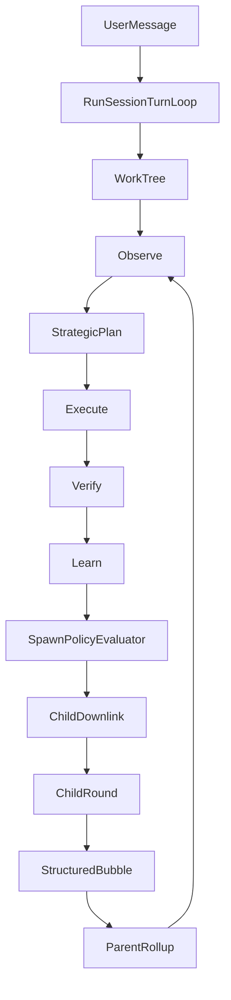

# Design: D7 S 层归一化

## 1. Design Principle

D7 的 S 层按 DSAFT 只承载稳定场景 / 价值流；A 层承载可发起活动；F 层承载最小功能点；Contract section 承载跨活动通讯对象。

因此：

- `Observe → Plan → Execute → Verify → Learn` 是 MUPS 活动链，不是 5 个 S。
- `TaskSpec` / `TaskReport` 是下行/上行 contract，不是 S。
- `Rollup` / `ChildDownlink` / `ScopeContract` 是 Work Model contract 与 governance activity，不是独立 S。

## 2. Target S/A Mapping

| Current Concept | Target |
|-----------------|--------|
| D7-S7 MUPS pipeline entry | D7-S6-A01 MUPSPipelineCoordinate |
| D7-S8 Observe | D7-S5-A06 ObserveQuantize |
| D7-S9 Execute | D7-S6-A02 ExecuteWorkItem |
| D7-S10 Verify | D7-S6-A03 VerifyDeliverable |
| D7-S11 Learn | D7-S6-A04 RunLearner |
| D7-S12 Observe-Learner loop | D7-S6-A05 CloseLearningLoop |
| D7-S13 AutoClose | D7-S2-A07 CompleteSession |
| D7-S14 EscapeEngine | D7-S6-A06 EvaluateEscape |
| D7-S15 WorkItem Rollup | D7-S1-A07 GovernRollup |
| D7-S16 Layer SubContext | D7-S1-A08 ManageScopeContract + D7-S5-A07 ProposeStrategicPlan |
| D7-S18 Pessimistic + Fallback | D7-S6-A07 ApplyPessimisticCommit |
| D7-S20 TaskSpec | Contract: Downlink TaskSpec, target S1/S6 |
| D7-S21 TaskReport | Contract: Uplink TaskReport, target S1/S6 |

## 3. WorkTree+MUPS Runtime Relation

## 4. Feedback Closure

### StrategicPlanReject

When the strategic proposer returns a structured budget rejection, the runner records it into the current round as a machine-readable `SpawnRationale`. On the next inline retry, the existing `PriorVerifyReason` prompt section includes that rationale so the LLM can self-correct proposal size.

### Child-Stats Uncertainty

Parent reevaluation should use a child-stats-derived round signal instead of passing the historical stored value as both previous and current input. This makes all-pass child convergence numerically visible even when the parent had a high previous uncertainty.

## 5. Compatibility

- Historical IDs remain queryable in registry history.
- T IDs are not mass-renumbered.
- Deprecated code fields stay for one release when needed, but are labeled `compat shim`.
- No behavior change to CLI / IM user surface except clearer failure feedback.

## 6. Tests

- Architecture guard: D7 current spec and registry must not present S7+ as canonical S.
- Architecture guard: retired `FastPath` / `OrchestratePath` source files must not reappear.
- Unit: StrategicPlanReject gets recorded for next prompt feedback.
- Unit: child-stats uncertainty reevaluate drops on all-pass terminal children.
