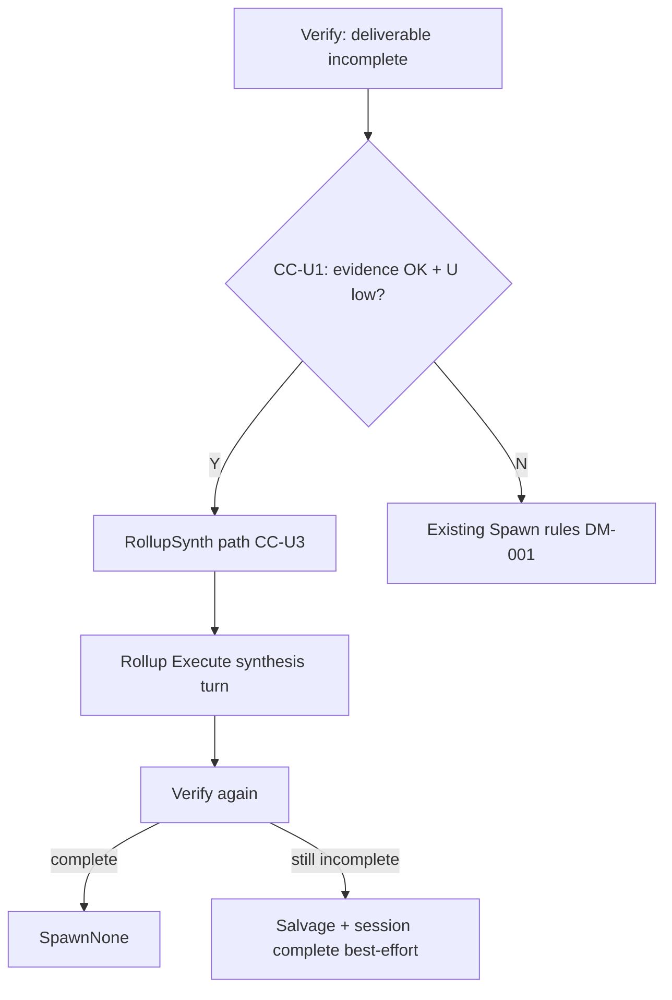

# Design: D7 不确定性驱动 Spawn — Deliverable 与拓扑解耦

**Change ID:** `d7-uncertainty-spawn-decouple`  
**Demand ID:** DM-20260704-001  
**Status:** Draft  
**Audience:** D7 编排 / MUPS / Review  
**代码锚点:** `spawn_policy.go`, `strategic_plan_proposer.go`, `rollup_gate.go`, `item_observe.go`, `item_pipeline.go`, `session_complete.go`

**前置:** [`d7-convergence-contract/design.md`](../d7-convergence-contract/design.md) CC-1～CC-5

---

## §0 设计原则（Task-Agnostic）

```
MUPS 只回答一个问题：「关于目标的不确定度 U，是否已经低到可以交付结论？」

  U 高  → 发散：Decompose / Explore / 更多 Execute 取证
  U 中  → 过渡：Inline 仅当 leaf 不宜拆且证据仍缺
  U 低  → 收敛：Rollup synth / SpawnNone / Session complete

DeliverableContract 回答另一个问题：「结论以什么形状呈现给用户？」
  → 属于 Verify 的 Emission / Extract 层，不是 Spawn 拓扑的主输入。
```

---

## §CC-U 不变式

### CC-U1 — Spawn Continuation 主信号

```
SpawnPolicyEvaluator MUST NOT use DeliverableContinuationRequired(round) as the
SOLE reason to choose SpawnInline when ALL of the following hold:

  (a) EvidenceProgress(round) >= EvidenceSufficientThreshold
  (b) UncertaintyMean < RollupSynthThreshold (default 0.50)
  (c) Depth == 0 OR parent has no running children blocking rollup

In that case, MUST prefer RollupSynth path (CC-U3) over SpawnInline.
```

**EvidenceProgress**（新信号，纯规则）：

| 输入 | 计算 |
|------|------|
| `artifact.Metadata["tool_calls"]` | ≥ 2 → +0.4 |
| `ScopeContract.InScope` 非空 | +0.2 |
| 子 WI 全 terminal | +0.3 |
| `VerdictKind == Partial` 且 reason 含 deliverable | 不扣分（格式≠证据缺） |

默认 `EvidenceSufficientThreshold = 0.5`。

### CC-U2 — Deliverable Gate 职责分离

| 层 | 职责 | 代码 |
|----|------|------|
| **Verify** | 格式//schema/`planning_meta` → `DeliverableStatus` + `StructuredDeliverable` | `deliverable_contract_verify.go` |
| **Spawn** | U + topology → inline / decompose / rollup / none | `spawn_policy.go` |
| **Session exit** | `ExtractSessionDeliverable` → salvage → `task_incomplete` | `session_complete.go`, `rollup_gate.go` |

```
DeliverableStatus == incomplete MUST NOT imply SpawnInline
when CC-U1 RollupSynth conditions are met.
```

Terminalization（CC-1.1）不变：`DeliverableStatus == complete` → `SpawnNone`。

### CC-U3 — Rollup Synth on Format Failure（收敛相）

**触发：** CC-U1 条件满足 + `DeliverableStatus == incomplete` + reason ∈ `{planning_meta, findings_json_*, partial deliverable}`

**动作（优先级）：**

1. **Path A — 同 WI rollup 轮：** 若 WI 曾有 decompose 子节点且全 terminal → 现有 `SetNeedsRollup`（CC-1.3）
2. **Path B — Ephemeral synthesis WI：** 若无子节点、depth-0 Goal：
   - 创建 **ephemeral checklist child** `WorkKindChecklist` + `NeedsRollup` 父标记
   - 或：直接 `item.NeedsRollup = true`，Execute 用 `ModeRollupSynth` 读 Materialize 中已有 tool results / private chain
3. **Path C — Salvage extract（session exit）：** rollup 仍 incomplete → `ExtractSessionDeliverable` lenient parse（best-effort，不进 Spawn 决策）



### CC-U4 — Strategic Single Mode Gate

```
IF StrategicPlan.execution_mode == "single"
AND UncertaintyMean >= SingleModeThreshold (default 0.45)
THEN reject or coerce to decompose with StrategicPlanReject reason=uncertainty_too_high_for_single
```

**Default QuantizedKind：** 当 U 高时，即使 strategic 返回 single，`planQuantizedKind` MUST NOT downgrade to `intent_command` if Observe 含 `ObsUncertainty RequiresMore`.

实现：`parseStrategicPlanJSON` 后、`applyBudgetCap` 前调用 `applySingleModeUncertaintyGate(in, prop, item.Uncertainty)`.

### CC-U5 — Observe 结构化 Verify 信号

在 `observeWorkItem` 增加规则 Observations（**不调 LLM**）：

```go
// 当 LastRound.DeliverableStatus == incomplete:
ObsSignal{Name: "deliverable_incomplete", Value: 1, ...}
ObsSignal{Name: "deliverable_reason", Value: hash(reason), ...}
ObsSignal{Name: "evidence_tool_calls", Value: float64(toolCalls), ...}
```

`ComputeUnifiedUncertainty` 权重调整（文档化，代码小改）：deliverable incomplete + 高 tool_calls → **不抬高** U（避免格式失败被当成「还需探索」）。

### CC-U6 — spawnRationale 准确

`spawnRationale(SpawnEscalateHuman)` 新增分支：

```go
if ctx.InlineRetriesAtMaxDepth >= ctx.MaxInlineRetriesAtMaxDepth &&
   deliverableContinuationRequired(round) {
    return fmt.Sprintf("CC-1.2: deliverable inline retries exhausted (%d/%d)",
        ctx.InlineRetriesAtMaxDepth, ctx.MaxInlineRetriesAtMaxDepth)
}
// depth>=MaxDepth 分支保留 R1 文案
// R7 仅当 VerdictIndeterminate && indeterminate retries exhausted
```

---

## §1 修改后的 Spawn 决策顺序（Partial 分支）

在 DM-001 决策树基础上，**Partial + deliverable incomplete** 插入 CC-U1：

```
VerdictPartial
  ├─ RollupRound? → (existing R5)
  ├─ CC-U1 evidence sufficient + U low? → RollupSynth (CC-U3) / SpawnAwait rollup
  ├─ ExploratoryPlanKind + CanDecompose + no children? → Decompose
  ├─ UncertaintyMean >= Threshold? → Decompose
  ├─ deliverableContinuationRequired?
  │     ├─ inline budget exhaust? → EscalateHuman (CC-U6 rationale)
  │     └─ else → Inline
  └─ SpawnNone
```

**关键变化：** CC-U1 在 `deliverableContinuationRequired → Inline` **之前**评估。

---

## §2 与 MUPS 五节点交互（出入参）

| 节点 | LLM? | 新增/变更输入 | 新增/变更输出 |
|------|------|---------------|---------------|
| **Observe** | 可选 | LastRound deliverable reason, tool_calls | ObsSignal → U |
| **Plan** | Strategic | `item.Uncertainty` gate single | coerced execution_mode |
| **Execute** | Yes | rollup synth Materialize child findings lines（已有） | Artifact + metadata |
| **Verify** | No | 不变 | DeliverableStatus（不驱动 Spawn 单独分支） |
| **Decide** | No | CC-U1 evidence + U | SpawnPolicy, NeedsRollup |
| **Learn** | No | 不变 | prior（长期） |

Execute **不负责**「该不该 decompose」——那是 Observe U + Plan + Decide 的事。Execute 只在 rollup synth 轮被 Materialize 告知「合成，勿再探索」。

---

## §3 AS-IS vs TO-BE（不确定性语言）

| 场景 | AS-IS | TO-BE |
|------|-------|-------|
| 读完 scope 文件，JSON 格式错 | Inline×3 → escalate | CC-U1 → RollupSynth → complete/salvage |
| 大 scope，少 tool_calls | single → inline 到死 | CC-U4 → decompose |
| 子 WI 全 pass，父 incomplete 格式 | 父 inline | CC-1.3 rollup（DM-001）+ CC-U3 |
| escalate 文案 | R7 indeterminate | CC-1.2 inline exhausted |

---

## §4 代码变更清单（按 Phase）

| 文件 | 变更 |
|------|------|
| `workmodel/spawn_policy.go` | CC-U1 分支；CC-U6 rationale |
| `workmodel/evidence_progress.go` | **新文件** EvidenceProgress 纯函数 |
| `workmodel/rollup_gate.go` | `TriggerRollupSynthOnFormatFailure` |
| `sessionorchestrator/strategic_plan_proposer.go` | CC-U4 gate |
| `sessionorchestrator/item_observe.go` | CC-U5 signals |
| `sessionorchestrator/item_pipeline.go` | rollup synth 触发 wiring |
| `sessionorchestrator/session_complete.go` | salvage hook |
| `*_test.go` | L5-D7-U-01～05 |

---

## §5 常量（可配置）

| 常量 | 默认 | 含义 |
|------|------|------|
| `SingleModeThreshold` | 0.45 | 允许 strategic single 的最大 U |
| `RollupSynthThreshold` | 0.50 | 触发格式失败 rollup 的最大 U |
| `EvidenceSufficientThreshold` | 0.50 | CC-U1 证据进度 |
| `DefaultUncertaintyDecomposeThreshold` | 0.60 | 已有，decompose |

---

## §6 验收映射

见 `demand.md` L5-D7-U-01～U-05；`tasks.md` Phase 1–3。

---

## §7 OpenSpec 合入路径（S5 后）

```
openspec/changes/d7-uncertainty-spawn-decouple/specs/
  → openspec/specs/d7-orchestration/spawn-policy.md (新建或追加)
  → openspec/specs/d7-orchestration/pipeline-architecture.md §CC-U 交叉引用
  → t-registry.md 登记 L5-D7-U-*
```
