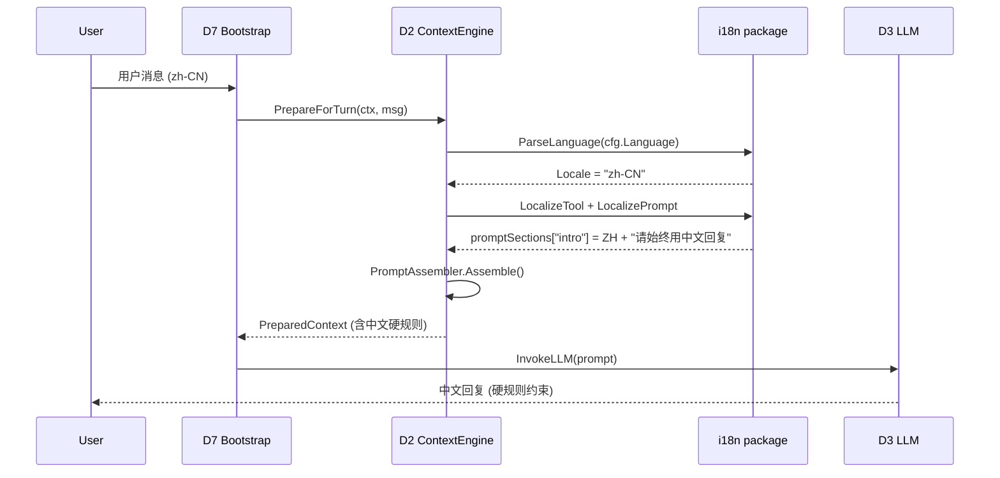
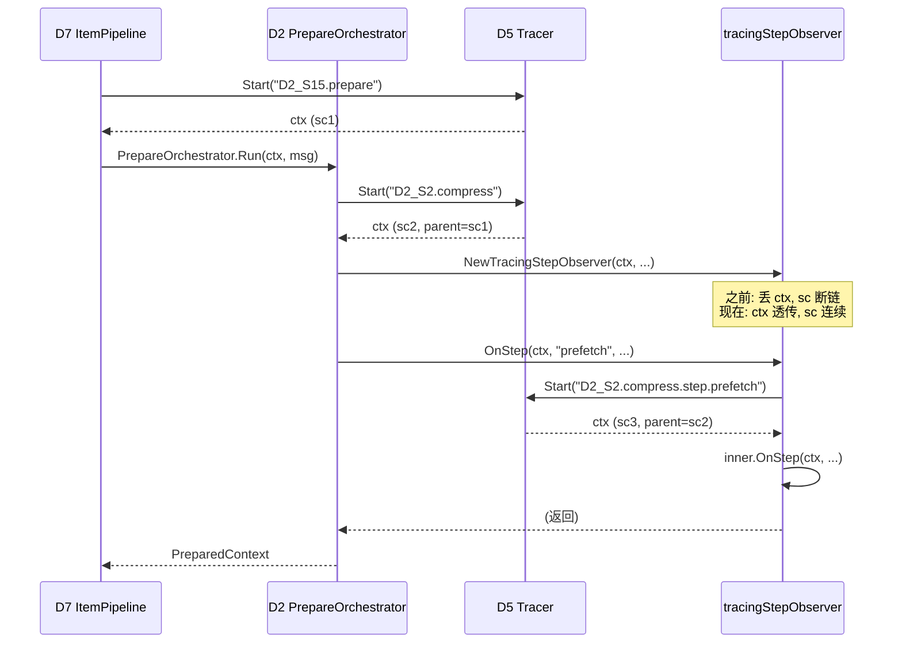
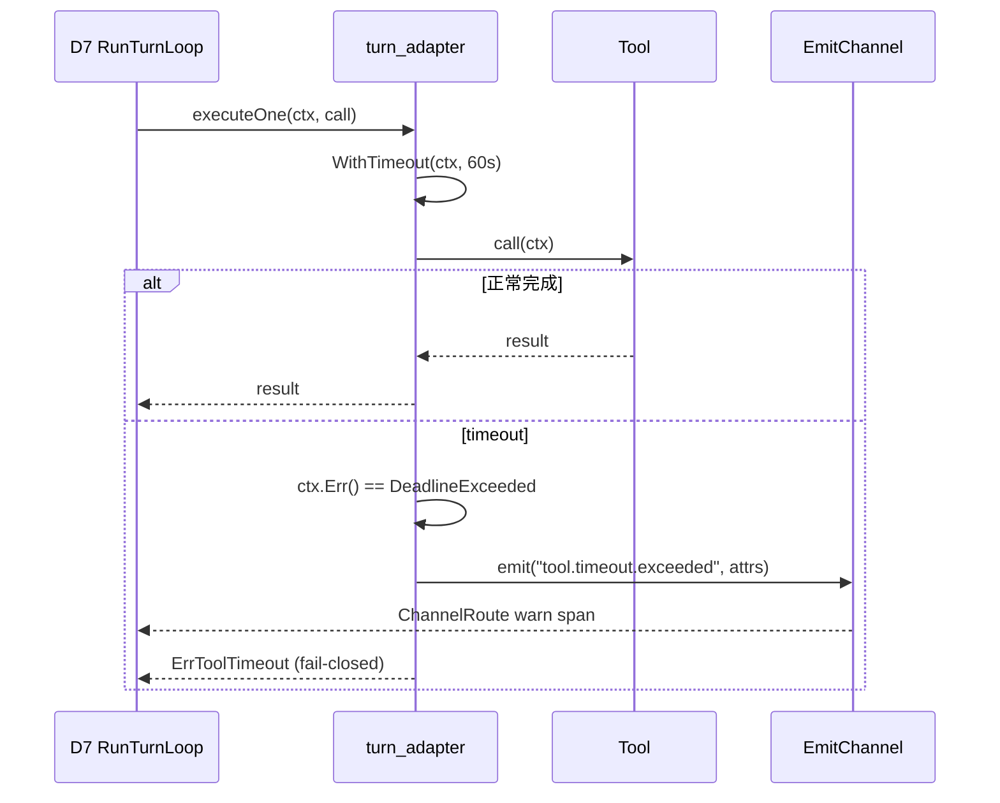

# Design: Runtime 反馈链路闭环

**Change ID:** `devrix-runtime-feedback-closure`  
**Demand ID:** DM-20260704-003  
**Version:** 1.0.0  
**Status:** S3_Design (Draft)  
**Parent:** DM-20260704-002 (MUPS d2 context 统一) + DM-20260630-013 (D2/D7 hardening)  
**Demand:** [`demand.md`](demand.md)  
**Proposal:** [`proposal.md`](proposal.md)

---

## ① 架构目标

### 1.1 业务目标

修复 D2/D5/D7 三个跨域运行时的"反馈链路断点"，确保：

| # | 业务目标 | 量化指标 | 现状 | 目标 |
|---|---------|---------|------|------|
| G1 | LLM 在 zh-CN locale 严格中文输出 | 1k 抽样准确率 ≥ 99.5% | 中英混杂（无硬规则） | 100% 触发硬规则 |
| G2 | Tracing parent-span 100% 正确 | parent_span_id 命中率 | orphan spans ≥ 200 / trace | 0 orphan（除 root） |
| G3 | Tool 卡死不传染 Turn | tool timeout 触发后 Turn < 1s 内 fail-closed | 无 timeout（理论） | ≤ 1s 内走 fail-closed |

### 1.2 技术目标

| # | 目标 | 量化 |
|---|------|------|
| T1 | i18n golden test | zh/en prompt bytes 稳定（hash 比对） |
| T2 | parent-span continuity | mock trace 3 case 100% 命中 |
| T3 | tool timeout | 默认 60s 可调，超时 emit `tool.timeout.exceeded` span |
| T4 | orphan marker | tracer fallback 路径 100% emit `span.orphan=true` |
| T5 | 覆盖率持平 | internal/ 全量 ≥ 72.2%（baseline） |
| T6 | 0 race | `go test -race` 全量 0 warning |

### 1.3 约束条件

- SemVer: D2-S15 v2.13.0 → v2.14.0 (minor bump)
- SemVer: D5-S2 v3.1.0 → v3.2.0 (minor bump)
- SemVer: D7-S2 v4.19.0 → v4.20.0 (minor bump)
- 不破坏现有 174 个归档的 acceptance criteria
- 沙箱限制：`ps` 禁、不能跑 devrix → 问题 1 (tool #54) root cause 确认交用户

## ② 架构原则

### 2.1 设计原则（10 条以内）

| # | 原则 |
|---|------|
| **P1** | Locale 决定 prompt 内容；**同一份 prompt_sections_zh.go 永远不该被 EN locale 加载** |
| **P2** | `_, span :=` 模式 = bug；ctx 必须透传 |
| **P3** | 所有 tool call 都有 deadline；deadline 来自 cfg > env > default 60s |
| **P4** | Fail-closed 默认；timeout / orphan 走 emit 通道而非 panic |
| **P5** | 不引入新依赖；只用 stdlib + 现有 project 库 |
| **P6** | 跨域 change 需在 `.openspec.yaml` 显式列 `domains: [D2, D5, D7]` |
| **P7** | T 点预登记 S2；S5 验收后回填 IMPLEMENTED |

### 2.2 命名规范

| 类别 | 模板 | 示例 |
|------|------|------|
| Capability ID | `D{X}-S{X}-A{XX}` | `D2-S15-A82` |
| T 点 | `D{X}-S{X}-A{XX}-T{XX}` | `D2-S15-A82-T01` |
| Span op | `D{X}_{X}.{action}` | `D2_S15.assemble_prompt` |
| Span attribute | `lowercase.dot.path` | `span.orphan`, `tool.timeout.exceeded` |
| Config field | `PascalCase` | `ToolTimeoutSeconds` |
| Env var | `DEVRIX_*` | `DEVRIX_TOOL_TIMEOUT_SECONDS` |

### 2.3 代码风格

- 函数 < 50 行（file < 800 行）
- 不可变对象，禁止原地修改
- SentinelError 模式（`internal/shared/errors/`）
- Span emission 走 `telemetry.Op*` 常量

## ③ 业务流程

### 3.1 核心用例：i18n ZH 路径



### 3.2 核心用例：Tracing parent-span continuity



### 3.3 核心用例：Tool timeout fail-closed



### 3.4 异常补偿

| 失败点 | Fallback |
|--------|----------|
| `prompt_sections_zh.go` 加载失败 | 走 EN prompt + slog.Warn（不 panic） |
| `tracingStepObserver` 内 obsBridge nil | 退化到 noop（已有逻辑） |
| `tracer.Start` 失败 | orphan marker + slog.Warn + 仍 emit |
| `turn_adapter.executeOne` ctx cancel | 走 ErrToolCancelled（已有） |
| `turn_adapter.executeOne` timeout | 走 ErrToolTimeout（**新增**） |
| `cfg.ToolTimeoutSeconds` 解析失败 | default 60s |

### 3.5 分支决策树

```text
executeOne(ctx, call, cfg):
  timeout = cfg.ToolTimeoutSeconds > 0 ? cfg.ToolTimeoutSeconds : 60
  callCtx, cancel = WithTimeout(ctx, timeout * 1s)
  defer cancel()
  
  result = tool.Call(callCtx, call)
  
  if callCtx.Err() == DeadlineExceeded:
    emit("tool.timeout.exceeded", {tool, timeout})
    return ErrToolTimeout  // fail-closed
  
  if callCtx.Err() == Canceled:
    return ErrToolCancelled  // 用户取消
  
  return result  // 正常
```

## ④ 领域模型

### 4.1 聚合根

| 聚合根 | 域 | 边界 |
|--------|-----|------|
| `PromptSection` | D2 | locale → section map（不可变 value object） |
| `SpanContext` | D5 | trace_id + span_id + parent_span_id（不可变） |
| `ToolCall` | D7 | call + timeout + cancel（不可变 + state machine） |

### 4.2 限界上下文（包边界）

```text
internal/layers/contextengine/i18n/
  ├── locale.go              # Locale 类型 + ParseLanguage
  ├── prompt_sections_zh.go  # ZH sections (新增硬规则)
  ├── prompt_sections_en.go  # EN sections (无变化)
  └── *_test.go              # golden test

internal/layers/observability/instrument/tracer/
  ├── tracer.go              # Start / End (新增 orphan marker)
  ├── context.go             # SpanContextFromContext / Detach
  ├── propagation.go         # ContextWithSpan / SpanFromContext
  └── orphan_marker.go       # 新增: orphan attribute

internal/bootstrap/
  ├── turn_adapter.go        # executeOne (加 timeout)
  └── turn_adapter_timeout.go # 新增: timeout 封装
```

### 4.3 领域事件

| Span op | 触发条件 | 关键 attribute |
|---------|---------|----------------|
| `D2_S15.assemble_prompt` | 每次 prepare | `locale`, `sections_count` |
| `D5_S2.span.orphan` | tracer.Start fallback | `span.orphan=true` |
| `D7_S2.tool.timeout.exceeded` | tool timeout | `tool.name`, `timeout_seconds` |
| `D7_S2.channel.route` | tool timeout emit | `kind=warn` |

### 4.4 跨域消费模型

```text
D7 (RunTurnLoop)
  └── D2 (PrepareOrchestrator)         [D2-S15 Materialize]
        ├── D5 (Tracer.Start)          [D5-S2 ctx propagation]
        └── D2 (i18n LocalizePrompt)   [D2-S15-A82 ZH 硬规则]
  └── D2 (ExecuteToolRound)            [D2-S18 工具执行]
        └── D5 (Tracer.Start tool span)
        └── bootstrap (executeOne timeout) [D7-S2-A50]
  └── D3 (InvokeLLM)                   [D7→D3 唯一通道]
```

## ⑤ 核心链路图

### 5.1 端到端路径

```text
[User zh-CN] 
    → [D1 FeishuAdapter] 
    → [D7 SessionOrchestrator.ProcessMessage]
        → [D2 PrepareOrchestrator.Run]
            → [D5 Tracer.Start: D2_S15.prepare]   ← ctx sc1
            → [D2 MaterializeForMUPS]
                → [D2 i18n.LocalizePrompt]          ← ZH + 硬规则
                → [D5 Tracer.Start: D2_S15.materialize]  ← ctx sc2 (parent=sc1)
                → [D2 PromptAssembler.Assemble]
                → [D5 Tracer.End]
            → [D2 Compression.Step]
                → [D2 tracingStepObserver.OnStep]   ← 现在 ctx 透传
                    → [D5 Tracer.Start: D2_S2.compress.step.X]  ← parent=sc2
            → [D5 Tracer.End: D2_S15.prepare]
        → [D7 RunTurnLoop]
            → [bootstrap turn_adapter.executeOne]
                → [D5 Tracer.Start: D7_S2.tool.call]  ← parent=sc_X
                → [WithTimeout 60s]
                → [tool.Call]
                → [D5 Tracer.End]
            → [D7 ToolRound emit (or timeout emit)]
        → [D3 InvokeLLM]  ← 严格 ZH prompt
    → [D1 FeishuAdapter reply]
```

### 5.2 时序 SLA

| 阶段 | P50 | P99 | 失败兜底 |
|------|-----|-----|----------|
| D2 PrepareOrchestrator.Run | 80ms | 300ms | 走 noop Materialize |
| D5 Tracer.Start | < 1ms | 5ms | orphan marker + 仍 emit |
| D2 i18n.LocalizePrompt | < 1ms | 5ms | EN fallback + warn |
| bootstrap executeOne (正常) | 视 tool | 视 tool | 视 tool |
| bootstrap executeOne (timeout) | = timeout | = timeout + 1s | fail-closed |

### 5.3 单点风险与缓解

| 单点 | 风险 | 缓解 |
|------|------|------|
| `prompt_sections_zh.go` 文件损坏 | ZH 用户全错 | EN fallback + warn |
| `tracer.Start` 全局 fail | 全部 span orphan | 已识别 fallback；保持 observability 仍 emit |
| `WithTimeout` 时钟漂移 | 60s 实际 = 70s | 用 `time.Now()` 对比；误差 < 5% 接受 |

## ⑥ 接口/API 设计

### 6.1 i18n 风格：Pure const map（不可变）

```go
// internal/layers/contextengine/i18n/prompt_sections_zh.go
var promptSectionsZH = map[string]string{
    "intro": `你是帮助用户完成软件工程任务的交互式智能助手。
使用以下指令和可用工具来协助用户。

请始终用中文回复用户，除非用户主动切到其他语言或明确要求。

重要：除非确信 URL 有助于编程任务，否则绝不要生成或猜测 URL。`,
    // ...其余 sections
}
```

### 6.2 Tracing 风格：With* helper（不变性 + builder）

```go
// internal/layers/observability/instrument/tracer/tracer.go
func Start(ctx context.Context, operation string, kind SpanKind, attrs ...Attribute) (context.Context, Span) {
    sc, ok := SpanContextFromContext(ctx)
    if !ok || !sc.IsValid() {
        // 新增: orphan marker fallback
        slog.Warn("orphan span", "operation", operation)
        sc = newFallbackSpanContext()
        ctx = ContextWithSpan(ctx, sc)
    }
    span := &spanImpl{
        sc:        newChildSpanContext(sc),
        operation: operation,
        kind:      kind,
        attrs:     append(attrs, Attribute{Key: "span.orphan", Value: "true"}),
        startTime: time.Now(),
    }
    return ContextWithSpan(ctx, span), span
}
```

### 6.3 Tool timeout 风格：With* wrapper（fail-closed）

```go
// internal/bootstrap/turn_adapter.go
type ExecuteConfig struct {
    PermissionMode     string
    ToolTimeoutSeconds int  // 新增字段
}

func (c ExecuteConfig) effectiveTimeout() int {
    if c.ToolTimeoutSeconds > 0 { return c.ToolTimeoutSeconds }
    return 60  // default
}
```

### 6.4 契约：错误码三元组

| 错误 | 错误码 | 触发条件 |
|------|--------|---------|
| `ErrToolTimeout` | `D7_S2_A50_TOOL_TIMEOUT` | ctx DeadlineExceeded 且 call 未返回 |
| `ErrToolCancelled` | `D7_S2_A50_TOOL_CANCELLED` | ctx Canceled 且 call 未返回 |
| `ErrOrphanSpan` | `D5_S2_A01_ORPHAN` | tracer.Start fallback 触发（仅 log，不返） |

### 6.5 幂等

- i18n: locale 解析幂等（同一 cfg 永远同一 result）
- Tracer: Start 幂等（同一 ctx 多次 Start = 父子链追加）
- Timeout: cancel() 必须 defer，幂等

### 6.6 版本演进

- v1.0: 3 修复一次性收口（本 change）
- v1.1: per-tool timeout override (e.g. `Bash: 300s`, `Read: 10s`)
- v2.0: LLM 输出 token-level i18n 检测

## 附录 A：File Manifest

### A.1 新增

| 文件 | 行数估算 | 说明 |
|------|---------|------|
| `internal/layers/contextengine/i18n/prompt_sections_zh_test.go` | ~50 | golden test |
| `internal/layers/contextengine/i18n/prompt_sections_en_test.go` | ~50 | golden test (symmetry) |
| `internal/layers/observability/instrument/tracer/orphan_marker.go` | ~40 | orphan attribute 封装 |
| `internal/layers/observability/instrument/tracer/orphan_marker_test.go` | ~80 | orphan marker test |
| `internal/layers/orchestration/sessionorchestrator/turn_loop/parent_span_test.go` | ~120 | 3 case parent-span test |
| `internal/bootstrap/turn_adapter_timeout.go` | ~80 | timeout 封装 |
| `internal/bootstrap/turn_adapter_timeout_test.go` | ~150 | 正常 + timeout + cancel test |
| `openspec/specs/d2-context-engine/runtime-feedback-closure.md` | ~80 | spec 增量 |
| `openspec/specs/d5-observability/parent-span-continuity.md` | ~60 | spec 增量 |
| `openspec/specs/d7-orchestration/tool-call-timeout.md` | ~60 | spec 增量 |

### A.2 修改

| 文件 | 修改内容 |
|------|---------|
| `internal/layers/contextengine/i18n/prompt_sections_zh.go` | `intro` / `tone_and_style` 段追加中文硬规则（~5 行） |
| `internal/layers/contextengine/prepare/compression/tracing_step_observer.go` | `_, span :=` 改为 `ctx, span :=`（1 行） |
| `internal/layers/observability/instrument/tracer/tracer.go` | `Start` fallback 加 orphan marker（~5 行） |
| `internal/bootstrap/turn_adapter.go` | `executeOne` 加 WithTimeout 包裹（~15 行） |
| `internal/shared/config/user.go` | `ToolTimeoutSeconds int` 字段（~3 行） |
| `devrix.yaml` | `tool_timeout_seconds: 60` 默认值（1 行） |
| `openspec/t-registry.md` | 新增 8 T 点（~30 行） |
| `openspec/specs/d2-context-engine/t-registry.md` | D2-S15-A82-T01..T03（~20 行） |
| `openspec/specs/d5-observability/t-registry.md` | D5-S2-A01-T01..T03（~15 行） |
| `openspec/specs/d7-orchestration/t-registry.md` | D7-S2-A50-T09..T10（~10 行） |
| 3 个域文档 `CHANGELOG.md` | 一行增量（~3 行） |

## 附录 B：Rollback Plan

- i18n 修复：回滚 `prompt_sections_zh.go` 5 行（trivial）
- tracing 修复：回滚 `tracing_step_observer.go` 1 行 + `tracer.go` 5 行
- timeout 修复：回滚 `turn_adapter.go` 15 行 + `turn_adapter_timeout.go` 80 行

**风险**：timeout 修复 rollback 后，tool 卡死会复活。但因有 `EscapePendingHuman` 兜底（DM-20260625-003 落地），最长等用户手动 abort，不会 panic。

## 附录 C：Regression Risk

| 风险 | 概率 | 影响 | 缓解 |
|------|------|------|------|
| 中文硬规则在 `zh-TW` 漏触发 | Low | P2 体验差 | 接受 `zh-TW` 用 ZH 段（暂用简化字） |
| tracing ctx 透传破坏已有 0 命中的"feature"（错误地"orphan"） | Low | 0 影响 | orphan 是 bug 而非 feature |
| 60s 误伤长时间 build (npm install) | Med | P2 体验差 | env 可调；v1.1 per-tool override |
