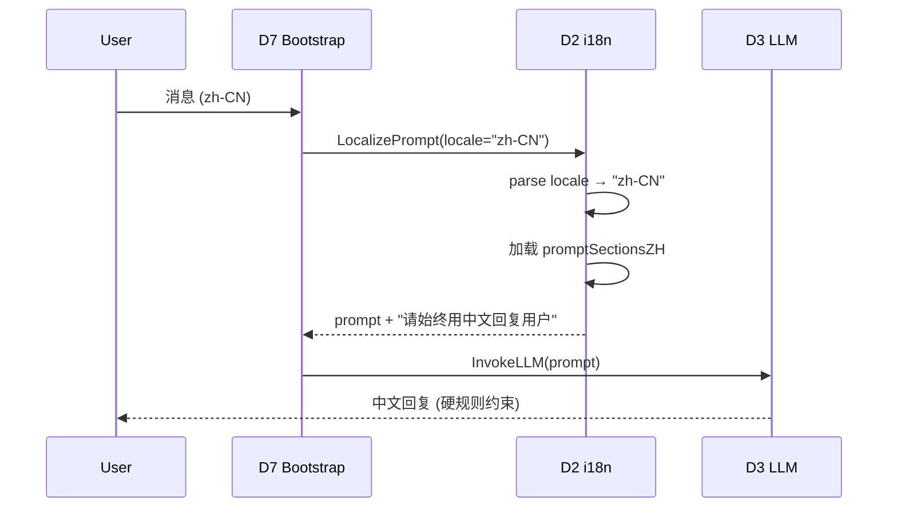
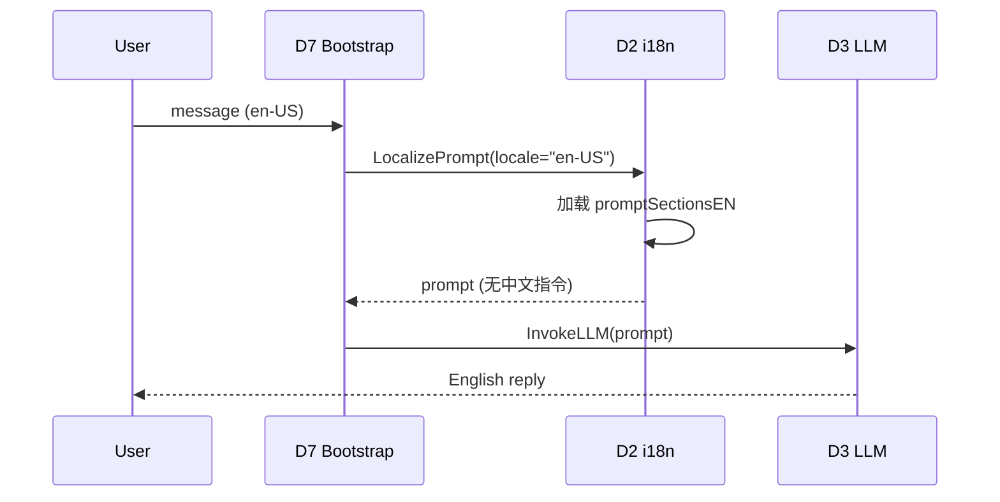

# D2 Runtime Feedback Closure — i18n Locale Gating

**Change:** devrix-runtime-feedback-closure
**Demand:** DM-20260704-003
**Version:** v2.14.0 (D2 contextengine)
**Status:** Draft (S3_Design)

---

## 1. Overview

D2 i18n prompt assembly 增强：locale-gated 中文硬规则，确保 LLM 在 zh-CN locale 严格中文输出。

## 2. Requirement

### R-D2-RFC-01: Locale-Gated Chinese Hard Rule

**Given** `cfg.Language` ∈ {`zh-CN`, `zh-Hans`, `zh`}
**When** D2 PromptAssembler 调用 `i18n.LocalizePrompt`
**Then** `promptSectionsZH["intro"]` 含字符串 `"请始终用中文回复用户"`
**And** `promptSectionsZH["tone_and_style"]` 含 `"可见输出（除代码标识符、文件路径、技术名词外）必须用中文"`

### R-D2-RFC-02: English Locale Symmetry (Negative Test)

**Given** `cfg.Language` = `en-US` (or any non-zh)
**When** D2 PromptAssembler 调用 `i18n.LocalizePrompt`
**Then** `promptSectionsEN["intro"]` **不**含字符串 `"请始终用中文回复"`
**And** `promptSectionsEN["tone_and_style"]` **不**含中文指令

### R-D2-RFC-03: Golden Test Stability

**Given** `prompt_sections_zh.go` / `prompt_sections_en.go` 内容不变
**When** golden test 运行
**Then** SHA256 hash 与 `.golden` 文件一致
**And** 0 字节漂移

## 3. Capability

| Capability | Description | T Points |
|-----------|-------------|----------|
| **D2-S15-A82** | i18n locale-gated 中文硬规则 | T01 (positive) + T02 (negative) + T03 (golden) |

## 4. Scenario

### S-D2-RFC-01: User in zh-CN receives ZH prompt

### S-D2-RFC-02: User in en-US receives EN prompt (no Chinese pollution)

## 5. Linkage

- Upstream: `cfg.Language` from `internal/shared/config/user.go`
- Downstream: D2 PromptAssembler → D7 RunTurnLoop → D3 LLM
- Related: DM-20260607-003 (i18n v2), DM-20260630-012 (format_hints)

## 6. Test Evidence

| T ID | Test File | Verification |
|------|-----------|--------------|
| D2-S15-A82-T01 | `prompt_sections_zh_test.go` | intro 段含硬规则 |
| D2-S15-A82-T02 | `prompt_sections_en_test.go` | intro 段不含中文 |
| D2-S15-A82-T03 | `prompt_sections_{zh,en}_test.go` | SHA256 hash 稳定 |
