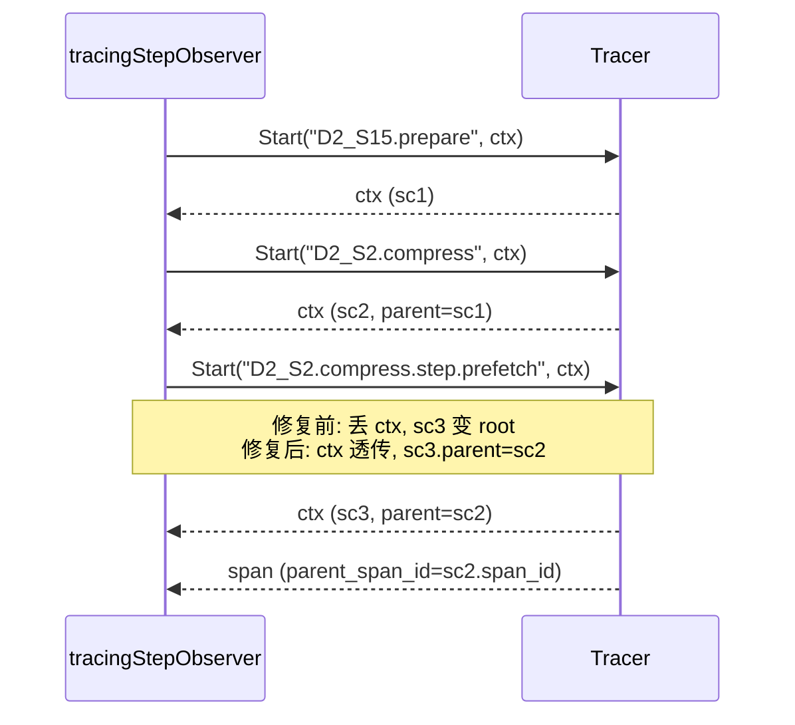
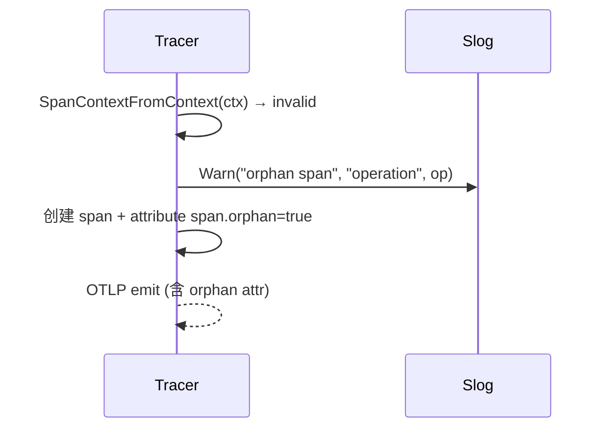

# D5 Parent-Span Continuity — Tracing ctx 透传

**Change:** devrix-runtime-feedback-closure
**Demand:** DM-20260704-003
**Version:** v3.2.0 (D5 observability)
**Status:** Draft (S3_Design)

---

## 1. Overview

D5 tracing ctx 透传：保证 `parent_span_id` 100% 命中，消除 Jaeger orphan spans。

## 2. Requirement

### R-D5-RFC-01: tracingStepObserver OnStep ctx 透传

**Given** `tracingStepObserver.OnStep(ctx, step, before, after)` 被调用
**When** `o.startSpan(ctx, ...)` 返回新 ctx
**Then** 新 ctx 透传给 `o.inner.OnStep(ctx, ...)`
**And** 子 span 的 `parent_span_id` = 父 span_id

### R-D5-RFC-02: Worker Fork Boundary Continuity

**Given** 3 种 trace fork 边界：
- Trace fork（`tracer.Start` 后子 trace）
- Scheduler dispatch（`wavescheduler.Dispatch`）
- Child downlink（`child_downlink.Send`）
**When** 子 span 在 fork 边界后创建
**Then** `parent_span_id` = 父 span_id 100% 命中（3 case 全部 PASS）
**And** `go test -race` 0 race

### R-D5-RFC-03: Orphan Marker (P1)

**Given** `tracer.Start(ctx, op, kind, attrs)` 在 ctx 缺 sc 时调用
**When** fallback 路径触发
**Then** 返回 span 附加 attribute `span.orphan=true`
**And** `slog.Warn("orphan span", "operation", op)` emit
**And** OTLP 出口仍 emit span（不丢弃）

## 3. Capability

| Capability | Description | T Points |
|-----------|-------------|----------|
| **D5-S2-A01** | Tracing ctx 透传 + orphan marker | T01 (ctx 透传) + T02 (3 case continuity) + T03 (orphan marker) |

## 4. Scenario

### S-D5-RFC-01: Compression pipeline parent-span

### S-D5-RFC-02: Orphan marker detection

## 5. Linkage

- Upstream: D2 compression pipeline, D7 orchestrator, D5 Tracer.Start
- Downstream: OTLP exporter → Jaeger
- Related: DM-20260610-005 (W3C Baggage 业务上下文), DM-20260610-007 (token breakdown)

## 6. Test Evidence

| T ID | Test File | Verification |
|------|-----------|--------------|
| D5-S2-A01-T01 | `tracing_step_observer_test.go` (新增 unit test) | ctx 透传 |
| D5-S2-A01-T02 | `parent_span_test.go` (3 case: trace fork / scheduler / child_downlink) | parent_span_id 100% 命中 |
| D5-S2-A01-T03 | `orphan_marker_test.go` | span.orphan=true + slog output |
