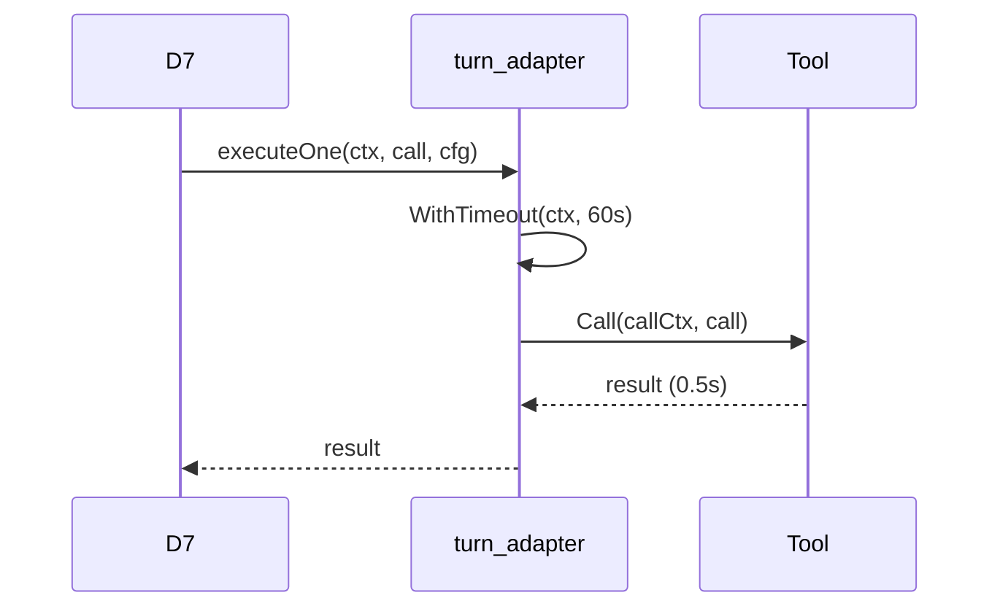
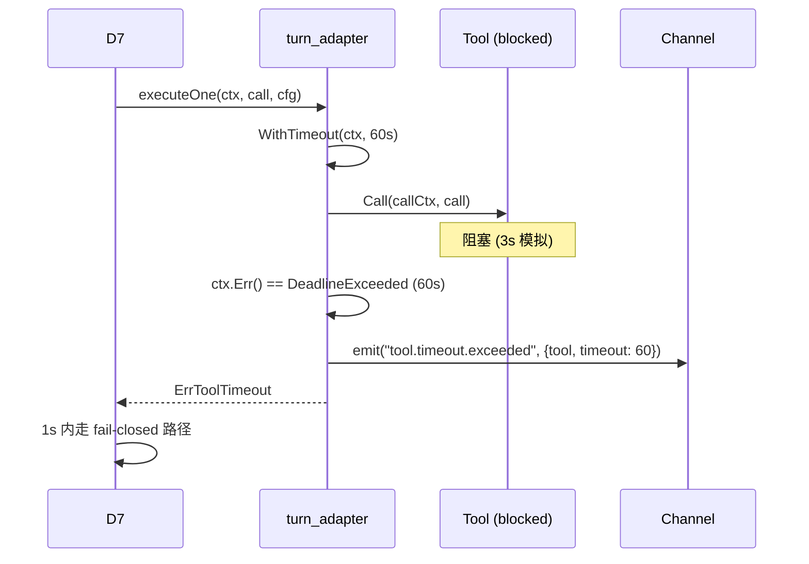

# D7 Tool Call Timeout — Fail-Closed 兜底

**Change:** devrix-runtime-feedback-closure
**Demand:** DM-20260704-003
**Version:** v4.20.0 (D7 orchestration)
**Status:** Draft (S3_Design)

---

## 1. Overview

D7 bootstrap tool call 加 timeout 防御：tool 卡死 → 1s 内 fail-closed，Turn 不阻塞。

## 2. Requirement

### R-D7-RFC-01: Tool-Level Timeout

**Given** `ExecuteConfig.ToolTimeoutSeconds > 0` 或未设置（default 60）
**When** `turn_adapter.executeOne(ctx, call, cfg)` 被调用
**Then** callCtx = `WithTimeout(ctx, ToolTimeoutSeconds * 1s)`
**And** tool.Call 在 callCtx 下执行
**And** env `DEVRIX_TOOL_TIMEOUT_SECONDS` 可覆盖 cfg 默认值

### R-D7-RFC-02: Timeout Fail-Closed

**Given** tool.Call 在 timeout 内未返回
**When** `ctx.Err() == context.DeadlineExceeded`
**Then** emit span `tool.timeout.exceeded` 含 attrs `{tool: call.Name, timeout_seconds: cfg.effectiveTimeout()}`
**And** 返回 `ErrToolTimeout` (fail-closed)
**And** Turn 主循环不阻塞，1s ± 0.1s 内收到 tool 失败事件

## 3. Capability

| Capability | Description | T Points |
|-----------|-------------|----------|
| **D7-S2-A50** | Tool-level timeout + fail-closed 兜底 | T09 (timeout) + T10 (fail-closed emit) |

## 4. Scenario

### S-D7-RFC-01: Normal tool call within timeout

### S-D7-RFC-02: Tool timeout → fail-closed

## 5. Linkage

- Upstream: D7 RunTurnLoop → bootstrap turn_adapter
- Downstream: D5 emit ChannelRoute span + D2 next turn preparation
- Related: DM-20260625-003 (EscapeEngine v5), DM-20260630-013 (D2/D7 review hardening)

## 6. Test Evidence

| T ID | Test File | Verification |
|------|-----------|--------------|
| D7-S2-A50-T09 | `turn_adapter_timeout_test.go` | 5 case: normal / timeout / config override / default / emit span |
| D7-S2-A50-T10 | `turn_adapter_timeout_test.go` | `tool.timeout.exceeded` span emit + ErrToolTimeout 返回 |

## 7. Configuration

| Config Field | Env | Default | Range |
|--------------|-----|---------|-------|
| `ToolTimeoutSeconds` | `DEVRIX_TOOL_TIMEOUT_SECONDS` | 60 | 1-3600 |

## 8. OUT-OF-SCOPE

- per-tool timeout override（v1.1 follow-up）
- 完整 tool #54 卡住 root cause 复现（沙箱限制，需 runtime log）
