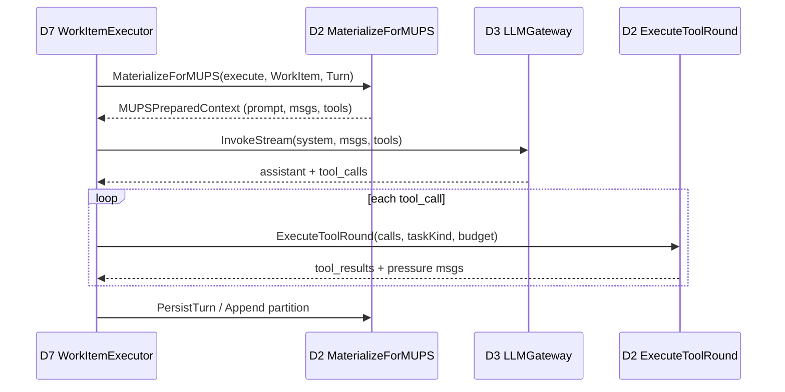

# Design: MUPS 上下文与工具决策 — D2 统一负责架构

**Change ID:** `mups-d2-context-tools-ownership`  
**Demand ID:** DM-20260704-001  
**Version:** 1.0.0  
**Status:** Draft  
**Parent:** `openspec/specs/d2-context-engine/d7-boundary.md` v2.1  
**Supersedes (partial):** DM-20260701-007 Phase B wiring gap（Filter v2 接线）、DM-20260630-011 Materialize 路径工具硬编码

---

## 1. Problem Statement（问题陈述）

### 1.1 当前架构漂移

MUPS v4/v4.3 五/六节点管道已在 D7 `ItemPipelineRunner` 落地，D2↔D7 边界规范（`d7-boundary.md`）明确：

- **D7 Leader**：MUPS 流程、WorkItem 生命周期、LLM 调用（→ D3）
- **D2 Follower**：Prepare / ToolRound / Persist 执行原语

但实际代码存在 **6 处边界违规或未完成的规格落地**：

| # | _gap_ | 设计态（规格） | 实现态（代码） |
|---|------|--------------|--------------|
| G1 | Filter v2 未接线 | `t-registry.md` D2-S15-A02-T02..T05 IMPLEMENTED | `prepare/orchestrator.go` 无 `PerEmissionClassFilter` 调用 |
| G2 | toolsForProfile 硬编码 | ToolSpec v3 + registry ListTools | `compressor.go:105` 硬编码 `read_file`/`grep` |
| G3 | Observe appendix 在 D7 | format_hints / i18n 集中 | `llm_observation_proposer.go:16-31` 本地常量 |
| G4 | Plan appendix 在 D7 | i18n.StrategicPlanAppendix 已存在但未走 Materialize | `strategic_plan_proposer.go:103` D7 拼接 |
| G5 | WithLocatorPhase 未消费 | D7 设置 phase → D2 应按 phase 差异化 | D7 `item_pipeline.go` 设置；D2 不读取 |
| G6 | toolchannel 未集成 | execute-channels.md Phase B | `toolchannel/` 骨架存在；Execute ReAct 未路由 |

### 1.2 后果

1. **工具集不一致** — Materialize 路径返回硬编码 readonly 工具，Prepare 路径返回 permission-filtered 全量；D7 `filterPipelineTools` 再做第三次过滤。
2. **Prompt 不可测试** — Observe/Plan appendix 与 D2 PromptAssembler 分离，无法 golden test 整条 system prompt。
3. **Filter v2 投资浪费** — 19 工具 v3 metadata + 三维 filter 测试全绿，但 MUPS Execute 实际不走该 pipeline。
4. **Probe 终止逻辑悬空** — ToolChannel Bounded(n) + PromptPressure 设计完成，ReAct loop 仍无 channel 路由。

### 1.3 目标态一句话

> **D7 传 MUPS phase + WorkItem 参数；D2 返回完整 PreparedContext（prompt + messages + filtered tools + budget）；D7 只调 D3 LLM 和执行 WorkItem 状态机。**

---

## 2. Architectural Principles（架构原则）

### 2.1 角色 reaffirmation

```text
┌─────────────────────────────────────────────────────────────┐
│ D7 Orchestration (Leader)                                    │
│  • MUPS 节点顺序与 WorkItem 状态机                            │
│  • InvokeLLM → D3（唯一 LLM 调用权）                          │
│  • PlanChannel 执行策略（commit/protocol/scenario/exploration）│
│  • Verify / Learn / Decide Go-only 逻辑                      │
└──────────────────────────┬──────────────────────────────────┘
                           │ MUPSContextRequest
                           ▼
┌─────────────────────────────────────────────────────────────┐
│ D2 Context Engine (Follower)                                 │
│  • MaterializeForMUPS — 唯一 MUPS 上下文出口                  │
│  • Tool Filter Pipeline（7 步，含 Filter v2）                 │
│  • Phase Prompt Registry（observe/plan/execute/rollup_synth）│
│  • Compression + TokenBudget                                 │
│  • ExecuteToolRound + ToolChannel Router（Phase B）          │
└─────────────────────────────────────────────────────────────┘
```

### 2.2 新增硬约束

| # | 约束 | 违反示例 |
|---|------|---------|
| **P1** | D2 拥有 **全部** MUPS context + tools 决策（给定 D7 传入的 phase 参数） | D7 硬编码 tool name 列表 |
| **P2** | D7 **MUST NOT** 为 MUPS 节点组装 system prompt 或 filter tools | `observationTaskAppendixZH` in D7 |
| **P3** | D7 **MUST NOT** import `contextengine/enforce/tools/filter` | D7 直接调 PerEmissionClassFilter |
| **P4** | D2 **MUST NOT** import D7 orchestration 包 | 现有 `d2_thin_test.go` |
| **P5** | D2 **MUST NOT** 调用 D3 LLM | 现有 DM-020 CI 阻断 |
| **P6** | Verify/Learn/Decide **不** 调用 MaterializeForMUPS | 无 LLM → 无 context 组装 |

### 2.3 与现有 PrepareForTurn 的关系

| 入口 | 消费方 | 状态 |
|------|--------|------|
| `PrepareForTurn` | D7 FastPath RunTurn、用户交互 Turn | **保留**，渐进共享 filter pipeline 内部函数 |
| `MaterializeForMUPS` | D7 MUPS ItemPipeline（Observe/Plan/Execute） | **新增**，MUPS 专用 |

两者共享底层：`PromptAssembler`、`filterPipeline()`、`compressMessages()`，但 **MUPS 路径必须走 MaterializeForMUPS**，不允许 D7 绕过。

---

## 3. New D2 API Contract（新 D2 API 契约）

### 3.1 类型定义

```go
// Package: internal/layers/contextengine/materialize
// Contract surface: shared/contracts/mups_context.go (cross-domain export)

type MUPSPhase string

const (
    MUPSPhaseObserve MUPSPhase = "observe"
    MUPSPhasePlan    MUPSPhase = "plan"
    MUPSPhaseExecute MUPSPhase = "execute"
    MUPSPhaseVerify  MUPSPhase = "verify"  // reserved; Materialize rejects
    MUPSPhaseLearn   MUPSPhase = "learn"   // reserved; Materialize rejects
    MUPSPhaseDecide  MUPSPhase = "decide"  // reserved; Materialize rejects
)

// MUPSContextRequest is the sole input D7 sends for MUPS LLM nodes.
type MUPSContextRequest struct {
    Phase        MUPSPhase
    PlanKind     string                    // from WorkItem / Plan (commit, protocol, …)
    TaskKind     string                    // review|edit|test|observe|refactor
    ToolProfile  string                    // readonly|implement|rollup_synth
    AgentProfile string                    // explore|implement|review|worker|delegate|planner|verifier
    WorkItem     *types.WorkItemSnapshot   // directive, scope, deliverable schema, depth
    Turn         *types.TurnContext          // session, messages, token budget, permission mode
    Policy       MaterializePolicy           // compression, workerLocal, locale, …
}

// MUPSPreparedContext is the sole output D7 consumes before LLM invoke.
type MUPSPreparedContext struct {
    SystemPrompt   string
    Messages       []types.Message
    Tools          []ToolDescriptor          // already filtered; empty = no tools
    TokenBudget    TokenBudget
    OutputHints    string                    // deliverable schema + scope_contract tags
    PhaseAppendix  string                    // node-specific instructions (appended to system)
    UserContextPrepend map[string]string     // AGENTS.md prepend (mode=prepend)
    TokenEst       int
    MessageCount   int
}

// IMUPSContextMaterializer is the D2 port D7 depends on.
type IMUPSContextMaterializer interface {
    MaterializeForMUPS(ctx context.Context, req MUPSContextRequest) (MUPSPreparedContext, error)
}
```

### 3.2 接口挂载

```text
contextengine.Engine
    ├── PrepareForTurn(...)           // existing — FastPath
    └── MaterializeForMUPS(...)       // NEW — MUPS path

bootstrap/turn_adapter.go
    └── contextEngineAdapter implements IMUPSContextMaterializer

sessionorchestrator/
    ├── LLMObservationProposer      → MaterializeForMUPS(phase=observe)
    ├── LLMStrategicPlanProposer    → MaterializeForMUPS(phase=plan)
    └── DefaultWorkItemExecutor     → MaterializeForMUPS(phase=execute) per round
```

### 3.3 MaterializeForMUPS 内部流程

```text
MaterializeForMUPS(req)
    │
    ├─ 1. Validate phase ∈ {observe, plan, execute}
    │      verify/learn/decide → return ErrPhaseNotMaterializable
    │
    ├─ 2. Base Prepare (reuse PrepareOrchestrator subset)
    │      A01 Snapshot_Load → A03 Compression_Run → A04 SystemPrompt_Build
    │
    ├─ 3. Phase Prompt Assembly (§5)
    │      baseSystem + PhaseAppendix + OutputHints
    │
    ├─ 4. Message Assembly
    │      observe/plan: directive-only user message
    │      execute: private chain merge + compressMessages
    │
    ├─ 5. Tool Filter Pipeline (§4) — skip when phase ∈ {observe, plan}
    │
    ├─ 6. TokenBudget allocation + TokenEst
    │
    └─ 7. Return MUPSPreparedContext
```

### 3.4 错误语义

| Error | 条件 | D7 处理 |
|-------|------|---------|
| `ErrPhaseNotMaterializable` | phase=verify/learn/decide | 不应调用；programming error |
| `ErrWorkItemRequired` | WorkItem nil on execute | fail WorkItem round |
| `ErrTokenBudgetExceeded` | 压缩后仍超 budget | D7 截断或 escalate |

---

## 4. Tool Filter Pipeline（D2 专属，有序）

### 4.1 Pipeline 顺序

Filter pipeline **MUST** 在 D2 Prepare 路径内按以下顺序执行（不可重排）：

```text
Step 1: ListTools(registry)
           └── ToolRegistry.ListTools(ctx, workDir) → []ToolSchema

Step 2: Permission filter (Ask/Allow/Deny)
           └── enforce.FilterToolsByPermissionMode(mode, tools, planFilePath)

Step 3: AgentRole filter
           └── agentRoleToolFilter.Filter(sessionContext, tools)

Step 4: PerEmissionClassFilter (by MUPSPhase → allowed emission classes)
           └── filter.NewPerEmissionClassFilter(classesForPhase(phase, agentProfile))

Step 5: PerTaskKindFilter (by TaskKind → IterationBound hints)
           └── filter.NewPerTaskKindFilter(taskKind).Apply(specs)

Step 6: ToolProfile filter (readonly / implement / rollup_synth)
           └── profileFilter(profile, specs)

Step 7: Convert to descriptors + i18n localize
           └── ToolDescriptor{Name, Description, Parameters, Spec metadata}
```

**实现位置：** `internal/layers/contextengine/materialize/filter_pipeline.go`

**现有代码复用：**
- Step 1-3：与 `context_engine.go:415-460` / `PrepareOrchestrator` 相同
- Step 4-5：`enforce/tools/filter/per_emission_class.go`, `per_task_kind.go`
- Step 6：替换 `toolsForProfile` 硬编码
- Step 7：`i18n.LocalizeTool`

### 4.2 MUPSPhase → EmissionClass 映射表

| MUPSPhase | 允许 EmissionClass | 允许工具（典型） | Tools 为空？ |
|-----------|-------------------|----------------|-------------|
| **observe** | _(skip pipeline)_ | — | **是** — LLM 仅 JSON 提案，不调工具 |
| **plan** | _(skip pipeline)_ | — | **是** — LLM 仅 strategic plan JSON |
| **execute** + `ToolProfile=implement` | Fact + Action + Probe + Experiment | read_file, grep, edit_file, bash, delegate_* | 否 |
| **execute** + `ToolProfile=readonly` | Fact + Probe | read_file, grep, glob, lsp_* | 否 |
| **execute** + `ToolProfile=rollup_synth` | _(skip — synthesis only)_ | — | **是** — 父节点 rollup 合成 |
| **execute** + `AgentProfile=explore` | Fact + Probe | read_file, grep, glob | 否 |
| **execute** + `AgentProfile=worker` | Fact + Action + Probe | 读写 + bash | 否 |
| **execute** + `AgentProfile=delegate` | Probe + Action | delegate_* | 否 |

Phase→Class 映射函数：

```go
func allowedEmissionClasses(phase MUPSPhase, agentProfile string) []contracts.EmissionClass {
    switch phase {
    case MUPSPhaseObserve, MUPSPhasePlan:
        return nil // no tools
    case MUPSPhaseExecute:
        if classes := filter.AllowedEmissionClassesForAgent(agentProfile); classes != nil {
            return classes
        }
        return nil // all classes
    default:
        return nil
    }
}
```

### 4.3 ToolProfile 过滤规则（Step 6）

| ToolProfile | 行为 | 替换现有 toolsForProfile |
|-------------|------|-------------------------|
| `rollup_synth` | 返回空 tools | ✅ 等价 |
| `readonly` | 仅保留 EC_Fact + EC_Probe 且非 write/bash/delegate | ✅ 替换硬编码 |
| `implement` / `""` | Step 4-5 输出全量保留（再减 interactive blocked） | ✅ 替换 nil fallback |
| _(blocked)_ | 移除 `ask_user_question` 等 MUPS 自动化不可用工具 | 替代 D7 `filterPipelineTools` |

### 4.4 TaskKind → IterationBound 提示（Step 5）

沿用 DM-20260701-007 已登记映射（advisory hints）：

| TaskKind | IterationBound Hint | 影响 |
|----------|---------------------|------|
| review | Bounded(15) | Probe 类工具 hint；OpenEnded 工具保持 OpenEnded（T12 放松） |
| edit | Bounded(10) | 同上 |
| test | Bounded(12) | 同上 |
| observe | OpenEnded | 无收敛压力 |
| refactor | Bounded(8) | 最紧 hint |

TaskKind 来源优先级：
1. D7 显式传入 `MUPSContextRequest.TaskKind`
2. D2 `IntentClassifier` 推断（`prepare/orchestrator.go` 已有路径）
3. 默认 `""` → OpenEnded

### 4.5 WithLocatorPhase 接线

D7 继续设置 `workmodel.WithLocatorPhase(ctx, phase)` 用于 **telemetry / span attributes**。

D2 `MaterializeForMUPS` **不读 ctx locator** — phase 通过 `MUPSContextRequest.Phase` 显式传入（避免隐式 ctx 耦合）。Locator 与 Request.Phase **MUST 一致**（D7 负责）；不一致时 D2 以 Request.Phase 为准并 log warn。

---

## 5. Prompt Assembly by MUPS Phase（按 MUPS 阶段组装 Prompt）

### 5.1 分层结构

```text
Final SystemPrompt =
    Layer 0: PromptAssembler.Build()     // 7 static sections (prompt-system-design.md)
  + Layer 1: Session Context             // existing dynamic blocks
  + Layer 2: OutputHints                 // format_hints.go tags
  + Layer 3: PhaseAppendix               // MUPS phase registry (NEW)
```

### 5.2 Phase Appendix Registry

**位置：** `internal/layers/contextengine/materialize/phase_prompts.go` + `i18n/format_hints_mups.go`

| Phase | PhaseAppendix 内容 | 来源（迁移自） |
|-------|-------------------|--------------|
| **observe** | observation JSON schema；规则：最多 3 条、禁止编造工具输出 | `llm_observation_proposer.go:16-31` → i18n |
| **plan** | strategic plan JSON schema + deliverable_contract 维度 | 已有 `i18n.StrategicPlanAppendix`；D7 停止拼接 |
| **execute** | `WorkItemOutputFormatHints` + WorkItem 实例 `<deliverable_schema>` + `<scope_contract>` | `format_hints.go` + WorkItem snapshot |
| **rollup_synth** | synthesis instructions：合并子 WI 结论、禁止新 tool call | 新增 i18n |

### 5.3 Execute OutputHints 组装

```go
func buildExecuteOutputHints(wi *types.WorkItemSnapshot) string {
    hints := WorkItemOutputFormatHints
    if schema := wi.DeliverableSchema; schema != "" {
        hints += fmt.Sprintf("\n<deliverable_schema>%s</deliverable_schema>", schema)
    }
    if wi.ScopeContract != nil {
        hints += scopeContractBlock(wi.ScopeContract)
    }
    if wi.PriorVerifyReason != "" {
        hints += fmt.Sprintf("\n<prior_verify_reason>%s</prior_verify_reason>", wi.PriorVerifyReason)
    }
    return hints
}
```

### 5.4 D7 删除项

| 文件 | 删除内容 |
|------|---------|
| `llm_observation_proposer.go` | `observationTaskAppendixZH/EN`, `observationTaskAppendix()` |
| `strategic_plan_proposer.go` | `i18n.StrategicPlanAppendix` 拼接逻辑 |
| `workitem_executor.go` | `appendWorkItemFormatHints()` — 改由 D2 OutputHints 承担 |

---

## 6. D7 → D2 Call Matrix（调用矩阵）

| MUPS Node | D7 动作 | D2 调用 | LLM? | Tools? | 备注 |
|-----------|---------|---------|------|--------|------|
| **Observe** (LLM path) | `ObservationProposer.ProposeObservations` | `MaterializeForMUPS(phase=observe)` | **是** | **否** | user payload = directive + structured signals |
| **Observe** (deterministic) | ContextProposer | — | 否 | — | 无 LLM 时不调 D2 |
| **Plan** (LLM path) | `StrategicPlanProposer.ProposeStrategicPlan` | `MaterializeForMUPS(phase=plan)` | **是** | **否** | budget/scope 在 user prompt |
| **Plan** (deterministic) | DefaultDecomposeProposer | — | 否 | — | 结构 fallback |
| **Execute** | `WorkItemExecutor.RunRound` | `MaterializeForMUPS(phase=execute)` **每轮** | **是** | **是** | ReAct loop；private chain append |
| **Execute** (rollup) | parent rollup synth | `MaterializeForMUPS(phase=execute, profile=rollup_synth)` | **是** | **否** | 合成子结论 |
| **Verify** | `VerifyDeliverable` / artifact check | — | 否 | — | Go-only |
| **Learn** | `Learner.Persist` | — | 否 | — | Go-only |
| **Decide** | `SpawnPolicyEvaluator` | — | 否 | — | Go-only |

### 6.1 序列图（Execute 一轮）



---

## 7. ToolRound Integration — Phase B

### 7.1 现状

- D7 `mups/execute/toolchannel/` 定义 `ToolChannel` 接口 + `Router`
- D7 Execute ReAct 经 `turn/orchestrator.go` 调 D2-S18 `ExecuteToolRound`，**无** EmissionClass 路由
- Probe Bounded(n) + PromptPressure 仅在 spec（`execute-channels.md`），未运行时生效

### 7.2 目标

```text
D7 ExecuteToolRound request
    ├── ToolCalls []ToolCall
    ├── TaskKind string          // from WorkItem
    ├── RemainingBudget int      // token / iteration budget
    └── PermissionMode

D2 ExecuteToolRound (extended)
    ├── toolchannel.Router.Route(call) → Fact|Action|Probe|Experiment channel
    ├── channel.Accept / OnResult
    ├── channel.InjectPromptPressure(remaining)
    └── return ToolRoundResult { Results, PressureMessages, ChannelOutcomes }
```

### 7.3 迁移策略

1. **Copy** `toolchannel/` 核心逻辑至 `contextengine/enforce/toolround/`（D2 包）
2. D2-S18 `ExecuteToolRound` 内部实例化 Router
3. D7 `WorkItemExecutor` 删除对 D7 toolchannel 的直接 import
4. Shadow mode：D7 并行跑 old/new router，diff outcomes（1 release）

### 7.4 D7 保留

- **PlanChannel**（`mups/execute/channel.go`）— per-PlanKind 执行策略不变
- **WorkItem 状态机** — spawn/rollup/terminal
- **LLM invoke** — 每轮 ReAct 的 stream 调用

---

## 8. Migration Plan（三阶段迁移）

### Phase A — Wire Filter v2 + MaterializeForMUPS API

**目标：** 新 API 可用；Filter v2 接入；feature flag 控制。

| 任务 | 交付物 |
|------|--------|
| A.1 | `MUPSContextRequest` / `MUPSPreparedContext` 类型 + `IMUPSContextMaterializer` 接口 |
| A.2 | `filter_pipeline.go` — 7 步 pipeline |
| A.3 | `mups_materializer.go` — MaterializeForMUPS 实现 |
| A.4 | `phase_prompts.go` — observe/plan/execute/rollup appendix |
| A.5 | `contextEngineAdapter` 暴露新接口 |
| A.6 | 单元测试：filter pipeline golden + phase prompt snapshot |
| A.7 | Feature flag `d2.mups_materialize.enabled`（默认 false） |

**Quality Gate:** `go test ./internal/layers/contextengine/materialize/...` PASS

### Phase B — Migrate D7 Callers

**目标：** Observe/Plan/Execute 切至 MaterializeForMUPS；ToolRound 集成。

| 任务 | 交付物 |
|------|--------|
| B.1 | `LLMObservationProposer` → MaterializeForMUPS(observe) |
| B.2 | `LLMStrategicPlanProposer` → MaterializeForMUPS(plan) |
| B.3 | `DefaultWorkItemExecutor.prepareContext` → MaterializeForMUPS(execute) |
| B.4 | 删除 D7 对 `ContextPreparer.Prepare` + 手动 appendix 的双轨路径 |
| B.5 | ToolChannel Router → D2-S18（shadow mode） |
| B.6 | 集成测试：item_pipeline_materialize_test 更新 |
| B.7 | Feature flag default **true** |

**Quality Gate:** `go test -race ./internal/layers/orchestration/sessionorchestrator/...` PASS

### Phase C — Remove D7 Dead Code

**目标：** 边界干净；lint  enforced。

| 任务 | 交付物 |
|------|--------|
| C.1 | 删除 `materialize/compressor.go::toolsForProfile` |
| C.2 | 删除 `sessionorchestrator/workitem_tools.go::filterPipelineTools` |
| C.3 | 删除 D7 `llm_observation_proposer.go` appendix 常量 |
| C.4 | 删除 `workitem_executor.go::appendWorkItemFormatHints` |
| C.5 | 删除/归档 D7 `mups/execute/toolchannel/`（逻辑已在 D2） |
| C.6 | 新增 `internal/lint/layer/d7_no_tool_filter_test.go` |
| C.7 | 更新 `openspec/specs/d2-context-engine/d7-boundary.md` §10 |
| C.8 | 移除 feature flag |

**Quality Gate:** 全量 unit + affected integration tests PASS；lint tests PASS

---

## 9. Boundary Enforcement（边界 enforcement）

### 9.1 Import 规则

```text
✅ D7 sessionorchestrator → D2 materialize (IMUPSContextMaterializer)
✅ D7 sessionorchestrator → D2 kernel (PrepareForTurn — FastPath 保留)
✅ D2 enforce/toolround → shared/contracts (ToolSpec, EmissionClass)
❌ D7 sessionorchestrator → D2 enforce/tools/filter
❌ D7 sessionorchestrator → 硬编码 tool names ("read_file", "grep", …)
❌ D2 contextengine → D7 orchestration
❌ D2 contextengine → D3 llmgateway
```

### 9.2 Lint 规则（新增）

**文件：** `internal/lint/layer/d7_no_tool_filter_test.go`

```go
// TestD7SessionOrchestrator_NoToolFilterImport ensures MUPS tool filtering
// stays in D2. D7 MUST NOT import enforce/tools/filter or call filterPipelineTools.
func TestD7SessionOrchestrator_NoToolFilterImport(t *testing.T) {
    forbidden := []string{
        "github.com/devrix/devrix/internal/layers/contextengine/enforce/tools/filter",
    }
    // + grep sessionorchestrator for hardcoded tool name literals in non-_test.go
}
```

**文件：** `internal/lint/layer/d2_thin_test.go`（已有，回归）

### 9.3 CI 门禁

| Check | Phase |
|-------|-------|
| `d2_thin_test` — D2 不 import orchestration | A |
| `d7_no_tool_filter_test` — D7 不 import filter | C |
| `d7_boundary_test` — D1 不直调 D2 | A |
| grep gate: `toolsForProfile` 不存在于 materialize | C |
| grep gate: `filterPipelineTools` 不存在于 sessionorchestrator | C |

### 9.4 OpenSpec 同步（S6 归档前）

| 文档 | 更新 |
|------|------|
| `openspec/specs/d2-context-engine/d7-boundary.md` | 新增 §10 MUPS Context Ownership |
| `openspec/specs/d2-context-engine/t-registry.md` | 登记 D2-S15-A90..A92, D2-S18-A90 T 点 |
| `openspec/specs/d7-orchestration/t-registry.md` | 登记 D7-S2-A90..A91 T 点 |

---

## 10. L5 Test Points（T 层测试点）

### 10.1 新增 T 点注册表

| T ID | L5 | S/A | 描述 | Priority | Phase |
|------|-----|-----|------|----------|-------|
| **D2-S15-A90-T01** | L5-D2-MUPS-01 | S15-A90 | `MaterializeForMUPS(observe)` → Tools 空 + PhaseAppendix 含 obs schema | P0 | A |
| **D2-S15-A90-T02** | L5-D2-MUPS-02 | S15-A90 | `MaterializeForMUPS(plan)` → Tools 空 + StrategicPlan appendix | P0 | A |
| **D2-S15-A90-T03** | L5-D2-MUPS-03 | S15-A90 | `MaterializeForMUPS(execute, implement)` → tools ⊇ read_file 且 ⊇ edit_file | P0 | A |
| **D2-S15-A90-T04** | L5-D2-MUPS-03 | S15-A90 | `MaterializeForMUPS(execute, readonly)` → 无 write/bash/delegate | P0 | A |
| **D2-S15-A90-T05** | L5-D2-MUPS-03 | S15-A90 | `MaterializeForMUPS(execute, rollup_synth)` → Tools 空 | P0 | A |
| **D2-S15-A90-T06** | L5-D2-MUPS-01 | S15-A90 | verify/learn/decide phase → `ErrPhaseNotMaterializable` | P0 | A |
| **D2-S15-A91-T01** | L5-D2-MUPS-03 | S15-A91 | Filter pipeline Step 4: execute+explore → 仅 Fact+Probe | P0 | A |
| **D2-S15-A91-T02** | L5-D2-MUPS-03 | S15-A91 | Filter pipeline Step 5: task_kind=review → Bounded(15) hint on bash | P0 | A |
| **D2-S15-A91-T03** | L5-D2-MUPS-03 | S15-A91 | Filter pipeline Step 6: profile=readonly 移除 ask_user_question | P0 | A |
| **D2-S15-A91-T04** | L5-D2-MUPS-03 | S15-A91 | Pipeline 顺序 invariant：permission 先于 emission class | P0 | A |
| **D2-S15-A92-T01** | L5-D2-MUPS-02 | S15-A92 | Phase appendix zh/en parity（observe + plan） | P0 | A |
| **D2-S15-A92-T02** | L5-D2-MUPS-03 | S15-A92 | Execute OutputHints 含 WorkItem deliverable_schema | P0 | A |
| **D2-S18-A90-T01** | L5-D2-MUPS-05 | S18-A90 | Probe channel iter≥bound → pressure message 注入 | P1 | B |
| **D2-S18-A90-T02** | L5-D2-MUPS-05 | S18-A90 | ToolRound Router 按 EmissionClass 分发 4 channel | P1 | B |
| **D7-S2-A90-T01** | L5-D2-MUPS-02 | S2-A90 | LLMObservationProposer 无本地 appendix 常量 | P0 | B |
| **D7-S2-A90-T02** | L5-D2-MUPS-02 | S2-A90 | LLMStrategicPlanProposer 无 appendix 拼接 | P0 | B |
| **D7-S2-A90-T03** | L5-D2-MUPS-03 | S2-A90 | WorkItemExecutor.prepareContext 仅走 MaterializeForMUPS | P0 | B |
| **D7-S2-A91-T01** | L5-D2-MUPS-04 | S2-A91 | `d7_no_tool_filter_test` CI PASS | P0 | C |
| **D7-S2-A91-T02** | L5-D2-MUPS-04 | S2-A91 | grep: 无 `toolsForProfile` / `filterPipelineTools` 于目标包 | P0 | C |

### 10.2 L5 Given-When-Then 摘要

**L5-D2-MUPS-01**
- GIVEN phase=observe
- WHEN MaterializeForMUPS
- THEN Tools=[] AND PhaseAppendix contains `obs_fact|obs_signal|obs_uncertainty|obs_deviation`

**L5-D2-MUPS-02**
- GIVEN phase=plan, locale=zh
- WHEN MaterializeForMUPS
- THEN SystemPrompt contains deliverable_contract dimensions AND D7 proposer has zero appendix constants

**L5-D2-MUPS-03**
- GIVEN phase=execute, taskKind=review, toolProfile=implement
- WHEN filter pipeline runs
- THEN output tools all have ToolSpec v3 metadata AND emission class ∈ allowed set

**L5-D2-MUPS-04**
- GIVEN sessionorchestrator production packages
- WHEN static import analysis
- THEN enforce/tools/filter not imported

**L5-D2-MUPS-05** (Phase B)
- GIVEN Probe tool call iter=16, taskKind=review, bound=15
- WHEN D2 ExecuteToolRound
- THEN synthesize pressure message injected AND no hard reject (T09 advisory)

### 10.3 测试文件布局

| T ID | Test 位置 |
|------|-----------|
| D2-S15-A90-T01..T06 | `materialize/mups_materializer_test.go` |
| D2-S15-A91-T01..T04 | `materialize/filter_pipeline_test.go` |
| D2-S15-A92-T01..T02 | `materialize/phase_prompts_test.go` |
| D2-S18-A90-T01..T02 | `enforce/toolround/channel_router_test.go` |
| D7-S2-A90-T01..T03 | `sessionorchestrator/item_pipeline_materialize_test.go` |
| D7-S2-A91-T01 | `internal/lint/layer/d7_no_tool_filter_test.go` |
| D7-S2-A91-T02 | `internal/lint/layer/d7_no_tool_filter_test.go` |

---

## Appendix A: 文件变更清单

| 路径 | Phase | 动作 |
|------|-------|------|
| `contextengine/materialize/mups_materializer.go` | A | 新增 |
| `contextengine/materialize/filter_pipeline.go` | A | 新增 |
| `contextengine/materialize/phase_prompts.go` | A | 新增 |
| `contextengine/i18n/format_hints_mups.go` | A | 新增 |
| `shared/contracts/mups_context.go` | A | 新增 |
| `bootstrap/turn_adapter.go` | A | 扩展 |
| `sessionorchestrator/llm_observation_proposer.go` | B | 简化 |
| `sessionorchestrator/strategic_plan_proposer.go` | B | 简化 |
| `sessionorchestrator/workitem_executor.go` | B | 简化 |
| `contextengine/enforce/toolround/` | B | 新增（自 toolchannel 迁移） |
| `materialize/compressor.go` | C | 删除 toolsForProfile |
| `sessionorchestrator/workitem_tools.go` | C | 删除 |
| `mups/execute/toolchannel/` | C | 删除或 thin wrapper |
| `internal/lint/layer/d7_no_tool_filter_test.go` | C | 新增 |

## Appendix B: 与 execute-channels.md 关系

| execute-channels 条目 | 本 change 处置 |
|----------------------|--------------|
| D7-EXEC-CH-1 ToolChannel 接口 | Phase B 迁至 D2-S18 |
| ProbeToolChannel Bounded(n) | D2 ExecuteToolRound 内执行 |
| PromptPressure 三档 | D2 channel.InjectPromptPressure |
| PlanChannel (per-PlanKind) | **不变**，留 D7 |

## Appendix C: 决策记录

| ID | 决策 | 理由 |
|----|------|------|
| ADR-MUPS-D2-01 | Phase 显式传参而非读 ctx locator | 避免隐式耦合；ctx locator 仅 telemetry |
| ADR-MUPS-D2-02 | 新 API 而非扩展 PrepareForTurn | MUPS 需 WorkItem snapshot + phase appendix；Turn Prepare 语义不同 |
| ADR-MUPS-D2-03 | ToolChannel 迁 D2 而非 D7 调 D2 filter | 终止/probe 是 tool 执行机制，属 S18 |
| ADR-MUPS-D2-04 | 三阶段迁移 + feature flag | 降低 Execute 回归风险 |
