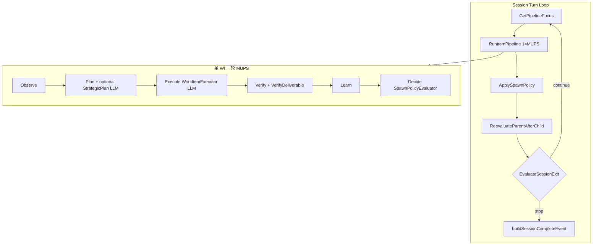
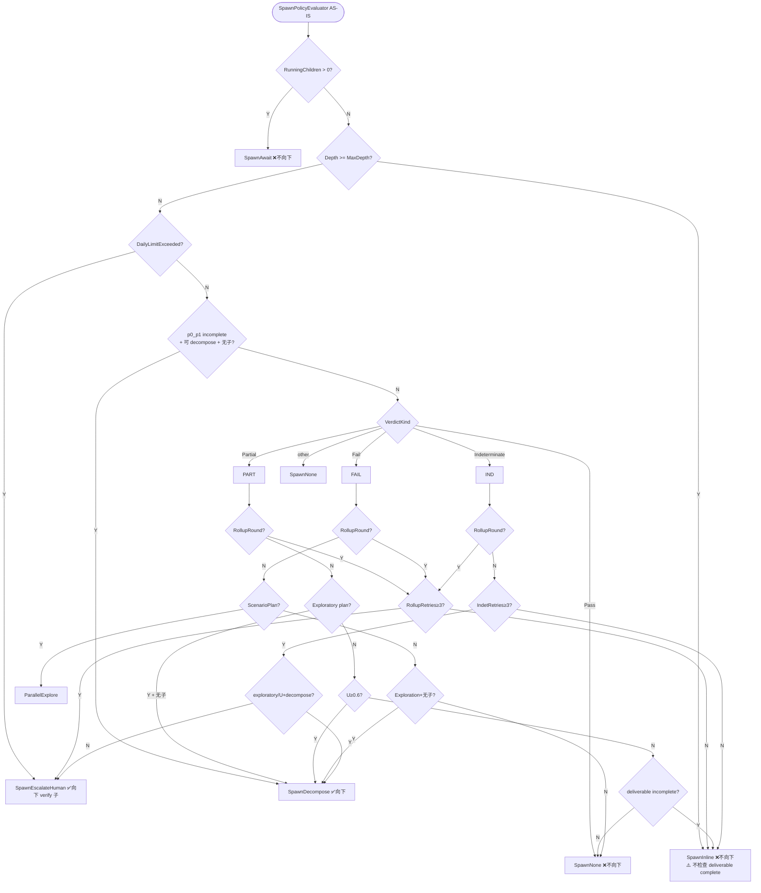
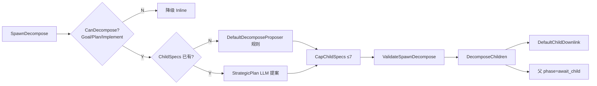
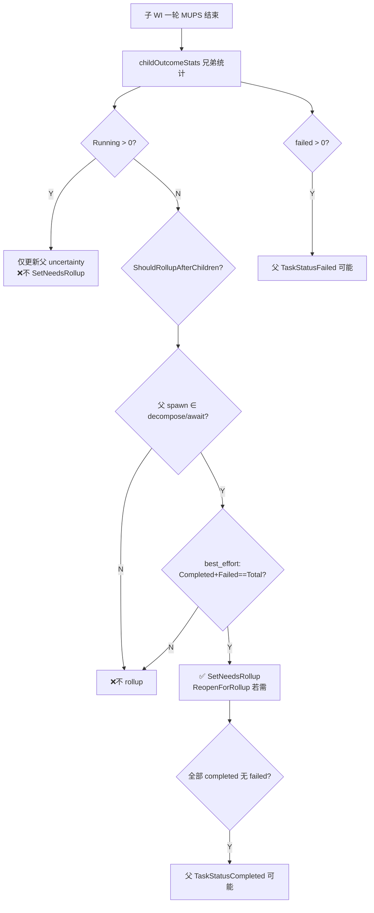
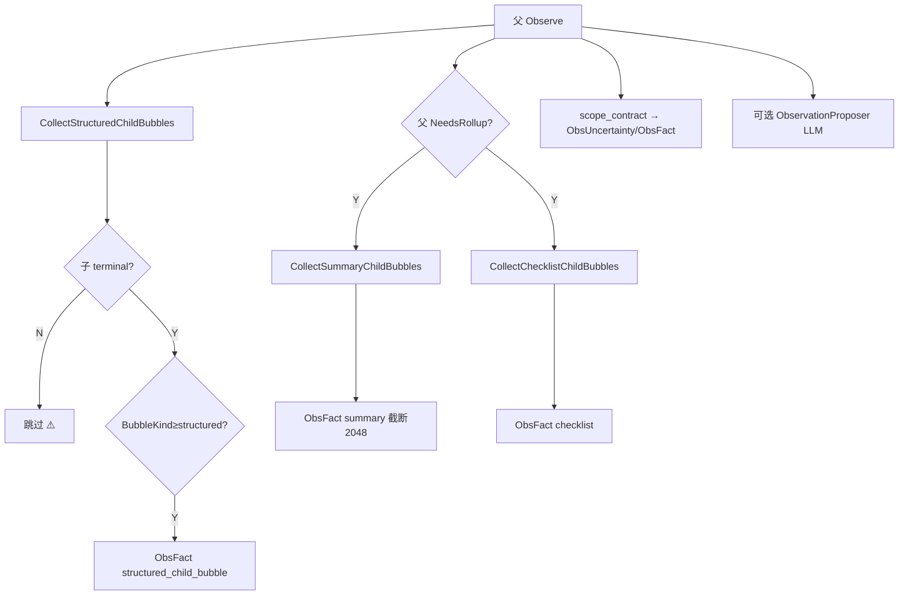
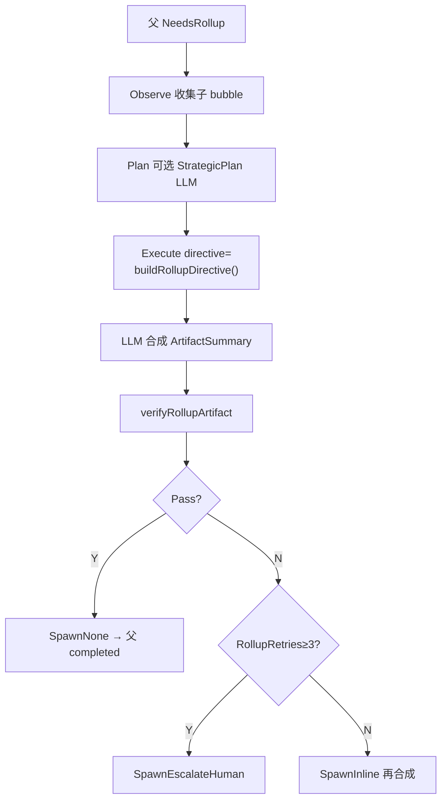
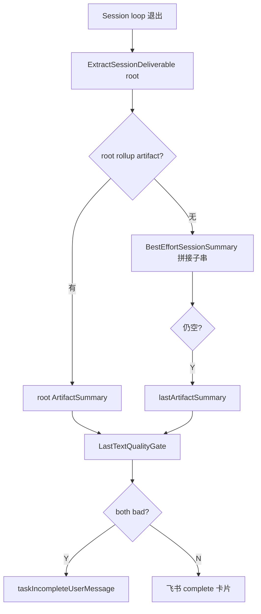
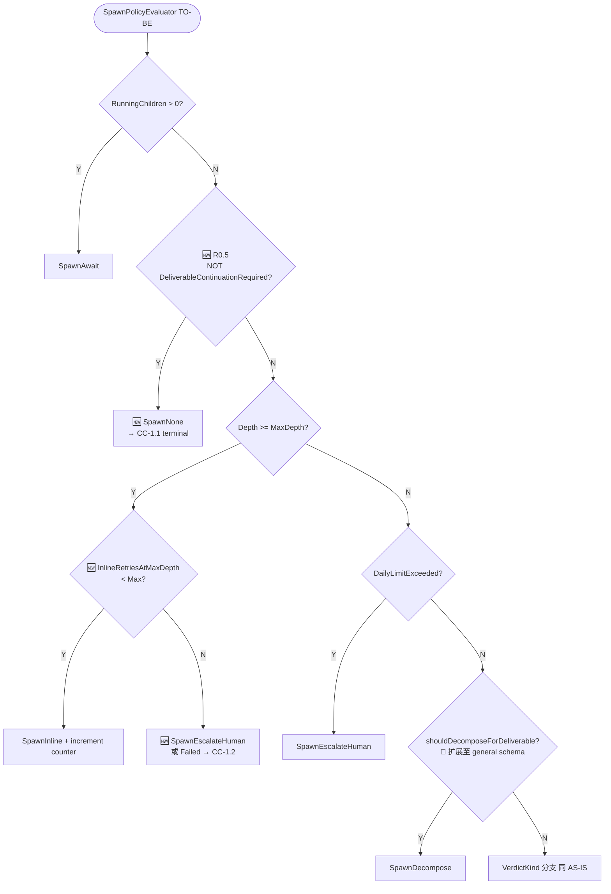
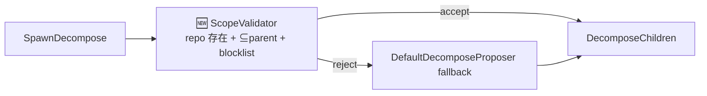
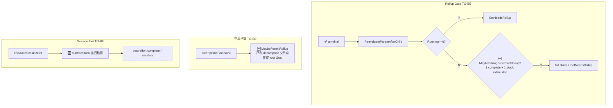

# Design: D7 收敛契约 — 向下传播 & 向上反馈决策树

**Change ID:** `d7-convergence-contract`  
**Status:** Draft  
**Audience:** D7 编排 / Review / 集成测试  
**代码锚点:** `workmodel/spawn_policy.go`, `rollup_gate.go`, `resolve.go`, `sessionorchestrator/item_pipeline.go`, `item_observe.go`

---

## §0 术语

| 术语 | 含义 |
|------|------|
| **向下传播** | 创建子 WorkItem（SpawnDecompose / SpawnEscalateHuman）或传递 scope/downlink |
| **向上反馈** | 子 WI terminal 后，bubble/rollup/stats 向父 WI 及 root 汇总 |
| **Terminal** | `TaskStatus ∈ {completed, failed, cancelled}` |
| **Continuation** | `DeliverableContinuationRequired(round)==true`（deliverable schema 适用且 status≠complete） |
| **Rollup** | 父 WI `NeedsRollup=true` 时 Execute 读子结果合成 artifact |

---

## §CC-1 收敛契约（Invariants）

以下 invariant **必须**在任意拓扑下成立（Phase 1 起强制）：

### CC-1.1 Round Terminalization

```
IF NOT DeliverableContinuationRequired(round)
THEN SpawnPolicy MUST BE SpawnNone
 AND ApplyRoundTerminalization MUST set TaskStatus terminal (per StatusAfterSpawnNone)
```

### CC-1.2 Max-Depth Inline Budget

```
IF Depth >= MaxDepth AND DeliverableContinuationRequired(round)
THEN SpawnInline ONLY WHILE InlineRetriesAtMaxDepth < MaxInlineRetriesAtMaxDepth
ELSE SpawnEscalateHuman OR TaskStatusFailed (best-effort rollup path)
```

### CC-1.3 Rollup Gate

```
IF parent.LastRound.SpawnPolicy ∈ {decompose, await}
 AND ∀ direct non-checklist children: TaskStatus terminal
THEN SetNeedsRollup(parent) AND parent MUST run ≥1 rollup MUPS round
```

### CC-1.4 Child Bubble Eligibility

```
IF child TaskStatus terminal AND ContextBubbleKind >= structured
THEN child MUST appear in parent's next Observe (structured_child_bubble)
```

### CC-1.5 Session Complete

```
IF root TaskStatus terminal OR !HasOpenWork(session)
THEN buildSessionCompleteEvent MUST use ExtractSessionDeliverable(root)
     before BestEffortSessionSummary before taskIncompleteUserMessage
```

---

## §1 总览：Session 与 MUPS 两层循环



**LLM 参与点：** StrategicPlan（Plan）、Execute（叶子/rollup）、可选 ObservationProposer（Observe）。  
**规则裁决点：** SpawnPolicy、Decompose 创建、Rollup 门禁、Session 退出、Quality Gate。

---

## §2 向下传播 — 当前实现决策树（AS-IS）

### 2.1 会不会创建子 WI？（SpawnPolicyEvaluator）

> 文件：`workmodel/spawn_policy.go`  
> 输入：Verify 后 `round` + `DefaultTreeEvalContext`



**AS-IS 向下传播触发汇总：**

| ID | 条件 | 结果 |
|----|------|------|
| RD | p0_p1 incomplete, depth<max, 无 running/已有子, 非 rollup | Decompose |
| R5 | partial, U≥0.6, depth<max | Decompose |
| R5-explore | partial, exploratory, 无子 | Decompose |
| R6-explore-fail | fail, ExplorationPlan, 无子 | Decompose |
| R7-exhaust | indeterminate≥3, exploratory/U, 无子 | Decompose |
| R2/R7-esc | daily limit / rollup·indet 耗尽 | EscalateHuman → verify 子 |

### 2.2 Decompose 落地链（ChildSpecs 来源）



**LLM 在 Plan 阶段输出（若 wired）：**

- `execution_mode=decompose`
- `child_specs[].scope_in / directive / expected_return`
- `deliverable_schema`（只能 narrow）
- `scope_contract`（Goal 可覆盖；Implement+downlink 受 PR #379 保护）

**规则校验（AS-IS）：** depth≤3, children≤7, daily≤5, scope⊆parent；**无 repo 路径存在性检查**。

### 2.3 向下传播 ≠ Inline / Await

| SpawnPolicy | 新建子 WI | 同一 WI 重跑 |
|-------------|-----------|--------------|
| Decompose | ✅ | — |
| EscalateHuman | ✅ verify | — |
| Await | — | 父等待 |
| Inline | — | ✅ 下一轮 MUPS |
| None | — | terminal 化（仅 none 路径） |

---

## §3 向上反馈 — 当前实现决策树（AS-IS）

向上分 **四条通道**，不要混谈。

### 3.1 通道 B：Rollup 门禁（纯规则，不看 LLM）

**触发：** 子 WI 每轮结束后 `ReevaluateParentAfterChild(sessionID, childID)`



**硬条件：** 子 WI 必须 **TaskStatus terminal**；deliverable complete 但 in_progress **不算**。

### 3.2 通道 A：Child Bubble → 父 Observe（规则格式化）

**触发：** 父 WI **下一次** MUPS 的 Observe（`item_observe.go`）



**Structured bubble 携带（来自子 LastRound，非 LLM 生成）：** verdict, plan_id, uncertainty, spawn, findings_count, deliverable=incomplete。

### 3.3 通道 C：Rollup Execute — LLM 总结收敛

**前置：** 父 `NeedsRollup=true` 且被 focus。



**buildRollupDirective 段落（规则组装 → LLM 读）：**

| 段落 | 内容 |
|------|------|
| ParentGoal | 父 title/directive |
| ChildOutcomes | terminal 子 structured bubble |
| FailedSubset | fail/partial 子 + reason |
| UncertainChildren | U≥0.6 terminal 子 |
| ExpectedReturn | deliverable_schema tag |

Rollup Execute **max ReAct = 2**（硬编码）。

### 3.4 通道 D：Session Complete



### 3.5 AS-IS 向上收敛全链（理想 vs 断裂）

**理想：**

```
子 LLM Execute → Verify deliverable=complete
  → SpawnNone → child completed
    → 父 NeedsRollup → 父 LLM Rollup → 父 completed
      → … → root → ExtractSessionDeliverable → 飞书
```

**断裂（sess_1783064119386_3000）：**

```
depth=3 → R1 SpawnInline（即使 deliverable=complete）
  → child in_progress 永不 terminal
    → stats.Running>0 → 父 await_child 永不开 rollup
      → Session 无限 MUPS
```

---

## §4 目标实现决策树（TO-BE）— 标注变更

### 4.1 SpawnPolicyEvaluator TO-BE



**变更摘要：**

| 分支 | AS-IS | TO-BE |
|------|-------|-------|
| deliverable complete @ any depth | R1 → Inline | **R0.5 → None → terminal** |
| deliverable incomplete @ max depth | Inline 无限 | **Inline 有预算 → escalate/fail** |
| decompose schema | 仅 p0_p1 | **registered schema 通用** |

### 4.2 Decompose 落地 TO-BE



### 4.3 向上反馈 TO-BE



### 4.4 AS-IS vs TO-BE 对照表

| 场景 | AS-IS 行为 | TO-BE 行为 |
|------|-----------|-----------|
| leaf deliverable=complete, depth=3 | SpawnInline, in_progress, 继续 MUPS | SpawnNone, completed, 触发父 rollup |
| leaf deliverable incomplete, depth=3, 21 轮 | 无限 Inline | 3 轮后 escalate/fail → 父 best-effort rollup |
| LLM scope 幻觉双兄弟 | 均 in_progress, 父永久 await | Validator 拒幻觉 / 单 child；stuck 有界 |
| 4 层中间 implement 父卡住 | root-only MaybeDecomposeParentRollup 无效 | MaybeParentRollup 任意层 |
| 孙子 inline stuck, 中间 await_child | sessionNoForwardProgress=false | subtreeStuck → 退出或 best-effort |

---

## §5 LLM 反馈 → 规则动作映射表

### 5.1 向下：LLM 输出如何影响传播

| LLM 输出（Plan/Execute） | 规则消费点 | 可能向下结果 |
|--------------------------|-----------|--------------|
| Strategic `child_specs[]` | ScopeValidator → DecomposeChildren | 创建 N 子 WI |
| Strategic `execution_mode=decompose` | Spawn 已是 Decompose 时落地 | 同上 |
| Strategic `scope_contract` | applyStrategicScope | 收窄父/子 scope |
| Execute artifact 正文 | VerifyDeliverable | incomplete→Decompose/Inline；complete→**TO-BE: None** |
| Execute 无 P0/file:line | deliverable incomplete | Decompose（根）或 Inline（叶） |

### 5.2 向上：LLM 输出如何触发总结

| 前置条件（规则） | LLM 输入 | LLM 输出 | 向上结果 |
|------------------|----------|----------|----------|
| 子 terminal + structured bubble | — | — | 父 Observe 收到 ObsFact |
| 父 NeedsRollup + 子全 terminal | buildRollupDirective | rollup ArtifactSummary | 父 artifact → 祖父 rollup |
| root 有 rollup artifact | — | — | ExtractSessionDeliverable → 飞书 |
| root 无 rollup | BestEffortSessionSummary（规则拼接） | — | 飞书（质量 gate 可能 task_incomplete） |

**关键：** LLM **从不**直接 SetNeedsRollup 或 DecomposeChildren；必须先过 Verify + SpawnPolicy。

---

## §6 集成测试矩阵（Review 必跑）

| ID | 拓扑 | 断言 |
|----|------|------|
| T1 | leaf@maxDepth, deliverable=complete | SpawnNone, completed, 不再 focus |
| T2 | leaf@maxDepth, incomplete×4 | 第 4 次 escalate/fail |
| T3 | 4层 + 2兄弟, 1 complete 1 stuck | parent rollup ≤ N 轮; session complete |
| T4 | 4层 decompose chain | 逐层 NeedsRollup → root deliverable |
| T5 | LLM 幻觉 scope | Validator reject → fallback |
| T6 | rollup fail×3 | human_review |
| T7 | review d2 kernel E2E | 非 task_incomplete |

---

## §7 硬编码常量一览（设计参考）

| 常量 | 值 | 用途 | TO-BE 可配置? |
|------|-----|------|---------------|
| DefaultMaxDecomposeDepth | 3 | R1 触顶 | Session 级 |
| DefaultMaxChildren | 7 | decompose 上限 | 是 |
| DefaultUncertaintyDecomposeThreshold | 0.6 | R5 decompose | 是 |
| DefaultMaxIndeterminateRetries | 3 | R7 | 是 |
| DefaultMaxRollupRetries | 3 | rollup inline | 是 |
| MaxInlineRetriesAtMaxDepth | 3 🆕 | R1 inline | 是 |
| RollupGatePolicy | best_effort | rollup 门禁 | WorkItem/Session |
| DefaultShareSummaryMaxTokens | 2048 | bubble 截断 | 否（Phase 1） |
| kindFocusPriority | Verify>Implement>… | focus 选择 | 否 |

---

## §8 与现有 OpenSpec 关系

- **父文档：** `openspec/specs/d7-orchestration/pipeline-architecture.md` §4 RunSessionTurnLoop
- **本 change 归档后：** 在 pipeline-architecture 增加 §4.x Convergence Contract 引用本 design
- **Delta spec：** `specs/d7-orchestration_convergence_delta.md`

---

## §9 Review Checklist（机制 Review 必查）

在批准实现前，确认决策树每条路径：

- [ ] deliverable complete 是否 **必经** SpawnNone → terminal？
- [ ] max depth incomplete 是否有 **retry 上限**？
- [ ] decompose ChildSpecs 是否 **经 ScopeValidator**？
- [ ] 子 terminal 是否 **必经** ReevaluateParent → NeedsRollup（当兄弟全 terminal）？
- [ ] rollup 是否 **仅** 在 NeedsRollup 时 LLM 合成？
- [ ] session complete 是否 **优先** root rollup deliverable？
- [ ] 集成测试 T3 是否覆盖 **4层+并行兄弟**？

---

*End of design.md*
