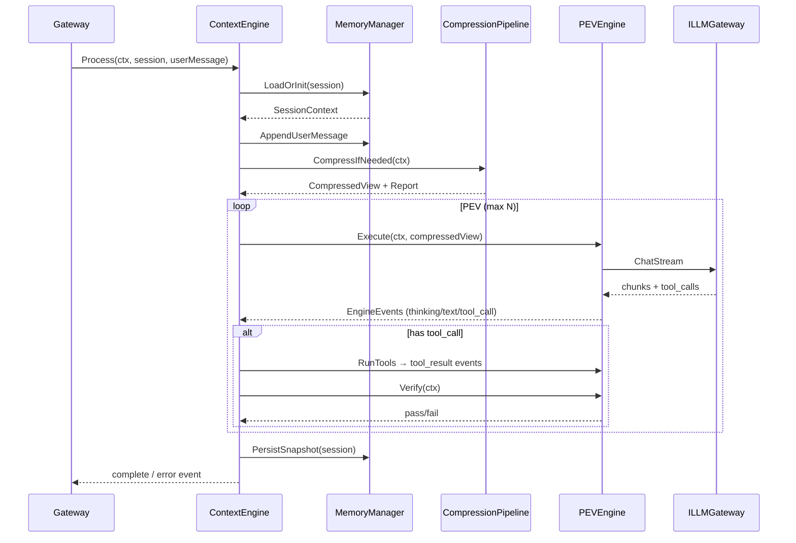

# Context Engine Layer Design (Layer 2)

**Change ID:** devrix-context-engine
**Layer:** 2 - Context Engine
**Status:** Draft
**Version:** 1.0
**Based on:** `docs/context-engine-design.md`, `docs/detail design framework.md`, `openspec/specs/context_engine_layer_delta.md`, 通信层 design §四流映射

> **文档分工：** 评审与 onboarding 读 `docs/context-engine-design.md`（六段式）；开发与任务拆解读本文档 + `tasks.md`；验收读 `specs/context-engine/spec.md` + L5 注册表。

---

## 一、架构目标

### 1.1 业务目标

| 业务目标 | 量化指标 | V1 |
|---------|---------|-----|
| **对话连续性** | 会话重启可恢复最近 N 轮上下文 | ✅ ContextSnapshot |
| **Token 可控** | 超长对话压缩后 ≤ 预算的 95% | ✅ 步骤 1-5, 7 |
| **任务执行闭环** | 工具调用后经 Verify 再回复用户 | ✅ 简化 PEV |
| **四流协同** | 事件流/任务流/信息流由引擎产出 | ✅ EngineEvent |
| **可测试** | 核心路径单元测试 + L5 验收 | ✅ 设计预留 |

### 1.2 层间边界

```
Communication (L1)          Context Engine (L2)           Downstream
─────────────────          ───────────────────           ──────────
Gateway.RouteInbound  ──▶  ContextEngine.Process()
                           ├─ MemoryManager
                           ├─ CompressionPipeline
                           └─ PEVEngine
                                    │
                                    ├──▶ ILLMGateway (L3)
                                    ├──▶ IToolRunner (L4)
                                    └──▶ IObserver (L5)
◀── EngineEvent chan ────  (thinking/text/tool_call/...)
```

**禁止：**
- ContextEngine 不得 import `adapters/` 或 `gateway` 具体实现（仅接口）
- 通信层不得直接操作消息历史（只通过 `IContextEngine`）

### 1.3 与现有代码对齐

当前契约（已实现）：

```go
// internal/layers/communication/gateway/gateway.go
type IContextEngine interface {
    Process(ctx context.Context, session *types.Session, message string) <-chan *EngineEvent
}

type EngineEvent struct {
    Type      string            // thinking | text | tool_call | tool_result | permission | status | complete | error | milestone_progress | info
    Content   string
    ToolName  string
    ToolInput string
    SessionID string
    Metadata  map[string]string
}
```

`Session.ContextSnapshot []byte` 已预留，本设计定义 **v1 JSON 快照格式**。

---

## 二、领域模型

### 2.1 核心实体

```go
// internal/shared/types/context.go (新增)

// ContextSnapshotVersion 快照格式版本
const ContextSnapshotVersion = "ctx-v1"

// SessionContext 会话级上下文（聚合根，引擎内部）
type SessionContext struct {
    SessionID       string
    WorkDir         string
    Model           string
    Messages        []Message          // 完整历史（压缩前）
    CompressedView  []Message          // 发给 LLM 的视图
    PEVState        PEVState
    TokenBudget     TokenBudget
    SystemPrompt    string
    MilestoneRefs   []string           // V3: 关联 milestone IDs
    UpdatedAt       time.Time
}

// PEVState PEV 循环状态
type PEVState struct {
    Phase         PEVPhase  // plan | execute | verify | done
    Iteration     int
    MaxIterations int       // V1 默认 3
    LastToolCalls []ToolCallRecord
    VerifyResult  *VerifyResult
}

type PEVPhase string
const (
    PEVPhaseExecute PEVPhase = "execute"
    PEVPhaseVerify  PEVPhase = "verify"
    PEVPhaseDone    PEVPhase = "done"
    // PEVPhasePlan — V3 + Milestone DAG
)

// TokenBudget Token 预算
type TokenBudget struct {
    MaxContextTokens   int  // 默认 128000
    ReservedOutput     int  // 默认 8192
    ToolResultBudget   int  // 步骤1，默认 800 tokens/条
    CompressionTarget  int  // 触发压缩阈值 = Max - Reserved - 10%
}

// CompressionReport 单次压缩报告（可观测）
type CompressionReport struct {
    OriginalTokens   int
    CompressedTokens int
    StepsApplied     []string
    Truncated        bool
}
```

### 2.2 值对象

| 值对象 | 说明 | 不可变 |
|--------|------|--------|
| `Message` | 已有 `types.Message`，复用 Role/Content | ✅ |
| `ToolCallRecord` | toolName, input, output, riskLevel | ✅ |
| `VerifyResult` | passed, deviation, commands | ✅ |
| `CompressionStepResult` | stepName, tokensBefore, tokensAfter | ✅ |

### 2.3 与 Session 的关系

```
Session (通信层聚合根)
  └── ContextSnapshot []byte  ← 序列化的 SessionContext（精简版）
ContextEngine 持有内存中的 SessionContext map[sessionID]
```

恢复流程：`GetSession` → 若 `ContextSnapshot` 非空 → 反序列化 → 继续对话。

---

## 三、ContextEngine 核心设计

### 3.1 组件结构

```
ContextEngine
├── MemoryManager        // 分层记忆读写
├── CompressionPipeline  // 七步压缩
├── PEVEngine            // Execute / Verify 循环
├── PromptLoader         // System prompt（AGENTS.md / 配置）
├── TokenCounter         // cl100k_base 或 gateway 委托
└── SnapshotStore        // ContextSnapshot 读写
```

### 3.2 Process 主流程



### 3.3 接口定义

```go
// internal/layers/contextengine/engine.go

type ContextEngine struct {
    memory      MemoryManager
    compression CompressionPipeline
    pev         PEVEngine
    llm         ILLMGateway
    tools       IToolRunner
    observer    IObserver
    cfg         *config.ContextEngineConfig
}

func NewContextEngine(deps EngineDeps) *ContextEngine

// 实现 gateway.IContextEngine
func (e *ContextEngine) Process(ctx context.Context, session *types.Session, message string) <-chan *gateway.EngineEvent
```

```go
// internal/layers/contextengine/contracts.go

type ILLMGateway interface {
    ChatStream(ctx context.Context, req *LLMRequest) (<-chan LLMChunk, error)
}

type IToolRunner interface {
    Execute(ctx context.Context, call ToolCall) (*ToolResult, error)
}

type IObserver interface {
    EmitContextCompressed(report CompressionReport)
    EmitPEVPhase(sessionID string, phase PEVPhase, iteration int)
}
```

---

## 四、PEV Engine 设计

### 4.1 V1 简化模型（无 Plan 阶段）

```
用户消息
  → Execute: 调用 LLM（带 tools schema）
  → 若 LLM 返回 tool_calls:
       → 权限由通信层 PermissionManager 处理（已有）
       → IToolRunner 执行
       → Verify: 运行轻量检查（V1: 仅检查结果非空 / 无 error）
       → 若 fail 且 iteration < max: 再 Execute
  → 输出最终 text + complete
```

### 4.2 V3 扩展（Plan + Milestone）

```
Plan: 解析用户意图 → 生成/更新 Milestone DAG（对接 milestone.Service）
Execute / Verify: 按 milestone 顺序执行（对接 TaskFlow）
EngineEvent.milestone_progress 由 PEV 在 milestone 状态变更时发出
```

### 4.3 Verify 策略（可配置）

| 级别 | 行为 | 版本 |
|------|------|------|
| `none` | 跳过 Verify | V1 默认 |
| `basic` | tool result 无 error | V1 可选 |
| `commands` | 运行配置的 verify 命令（如 `go test ./...`） | V2+ |

---

## 五、七步压缩管道

### 5.1 管道架构

```go
// internal/layers/contextengine/compression/pipeline.go

type CompressionPipeline interface {
    Run(ctx context.Context, input CompressionInput) (CompressionOutput, error)
}

type Step interface {
    Name() string
    Apply(ctx context.Context, msgs []types.Message, budget TokenBudget) ([]types.Message, error)
}
```

执行顺序（与 delta spec 一致）：

```
messages
  → [1] ToolResultBudget   // 每条 tool result 截断
  → [2] Snip               // 从旧到新删除整段 message
  → [3] Microcompact       // 同 role 相邻合并
  → [4] ContextCollapse    // 折叠琐碎往返（启发式）
  → [5] SystemPromptAssembly
  → [6] Autocompact        // V2: LLM 摘要，V1 skip
  → [7] TokenBlock         // 仍超限 → ContextExceededError
  → compressed_messages
```

### 5.2 各步骤参数（V1 默认）

| 步骤 | 参数 | 默认 |
|------|------|------|
| ToolResultBudget | maxTokensPerResult | 800 |
| Snip | minMessagesKeep | 4（首尾各保留 2 轮） |
| Microcompact | separator | `\n---\n` |
| ContextCollapse | minContentLength | 20 字符以下可折叠 |
| SystemPromptAssembly | position | index 0 |
| TokenBlock | — | 抛 `CTX_EXCEEDED_4001` |

### 5.3 触发条件

```go
if tokenCounter.Count(messages) > budget.CompressionTarget {
    pipeline.Run(...)
}
```

每次压缩写入 `IObserver.EmitContextCompressed` 供 Observability 层消费。

---

## 六、分层记忆

### 6.1 三层模型

| 层级 | 名称 | 存储 | 生命周期 | V1 |
|------|------|------|----------|-----|
| L1 | Working Memory | 进程内 `map` | 单次 `Process` 调用 | ✅ |
| L2 | Short-Term Memory | 内存 + `ContextSnapshot` 文件 | Session | ✅ |
| L3 | Long-Term Memory | SQLite `~/.devrix/memory.db` | 跨 Session | ❌ V3 |

### 6.2 Working Memory

```go
type WorkingMemory struct {
    ActiveTools   []string
    CurrentPEV    PEVState
    StreamBuffer  strings.Builder  // 流式聚合
}
```

不持久化；`Process` 结束时丢弃。

### 6.3 Short-Term Memory

```go
type ShortTermMemory struct {
    Messages      []types.Message
    Milestones    []*types.Milestone  // V3 对接
    Budget        TokenBudget
    Metadata      map[string]string
}
```

持久化路径：
- `Session.ContextSnapshot`（随 Session Store 写入）
- 冗余备份：`~/.devrix/context/{sessionId}.json`（可选，配置开启）

### 6.4 Long-Term Memory（V3 占位）

```go
func (m *LongTermMemory) Recall(query string) ([]MemoryEntry, error) {
    return nil, errors.NewFeatureNotImplemented("long-term memory", "v3")
}
```

---

## 七、配置设计

### 7.1 新增配置块（devrix.yaml）

```yaml
context_engine:
  max_context_tokens: 128000
  reserved_output_tokens: 8192
  tool_result_budget: 800
  compression_enabled: true
  pev:
    max_iterations: 3
    verify_mode: "basic"   # none | basic | commands
  snapshot:
    enabled: true
    backup_dir: "~/.devrix/context"
  system_prompt:
    sources:
      - "AGENTS.md"
      - ".devrix/AGENTS.md"
    fallback: "You are Devrix, a multi-agent development assistant."
```

### 7.2 Go 配置类型

```
internal/shared/config/contextengine.go
  ContextEngineConfig
  PEVConfig
  SnapshotConfig
```

---

## 八、错误处理

| 错误码 | 名称 | 场景 |
|--------|------|------|
| CTX_EXCEEDED_4001 | ContextExceeded | TokenBlock 仍超限 |
| CTX_SNAPSHOT_4002 | SnapshotCorrupt | 快照反序列化失败 |
| CTX_PEV_4003 | PEVMaxIterations | PEV 超过最大轮次 |
| CTX_LLM_4004 | LLMUnavailable | Gateway 熔断 |
| CTX_MEMORY_4005 | FeatureNotImplemented | L3 长期记忆 V3 |

错误通过 `EngineEvent{Type:"error", Metadata: {code, recoverable}}` 回传通信层。

---

## 九、项目结构

```
devrix/
├── internal/
│   ├── layers/
│   │   └── contextengine/
│   │       ├── engine.go              # ContextEngine, Process
│   │       ├── contracts.go           # ILLMGateway, IToolRunner, IObserver
│   │       ├── memory/
│   │       │   ├── manager.go
│   │       │   ├── working.go
│   │       │   ├── shortterm.go
│   │       │   └── longterm_stub.go   # V3
│   │       ├── compression/
│   │       │   ├── pipeline.go
│   │       │   └── steps/
│   │       │       ├── tool_result_budget.go
│   │       │       ├── snip.go
│   │       │       ├── microcompact.go
│   │       │       ├── collapse.go
│   │       │       ├── assembly.go
│   │       │       ├── autocompact_stub.go
│   │       │       └── token_block.go
│   │       ├── pev/
│   │       │   ├── engine.go
│   │       │   ├── execute.go
│   │       │   └── verify.go
│   │       ├── prompt/
│   │       │   └── loader.go
│   │       ├── token/
│   │       │   └── counter.go
│   │       └── snapshot/
│   │           └── store.go
│   └── shared/
│       ├── types/
│       │   └── context.go             # SessionContext, PEVState, ...
│       ├── config/
│       │   └── contextengine.go
│       └── errors/
│           └── context.go
├── tests/
│   ├── integration/
│   │   └── context_gateway_flow_test.go
│   └── acceptance/p0/
│       └── ctx_compression_test.go
```

---

## 十、版本分期

### V1（本变更实现目标）

| 能力 | 说明 |
|------|------|
| ContextEngine 替换 Stub | main.go 注入 |
| 压缩 1-5, 7 | 完整管道 |
| PEV Execute→Verify | 简化版 |
| Working + ShortTerm | 快照持久化 |
| Token 计数 | 本地 counter |

### V2

| 能力 | 说明 |
|------|------|
| Autocompact（步骤 6） | 调用 LLM 生成摘要 |
| Verify commands 模式 | 配置化验证命令 |
| 与 Observability 深度集成 | trace span per step |

### V3

| 能力 | 说明 |
|------|------|
| PEV Plan 阶段 | 对接 Milestone DAG |
| Long-Term Memory | SQLite + 向量检索（可选） |
| 跨会话项目记忆 | 按 workDir 聚合 |

---

## 十一、测试策略与 L5 映射

| L5 ID | 描述 | 优先级 | 测试层级 |
|-------|------|--------|----------|
| L5-CTX-01 | 新会话初始化上下文 | P0 | unit |
| L5-CTX-02 | 用户消息后历史追加 | P0 | unit |
| L5-CTX-03 | 超预算触发压缩 | P0 | unit + acceptance |
| L5-CTX-04 | TokenBlock 超限报错 | P0 | unit |
| L5-CTX-05 | 快照保存与恢复 | P0 | integration |
| L5-CTX-06 | PEV Execute 调用 LLM | P0 | integration (mock LLM) |
| L5-CTX-07 | 工具调用后 Verify | P1 | integration |
| L5-CTX-08 | Autocompact 跳过（V1） | P1 | unit |
| L5-CTX-09 | Gateway 四流事件完整 | P0 | integration |
| L5-CTX-10 | L3 记忆访问返回 NotImplemented | P2 | unit |

测试遵守 `openspec/specs/testing-framework/spec.md`：
- 单元测试：`internal/layers/contextengine/**/*_test.go`
- 集成：`tests/integration/` + `//go:build integration`
- 验收：`tests/acceptance/p0/` + `// Covers: L5-CTX-*`

---

## 十二、依赖与集成计划

### 12.1 与通信层（已完成接口）

`main.go` 替换：

```go
// Before
contextEngine := gateway.NewStubContextEngine()

// After
contextEngine := contextengine.NewContextEngine(contextengine.EngineDeps{
    LLM:      llmGateway,      // 可先 stub
    Tools:    toolRunner,      // 可先 stub
    Observer: metricsBridge,
    Config:   cfg.ContextEngine,
})
```

### 12.2 与 LLM Gateway（Layer 3）

上下文引擎只依赖 `ILLMGateway.ChatStream`，不感知具体模型。LLM 层可并行开发，V1 使用 `MockLLMGateway` 完成上下文引擎测试。

### 12.3 与 Multi-Agent（Layer 4）

`IToolRunner` 由 Multi-Agent 层实现；V1 可提供 `NoOpToolRunner`（返回 "not implemented"）使纯对话路径先通。

### 12.4 与 Milestone/TaskFlow（通信层 V3）

V3 在 PEV Plan 阶段调用 `milestone.Service` 创建 DAG，通过 `EngineEvent.milestone_progress` 回传通信层 UI 组件。

---

## 十三、开放问题

| # | 问题 | 建议 | 决策人 |
|---|------|------|--------|
| 1 | Token 计数实现位置 | V1 内置 `token/counter.go`，L3 可统一 | 架构 |
| 2 | System Prompt 加载优先级 | AGENTS.md > .devrix > fallback | 产品 |
| 3 | 快照是否加密 | V1 明文 JSON，V2 可选 AES | 安全 |
| 4 | 压缩是否异步 | V1 同步（<100ms 目标），V2 可考虑后台 | 性能 |

---

## 十四、参考文档索引

| 文档 | 路径 | 用途 |
|------|------|------|
| **详细设计（六段式）** | `docs/context-engine-design.md` | ①~⑥ 架构目标/原则/流程/模型/链路/接口 |
| 设计框架模板 | `docs/detail design framework.md` | 模块设计模板 |
| 文档索引 | `docs/README.md` | docs ↔ OpenSpec 映射 |
| Context Engine Delta | `openspec/specs/context_engine_layer_delta.md` | 层能力 SoT |
| 通信层设计（四流/PEV 映射） | `openspec/archive/devrix-foundation/specs/communication/design.md` | L1 集成 |
| 测试框架规约 | `openspec/specs/testing-framework/spec.md` | L5 / 测试目录 |
| 现有引擎契约 | `internal/layers/communication/gateway/gateway.go` | IContextEngine |
| 行业参考 | `dev-brain/openspec/.../context-engine/design.md` | 记忆/压缩模式 |
