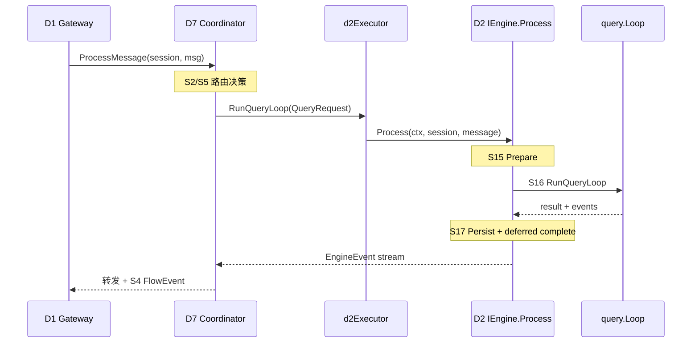

# D2 Context Engine — S 层重构 Design

**Change ID:** devrix-d2-sa-refine
**Demand ID:** DM-20260614-009
**阶段:** S3 Design
**版本:** v1.0
**状态:** Approved — S3-Gate + D7 边界 §12

---

## 1. 概述

### 1.1 设计目标

| 目标 | 描述 |
|------|------|
| S 切法 | 按执行生命周期（准备→执行→持久化），非按 Go 包 |
| Legacy 双轨 | S1–S14 冻结；S15–S20 Canonical |
| D2 Thin | QueryLoop 纯机制；Hooks/Queue 由 D7 注入 |
| 边界 | Out of Scope 清单可执行追踪 |

### 1.2 版本范围

| 版本 | 范围 |
|------|------|
| v1.0 | Registry + Gherkin + Legacy 映射表 |
| v1.1 | Span canonical 名 + `loop` 无 D4 import 测试 |
| v2.0 | 物理迁移 + tasks/delegate 移除 |

---

## 2. Decision 记录

### Decision: S 切法

| 方案 | 优点 | 缺点 |
|------|------|------|
| A: 执行生命周期 S15–S20 | 对齐 North Star；与 D1/D7 切法 A 一致 | 双轨表 |
| B: 保留 module S 微调 | 改动小 | 不解决 P1/P2 |

**选择:** A  
**理由:** Playbook 原则 1 — 先问可验证承诺，再问模块怎么拆  
**影响:** layering + registries；v1.0 无代码

### Decision: S 编号

| 方案 | 选择 | 理由 |
|------|------|------|
| 复用 S10 语义扩展 | 拒绝 | 污染已有 T |
| 新号段 S15–S20 | **采用** | 与 D1 S13–S18 模式一致 |
| 重编 S2–S13 | 拒绝 | BREAKING T |

### Decision: D2-S11 Queue 归属

| 方案 | 选择 | 理由 |
|------|------|------|
| 保留 D2 Canonical | 拒绝 | delegate-progress 是 D7 Flow 机制 |
| Legacy S11 + Canonical → D7-S4 | **采用** | 跨域 Decision |

### Decision: LoopHooks 归属

| 方案 | 选择 | 理由 |
|------|------|------|
| D2 内建编排 Hook | 拒绝 | 违反 D2 Thin |
| D7 注入 LoopHooks | **采用** | Follower 只执行回调，不定义编排策略 |

---

## 3. S 层定义（Canonical）

### D2-S15: PrepareExecutionContext

| 属性 | 值 |
|------|---|
| North Star | Turn 开始前上下文可用、合法、在预算内 |
| 触发 | `IEngine.Process` 收到 D7 调用 |
| 涉及 Legacy | S2, S3, S4, S7, S13 |
| 涉及 A | LoadSession, RepairToolChain, CompressIfNeeded, AssemblePrompt |

**Gherkin:**

```gherkin
# <!-- T: D2-S15-A01-T01 -->
Scenario: 新会话初始化空历史
  Given session without ContextSnapshot
  When PrepareExecutionContext runs
  Then working memory is empty
  And system prompt is loaded

# <!-- T: D2-S15-A02-T01 -->
Scenario: 损坏快照降级为空上下文
  Given invalid ContextSnapshot bytes
  When LoadSession runs
  Then fresh SessionContext is created
  And info event describes reset

# <!-- T: D2-S15-A03-T01 -->
Scenario: RepairToolChain 在 LLM 前执行
  Given orphan tool_result in messages
  When PrepareExecutionContext completes
  Then API messages have valid tool_call_id pairs
```

### D2-S16: RunQueryLoop

| 属性 | 值 |
|------|---|
| North Star | LLM↔Tool 多轮直到完成或 max_turns |
| 触发 | Prepare 完成 |
| 涉及 Legacy | S10 核心 |
| 涉及 A | RunQueryLoop |
| **禁止** | import D4；Task 写模型变更 |

**Gherkin:**

```gherkin
# <!-- T: D2-S16-A01-T01 --> (maps D2-S10-A01-T34)
Scenario: Multi-turn tool loop until final text
  Given query_loop.enabled=true
  When RunQueryLoop executes
  Then loop continues until no pending tool calls
  And TurnCount reflects rounds executed

# <!-- T: D2-S16-A01-T02 -->
Scenario: Context cancel stops loop without panic
  Given RunQueryLoop in progress
  When parent context is cancelled
  Then event emission stops
  And no panic occurs

# <!-- T: D2-S16-A01-T03 -->
Scenario: D2 Thin — no direct D4 import in query package
  Given query package source
  When static import analysis runs
  Then multiagent package is not imported
```

### D2-S17: PersistSessionState

| 属性 | 值 |
|------|---|
| North Star | Turn 成功后状态 durable；complete 延迟 |
| 触发 | RunQueryLoop 成功 |
| 涉及 Legacy | S3, S6 |

**Gherkin:**

```gherkin
# <!-- T: D2-S17-A01-T01 -->
Scenario: Deferred complete after snapshot write
  Given successful QueryLoop turn
  When PersistSessionState completes
  Then ContextSnapshot is updated
  And complete event emits only after persist

# <!-- T: D2-S17-A02-T01 -->
Scenario: Main transcript append-only
  Given main_transcript.enabled=true
  When turn completes
  Then transcript.jsonl appends deltas
  And snapshot is not replaced by transcript
```

### D2-S18: EnforceExecutionPolicy

| 属性 | 值 |
|------|---|
| North Star | 工具执行前权限/沙箱/工具面生效 |
| 涉及 Legacy | S5, S8, S9(toolpool), S12, permission |

**Gherkin:**

```gherkin
# <!-- T: D2-S18-A01-T01 --> (maps D2-CTX-T36)
Scenario: Plan mode write denied outside plan file
  Given PermissionMode=plan
  When write_file targets path outside PlanFilePath
  Then tool returns denial without writing

# <!-- T: D2-S18-A02-T01 --> (maps D2-S8-A01-T01)
Scenario: Bash sandbox confines to workdir
  Given bash tool invocation
  When sandbox runs command
  Then execution stays within session WorkDir
```

### D2-S19: NestedExecution

| 属性 | 值 |
|------|---|
| North Star | SubQuery/Background 嵌套执行边界清晰 |
| 涉及 Legacy | S10 SubQuery/Fork/Background |

**Gherkin:**

```gherkin
# <!-- T: D2-S19-A01-T01 --> (maps D2-CTX-T40)
Scenario: Explore sub-agent read-only
  Given builtin Explore invocation
  When SubQuery runs
  Then write tools are excluded

# <!-- T: D2-S19-A02-T01 --> (maps D2-CTX-T41)
Scenario: Fork children share identical tool_result prefix
  Given fork_subagent_enabled=true
  When two fork children built
  Then placeholder tool_result text is identical
```

### D2-S20: LegacyHarnessFallback

| 属性 | 值 |
|------|---|
| North Star | 仅显式 legacy 配置走 Harness |
| 涉及 Legacy | S9 |
| 默认 | **不执行**（query_loop.enabled=true） |

**Gherkin:**

```gherkin
# <!-- T: D2-S20-A01-T01 --> (maps D2-S11-A01-T01 path variant)
Scenario: Default config skips harness bootstrap
  Given default ContextEngineConfig
  When Process runs
  Then PathQueryLoop is recorded
  And bootstrap stages do not run

# <!-- T: D2-S20-A02-T01 -->
Scenario: Legacy path runs bootstrap when explicitly disabled query loop
  Given query_loop.enabled=false and harness.enabled=true
  When first Process for session
  Then bootstrap stages run once
```

---

## 4. A 层（Canonical 草案）

| A ID | Name | Canonical S | Legacy 映射 | Code |
|------|------|-------------|-------------|------|
| D2-S15-A01 | LoadSession | S15 | S3-A01 | `memory/manager.go` |
| D2-S15-A02 | RepairToolChain | S15 | S13-A01 | `conversation/repair.go` |
| D2-S15-A03 | CompressIfNeeded | S15 | S2-A01 | `compression/pipeline.go` |
| D2-S15-A04 | AssemblePrompt | S15 | S7-A02 | `prompt/assembler.go` |
| D2-S16-A01 | RunQueryLoop | S16 | S10-A01 | `query/loop.go` |
| D2-S17-A01 | PersistSnapshot | S17 | S6-A01 | `snapshot/store.go` |
| D2-S17-A02 | PersistMainTranscript | S17 | S6-A02 | `transcript/main_thread.go` |
| D2-S17-A03 | CommitActiveWindow | S17 | S3-A01-F04 | `engine.go` |
| D2-S18-A01 | CheckPermission | S18 | S10+permission | `permission/mode.go` |
| D2-S18-A02 | IsolateToolExecution | S18 | S8-A01 | `toolrunner/sandbox.go` |
| D2-S18-A03 | FilterToolSurface | S18 | S9-A03 | `harness/toolpool.go` |
| D2-S19-A01 | RunSubQuery | S19 | S10 SubQuery | `query/subquery.go` |
| D2-S19-A02 | RunBackgroundTask | S19 | S10-A03 | `query/background.go` |
| D2-S20-A01 | BootstrapLegacyHarness | S20 | S9-A01 | `harness/bootstrap.go` |

**Out of Scope A（登记迁移，v2.0）：**

| Legacy A | 当前位置 | 目标 |
|----------|----------|------|
| Task CRUD tools | `tasks/task_manager.go` | D7-S1 |
| PlanMode / PlanAgent | `tasks/plan_*.go` | D7-S5 |
| Delegate tool routing | `delegate_tools.go` | D7-S2/S5 F |
| ManageSessionQueue (delegate-progress) | `queue/session_queue.go` | D7-S4 |

---

## 5. F 层（Canonical 摘要）

| Canonical S | 关键 F | Legacy F |
|-------------|--------|----------|
| S15 | RunPipeline, RepairChain, BuildPrompt | S2/S7/S13 F |
| S16 | LoopRun, ExecuteToolBatch, StreamEmit | S10 F core |
| S17 | Serialize, AppendTranscript, CommitWindow | S6/S3 F |
| S18 | SandboxExec, PlanWriteGate, ToolPoolFilter | S8/S9 F |
| S19 | SubQueryRun, ForkBuild, SidechainAppend | S10 SubQuery F |
| S20 | BootstrapStages, PreflightScore | S9 F |

---

## 6. T 层 Legacy → Canonical 映射（节选）

| Legacy T ID | Canonical T ID | Canonical S |
|-------------|----------------|-------------|
| D2-S2-A01-T01 | D2-S15-A03-T01 | S15 |
| D2-S3-A01-T01 | D2-S15-A01-T01 | S15 |
| D2-S10-A01-T34 | D2-S16-A01-T01 | S16 |
| D2-CTX-T36 | D2-S18-A01-T01 | S18 |
| D2-CTX-T40 | D2-S19-A01-T01 | S19 |
| D2-S9-A01-T08 | D2-S20-A01-T01 | S20 |
| D2-S1-A01-T01–T04 | — | RETIRED |

> v1.0：**不修改**测试文件 `// T:` 注释；canonical 列供追溯与新测试使用。

---

## 7. 跨域边界清单（v2.0 迁移）

| 组件 | 路径 | 问题 | 目标 D/S |
|------|------|------|----------|
| TaskManager | `tasks/task_manager.go` | Leader 写模型 | D7-S1 |
| PlanMode | `tasks/plan_mode.go` | 结构决策 | D7-S5 |
| PlanAgent | `tasks/plan_agent.go` | 探索编排 | D7-S5 |
| delegate_tools | `delegate_tools.go` | D4 路由 | D7 F |
| delegate-progress drain | `queue/session_queue.go` | Flow 聚合 | D7-S4 |
| worker_tools | `worker_tools.go` | Worker 编排面 | D7/D4 |

---

## 8. Legacy Module Index（D2-S1–S14）

| S ID | Module | Status | Canonical / 备注 |
|------|--------|--------|------------------|
| D2-S1 | PEV | RETIRED | — |
| D2-S2 | Compression | Legacy | → S15 |
| D2-S3 | Memory | Legacy | → S15, S17 |
| D2-S4 | Token | Legacy | → S15 |
| D2-S5 | Registry | Legacy | → S18 |
| D2-S6 | Snapshot | Legacy | → S17 |
| D2-S7 | Prompt | Legacy | → S15 |
| D2-S8 | Sandbox | Legacy | → S18 |
| D2-S9 | Harness | Legacy | → S20 |
| D2-S10 | QueryLoop | Legacy | → S16, S18, S19 |
| D2-S11 | Queue | Legacy | → **D7-S4** |
| D2-S12 | Worktree | Legacy | → S18 |
| D2-S13 | Conversation | Legacy | → S15 |
| D2-S14 | Mock | Legacy | 测试辅助，无 Canonical |

---

## 9. 物理路径（v2.0 目标，v1.0 登记）

| Canonical S | scenario-slug | 当前路径 | v2.0 目标 |
|-------------|---------------|----------|-----------|
| S15 | `prepare` | `engine.go` + 分散包 | `contextengine/prepare/` |
| S16 | `query` | `query/` | 保持（瘦身 loop） |
| S17 | `persist` | `snapshot/`, `transcript/` | `contextengine/persist/` |
| S18 | `policy` | `permission/`, `toolrunner/` | `contextengine/policy/` |
| S19 | `nested` | `query/subquery.go` 等 | `contextengine/nested/` |
| S20 | `legacyharness` | `harness/` | 保持或 `legacy/` |

---

## 10. Process 编排序（Canonical）

```text
Process (D7-invoked)
  1. D2-S15 PrepareExecutionContext
       LoadSession → RepairToolChain → CompressIfNeeded → AssemblePrompt
  2. D2-S18 EnforceExecutionPolicy (tool surface / permission mode 已就绪)
  3. D2-S16 RunQueryLoop
       [optional D2-S19 NestedExecution via SubQuery tools]
  4. D2-S17 PersistSessionState
       CommitActiveWindow → PersistSnapshot → PersistMainTranscript → emit complete
```

Legacy 分支：`query_loop.enabled=false` → 插入 D2-S20 于步骤 1 之前。

---

## 11. Grill Review 记录

| 议题 | 结论 |
|------|------|
| D2 是否应保留 TaskTools | v1.0 Legacy；v2.0 → D7-S1 |
| Queue 是否 D2 | Canonical → D7-S4 |
| S16 与 S10 关系 | S10 Legacy 整体；S16 Canonical 核心 |
| v1.0 是否改 loop.go | 否；v1.1 加 import 约束测试 |

---

## 12. D7 关系 — 接口契约与编排序（SoT）

> 跨域 SoT 同步：`openspec/specs/d2-context-engine/d7-boundary.md`

### 12.1 Stackelberg 分工

| | D7 Leader | D2 Follower |
|---|-----------|-------------|
| 决定 | 路径、Executor、Wave DAG | — |
| 执行 | 调用 `QueryLoopExecutor` | Prepare → Loop → Persist |
| 进度广播 | FlowEvent → D1（S4） | EngineEvent → D7 转发 |
| 不保证 | 结论质量（D6） | 任务结构（S5） |

### 12.2 运行时调用链



**代码锚点：** `internal/bootstrap/wire_coordinator.go` — `d2Executor.RunQueryLoop` → `engine.Process`。

### 12.3 契约面

| 契约 | 方向 | 说明 |
|------|------|------|
| `contracts.IOrchestrationEntry` | D1 → D7 | ingress 唯一入口 |
| `coordinator.QueryLoopExecutor` | D7 → D2 | bootstrap `d2Executor` 适配 |
| `contracts.IEngine` | D7 → D2 | `Process(ctx, session, content)` |
| `query.LoopHooks` | D7 注入 → D2 | BeforeComplete / AfterToolRound |
| `contracts.EngineEvent` | D2 → D7 → D1 | 执行事件流 |

**禁止：** `contextengine` import `orchestration`（D2 Thin，v1.1 静态测试 T03）。

### 12.4 Process 编排序（Canonical）

```text
D7 调用 IEngine.Process
  │
  ├─ [legacy] query_loop.enabled=false → D2-S20 Bootstrap
  │
  ├─ 1. D2-S15 PrepareExecutionContext
  │      LoadSession → RepairToolChain → CompressIfNeeded → AssemblePrompt
  │
  ├─ 2. D2-S18 EnforceExecutionPolicy（tool surface / permission 就绪）
  │
  ├─ 3. D2-S16 RunQueryLoop
  │      └─ [optional] D2-S19 NestedExecution（SubQuery 工具）
  │
  └─ 4. D2-S17 PersistSessionState
         CommitActiveWindow → PersistSnapshot → PersistTranscript → emit complete
```

### 12.5 D7 路径 × D2 场景

| D7 路径 | D7 S | D2 参与 | D2 Canonical |
|---------|------|---------|--------------|
| FastPath | S2 | 直接 `d2Executor` | S15→S16→S17 |
| SerialExplore | S2+S5 | D2 read-only Loop | S16 + S18 + S19 |
| WaveExecute | S3 | 每 Worker 可能 D2 或 D4 | S16 per worker |
| BackgroundRun | S1 | D2 SubQuery | S19 |
| PlanMode gate | S5 | D2 permission only | S18（决策在 D7） |

### 12.6 跨域迁移表（v2.0，v1.0 登记）

| 组件 | 当前 | Canonical 归属 | 联动 Demand |
|------|------|----------------|-------------|
| `tasks/` | D2 | D7-S1/S5 | DM-20260612-011 |
| `delegate_tools.go` | D2 | D7 F | DM-008 v2.0 |
| `queue/` delegate-progress | D2 | D7-S4 | DM-008 |
| `worker_tools.go` | D2 | D7/D4 | Wave 系列 |

### 12.7 Decision: D2 完备性边界

| D2 保证 | D2 不保证 |
|---------|-----------|
| 单 turn 执行机制（顺序、持久化、权限） | 编排路径是否正确 |
| EngineEvent 语义正确 | IM 展示是否正确（D1） |
| deferred complete | 用户是否该信结论（D6） |
| SubQuery 嵌套边界 | TaskGraph 是否最优（D7-S5） |
