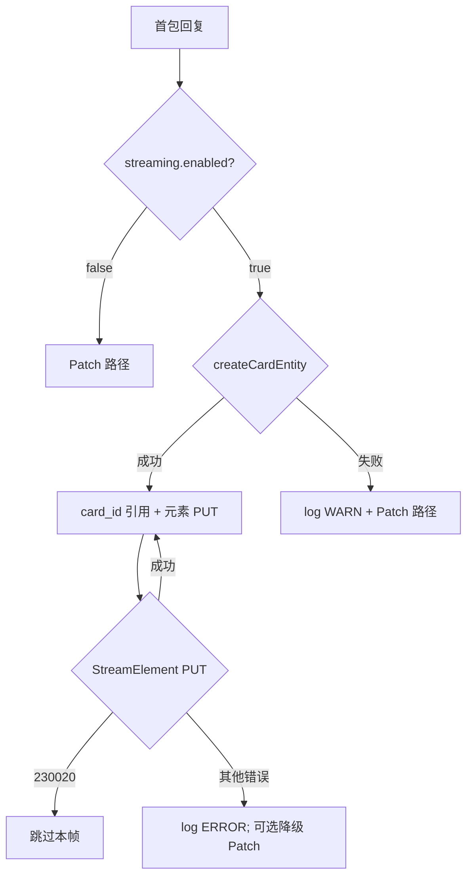

# Design: 飞书 IM 2.0 流式更新

**Change ID:** devrix-feishu-streaming  
**Demand ID:** DM-20260611-006  
**Status:** S3_Design

---

## 1. 架构概览

### 1.1 现状数据流

```
Gateway (event_type=text, chunk)
    → FeishuAdapter.OnMessage
    → appendResponseText
        → textBuffer += chunk
        → BuildCardJSON(全文)
        → sendCardReply / patchMessage   ← 全卡替换
```

### 1.2 目标数据流

```
Gateway (event_type=text, chunk)          [不变]
    → FeishuAdapter.OnMessage
    → appendResponseText
        → textBuffer += chunk
        → [有 cardID] streamCardElement("reply_text", fullText, seq++)
        → [无 cardID] patchMessage (降级)

首包回复:
    → buildStreamingReplyCardJSON(streaming=true)
    → createCardEntity(cardJSON) → card_id
    → replyMessage({"type":"card","data":{"card_id"}})

complete:
    → streamCardElement (最终全文)
    → updateCardEntity(streaming_mode=false, footer)
    → clearSessionStream
```

### 1.3 与多卡模型关系

```
用户指令一轮 (session 至 complete)
├── 思考卡      thinkingMsgID     Patch 聚合 [不变]
├── 工具卡      toolsMsgID        Patch 聚合 [不变]
├── 任务进度卡  progressMsgID     Patch 聚合 [不变]
└── 回复卡      cardID + reply_text  Cardkit 流式 [本变更]
```

---

## 2. 飞书 API 契约

### 2.1 三步 API

| 步骤 | API | 用途 |
|------|-----|------|
| 1 | `POST /open-apis/cardkit/v1/cards` | 创建卡片实体，body `{type:"card_json", data: cardJSON}` |
| 2 | `Im.Message.Reply` content=`{"type":"card","data":{"card_id":"..."}}` | 发送消息引用实体 |
| 3 | `PUT /open-apis/cardkit/v1/cards/{card_id}/elements/{element_id}/content` | 元素流式更新 |

结束时：

| 步骤 | API | 用途 |
|------|-----|------|
| 4 | `PUT /open-apis/cardkit/v1/cards/{card_id}` | 全卡更新，关闭 `streaming_mode`，写入 footer |

**注意**：引用 `card_id` 的消息 **不能** 用 `Im.Message.Patch` 更新正文，必须用 cardkit PUT（cc-connect 已验证）。

### 2.2 sequence 规则

- 同一 `card_id` 下所有 cardkit PUT（元素 + 全卡）共用 **单调递增** `sequence`
- 从 1 开始，每次 PUT 前 `++`
- 并发写同一 card 必须串行（mutex）

### 2.3 权限

飞书应用需开通（以开放平台实际 scope 名为准）：

- 消息发送（已有）
- **cardkit 卡片写权限**（新增验收项）

验收前在飞书开放平台 → 应用能力 → 权限管理 中确认。

### 2.4 客户端要求

- JSON 2.0 + cardkit 流式：**飞书客户端 7.20+**
- 低版本：卡片标题可见，正文显示升级提示（飞书兜底行为）

---

## 3. 核心组件设计

### 3.1 新增 `feishu_cardkit.go`

```go
// CardkitClient 封装 cardkit v1 HTTP API（可用 lark.Client.Post/Put 直调）
type CardkitClient struct { api FeishuAPI }

func (c *CardkitClient) CreateCard(ctx context.Context, cardJSON string) (cardID string, err error)
func (c *CardkitClient) StreamElementContent(ctx context.Context, cardID, elementID, content string, seq int) error
func (c *CardkitClient) UpdateCard(ctx context.Context, cardID, cardJSON string, seq int) error
```

错误分类（参考 cc-connect）：

- `code=230020` → 限流，跳过本帧、返回 nil
- 其他 → 返回 error，触发降级或日志

### 3.2 扩展 `feishuSessionStream`

```go
type feishuSessionStream struct {
    // ... 现有字段 ...
    replyCardID       string   // cardkit 实体 ID
    replyElementID    string   // 固定 "reply_text"
    cardkitSequence   int      // 单调 sequence
    cardkitEnabled    bool     // createCardEntity 是否成功
    streamThrottle    *streamThrottleState
}
```

### 3.3 流式回复卡片 JSON

```json
{
  "schema": "2.0",
  "config": {
    "streaming_mode": true,
    "update_multi": true,
    "width_mode": "fill"
  },
  "body": {
    "elements": [{
      "tag": "markdown",
      "element_id": "reply_text",
      "content": ""
    }]
  }
}
```

`BuildStreamingReplyCardJSON(content string, streaming bool)` 在 `feishu_card.go` 新增。

### 3.4 `appendResponseText` 改造

```go
func (a *FeishuAdapter) appendResponseText(ctx, sessionID, chatID, chunk string) error {
    // 1. textBuffer += chunk
    // 2. if responseMsgID == "":
    //      cardJSON := BuildStreamingReplyCardJSON("", true)
    //      cardID, err := cardkit.CreateCard(cardJSON)
    //      if err == nil:
    //          reply with card_id ref; store cardID, cardkitEnabled=true
    //      else:
    //          legacy sendCardReplyAndGetID(inline JSON); cardkitEnabled=false
    // 3. if cardkitEnabled:
    //      if throttle.ShouldFlush(fullText):
    //          cardkit.StreamElementContent(cardID, "reply_text", fullText, seq++)
    //    else:
    //      patchMessage(responseMsgID, BuildCardJSON(...))
}
```

### 3.5 节流器

```go
type streamThrottleConfig struct {
    Enabled       bool
    IntervalMs    int  // default 400
    MinDeltaChars int  // default 24
}
```

逻辑对标 `cc-connect-src/core/streaming.go`：

- 累积字符增量 < MinDeltaChars 且非首包 → 延迟 flush
- 距上次发送 < IntervalMs → 延迟 flush
- `complete` 时强制最终 flush

### 3.6 `complete` / `finalizeStructuredSession`

```go
// 有 cardkitEnabled:
//   1. 最终 StreamElementContent(全文)
//   2. cardJSON := BuildStreamingReplyCardJSON(全文+footer, streaming=false)
//   3. UpdateCard(cardID, cardJSON, seq++)
// 无 cardkit: 现有 patchMessage footer 逻辑
```

### 3.7 工具调用期间的协调

工具 `tool_call` / `tool_result` 事件不操作 `replyCardID`。回复流式与工具卡独立 message_id / card_id，无 sequence 共享问题。

若未来思考卡也走 cardkit，需独立 card_id，不可共用 sequence。

---

## 4. 配置设计

`~/.devrix/config.yaml`:

```yaml
im:
  feishu:
    streaming:
      enabled: true          # 默认 true；false 则始终 Patch
      interval_ms: 400       # 流式 PUT 最小间隔
      min_delta_chars: 24    # 最小字符增量
```

Go 结构：

```go
type FeishuStreamingUserConfig struct {
    Enabled       *bool `yaml:"enabled"`
    IntervalMs    int   `yaml:"interval_ms"`
    MinDeltaChars int   `yaml:"min_delta_chars"`
}
```

---

## 5. 降级策略



**原则**：降级后本会话不再尝试 cardkit，避免 Patch 与 cardkit 混用。

---

## 6. 文件变更清单

| 操作 | 文件 | 说明 |
|------|------|------|
| 新增 | `adapters/feishu_cardkit.go` | cardkit API |
| 新增 | `adapters/feishu_cardkit_test.go` | HTTP mock 测试 |
| 新增 | `adapters/feishu_stream_throttle.go` | 节流（可内联于 progress） |
| 修改 | `adapters/feishu_card.go` | `BuildStreamingReplyCardJSON` |
| 修改 | `adapters/feishu_progress.go` | `appendResponseText`、finalize |
| 修改 | `adapters/feishu.go` | session stream 字段、FeishuConfig |
| 修改 | `shared/config/user.go` | streaming 配置 |
| 修改 | `bootstrap/im_hosts.go` | 接线 |
| 修改 | `openspec/l5-registry.md` | S7 登记 L5-1-2-04~08 |

---

## 7. 测试策略

### 7.1 单元测试

| 测试 | Covers |
|------|--------|
| `TestCreateCardEntity_Success` | L5-1-2-04 |
| `TestStreamElementContent_SequenceMonotonic` | L5-1-2-05 |
| `TestAppendResponseText_FallbackPatchOnCardkitError` | L5-1-2-06 |
| `TestFinalize_ClosesStreamingMode` | L5-1-2-07 |
| `TestStreamThrottle_RespectsInterval` | L5-1-2-08 |

### 7.2 集成 / 真机

1. 飞书发消息触发多段回复 → 观察打字机效果
2. 临时 revoke cardkit 权限 → 确认 Patch 降级内容完整
3. 带代码块 / 列表 / 表格的回复 → 完成后格式正确

---

## 8. 实施阶段

见 `tasks.md`。

---

## 9. 回退策略

| 变更 | 回退 |
|------|------|
| 代码 | `im.feishu.streaming.enabled: false` 即回退 Patch |
| 配置 | 删除 streaming 块，默认 enabled=true 可改为 false |
| 权限 | 无 cardkit 权限时自动降级，无需发版回滚 |

Migration：**roll-forward**（纯代码 + 配置，无 DB）

---

## 10. 参考

- cc-connect: `platform/feishu/feishu.go` — `createCardEntity`, `StreamRichCardText`, `updateCardEntity`
- cc-connect: `core/streaming.go` — 节流与 `RichCardTextStreamer`
- 飞书文档: [卡片 JSON 2.0 结构](https://open.feishu.cn/document/feishu-cards/card-json-v2-structure)
- 归档: `openspec/archive/2026-06-08-devrix-feishu-cards/` — RichCardTextStreamer P2 backlog
