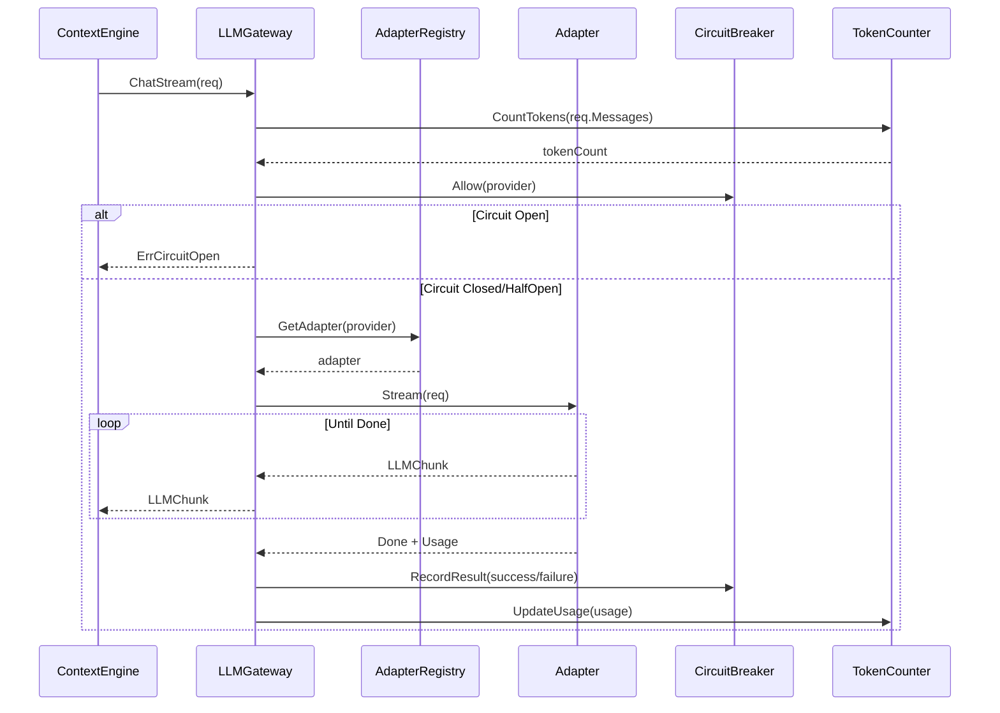

# LLM Gateway Layer Design (Layer 3)

**Change ID:** devrix-llm-gateway
**Layer:** 3 - LLM Gateway
**Status:** Draft
**Version:** 1.0.0
**Based on:** `openspec/specs/llm_gateway_layer_delta.md`

---

## 一、架构目标

### 1.1 业务目标

| 业务目标 | 量化指标 | V1 |
|---------|---------|-----|
| 统一 LLM 调用接口 | 适配 DeepSeek / MiniMax | ✅ |
| 熔断器保护 | Circuit Breaker 防止级联故障 | ✅ |
| Token 预算控制 | Token 计数与预算检查 | ✅ |
| 可观测性 | Tracing + Metrics 内建 | ✅ |
| 重试与降级 | 指数退避 + Fallback 模型 | ✅ |

### 1.2 层间边界

```
Layer 2 (Context Engine)                    Layer 3 (LLM Gateway)
─────────────────────────                  ──────────────────────
PEVEngine.Run()
    │
    └──▶ ILLMGateway.ChatStream() ──▶ LLMGateway
                                      ├─ AdapterRegistry
                                      │   ├─ DeepSeekAdapter
                                      │   └─ MiniMaxAdapter
                                      ├─ CircuitBreaker
                                      ├─ TokenCounter
                                      └─ ConfigLoader
                                                    │
                                                    ▼
                                              External LLM APIs
```

**禁止：LLM Gateway 不得 import contextengine/ 或 communication/ 包**

---

## 二、Provider 配置

### 2.1 支持的 Provider

| Provider | Adapter | API 类型 | Base URL |
|----------|---------|----------|----------|
| `deepseek` | DeepSeekAdapter | OpenAI-compatible | `https://api.deepseek.com/v1` |
| `minimax` | MiniMaxAdapter | OpenAI-compatible | `https://api.minimax.io/v1` |

### 2.2 配置契约

```yaml
llm_gateway:
  default_provider: "minimax"
  default_model: ""  # 用户配置，代码不限制
  
  circuit_breaker:
    failure_threshold: 5
    success_threshold: 2
    open_duration: "30s"
  
  providers:
    deepseek:
      type: "deepseek"
      base_url: "https://api.deepseek.com/v1"
      api_key_env: "DEEPSEEK_API_KEY"
      timeout: "60s"
      max_tokens: 8192
      temperature: 0.7
      retry:
        max_attempts: 3
        initial_delay: "1s"
        max_delay: "10s"
        backoff: 2.0
    
    minimax:
      type: "minimax"
      base_url: "https://api.minimax.io/v1"
      api_key_env: "MINIMAX_API_KEY"
      timeout: "60s"
      max_tokens: 8192
      temperature: 0.7
      retry:
        max_attempts: 3
        initial_delay: "1s"
        max_delay: "10s"
        backoff: 2.0
```

---

## 三、领域模型

### 3.1 核心实体

```go
// contracts.go

type LLMRequest struct {
    Model        string            // 用户配置的模型名
    Provider     string            // deepseek | minimax
    SystemPrompt string
    Messages     []types.Message
    Tools        []ToolSchema
    MaxTokens    int
    Temperature  float64
    Stream       bool
}

type LLMChunk struct {
    Content   string
    Thinking  string
    ToolCalls []ToolCall
    Done      bool
    Usage     TokenUsage
}

type TokenUsage struct {
    PromptTokens     int
    CompletionTokens int
    TotalTokens      int
}

type ToolSchema struct {
    Name        string
    Description string
    Parameters  string // JSON Schema
}

type ToolCall struct {
    ID    string
    Name  string
    Input string // JSON string
}

type CircuitState string

const (
    CircuitClosed   CircuitState = "closed"
    CircuitOpen    CircuitState = "open"
    CircuitHalfOpen CircuitState = "half-open"
)

type CircuitBreakerConfig struct {
    FailureThreshold  int
    SuccessThreshold  int
    OpenDuration     time.Duration
}

type RetryConfig struct {
    MaxAttempts  int
    InitialDelay time.Duration
    MaxDelay     time.Duration
    Backoff      float64
}
```

---

## 四、业务流程

### 4.1 核心用例：ChatStream



### 4.2 熔断器状态机

```
Closed ──[failure >= threshold]──▶ Open
                                  │
                          [openDuration elapsed]
                                  │
                                  ▼
                              HalfOpen
                                  │
              ┌───────────────────┴───────────────────┐
              │                                       │
    [success >= successThreshold]           [failure]
              │                                       │
              ▼                                       ▼
          Closed ◀──[failure >= threshold]───── Open
```

---

## 五、目录结构

```
internal/layers/llmgateway/
├── contracts.go              # 接口与类型定义
├── gateway/
│   ├── gateway.go           # LLMGateway 主实现 (~150 行)
│   ├── gateway_test.go
│   └── options.go            # Gateway 选项模式
├── adapter/
│   ├── registry.go           # AdapterRegistry (~80 行)
│   ├── registry_test.go
│   ├── adapter.go            # IAdapter 接口 (~50 行)
│   ├── deepseek.go           # DeepSeek 适配器 (~200 行)
│   ├── deepseek_test.go
│   ├── minimax.go            # MiniMax 适配器 (~200 行)
│   └── minimax_test.go
├── breaker/
│   ├── circuit_breaker.go    # CircuitBreaker 实现 (~200 行)
│   ├── circuit_breaker_test.go
│   └── state.go              # 状态机
├── token/
│   ├── counter.go           # Token 计数器 (cl100k_base) (~150 行)
│   ├── counter_test.go
│   └── estimator.go         # Token 估算器
├── config/
│   ├── loader.go            # 配置加载器 (~100 行)
│   └── provider.go          # Provider 配置
├── retry/
│   └── retry.go             # 重试策略 (~80 行)
└── observer/
    ├── observer.go          # ILLMObserver 接口
    └── noop.go              # NoOp 实现
```

---

## 六、接口设计

### 6.1 核心接口

```go
// contracts.go

// ILLMGateway LLM 网关接口 (被 L2 依赖)
type ILLMGateway interface {
    ChatStream(ctx context.Context, req *LLMRequest) (<-chan LLMChunk, error)
    ChatComplete(ctx context.Context, req *LLMRequest) (*LLMChunk, error)
    Close() error
}

// IAdapter 模型适配器接口
type IAdapter interface {
    Stream(ctx context.Context, req *LLMRequest) (<-chan *AdapterChunk, error)
    Provider() string
    Supports(provider string) bool
}

type AdapterChunk struct {
    Raw    []byte
    Parsed *LLMChunk
    Error  error
}

// ICircuitBreaker 熔断器接口
type ICircuitBreaker interface {
    Allow(circuitKey string) (bool, error)
    RecordSuccess(circuitKey string)
    RecordFailure(circuitKey string)
    State(circuitKey string) CircuitState
    Reset(circuitKey string)
}

// ITokenCounter Token 计数接口
// NOTE: devrix-context-engine-v2 要求与 internal/shared/contracts/tokencounter.go 对齐。
// Gateway 实现须满足：CountText, CountMessages, CountWithSystemPrompt,
// TruncateToTokens, EncodingForModel。EstimateRemaining 可作为 Gateway 扩展方法。
type ITokenCounter interface {
    Count(messages []types.Message) int
    CountWithPrompt(prompt string, messages []types.Message) int
    EstimateRemaining(current, max int) int
}

// ILLMObserver LLM 可观测接口
type ILLMObserver interface {
    EmitLLMCall(provider, model string, duration time.Duration, success bool)
    EmitTokenUsage(provider, model string, usage TokenUsage)
    EmitCircuitState(provider string, state CircuitState)
}

// IHealthCheck 健康检查接口
type IHealthCheck interface {
    Check(ctx context.Context, provider string) error
    CheckAll(ctx context.Context) map[string]error
}
```

### 6.2 配置接口

```go
type LLMConfig struct {
    DefaultProvider string
    Providers       map[string]ProviderConfig
    TokenLimit     int
    CircuitBreaker CircuitBreakerConfig
}

type ProviderConfig struct {
    Type        string
    BaseURL     string
    APIKeyEnv   string
    Timeout     time.Duration
    MaxTokens   int
    Temperature float64
    Retry       RetryConfig
    Headers     map[string]string
}
```

---

## 七、错误处理

| 错误码 | 类型 | 说明 | 可恢复 |
|--------|------|------|--------|
| LLM_PROVIDER_1001 | ProviderUnavailable | Provider 不可用 | ✅ |
| LLM_CIRCUIT_1002 | CircuitOpen | 熔断器开启 | ✅ |
| LLM_TIMEOUT_1003 | Timeout | 请求超时 | ✅ |
| LLM_AUTH_1004 | AuthFailed | 认证失败 | ❌ |
| LLM_TOKEN_1005 | TokenBudgetExceeded | Token 超限 | ❌ |
| LLM_PARSE_1006 | ParseError | 响应解析错误 | ✅ |
| LLM_UNSUPPORTED_1007 | UnsupportedProvider | 不支持的 Provider | ❌ |

### 7.1 错误可重试性

```go
func IsRetryable(err error) bool {
    switch e := err.(type) {
    case *LLMError:
        switch e.Code {
        case "LLM_TIMEOUT_1003", "LLM_PROVIDER_1001", "LLM_PARSE_1006":
            return true
        default:
            return false
        }
    }
    return true // 网络错误默认可重试
}
```

---

## 八、测试策略

| L5 ID | 描述 | 优先级 |
|-------|------|--------|
| L5-LLM-01 | DeepSeek 适配器流式响应 | P0 |
| L5-LLM-02 | MiniMax 适配器流式响应 | P0 |
| L5-LLM-03 | Circuit breaker 正常关闭 | P0 |
| L5-LLM-04 | Circuit breaker 触发开启 | P0 |
| L5-LLM-05 | Circuit breaker 半开→关闭 | P0 |
| L5-LLM-06 | Circuit breaker 半开→开启 | P0 |
| L5-LLM-07 | Token 计数准确性 | P0 |
| L5-LLM-08 | Token 预算检查 | P0 |
| L5-LLM-09 | Provider 配置加载 | P0 |
| L5-LLM-10 | 未知 Provider 报错 | P1 |
| L5-LLM-11 | 重试策略执行 | P1 |
| L5-LLM-12 | Fallback 模型切换 | P1 |
| L5-LLM-13 | LLM 调用可观测事件 | P1 |

---

## 九、版本分期

| 版本 | 能力 |
|------|------|
| V1 | DeepSeek + MiniMax 适配器 + Circuit Breaker + Token Counter |
| V2 | Anthropic/OpenAI 适配器 + Rate Limiter |
| V3 | 多模型负载均衡 + A/B Testing |
