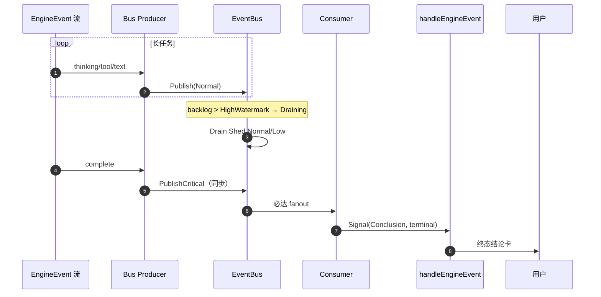

# D1 Communication — 可观测性与必达指南

**Capability:** d1-communication
**Status:** Active
**Version:** 2.0.0
**Last Updated:** 2026-06-30
**Parent:** `d1-domain.md` · `span-registry.md` · `t-registry.md`
**Change:** devrix-d1-sa-refine (DM-20260614-006) — 切法 A / **devrix-d1-ac-restructuring (DM-20260629-005) PR-3 god-doc-split pt2 (230→100)**

---

## See also

- **Span ↔ T 绑定**：`t-registry.md` §T-Without-Span Tracker + Span Evidence 列
- **T 验收摘要 + Statistics**：`t-registry.md` §Statistics
- **Span operation 全表**：`span-registry.md`

---

## 0. 文档定位

本文档提供 **Trace 树、EventBus 必达机制与验收 Runbook**。Span ↔ T 绑定、T 验收摘要与 Statistics 见 `t-registry.md`；Span operation 全表见 `span-registry.md`。

---

## 1. IntentFast Trace 树

一次普通对话（IntentFast）的预期 span 层次：

```text
[D1] D1_Capture_Message_Receive
  ├─ D1_Capture_Store_Update
  ├─ D1_Capture_Persist
  ├─ D1_Dispatch_Route {dispatch.target=d7}
  │
  ├─ [D7] D7_Orchestration_Session_Process
  │    ├─ D7_Orchestration_Intent_Classify
  │    └─ D7 Turn / D3 Stream / D2 Prepare·ToolRound
  │
  ├─ D1_Capture_EngineEvent_Handle（每事件）
  │    ├─ D1_Signal_Thinking + ChainIntegrity
  │    ├─ D1_Signal_Task + TaskWorkProof
  │    └─ D1_Signal_Conclusion + ChainIntegrity
  │
  └─ D1_Adapter_*_Outbound
```

### 延迟 SLO

| 指标 | 目标 | 观测 Span |
|------|------|-----------|
| IM 入口启动 | P99 < 500ms | `D1_Adapter_*_Outbound` |
| 入站 → 首 thinking | P99 < 800ms | `D1_Signal_Thinking` |
| complete 必达 | P99 < 800ms from inbound | `D1_Signal_Conclusion` |

Legacy Gateway span（11 ops）与 Adapter span（3 ops）登记见 `span-registry.md` §Legacy。

---

## 2. EventBus 双通道与必达

### 2.1 路由规则

`capture/event_dispatcher.go`：

| EngineEvent.Type | API | 优先级 |
|------------------|-----|--------|
| `complete` / `error` | `PublishCritical` | Critical（同步 fanout） |
| 其他 | `Publish` | Normal / Low |

`complete`/`error` 禁止走 `Publish`（`bus.go` 返回错误）。

### 2.2 PublishCritical 语义

`delivery/eventbus/bus.go`：

- 绕过 `normalCh`，不计入 backlog
- `dispatchMu` 同步 fanout；返回时事件已在 subscriber buffer
- Drain / Compact **不影响** Critical 路径

### 2.3 状态机

```text
Running → Draining → (backlog ≤ LowWatermark) → Running
         → Compacting → Reconnecting → Closed

PublishCritical: Running/Draining/Reconnecting 均可（Closed 除外）
```

---

## 3. 弱网 Drain 故障注入场景

### 场景描述

长任务产生大量 thinking/tool 事件 → backlog 超 HighWatermark → TriggerDrain → Normal/Low 被 Shed → 同时 D7 发出 `complete`。

### 时序（必达承诺）



### 测试 ↔ T ↔ 断言

| 故障场景 | 测试文件 | T ID |
|----------|----------|------|
| normalCh 满时 complete 仍达 | `delivery/eventbus/bus_test.go` `TestL5_2_3_05_*` | D1-S18-A01-F02-T01 |
| error 同样必达 | 同上 `TestL5_2_3_06_*` | D1-S18-A01-F02-T01 |
| Drain 中 PublishCritical | `delivery/eventbus/drain_test.go` `TestDrainPreservesCritical` | D1-S18-A01-F03-T01 |
| Drain 只 Shed Normal | `drain_test.go` `TestL5_2_3_02_*` | D1-S18-A01-F03-T01 |
| Compact 不丢 Critical | `delivery/eventbus/compact_test.go` | S18-A01-F04 |
| Reconnect 后 Critical | `delivery/eventbus/reconnect_test.go` | S18-A01-F05 |

---

## 4. 生产 Trace 检查清单

| 检查项 | 查询 / 条件 | 期望 |
|--------|------------|------|
| 入站可追溯 | `D1_Capture_Persist` 存在 | 每用户消息 1 个 |
| D7 路由 | `D1_Dispatch_Route{target=d7}` | 无 legacy D2 路径 |
| 信号锚点 | `D1_S14/15/16_Signal_*` | `source_event_id` 非空 |
| Fast 链完整 | `D1_Signal_ChainIntegrity` | `chain.intact=true` |
| 必达时效 | inbound → `D1_Signal_Conclusion` | P99 ≤ 800ms |
| Drain 不丢结论 | Drain 期间仍有 Conclusion span | 无 gap |

### 建议告警（D5 metric 层）

| 告警 | 条件 | 严重度 |
|------|------|--------|
| 结论链断裂 | `chain.intact=false` 且 `break_at_kind=conclusion` | P0 |
| 必达超时 | inbound→Conclusion P99 > 800ms | P1 |
| Drain 频繁 | `eventbus.drain` > 10/min/session | P2 |
| D7 未配置 | RouteInbound error（无 Dispatch span） | P0 |

---

## 5. 关联文档

| 文档 | 关系 |
|------|------|
| `span-registry.md` | Span operation 登记 SoT |
| `t-registry.md` | T 点全表 SoT + §T-Without-Span Tracker + Span Evidence 列 |
| `terminal-state-guide.md` | 主路径与时序 |
| `spec.md` | Gherkin 验收场景 |
| `f-registry.md` §S18 | EventBus F 点 |
| `../d5-observability/span-registry.md` | 全局 Trace |

---

## 修订记录

| Version | Date | Changes |
|---------|------|---------|
| 1.0.0 | 2026-06-16 | 初版：Span↔T 绑定、Trace 树、EventBus 必达、T 分组摘要、Runbook、缺口 |
| 2.0.0 | 2026-06-30 | **DM-20260629-005 S7_Archive ACCEPTED PR-3 god-doc-split pt2**：230 → 100 行；(1) 删 §1 Canonical Span↔T 绑定矩阵（迁 `t-registry.md` §T-Without-Span Tracker + Span Evidence 列）；(2) 删 §5 T 层验收矩阵（指向 `t-registry.md` §Statistics）；(3) 删 §7 已知缺口（迁 `t-registry.md` §T-Without-Span Tracker）；(4) 头部加 "See also" 块；(5) §Change line + 修订记录 v2.0.0 row |