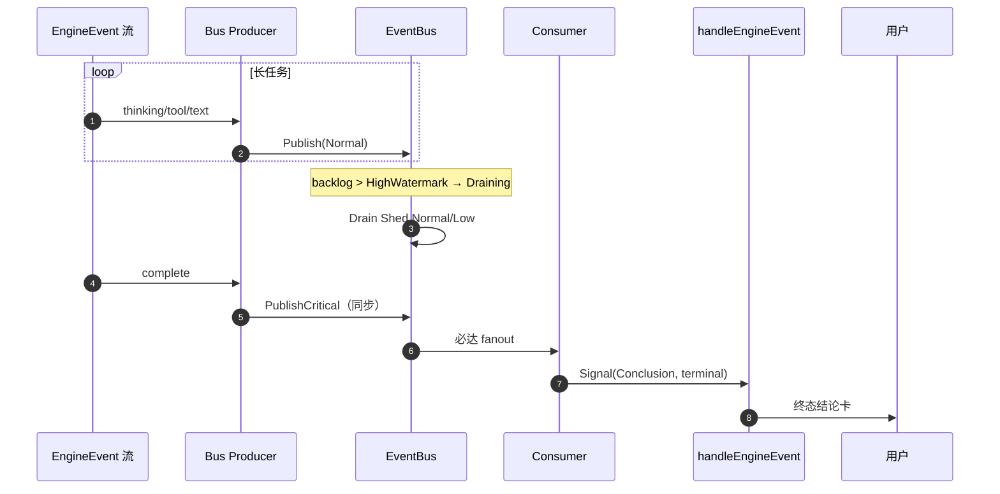

# D1 Communication — 可观测性与必达指南

**Capability:** d1-communication
**Status:** Active
**Version:** 1.0.0
**Last Updated:** 2026-06-16
**Parent:** `d1-domain.md` · `span-registry.md` · `t-registry.md`
**Complements:** `terminal-state-guide.md` · `../d5-observability/span-registry.md`

---

## 0. 文档定位

本文档提供 **Span ↔ T 绑定视图、Trace 树、EventBus 必达机制与验收 Runbook**。

| 本文档提供 | 权威 SoT 在其他文件 |
|-----------|-------------------|
| Canonical Span ↔ T 绑定矩阵 | Span 操作名全表 → `span-registry.md` |
| IntentFast Trace 树 | OTel 常量定义 → `telemetry/names.go` |
| EventBus 双通道与故障注入场景 | F 点实现细节 → `f-registry.md` §S18 |
| 按 S 分组的 T 验收摘要 + P0 清单 | T 点全表（56 条）→ `t-registry.md` |
| 生产检查清单与告警建议 | Gherkin 场景 → `spec.md` |

---

## 1. Canonical Span ↔ T 绑定

代码常量 SoT：`internal/layers/observability/instrument/telemetry/names.go`。  
文档 operation 名（`d1.*`）与代码常量（`D1_S*`）一一对应，见 `span-registry.md` §Canonical。

| 文档 Operation | 代码常量 | S | 绑定 T（P0 加粗） |
|----------------|----------|---|------------------|
| `d1.capture.persist` | `D1_Capture_Persist` | S13 | **D1-S13-A02-T01** |
| `d1.dispatch.route` | `D1_Dispatch_Route` | S13 | **D1-S13-A03-T01**, **D1-S13-A03-T02** |
| `d1.signal.thinking` | `D1_Signal_Thinking` | S14 | **D1-S14-A01-F01-T01** |
| `d1.signal.task` | `D1_Signal_Task` | S15 | D1-S15-A01-F01-T01 |
| `d1.signal.conclusion` | `D1_Signal_Conclusion` | S16 | **D1-S16-A02-T01**, **D1-S16-A02-T02** |
| `d1.signal.chain_integrity` | `D1_Signal_ChainIntegrity` | S14–S16 | 与结论 T 同跑 |
| `d1.signal.task.work_proof` | `D1_Signal_TaskWorkProof` | S15 | **D1-S15-A02-F01-T01** |
| `d1.signal.user_feedback` | `D1_UserFeedback_ConclusionRejected` | S16 | ⬜ 待补 T |
| `eventbus.publish_critical` | （bus 内隐式） | S18 | **D1-S18-A01-F02-T01** |
| `eventbus.drain` | （bus 内隐式） | S18 | **D1-S18-A01-F03-T01** |
| `adapter.feishu.encode` | `D1_Adapter_Feishu_Outbound` | S17 | D1-S17-A01-T01 |

### 出站信号 Span 必填属性

Emit 位置：`capture/signal_hooks.go` `emitOutboundSignalSpans`。

| Attribute | 用途 |
|-----------|------|
| `session.id` | 会话关联 |
| `signal.kind` | Thinking / Task / Conclusion |
| `signal.sequence` | 同 turn 内顺序 |
| `source_event_id` | 客观锚点，供 D6 追溯 |
| `elapsed_ms` | 自入站 turn 起耗时 |
| `inbound.turn_id` | 绑定用户轮次 |
| `signal.is_terminal` | 是否终态 Conclusion |

链完整性 span 额外记录：`chain.intact`、`chain.saw_thinking/task/conclusion`、`chain.break_at_kind`。

---

## 2. IntentFast Trace 树

一次普通对话（IntentFast）的预期 span 层次：

```text
[D1] D1_Capture_Message_Receive
  ├─ D1_Capture_Store_Update
  ├─ D1_Capture_Persist
  ├─ D1_Dispatch_Route {dispatch.target=d7}
  │
  ├─ [D7] D7_Orchestration_Session_Process
  │    ├─ D7_Orchestration_Intent_Classify
  │    └─ D7 Turn / D3 Stream / D2 Prepare·ToolRound
  │
  ├─ D1_Capture_EngineEvent_Handle（每事件）
  │    ├─ D1_Signal_Thinking + ChainIntegrity
  │    ├─ D1_Signal_Task + TaskWorkProof
  │    └─ D1_Signal_Conclusion + ChainIntegrity
  │
  └─ D1_Adapter_*_Outbound
```

### 延迟 SLO

| 指标 | 目标 | 观测 Span |
|------|------|-----------|
| IM 入口启动 | P99 < 500ms | `D1_Adapter_*_Outbound` |
| 入站 → 首 thinking | P99 < 800ms | `D1_Signal_Thinking` |
| complete 必达 | P99 < 800ms from inbound | `D1_Signal_Conclusion` |

Legacy Gateway span（11 ops）与 Adapter span（3 ops）登记见 `span-registry.md` §Legacy；Coverage 全表见 `observability/diagnose/coverage/registry_test.go`。

---

## 3. EventBus 双通道与必达

### 3.1 路由规则

`capture/event_dispatcher.go`：

| EngineEvent.Type | API | 优先级 |
|------------------|-----|--------|
| `complete` / `error` | `PublishCritical` | Critical（同步 fanout） |
| 其他 | `Publish` | Normal / Low |

`complete`/`error` 禁止走 `Publish`（`bus.go` 返回错误）。

### 3.2 PublishCritical 语义

`delivery/eventbus/bus.go`：

- 绕过 `normalCh`，不计入 backlog
- `dispatchMu` 同步 fanout；返回时事件已在 subscriber buffer
- Drain / Compact **不影响** Critical 路径

### 3.3 状态机

```text
Running → Draining → (backlog ≤ LowWatermark) → Running
         → Compacting → Reconnecting → Closed

PublishCritical: Running/Draining/Reconnecting 均可（Closed 除外）
```

---

## 4. 弱网 Drain 故障注入场景

### 场景描述

长任务产生大量 thinking/tool 事件 → backlog 超 HighWatermark → TriggerDrain → Normal/Low 被 Shed → 同时 D7 发出 `complete`。

### 时序（必达承诺）



### 测试 ↔ T ↔ 断言

| 故障场景 | 测试文件 | T ID |
|----------|----------|------|
| normalCh 满时 complete 仍达 | `delivery/eventbus/bus_test.go` `TestL5_2_3_05_*` | D1-S18-A01-F02-T01 |
| error 同样必达 | 同上 `TestL5_2_3_06_*` | D1-S18-A01-F02-T01 |
| Drain 中 PublishCritical | `delivery/eventbus/drain_test.go` `TestDrainPreservesCritical` | D1-S18-A01-F03-T01 |
| Drain 只 Shed Normal | `drain_test.go` `TestL5_2_3_02_*` | D1-S18-A01-F03-T01 |
| Compact 不丢 Critical | `delivery/eventbus/compact_test.go` | S18-A01-F04（Legacy `D1-S9-A02-T03`） |
| Reconnect 后 Critical | `delivery/eventbus/reconnect_test.go` | S18-A01-F05（Legacy `D1-S9-A02-T04`） |

---

## 5. T 层验收矩阵（按 S 摘要）

全表 56 条见 `t-registry.md`。以下为按 Canonical S 分组摘要（IMPLEMENTED 全绿）。

| S | Canonical T | Legacy T | P0 数 | 覆盖重点 |
|---|-------------|----------|-------|----------|
| S13 Capture | 4 | 9 | 6 | 持久化、D7 路由、权限、Session |
| S14 Thinking | 1 | 2 | 1 | 信号映射 + 锚点 |
| S15 TaskProgress | 2 | 6 | 2 | tool→Task、Worker 双卡 |
| S16 Conclusion | 2 | 5 | 4 | complete/error 必达、流式 |
| S17 Channel | 1 | 18 | 3 | 三平台 Parse/Encode、限流 |
| S18 Delivery | 2 | 7 | 6 | Critical、Drain、Compact |

### P0 必跑清单

```bash
# 信号旅程（S13→S14→S15→S16 一条用例覆盖 4 个 Canonical T）
go test -tags='acceptance d1' ./tests/acceptance/p0/ -run TestL5_D1_SignalJourney -v

# D7 路由（S13-A03）
go test ./internal/layers/communication/capture/ -run TestMatrix_D7 -v

# EventBus 必达（S18）
go test ./internal/layers/communication/delivery/eventbus/ -v

# 权限门（S13-A04）
go test ./internal/layers/communication/capture/ -run Permission -v
```

核心旅程测试：`tests/acceptance/p0/d1_signal_journey_test.go`（标注 `D1-S13-A02-T01`、`D1-S14-A01-F01-T01`、`D1-S15-A01-F01-T01`、`D1-S16-A02-T01`）。

---

## 6. 生产 Trace 检查清单

| 检查项 | 查询 / 条件 | 期望 |
|--------|------------|------|
| 入站可追溯 | `D1_Capture_Persist` 存在 | 每用户消息 1 个 |
| D7 路由 | `D1_Dispatch_Route{target=d7}` | 无 legacy D2 路径 |
| 信号锚点 | `D1_S14/15/16_Signal_*` | `source_event_id` 非空 |
| Fast 链完整 | `D1_Signal_ChainIntegrity` | `chain.intact=true` |
| 必达时效 | inbound → `D1_Signal_Conclusion` | P99 ≤ 800ms |
| Drain 不丢结论 | Drain 期间仍有 Conclusion span | 无 gap |

### 建议告警（D5 metric 层）

| 告警 | 条件 | 严重度 |
|------|------|--------|
| 结论链断裂 | `chain.intact=false` 且 `break_at_kind=conclusion` | P0 |
| 必达超时 | inbound→Conclusion P99 > 800ms | P1 |
| Drain 频繁 | `eventbus.drain` > 10/min/session | P2 |
| D7 未配置 | RouteInbound error（无 Dispatch span） | P0 |

---

## 7. 已知缺口（第四层）

| 缺口 | 现状 | 建议 |
|------|------|------|
| `D1_UserFeedback_ConclusionRejected` | span 已 emit，无绑定 T | 新增 P1 T + acceptance 用例 |
| `eventbus.publish_critical` / `eventbus.drain` | 文档已登记，bus 内无显式 OTel span | D5-S21 补 span |
| IntentOrchestrate 链完整性 | `chain.intact` 未单独定义 worker 洪流语义 | 扩展 `ChainReport` |
| 空消息拒绝 | spec Gherkin 有描述 | 新增 `D1-S13-A01-T01` |
| thinking 折叠 | spec Gherkin 有描述 | 新增 `D1-S14-A01-T02` |

---

## 8. 关联文档

| 文档 | 关系 |
|------|------|
| `span-registry.md` | Span operation 登记 SoT |
| `t-registry.md` | T 点全表 SoT |
| `terminal-state-guide.md` | 主路径与时序 |
| `spec.md` | Gherkin 验收场景 |
| `f-registry.md` §S18 | EventBus F 点 |
| `../d5-observability/span-registry.md` | 全局 Trace |

---

## 修订记录

| Version | Date | Changes |
|---------|------|---------|
| 1.0.0 | 2026-06-16 | 初版：Span↔T 绑定、Trace 树、EventBus 必达、T 分组摘要、Runbook、缺口 |
