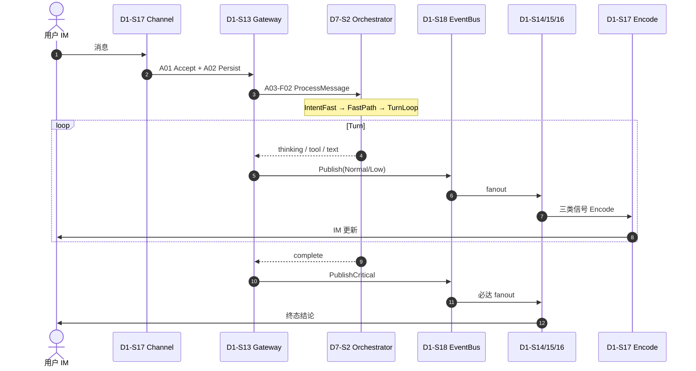
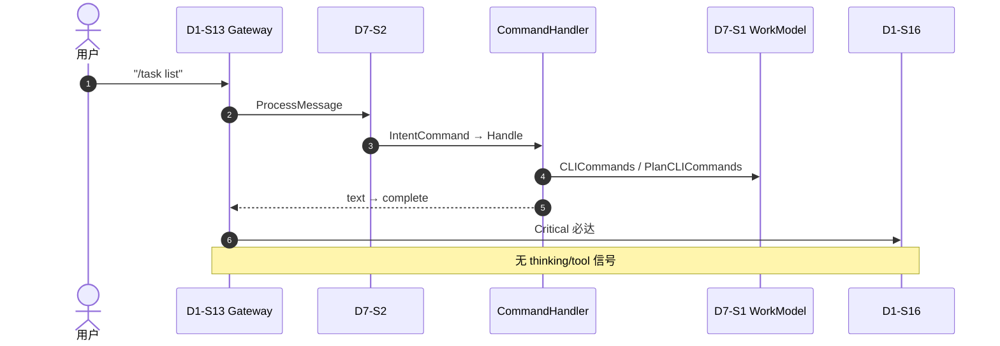
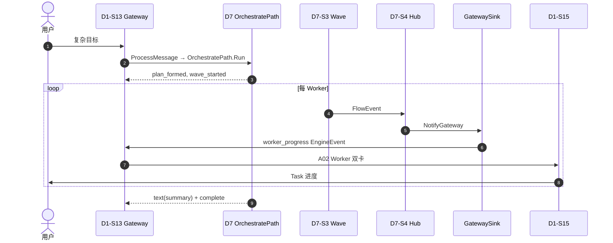

# D1 Communication — 终态架构指南

**Capability:** d1-communication
**Status:** Active
**Version:** 1.0.0
**Last Updated:** 2026-06-16
**Parent:** `d1-domain.md`
**Complements:** `a-registry.md` · `f-registry.md` · `design.md` · `../architecture/cross-domain-boundaries.md`

---

## 0. 文档定位

本文档保存 **D1 终态价值流** 的跨域流程、编排树与时序视图，供架构评审与 onboarding 使用。

| 本文档提供 | 权威 SoT 在其他文件（本文不重复登记） |
|-----------|--------------------------------------|
| D1 领域定位与跨域边界（D1 视角） | S/A 明细表 → `a-registry.md` |
| A→F 编排树（可读结构） | F 点字段/代码路径 → `f-registry.md` |
| IntentKind × D1 参与差异 | Gherkin 验收 → `spec.md` |
| 主路径 / 命令 / 编排 时序图 | T 点全表 → `t-registry.md` |
| EngineEvent → 三类信号映射 | Span 操作名表 → `span-registry.md` |
| 可观测性与必达演练 | 详细 trace/runbook → `observability-guide.md` |

---

## 1. 领域锚点：Trusted Intermediary

D1 是 Devrix 的 **可信中介**：只管用户可感知的「进、看、收」，不管推理、编排与执行。

| D1 拥有 | Out of Scope（归属） |
|---------|-------------------|
| 入站捕获 + 会话持久化 + 路由分发 | Turn 主循环、意图分类 → **D7** |
| 三类出站信号（Thinking / Task / Conclusion） | 上下文准备、工具执行 → **D2** |
| 多 IM 通道接入与编解码 | LLM 调用、内容过滤 → **D3** |
| 弱网必达（Critical 结论不 Drain） | Worker 派发、FlowEvent 写侧 → **D7-S4** |
| 用户 feedback 入站钩子（客观锚点） | 信誉计算、质量评判 → **D5/D6** |

**博弈定位（切法 A）：** D1 = 可信送达 + 客观锚点（`source_event_id`、`elapsed_ms`、`inbound_turn_id`）；质量评级见 D6。

**Domain Kernel（非 S）：** `core.Card`、`types.Session`、`types.InboundMessage` — 见 `code-layout.md` §4.1 `kernel/`。

---

## 2. 终态 S 层（6 个价值流）

Canonical SoT：**D1-S13–S18**（DM-20260614-006）。Legacy D1-S1–S12 已退役。

| S | Scenario | 用户/系统目标 | scenario-slug |
|---|----------|--------------|---------------|
| S13 | CaptureUserIntent | 指令不丢、可追、可续聊 | `capture/` |
| S14 | PresentThinking | 信号① 思考（Costly Signal） | `thinking/` |
| S15 | PresentTaskProgress | 信号② 任务/工具/Worker（Commitment Device） | `taskprogress/` |
| S16 | DeliverConclusion | 信号③ 总结/错误（Costly Signal） | `conclusion/` |
| S17 | ConnectChannel | 多 IM 接入与编解码 | `channel/` |
| S18 | GuaranteeDelivery | 弱网/背压下结论必达 | `delivery/` |

各 S 下 A 层明细见 `a-registry.md` §Canonical（共 **16 A**）。

---

## 3. A→F 编排树（Canonical）

F 点登记见 `f-registry.md` §Canonical（共 **18 F**，分布在 **8 个 A** 上）。以下为编排结构速查。

### S13 CaptureUserIntent

```text
A01 AcceptInboundMessage
  └─ (内联) 空消息校验 · 64KB 上限 · getOrCreateSession

A02 PersistUserTurn
  └─ (内联) sessionStore.Update

A03 DispatchToAgent
  ├─ F02 routeD7          → IOrchestrationEntry.ProcessMessage（主路径）
  ├─ (bootstrap hook)     → sessionagents.EnsureSessionLeader（DM-20260628-003，非 D1 import）
  └─ F01 routeLegacyD2    → RETIRED（DM-007，禁止 fallback）

> **F03 routeAgent 已迁出 D1**（DM-20260628-003）：原 `gateway/agent_route.go` 逻辑在 `bootstrap/sessionagents.Manager`，经 `SetBeforeDispatch` 注入；**不得**劫持 ProcessMessage。

A04 ResolvePermissionGate
  └─ (Legacy F) RequestPermission · ResolveRequest

A05 ParseCommand
  └─ (Legacy F) ParseCommand
```

**硬约束：** `orchestrationEntry == nil` → RouteInbound 返回错误，禁止 silent fallback 到 D2（`spec.md` §CaptureUserIntent）。

### S14 PresentThinking

```text
A01 EmitThinkingDelta
  ├─ F01 mapEngineEventToThinking
  └─ F02 encodeThinkingFeishuCLI  → 复用 S17-F01 CardKit
```

### S15 PresentTaskProgress

```text
A01 EmitToolProgress
  ├─ F01 mapToolToTaskSignal
  └─ F03 emitMilestoneCardProgress

A02 EmitWorkerProgress
  ├─ F01 mapWorkerEventToTask
  └─ F02 encodeFeishuWorkerCard  → S17-F02
```

Worker 进度双入口：

1. D7 Turn 直接产出 `EngineEvent{Type: worker_progress}`
2. D7-S4 `GatewaySink.EmitWorkerProgress` 将 `FlowEvent` 转为 `EngineEvent`

### S16 DeliverConclusion

```text
A01 EmitSummaryChunk
  └─ F01 mapTextDeltaToConclusion

A02 FinalizeReply
  ├─ F01 mapTerminalToConclusion   → complete/error，PublishCritical
  └─ F02 closeStreamMode
```

### S17 ConnectChannel（Encode 横切）

| F | 职责 | 服务 S |
|---|------|--------|
| F01 EncodeFeishuCardKit | Thinking/Conclusion 流式 | S14、S16 |
| F02 EncodeFeishuWorkerCard | Worker 双卡 | S15 |
| F03 EncodeDingTalkMarkdown | 全 Kind | S14–S16 |
| F04 EncodeCLIANSI | CLI 输出 | S14–S16 |

### S18 GuaranteeDelivery

```text
A01 DeliverOutboundSignal
  ├─ F01 Publish          Normal/Low 入队
  ├─ F02 PublishCritical  complete/error 同步 fanout
  ├─ F03 Drain            只 Shed Normal/Low
  ├─ F04 Compact          同类合并
  └─ F05 Reconnect        通道重建
```

实现路由：`capture/event_dispatcher.go`（complete/error → `PublishCritical`）。

---

## 4. 主路径架构

```text
[User IM]
  → S17 Parse* → S13 Accept → Persist → Dispatch (D7)
  → D7 ProcessMessage (4 IntentKind 正交链)
  → EngineEvent 流 → S18 EventBus → present/ (S14|S15|S16)
  → S17 Encode* → [User IM]
  S18 overlay: Critical Conclusion 永不 Drain
```

代码锚点：

- 入站：`capture/gateway.go` `RouteInbound` → `orchestrationEntry.ProcessMessage`
- 出站：`capture/signal_router.go` `SignalRouter.Dispatch` → `thinking/` `taskprogress/` `conclusion/`
- 必达：`delivery/eventbus/bus.go` `PublishCritical`

---

## 5. 跨域契约（D1 视角）

| 跨域路径 | D1 责任 | 对方责任 |
|----------|---------|----------|
| D1 → D7 | S13-A03 `DispatchToAgent` | S2-A01 `ProcessMessage` |
| D7 → D1 | S14–S16 渲染 | S4-A03 `NotifyGateway` + `EngineEvent` channel |
| D1 ↔ D5 | span/metric emit | OTel SDK 持久化 |
| D1 → D6 | S13 feedback 钩子 | S11 `JudgeResult`（D1 不计算信誉） |
| D1 ✗ D3 | 无直连 | LLM 结果经 D7→D1 展示链回流 |

完整跨域 SoT：`../architecture/cross-domain-boundaries.md`。

---

## 6. IntentKind × D1 参与

D1 对四条路径 **无感知**——统一调 `ProcessMessage`；差异全在 D7 内部（DM-20260615-004）。

| IntentKind | D7 执行链 | D1 收到的 EngineEvent | 三类信号链 |
|------------|----------|----------------------|-----------|
| IntentSkip | 内联 close channel | 无/极短 | — |
| IntentCommand | `CommandHandler`（零 LLM） | `text` + `complete` | 仅 Conclusion（预期） |
| IntentFast | `FastPath.Run` → TurnLoop | thinking + tool + text + complete | 完整链 |
| IntentOrchestrate | `OrchestratePath` → Wave | plan_formed + wave + worker + text + complete | Task 为主 + Conclusion |

D1 的 Screening 在 **S13-A04 PermissionGate** 与 **S13-A05 ParseCommand**；意图分类在 **D7-S5**，不归 D1。

---

## 7. EngineEvent → D1 信号映射

| EngineEvent.Type | D1 S | D1 A | Signal Kind | Bus 优先级 |
|------------------|------|------|-------------|-----------|
| `thinking` | S14 | A01 | Thinking | Low |
| `tool_call` / `tool_result` | S15 | A01 | Task | Normal |
| `worker_progress` | S15 | A02 | Task | Normal |
| `text` | S16 | A01 | Conclusion（非终态） | Normal |
| `complete` | S16 | A02 | Conclusion（终态） | **Critical** |
| `error` | S16 | A02 | Conclusion（终态） | **Critical** |

路由实现：`capture/signal_router.go` `SignalRouter.Dispatch`。

---

## 8. 时序图

### 8.1 IntentFast（普通对话）



### 8.2 IntentCommand（零 LLM）



命令白名单：`/plan` `/task` `/help` `/stop` — 见 `orchestration/sessionorchestrator/command_handler.go`。

### 8.3 IntentOrchestrate（多任务）



---

## 9. DSAFT 五层叠合（终态）

```text
D  — D1 Communication (Trusted Intermediary)
S  — 6 价值流 S13–S18
A  — 16 Activities（见 a-registry.md）
F  — 18 Function Points（见 f-registry.md）
T  — 56 Test Points，26 P0（见 t-registry.md + observability-guide.md §验收）
Span — 22 operations（见 span-registry.md + observability-guide.md §Trace）
```

---

## 10. 关联文档

| 文档 | 关系 |
|------|------|
| `d1-domain.md` | **领域 SoT** |
| `spec.md` | Gherkin 验收规格 |
| `a-registry.md` / `f-registry.md` / `t-registry.md` | A/F/T 登记 SoT |
| `span-registry.md` | Span 操作名 SoT |
| `observability-guide.md` | Trace 树、必达演练、验收 Runbook |
| `design.md` | 六段式详细设计（EventBus、CardKit 等实现细节） |
| `dsaft-architecture.md` | Stub（历史 DSAFT 入口，计数表 only） |
| `../architecture/cross-domain-boundaries.md` | 全系统跨域边界 |
| `../architecture/code-layout.md` | scenario-slug 物理路径 |

---

## 修订记录

| Version | Date | Changes |
|---------|------|---------|
| 1.0.0 | 2026-06-16 | 初版：终态定位、A→F 编排树、跨域契约、IntentKind、时序图、信号映射 |
