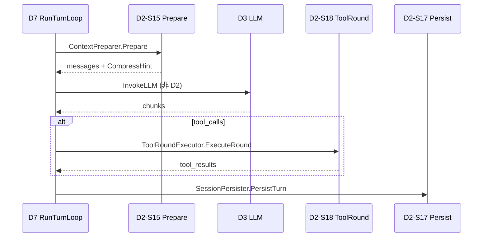

# D2 Context Engine — 终态流程指南

**Capability:** d2-context-engine
**Status:** Active
**Version:** 1.0.0
**Last Updated:** 2026-06-16
**Parent:** `d2-domain.md`
**Complements:** `d7-boundary.md` · `../d7-orchestration/terminal-state-guide.md`

> D2 = **Execution Follower**。本文描述 D7 调度下的拆面契约；登记字段见 `a-registry.md`。

---

## 1. 文档分工

| 主题 | 本文 | SoT |
|------|------|-----|
| D7→D2 拆面时序 | ✅ | `d7-boundary.md` |
| S15–S18 A 树 | ✅ | `a-registry.md` |
| Gherkin / T 全表 | 摘要 | `spec.md` / `t-registry.md` |

---

## 2. 领域定位

**在会话边界内完成 Prepare → ToolRound → Persist；不拥有 Turn 主循环与 LLM 调用权（DM-020）。**

---

## 3. 终态 S 层与 A 层（18 A）

| S | Scenario | A 数 | 关键 A |
|---|----------|------|--------|
| **S15** | PrepareExecutionContext | 4 | LoadSession · CompressContext · AssemblePrompt |
| **S16** | RunQueryLoop | 2 | RunLoop · StreamResponse（**LEGACY FREEZE**） |
| **S17** | PersistSessionState | 4 | SaveSnapshot · WriteTranscript · CommitWindow |
| **S18** | EnforceExecutionPolicy | 8 | CheckPermission · ExecuteToolRound · SpawnSubquery |

---

## 4. D7 Turn 拆面主路径（DM-020）

```text
D7-S2-A06 RunTurnLoop
  ├── D2-S15 PrepareExecutionContext
  │     A01 LoadSession → A03 CompressContext → A04 AssemblePrompt
  ├── D7-S2-A07 InvokeLLM → D3          ← D2 不参与
  ├── D2-S18-A05 ExecuteToolRound       ← 权限在 A01，沙箱在 A03
  └── D2-S17 PersistSessionState
        A01 SaveSnapshot → A02 WriteTranscript → A04 CommitWindow
```



---

## 5. 其他 D7 路径 × D2 参与

| D7 路径 | D2 参与 |
|---------|---------|
| IntentFast | S15 → (D7 LLM) → S18 → S17 |
| Wave Worker (D2 runner) | S15 context + S16 loop 片段 + S18 |
| SubQuery | S15 fork + S18-A06/A08；Flow → **D7-S4** |
| Background | S18-A07；状态经 D7-S1 facade 查询 |
| PlanMode | S18 只读工具过滤（plan_mode permission） |

---

## 6. 硬约束

| 约束 |  enforcement |
|------|-------------|
| D2→D3 import | CI `d2_d3_ban_test` 硬阻断 |
| D2 不 Publish FlowEvent | SubQuery/Background → D7 SpokeBridge |
| D2 不 orchestrate | 无 `orchestration/` import |
| S16 不替代 D7 Turn | 新 Turn 必须走 D7-S2-A06 |

---

## 7. 代码路径

| S | 路径 |
|---|------|
| S15 | `prepare/` |
| S16 | `query/loop.go` + `engine.go` |
| S17 | `persist/` + `engine_persist.go` |
| S18 | `enforce/` |

---

## 8. 相关文档

| 文档 | 关系 |
|------|------|
| `d2-domain.md` | 领域 SoT |
| `d7-boundary.md` | D2↔D7 契约矩阵 |
| `observability-guide.md` | Span↔T、Trace 树 |
| `../d7-orchestration/terminal-state-guide.md` | D7 Leader 对称指南 |
