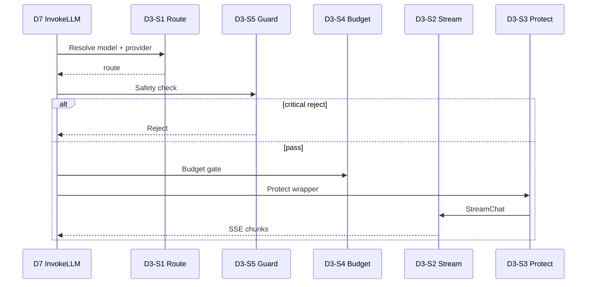

# D3 LLM Gateway — 终态流程指南

**Capability:** llm-gateway
**Status:** Active
**Version:** 1.0.0
**Last Updated:** 2026-06-16
**Parent:** `d3-domain.md`
**Complements:** `../d7-orchestration/d3-boundary.md` · `../d7-orchestration/terminal-state-guide.md`

> D3 = **公共 Gateway**。调用决策权在 **D7**（DM-020）；D2 禁止直调。

---

## 1. 文档分工

| 主题 | 本文 | SoT |
|------|------|-----|
| D7→D3 Invoke 时序 | ✅ | `d3-boundary.md` |
| 5+1 S 价值流 | ✅ | `d3-domain.md` / `spec.md` §1 |
| F 编排明细 | 摘要 | `f-registry.md` |

---

## 2. 终态 S 层（6 S，每 S 1 A）

| S | 承诺 | 关键 F 链 |
|---|------|-----------|
| **S1** RouteModel | C1 | ResolveTierAlias → MatchRouting → ResolveDefault |
| **S2** StreamChat | C2 | OpenAIStreamClient → ParseSSE → AdapterProtocol |
| **S3** ProtectCall | C3 | CircuitBreaker → Retry → Fallback |
| **S4** BudgetTokens | C4 | TokenBudget check/truncate |
| **S5** GuardContent | C5 | SafetyPattern → Reject/Warning |
| **S6** ConfigureGateway | 横切 | NewFromConfig fail-fast |

---

## 3. D7 Invoke 主路径（DM-020）

```text
D7-S2-A07 InvokeLLM
  ├── D3-S1 RouteModel        (llm.provider.route)
  ├── D3-S5 GuardContent      (safety.check — 注入 S2 前)
  ├── D3-S4 BudgetTokens      (预算门 — 注入 S2)
  ├── D3-S2 StreamChat        (llm.stream → llm.adapter.stream)
  └── D3-S3 ProtectCall       (llm.circuit_breaker / llm.retry 包裹)
```



---

## 4. 消费者矩阵

| 消费者 | 路径 | 备注 |
|--------|------|------|
| **D7** | `InvokeLLM` | **Canonical** 主路径 |
| D1 | Bridge 展示 | 不经 D2 |
| D4 | 经 D2 IEngine | 间接，非直调 |
| ~~D2~~ | **禁止** | `d2_d3_ban_test` |

---

## 5. 硬约束

| 约束 | enforcement |
|------|-------------|
| 运行时 span 名不变 | `llm.stream` 等 5 ops（R1 Q3） |
| obs nil 启动 fail | `ErrObservabilityRequired` |
| Breaker 事件 | `flow.breaker.*` → D7/D1 展示 |
| D2→D3 import | CI 硬阻断 |

---

## 6. 代码路径

| S | scenario-slug |
|---|---------------|
| S1 | `route/` |
| S2 | `stream/` |
| S3 | `protect/` |
| S4 | `budget/` |
| S5 | `guard/` |
| S6 | `configure/` |
| CROSS | `internal/bridges/llm/` |

---

## 7. 相关文档

| 文档 | 关系 |
|------|------|
| `d3-domain.md` | 领域 SoT |
| `observability-guide.md` | Span↔T、Trace 树 |
| `spec.md` | Gherkin 全量 |
