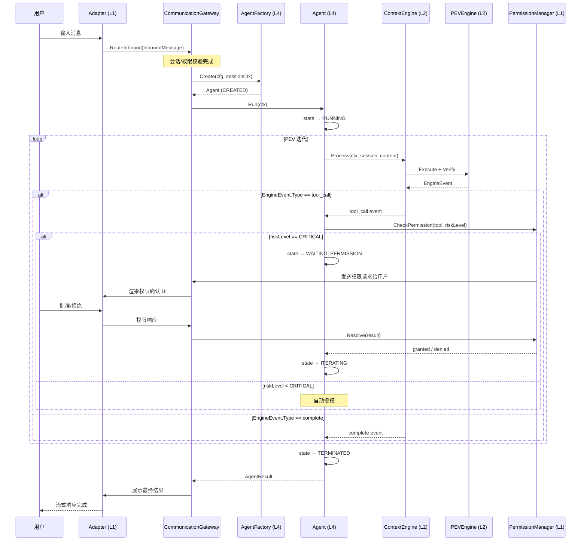
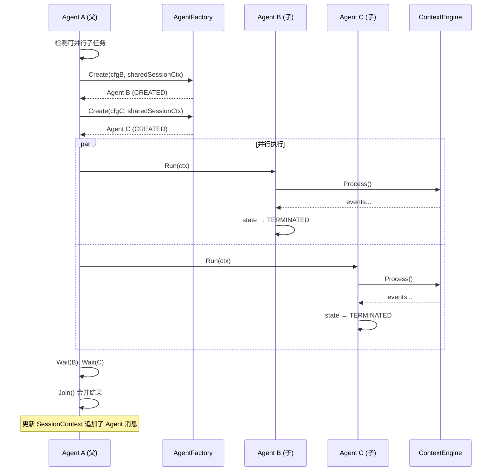
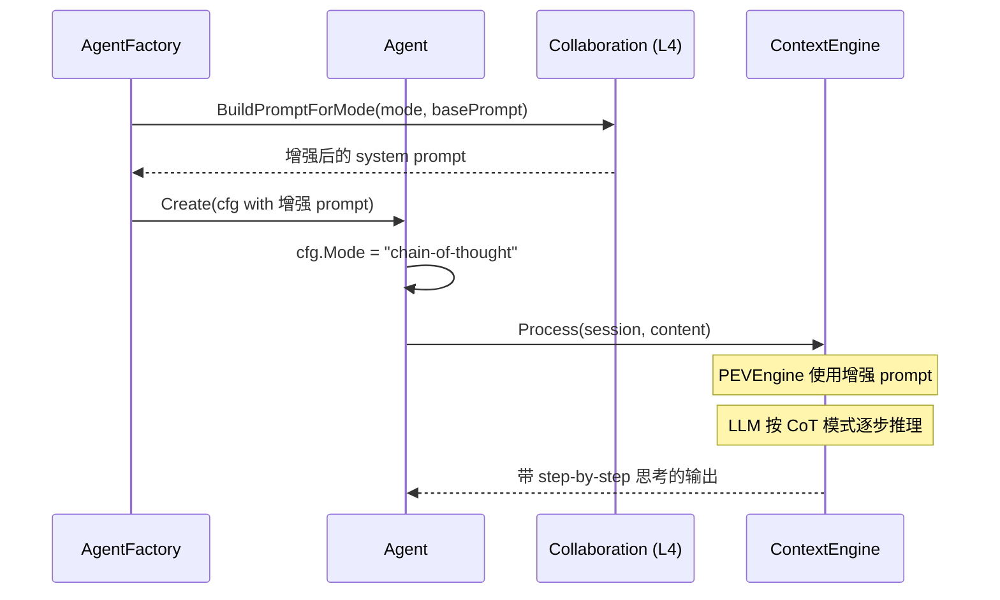

# Multi-Agent Layer 详细设计（Layer 4）

**文档类型:** 详细架构设计（遵循 `docs/detail design framework.md`）
**Change ID:** devrix-multi-agent
**Demand ID:** DM-20260608-005
**版本:** 1.0.0
**状态:** Design Review（Grill 审查通过，6 决策已合入，2026-06-08）  
**架构入口:** [architecture/code-map.md](./architecture/code-map.md) · D4-S10 Delegate  
**注意:** 下文部分仍写 PEVEngine；现行 Agent 通过 `IEngine.Process` 驱动 **QueryLoop**。

> **Grill 审查关键修正（详见 `openspec/changes/devrix-multi-agent/design.md`）：**
> 1. 权限模型：同步 PermissionManager → 异步 AgentPermissionGate（Agent 实现 IPermissionGate）
> 2. 跨层契约：提取 `contracts.IEngine`，Agent 不依赖 L1/L2 实现包
> 3. Fork 模型：共享指针+RWMutex → 消息隔离+Join 合并（消除并发写风险）
> 4. 限额策略：新增 MaxTotalAgents 全局限额兜底
> 5. 实施顺序：6 里程碑 → 4 PR（PR1 contracts → PR2 perm gate → PR3 Agent → PR4 bootstrap）

> **SoT（Source of Truth）映射：**
> - 可读架构文档：本文档
> - OpenSpec 实施设计：`openspec/changes/devrix-multi-agent/design.md`
> - 变更提案：`openspec/changes/devrix-multi-agent/proposal.md`
> - 需求澄清：`openspec/changes/devrix-multi-agent/demand.md`
> - 任务分解：`openspec/changes/devrix-multi-agent/tasks.md`
> - 验收规格（Gherkin）：`openspec/changes/devrix-multi-agent/specs/multi-agent/spec.md`

---

## 文档索引

| 文档 | 用途 |
|------|------|
| 本文档 | 按六段式框架展开的**可读架构设计**（评审 / onboarding） |
| `openspec/specs/multi_agent_layer_delta.md` | 层能力 Delta SoT（Gherkin Scenario） |
| `openspec/changes/devrix-multi-agent/design.md` | OpenSpec 实施设计（包结构、代码骨架、版本分期） |
| `openspec/t-registry.md` | {T}-AGENT 测试点注册（P0/P1/P2 优先级） |
| `openspec/specs/d4-multi-agent/span-registry.md` | Span 注册表（6 ops，agent_tool） |

---

## ① 架构目标

### 业务目标

| 痛点 | 目标能力 | 用户可感知结果 |
|------|----------|----------------|
| 单 Agent 无法并行处理独立子任务 | Fork/Join 子 Agent 机制 | 复杂任务自动分解并行，缩短总耗时 |
| 不同任务需要不同推理策略 | CollaborationMode 配置 | 用户可按需选择 CoT / Iterative-Refinement 模式 |
| 工具执行缺乏统一风险管控 | 复用 gateway.PermissionManager | CRITICAL 工具执行前强制用户确认 |
| Agent 生命周期不可观测 | Agent 状态机 + Observer 适配 | 用户可见 Agent 状态变化（运行中/等待权限/已完成） |

### 技术目标（量化）

| 指标 | V1 目标 | 测量方式 |
|------|---------|----------|
| **Agent 创建延迟** | P99 < 10ms | `agent.create` span duration |
| **单次迭代延迟** | P99 < 5s（不含 LLM 调用） | `agent.iterate` span duration |
| **Fork 创建延迟** | P99 < 15ms | `agent.fork` span duration |
| **Join 合并延迟** | P99 < 5ms | `agent.join` span duration |
| **并行子 Agent 上限** | 单 Session 3 个 | `AgentConfig.MaxChildren` 硬限制 |
| **权限超时默认** | 60 秒（复用 `gateway.PermissionManager`） | PermissionManager 配置 |
| **状态转换原子性** | 100% 合法转换（不允许非法跳转） | 状态机单元测试全覆盖 |
| **并发安全** | 无 data race | `-race` 测试门禁 |

### 约束条件

| 类型 | 约束 | 设计响应 |
|------|------|----------|
| **架构** | 不得反向依赖 L1 Communication | 仅通过 `IContextEngine` 接口与 L2 交互 |
| **架构** | 不得直接调用 LLM | 委托 `IContextEngine.Process()` 驱动 QueryLoop |
| **复用** | 不复建 Tool Registry | 复用 `contextengine/registry` |
| **复用** | 不复建 Permission 管线 | 委托 `gateway.PermissionManager` |
| **复用** | 不复建 Observer 体系 | 适配器桥接到 `contextengine.IObserver` |
| **版本** | V1 不实现 Supervisor-Worker、Peer-Review | 明确 FeatureNotImplemented |
| **测试** | 遵守测试框架规约 | {T}-AGENT-* 测试点 + `tests/` 分层 |
| **安全** | Agent 沙箱不可逃逸 | 工具执行复用 `contextengine/enforce/toolrunner` 沙箱 |

---

## ② 架构原则

### 设计原则

| 原则 | Multi-Agent 层落地 |
|------|-------------------|
| **状态机驱动** | Agent 生命周期严格遵循 `CREATED → RUNNING → ITERATING → WAITING_PERMISSION → TERMINATED` |
| **复用优于新建** | Tool Registry / PermissionManager / Observer 全部复用现有组件 |
| **父子共享指针** | Fork 时共享 `*types.SessionContext` 指针，V1 不实现完整 COW |
| **单向依赖** | L4 → L2 接口（`IContextEngine`）；L4 → L1 接口（`PermissionManager`）；禁止 L4 import L1/L3 实现包 |
| **小包高内聚** | 按功能拆分 subpackage，单文件 ≤ 400 行，单包 ≤ 500 行 |
| **接口即契约** | 小接口（1-3 方法），接口定义在消费方（`contracts.go`） |
| **可观测内建** | Agent 生命周期每个阶段通过 `ObserverAdapter` 桥接到 L2 `IObserver` |
| **面向失败设计** | 子 Agent 超时→TERMINATED；权限超时→PermissionTimeoutError；context 取消→优雅终止 |

### 命名规范

| 类别 | 规范 | 示例 |
|------|------|------|
| 包路径 | `internal/layers/multiagent/{子域}` | `multiagent/agent/lifecycle.go` |
| 接口 | 领域语义 + `I` 前缀 | `IAgentFactory`, `Agent` |
| 跨层契约 | 定义在 `multiagent/contracts.go` | `agent.AgentState` |
| 错误码 | `AGT_{DOMAIN}_{序号}` | `AGT_LIFECYCLE_5001` |
| 事件类型 | snake_case 字符串 | `agent.created`, `agent.forked`, `agent.terminated` |
| 配置键 | snake_case YAML | `multi_agent.max_children` |
| 状态常量 | UPPER_SNAKE_CASE | `AgentStateCreated` |

### 代码风格

- 单文件 ≤ 400 行；状态机 / 生命周期 / ForkJoin 各自独立文件
- 错误必须 wrap：`fmt.Errorf("agent fork: %w", err)`
- 禁止 goroutine leak：`Run()` 内部 goroutine 通过 context 取消 + `defer close(eventCh)`
- 日志使用 `slog` + `agent_id` / `session_id` / `trace_id`
- 不可变模式：状态转换返回新状态，不修改现有状态

---

## ③ 业务流程

### 3.1 核心用例：Agent 创建与执行（Happy Path）



**RT 预算（不含 LLM 推理）：**

| 步骤 | 目标 RT |
|------|---------|
| AgentFactory.Create | < 10ms |
| Agent.Run 启动 | < 5ms |
| 单次迭代（不含 LLM） | < 50ms |
| Permission Check | < 5ms |
| Join 结果合并 | < 5ms |
| 状态转换 | < 1ms |

### 3.2 核心用例：Fork/Join 并行子任务



### 3.3 核心用例：Collaboration Mode 生效



### 3.4 Agent 生命周期状态机

```
                    ┌─────────────┐
                    │   CREATED   │ ← AgentFactory.Create()
                    └──────┬──────┘
                           │ .Run()
                           ▼
                    ┌─────────────┐
            ┌──────▶│   RUNNING   │
            │       └──────┬──────┘
            │              │ Process() 返回
            │              ▼
            │       ┌──────────────┐
            │       │  ITERATING   │ ← PEV 迭代循环（对 Agent 透明）
            │       └──────┬───────┘
            │              │
            │     ┌────────┼────────┐
            │     │                 │
            │     ▼                 ▼
            │  ┌──────────────┐  ┌─────────────┐
            │  │ tool_call    │  │ 无 tool_call │
            │  │ (CRITICAL)   │  │ → complete   │
            │  └──────┬───────┘  └──────┬───────┘
            │         │                 │
            │         ▼                 │
            │  ┌────────────────────┐   │
            │  │ WAITING_PERMISSION │   │
            │  └────────┬───────────┘   │
            │           │               │
            │    ┌──────┼──────┐        │
            │    │      │      │        │
            │    ▼      ▼      ▼        │
            │ GRANTED DENIED TIMEOUT    │
            │    │      │      │        │
            │    │      ▼      ▼        │
            │    │   ┌──────────────┐   │
            │    │   │ error event  │   │
            │    │   └──────────────┘   │
            │    │                      │
            └────┼──────────────────────┘
                 │ 循环回到 ITERATING

                          │ (no more tool calls)
                          ▼
                   ┌─────────────┐
                   │ TERMINATED  │ ← 最终状态
                   └─────────────┘
```

**合法状态转换：**

| 当前状态 | 合法下一状态 | 触发条件 |
|----------|-------------|----------|
| CREATED | RUNNING | `Agent.Run()` 被调用 |
| RUNNING | ITERATING | `ContextEngine.Process()` 返回 EngineEvent |
| ITERATING | ITERATING | PEV 迭代循环（tool_call 后继续） |
| ITERATING | WAITING_PERMISSION | CRITICAL 工具触发权限确认 |
| ITERATING | TERMINATED | 无更多 tool_call，结果已产出 |
| WAITING_PERMISSION | ITERATING | 用户批准权限 |
| WAITING_PERMISSION | TERMINATED | 用户拒绝权限 / 超时 |
| any | TERMINATED | `Terminate()` 强制终止 / context 取消 |

> **注**：`AgentState` 为公开类型，`RUNNING` 和 `ITERATING` 两种状态对层外合并为 Agent 处于活跃状态，可通过 Observer 事件区分。

### 3.5 异常补偿

| 异常 | 检测点 | 补偿策略 | 幂等 |
|------|--------|----------|------|
| Fork 数超限 | AgentFactory.Create | 返回 `AGT_FACTORY_5002`，拒绝新建 | 同请求重试结果一致 |
| 子 Agent 超时 | Agent.Wait | `AGT_LIFECYCLE_5005`，子 Agent 强制 TERMINATED | Wait 可重试 |
| Context 取消 | ctx.Done / `/stop` | 所有子 Agent 传播取消，优雅终止 | 取消信号幂等 |
| 权限超时 | PermissionManager | `AGT_PERMISSION_5007`，工具不执行 | 用户重发消息重新触发 |
| 状态非法转换 | Agent 状态机 | `AGT_LIFECYCLE_5003`，panic recovery + error event | — |
| Join 时子 Agent 未完成 | Agent.Join | `AGT_FORK_5004`，调用者应在 Wait 后 Join | Wait 后重试 |
| SessionContext 并发写冲突 | Fork/Join | `sync.RWMutex` 锁定，追加消息而非修改 | 追加操作天然幂等 |

### 3.6 分支：Fork 触发条件

```
Agent 收到 EngineEvent
  → event 包含 tool_call?
    否 → 继续 ITERATING 循环
    是 → tool_call 需要子任务并行?
          否 → 由 PEVEngine 内部处理（普通工具执行）
          是 → Agent.Fork(cfg)
                → 检查 MaxChildren 限制
                     超限 → AGT_FACTORY_5002
                     未超限 → 创建子 Agent → 并行执行 → Join
```

---

## ④ 领域模型

### 4.1 限界上下文

```
┌──────────────────────────────────────────────────────────────────────┐
│  Devrix 系统                                                          │
│  ┌──────────────────┐   ┌─────────────────────────────────────────┐  │
│  │ Communication    │   │ Context Engine (L2)                     │  │
│  │ 会话/适配/权限    │──▶│ PEV/压缩/记忆                           │  │
│  └────────┬─────────┘   └────────────────┬────────────────────────┘  │
│           │                              │                            │
│           │     ┌────────────────────────┼──────────────────┐         │
│           │     │  Multi-Agent (L4, 本上下文)                │         │
│           │     │  ┌──────────────────────────────────────┐ │         │
│           │     │  │ Agent 生命周期 / Fork/Join / Mode   │ │         │
│           │     │  └──────────────────────────────────────┘ │         │
│           │     │  委托：IContextEngine / PermissionManager │         │
│           │     └───────────────────────────────────────────┘         │
│           │                              │                            │
│           ▼                              ▼                            │
│    ┌──────────┐                  ┌──────────────┐                     │
│    │ LLM GW   │                  │ Observability│                     │
│    └──────────┘                  └──────────────┘                     │
└──────────────────────────────────────────────────────────────────────┘
```

**Multi-Agent 层边界：** 管理「Agent 实例的创建、生命周期、并行编排」；不管理 LLM 调用（委托 L2）、不管理工具执行（委托 L2 PEVEngine）、不管理权限 UI（委托 L1 PermissionManager）。

### 4.2 聚合根

| 聚合根 | 职责 | 持久化 |
|--------|------|--------|
| **Agent** | ID、State、Config、子 Agent 列表、SessionContext 引用 | 不持久化（进程内） |
| AgentFactory | 创建 Agent、校验 Fork 限制 | 无状态 |

> V1 Agent 不持久化。会话重建时通过 SessionContext 中的消息历史恢复上下文，Agent 实例按需重新创建。

### 4.3 实体与值对象

```
Agent (聚合根)
├── id                    string
├── state                 AgentState (值对象, enum)
├── config                AgentConfig (值对象)
├── sessionCtx            *types.SessionContext (共享引用)
├── engine                gateway.IContextEngine (依赖注入)
├── observer              contextengine.IObserver (适配器注入)
├── childAgents           map[string]*Agent (实体引用, 1:N)
├── result                *AgentResult (值对象, 仅在 TERMINATED 时非 nil)
└── mu                    sync.RWMutex

AgentConfig (值对象)
├── SessionID             string
├── WorkDir               string
├── Mode                  CollaborationMode
├── MaxIter               int (默认 50)
├── MaxChildren           int (硬限制 3)
├── Timeout               time.Duration (默认 5min)
├── SystemPrompt          string (基础 prompt，不含 Mode 增强)
└── ParentID              string (空 = 根 Agent)

AgentResult (值对象)
├── Messages              []types.Message
├── ExitCode              int
├── Error                 error
└── Duration              time.Duration

CollaborationMode (值对象, string enum)
├── ModeChainOfThought         "chain-of-thought"
├── ModeIterativeRefinement    "iterative-refinement"
└── ModeDefault                "default"

AgentState (值对象, int enum)
├── AgentStateCreated           0
├── AgentStateRunning          1
├── AgentStateIterating        2
├── AgentStateWaitingPermission 3
├── AgentStateTerminated       4
```

### 4.4 领域事件

| 事件 | 触发 | 消费者 | 是否上报告警 |
|------|------|--------|-------------|
| `agent.created` | AgentFactory.Create 成功 | ObserverAdapter → IObserver | 否 |
| `agent.started` | Agent.Run 开始 | ObserverAdapter → IObserver | 否 |
| `agent.iterating` | 每次 PEV 迭代 | ObserverAdapter → IObserver | 否 |
| `agent.waiting_permission` | CRITICAL 工具触发权限确认 | ObserverAdapter → IObserver | 否 |
| `agent.forked` | Fork 创建子 Agent | ObserverAdapter → IObserver | 否 |
| `agent.joined` | Join 合并子 Agent 结果 | ObserverAdapter → IObserver | 否 |
| `agent.terminated` | Agent 进入 TERMINATED | ObserverAdapter → IObserver | 否 |
| `agent.error` | 任何不可恢复错误 | ObserverAdapter → IObserver | 是（ERROR 级别日志） |

### 4.5 模型关系图

```
┌──────────────────┐      1:1      ┌──────────────────┐
│   AgentFactory   │──────────────▶│     Agent        │
│   (无状态工厂)     │   Create()    │   (聚合根)       │
└──────────────────┘               └────────┬─────────┘
                                           │
               ┌───────────────────────────┼───────────────────────┐
               │                           │                       │
               ▼                           ▼                       ▼
       ┌──────────────┐           ┌──────────────┐        ┌──────────────┐
       │  AgentConfig │           │ AgentState   │        │ Agent[]      │
       │  (值对象)     │           │ (值对象)     │        │ (子 Agent)   │
       └──────┬───────┘           └──────────────┘        └──────────────┘
              │
              ▼
       ┌──────────────┐
       │CollaborationMode│
       │  (值对象)     │
       └──────────────┘

┌──────────────────┐      1:N      ┌──────────────────┐
│     Agent        │──────────────▶│     Agent        │
│   (父 Agent)     │  Fork/Join    │   (子 Agent)     │
└──────────────────┘               └──────────────────┘
        │                                   │
        │                                   │
        ▼                                   ▼
┌──────────────────┐               ┌──────────────────┐
│ *SessionContext  │◀──────共享────▶│ *SessionContext  │
│  (同一个指针)    │               │   (同一个指针)    │
└──────────────────┘               └──────────────────┘
        │
        │ 委托
        ▼
┌──────────────────┐
│ IContextEngine   │  ← ContextEngine.Process()（L2）
│ PermissionManager│  ← gateway.PermissionManager（L1）
└──────────────────┘
```

---

## ⑤ 核心链路图

### 5.1 端到端路径（标注 SLA）

```
用户终端
  │ <10ms
  ▼
CLI/Feishu Adapter (L1)
  │ <5ms
  ▼
CommunicationGateway.RouteInbound (L1)
  │ <50ms
  ▼
AgentFactory.Create ──────────────────────────────────────┐
  │ <10ms                                                 │
  ▼                                                       │
Agent.Run(ctx) ───────────────────────────────────────────┤
  │                                                        │ 引擎域
  ├─ 状态转换: CREATED→RUNNING           <1ms             │ (本层 SLA)
  ├─ 驱动 ContextEngine.Process()       <5ms 启动        │ P99 <100ms
  │     └─ PEVEngine.Execute+Verify     【L2 域】         │ (不含 LLM)
  ├─ 权限检查 (CRITICAL 工具)              <5ms             │
  │     └─ PermissionManager.Request     【L1 域】         │
  ├─ Fork (如需要)                        <15ms            │
  │     ├─ AgentFactory.Create (子)       <10ms            │
  │     └─ 子 Agent.Run                   并行执行          │
  ├─ Join (如需要)                        <5ms             │
  ├─ 状态转换: →TERMINATED              <1ms             │
  └─ 组装 AgentResult                      <5ms             │
  │ <5ms                                                  ┘
  ▼
AgentResult → CommunicationGateway → Adapter 渲染
  │
  ▼
用户看到最终结果
```

### 5.2 瓶颈与优化策略

| 潜在瓶颈 | 占比预估 | 优化 |
|----------|----------|------|
| LLM 推理等待 | **外部主瓶颈** | 不属于本层 SLA，但 Fork 可并行分散 |
| ContextEngine.Process | 80%（加 LLM 后） | Agent 层不做额外处理 |
| 权限等待（用户未响应） | 不确定 | 60s 超时自动拒绝 |
| Fork 创建开销 | <2% | V1 足够；V2 可对象池化 |
| Join 合并开销 | <1% | 追加消息，O(n) n=子 Agent 数 ≤3 |

### 5.3 单点风险

| 节点 | 风险 | 缓解 |
|------|------|------|
| Agent 实例不持久化 | 进程崩溃丢 Agent 状态 | 通过 SessionContext 消息历史可恢复上下文 |
| 共享 SessionContext 指针 | 并发写入 race | `sync.RWMutex`；写操作追加不修改 |
| 单 Session 3 并行上限 | 复杂任务 Fork 不足 | V2 可调整为可配置 |
| 父 Agent 阻塞等子 Agent | 子 Agent 超时兜底 | `AgentConfig.Timeout` 传播到子 Agent |

---

## ⑥ 接口 / API 设计

> Multi-Agent 层为**进程内模块**，无 HTTP 暴露；「API」指 Go 接口契约与事件协议。

### 6.1 核心接口

```go
// ============================================
// contracts.go — 类型定义与常量
// ============================================

// AgentState Agent 生命周期状态
type AgentState int

const (
    AgentStateCreated           AgentState = iota // 0: 已创建
    AgentStateRunning                              // 1: 运行中
    AgentStateIterating                            // 2: 迭代中
    AgentStateWaitingPermission                    // 3: 等待权限
    AgentStateTerminated                           // 4: 已终止
)

func (s AgentState) String() string { ... }
func (s AgentState) IsActive() bool { return s >= AgentStateRunning && s <= AgentStateWaitingPermission }
func (s AgentState) IsTerminal() bool { return s == AgentStateTerminated }

// CollaborationMode 协作模式（配置类型，非接口）
type CollaborationMode string

const (
    ModeChainOfThought      CollaborationMode = "chain-of-thought"
    ModeIterativeRefinement CollaborationMode = "iterative-refinement"
    ModeDefault             CollaborationMode = "default"
)

// AgentConfig Agent 创建配置
type AgentConfig struct {
    SessionID    string
    WorkDir      string
    Mode         CollaborationMode
    MaxIter      int           // 默认 50
    MaxChildren  int           // 默认 3，硬限制
    Timeout      time.Duration // 默认 5min
    ParentID     string        // 空表示根 Agent
}

// AgentResult Agent 执行结果
type AgentResult struct {
    Messages []types.Message
    ExitCode int
    Error    error
    Duration time.Duration
}

// ============================================
// IAgentFactory 创建 Agent 实例
// ============================================
type IAgentFactory interface {
    // Create 创建新 Agent 实例
    // ctx 用于取消创建过程
    // cfg 包含 SessionID、Mode、超时等配置
    // sessionCtx 共享的会话上下文指针（Fork 时传入父 Agent 的指针）
    Create(ctx context.Context, cfg AgentConfig, sessionCtx *types.SessionContext) (Agent, error)
}

// ============================================
// Agent 主接口
// ============================================
type Agent interface {
    // ID 返回 Agent 唯一标识
    ID() string

    // State 返回当前生命周期状态
    State() AgentState

    // Config 返回 Agent 配置（只读副本）
    Config() AgentConfig

    // Run 执行 Agent 主循环
    // 委托 IContextEngine.Process() 驱动 PEVEngine
    // 阻塞直到 Agent 完成或出错
    // 返回 AgentResult（也通过 Wait() 获取）
    Run(ctx context.Context) (*AgentResult, error)

    // Fork 创建子 Agent
    // 共享父 Agent 的 SessionContext 指针
    // V1 简化版：同步等待子 Agent 完成后返回结果，不立即 Join
    Fork(ctx context.Context, cfg AgentConfig) (Agent, error)

    // Join 合并子 Agent 的结果到父 Agent
    // 子 Agent 必须先 Wait 完成
    Join(ctx context.Context, child Agent) error

    // Terminate 强制终止 Agent
    // 传播取消到 ContextEngine 和所有子 Agent
    Terminate(ctx context.Context) error

    // Wait 等待 Agent 完成并获取结果
    // 阻塞直到 Agent 进入 TERMINATED 状态
    Wait(ctx context.Context) (*AgentResult, error)
}

// ============================================
// AgentDeps Agent 构造依赖
// ============================================
type AgentDeps struct {
    Engine           gateway.IContextEngine
    PermissionMgr    gateway.PermissionManager
    Observer         contextengine.IObserver  // 通过 ObserverAdapter 桥接
}
```

### 6.2 接口合规断言

```go
// agent/agent.go
var _ Agent = (*agentImpl)(nil)

// factory/factory.go
var _ IAgentFactory = (*AgentFactory)(nil)
```

### 6.3 事件协议（AgentEvent）

Agent 通过 Observer 上报告生命周期事件，不另建事件总线：

```go
// observer/adapter.go

// AgentEvent Agent 层上报给 Observer 的事件结构
type AgentEvent struct {
    AgentID     string
    ParentID    string
    SessionID   string
    EventType   string      // "agent.created", "agent.started", ...
    State       AgentState
    Mode        CollaborationMode
    Timestamp   time.Time
    Metadata    map[string]any  // 额外上下文（如子 Agent 数）
}
```

### 6.4 错误码体系

| 错误码 | 常量名 | 含义 | 是否可恢复 |
|--------|--------|------|-----------|
| 5001 | `AGT_LIFECYCLE_INVALID_TRANSITION` | 非法状态转换 | 否（程序 bug） |
| 5002 | `AGT_FACTORY_MAX_CHILDREN` | 子 Agent 数超限 | 否（用户需等待或取消现有） |
| 5003 | `AGT_LIFECYCLE_ALREADY_TERMINATED` | 已终止 Agent 被再次操作 | 否 |
| 5004 | `AGT_FORK_JOIN_NOT_COMPLETED` | Join 时子 Agent 未完成 | 是（先 Wait 再 Join） |
| 5005 | `AGT_LIFECYCLE_TIMEOUT` | Agent 执行超时 | 是（用户可重试） |
| 5006 | `AGT_FACTORY_INVALID_CONFIG` | AgentConfig 参数不合法 | 否 |
| 5007 | `AGT_PERMISSION_TIMEOUT` | 权限确认超时（60s） | 是（用户重发） |
| 5008 | `AGT_PERMISSION_DENIED` | 用户拒绝权限 | 是（用户换指令） |
| 5009 | `AGT_CONTEXT_CANCELLED` | Context 被取消 | 是（用户重新触发） |

### 6.5 错误实现模式

```go
// internal/shared/errors/multiagent.go

// 复用在 shared/errors/ 中的 SentinelError
const (
    ErrCodeAgentInvalidTransition   = "AGT_LIFECYCLE_5001"
    ErrCodeAgentMaxChildren         = "AGT_FACTORY_5002"
    ErrCodeAgentAlreadyTerminated   = "AGT_LIFECYCLE_5003"
    ErrCodeAgentJoinNotCompleted    = "AGT_FORK_5004"
    ErrCodeAgentTimeout             = "AGT_LIFECYCLE_5005"
    ErrCodeAgentInvalidConfig       = "AGT_FACTORY_5006"
    ErrCodeAgentPermissionTimeout   = "AGT_PERMISSION_5007"
    ErrCodeAgentPermissionDenied    = "AGT_PERMISSION_5008"
    ErrCodeAgentContextCancelled    = "AGT_CONTEXT_5009"
)

func NewAgentInvalidTransitionError(from, to AgentState) *SentinelError {
    return WithCode(ErrCodeAgentInvalidTransition,
        fmt.Sprintf("非法状态转换: %s → %s", from, to), nil)
}

func NewAgentMaxChildrenError(current, max int) *SentinelError {
    return WithCode(ErrCodeAgentMaxChildren,
        fmt.Sprintf("子 Agent 数超限: 当前 %d, 最大 %d", current, max), nil)
}
```

### 6.6 Collaboration Mode Prompt 生成

```go
// collaboration/prompt.go

// BuildPromptForMode 根据 mode 增强 system prompt
func BuildPromptForMode(mode CollaborationMode, basePrompt string) string {
    var enhancement string
    switch mode {
    case ModeChainOfThought:
        enhancement = "\n\n## 推理模式：Chain-of-Thought\n" +
            "请逐步推理，每一步都要明确说明你的理由。" +
            "最终答案前用【最终答案】标记。"
    case ModeIterativeRefinement:
        enhancement = "\n\n## 推理模式：Iterative Refinement\n" +
            "请先给出初始答案，然后进行自我批判（指出不足），" +
            "最后在【改进答案】后给出改进版本。"
    default:
        return basePrompt
    }
    return basePrompt + enhancement
}
```

---

## ⑦ 目录结构

```
internal/layers/multiagent/
│
├── contracts.go              # 类型定义、常量、接口（约 120 行）
│                              # - AgentState (int enum + String/IsActive/IsTerminal)
│                              # - CollaborationMode (string enum)
│                              # - AgentConfig
│                              # - AgentResult
│                              # - IAgentFactory 接口
│                              # - Agent 接口
│                              # - AgentDeps
│
├── agent/
│   ├── agent.go              # Agent 主实体（约 180 行）
│   │                          # - agentImpl struct
│   │                          # - NewAgent() 构造函数
│   │                          # - ID() / State() / Config() getter
│   │   Run()                  # - 主循环实现
│   │   Fork()                 # - Fork 入口（调用 factory）
│   │   Join()                 # - Join 结果合并
│   │   Terminate()            # - 强制终止
│   │   Wait()                 # - 阻塞等待完成
│   │
│   ├── state.go              # 状态机（约 80 行）
│   │                          # - AgentState 类型方法
│   │                          # - transition(from, to) 校验 + 执行
│   │                          # - ValidTransitions map
│   │
│   ├── lifecycle.go          # Run/Terminate/Wait 实现（约 200 行）
│   │                          # - runLoop() 主循环
│   │                          # - handleEngineEvent() 事件分发
│   │                          # - handleToolCall() 工具调用处理
│   │                          # - handlePermission() 权限确认
│   │
│   ├── forkjoin.go           # Fork/Join 实现（约 150 行）
│   │                          # - fork() 创建子 Agent
│   │                          # - join() 合并结果到 SessionContext
│   │                          # - collectChildResults() 收集子 Agent 结果
│   │
│   └── agent_test.go         # 单元测试（约 300 行）
│                              # - TestAgentLifecycle
│                              # - TestAgentForkJoin
│                              # - TestAgentStateTransitions
│                              # - TestAgentPermissionFlow
│
├── factory/
│   ├── factory.go             # AgentFactory 实现（约 120 行）
│   │                          # - AgentFactory struct
│   │                          # - Create() 方法
│   │                          # - validateConfig() 校验
│   │                          # - NewAgentFactory() 构造函数
│   │
│   └── factory_test.go        # 单元测试（约 100 行）
│
├── collaboration/
│   ├── mode.go               # CollaborationMode 配置类型（约 30 行）
│   │                          # - 常量定义
│   │                          # - Validate() 校验方法
│   │
│   ├── prompt.go             # BuildPromptForMode()（约 50 行）
│   │                          # - BuildPromptForMode(mode, base) string
│   │                          # - 各模式的 prompt 增强模板
│   │
│   └── mode_test.go           # 单元测试（约 60 行）
│
└── observer/
    ├── adapter.go            # Agent → contextengine.IObserver 适配器（约 80 行）
    │                          # - ObserverAdapter struct
    │                          # - EmitAgentEvent(event) 桥接到 IObserver
    │                          # - 事件类型映射
    │
    └── noop.go               # NoOp 实现（约 20 行）
                               # - NoOpObserverAdapter
```

### 文件行数预估

| 文件 | 预估行数 | 职责 |
|------|----------|------|
| `contracts.go` | 120 | 类型、接口、常量 |
| `agent/agent.go` | 180 | 主实体 + 构造函数 |
| `agent/state.go` | 80 | 状态机 |
| `agent/lifecycle.go` | 200 | 主循环 + 权限处理 |
| `agent/forkjoin.go` | 150 | Fork/Join |
| `agent/agent_test.go` | 300 | 测试 |
| `factory/factory.go` | 120 | 工厂实现 |
| `factory/factory_test.go` | 100 | 测试 |
| `collaboration/mode.go` | 30 | Mode 常量 |
| `collaboration/prompt.go` | 50 | Prompt 生成 |
| `collaboration/mode_test.go` | 60 | 测试 |
| `observer/adapter.go` | 80 | 适配器 |
| `observer/noop.go` | 20 | NoOp |
| **合计** | **~1490** | |

---

## ⑧ 配置设计

### 8.1 YAML 配置（devrix.yaml）

```yaml
# Multi-Agent Layer (L4) 配置
multi_agent:
  # 单 Session 最大并行子 Agent 数（硬限制）
  max_children: 3

  # Agent 默认超时时间
  default_timeout: "5m"

  # 默认最大迭代次数
  default_max_iter: 50

  # 权限超时（复用 gateway.PermissionManager 的 timeout，此处仅为 Agent 侧的重试配置）
  permission_timeout: "60s"

  # 默认协作模式 ("default" | "chain-of-thought" | "iterative-refinement")
  default_mode: "default"
```

### 8.2 配置类型（Go）

```go
// internal/shared/config/multiagent.go

// MultiAgentFileConfig YAML 文件对应结构
type MultiAgentFileConfig struct {
    MaxChildren       int           `yaml:"max_children"`
    DefaultTimeout    time.Duration `yaml:"default_timeout"`
    DefaultMaxIter    int           `yaml:"default_max_iter"`
    PermissionTimeout time.Duration `yaml:"permission_timeout"`
    DefaultMode       string        `yaml:"default_mode"`
}

// MultiAgentConfig 运行时配置（已解析/校验/合并默认值）
type MultiAgentConfig struct {
    MaxChildren       int
    DefaultTimeout    time.Duration
    DefaultMaxIter    int
    PermissionTimeout time.Duration
    DefaultMode       CollaborationMode
}

func DefaultMultiAgentConfig() MultiAgentConfig {
    return MultiAgentConfig{
        MaxChildren:       3,
        DefaultTimeout:    5 * time.Minute,
        DefaultMaxIter:    50,
        PermissionTimeout: 60 * time.Second,
        DefaultMode:       ModeDefault,
    }
}

// BuildMultiAgentConfig 从文件配置构建运行时配置
func BuildMultiAgentConfig(file MultiAgentFileConfig) MultiAgentConfig {
    cfg := DefaultMultiAgentConfig()
    if file.MaxChildren > 0 {
        cfg.MaxChildren = file.MaxChildren
    }
    // ... 其他字段合并
    return cfg
}
```

---

## ⑨ 可观测性集成

完整的 Span 注册表、Trace Tree、Metrics 定义见独立文件：
`openspec/specs/d4-multi-agent/span-registry.md`

Multi-Agent 层通过 `observability.Bridge` 集成 OpenTelemetry，包含 6 个 Operation（agent_tool）、8 个 Metrics。

> **注意：** 本文档旧版内联的 `agent.create`、`agent.iterate`、`agent.permission_check` 常量已不再存在于代码中。以 `span-registry.md` 和 `telemetry/names.go` 为权威来源。

---

## ⑩ 与其他层的关系

| 层 | 关系 | 接口/组件 | 数据方向 |
|----|------|----------|---------|
| L1 Communication | **启动 Agent**：Gateway 调用 AgentFactory.Create | `IAgentFactory` | L1 → L4 |
| L1 Communication | **权限委托**：Agent 调用 PermissionManager | `gateway.PermissionManager` | L4 → L1 |
| L2 Context Engine | **核心委托**：Agent 通过 Process() 驱动 PEVEngine | `gateway.IContextEngine` | L4 → L2 |
| L2 Context Engine | **Observer 桥接**：Agent 事件适配到 IObserver | `contextengine.IObserver` | L4 → L2 |
| L2 Context Engine | **工具注册复用**：不新建，直接引用 L2 | `contextengine.IToolRegistry` | L4 → L2 |
| L3 LLM Gateway | **间接**：通过 PEVEngine 调用（Agent 不直接调用） | （无直接接口） | L4 → L2 → L3 |
| T 层 Observability | **内建追踪**：Agent 创建 Span/Metric | `observability.Bridge` | L4 → L5 |

### 与 L1 CommunicationGateway 的集成点

```go
// CommunicationGateway 中新增：
type CommunicationGateway struct {
    // ... 现有字段
    agentFactory multiagent.IAgentFactory  // V1 新增，可选
}

// 当检测到需要 Fork 的指令时（V1 由用户 "/fork" 命令触发，V2 由 PEV 自动检测）：
func (g *CommunicationGateway) handleForkCommand(session *types.Session, cmd string) {
    cfg := multiagent.AgentConfig{
        SessionID: session.ID,
        WorkDir:   session.WorkDir,
        Mode:      multiagent.ModeDefault,
        ParentID:  "",  // 根 Agent
    }
    agent, err := g.agentFactory.Create(ctx, cfg, session.Context)
    // ...
}
```

---

## ⑪ 测试策略

### 11.1 测试金字塔

```
         ┌─────┐
         │ E2E │  ← tests/e2e/agent_fork_e2e_test.go
         ├─────┤
         │集成 │  ← tests/integration/agent_integration_test.go
         ├─────┤
         │单元 │  ← agent/agent_test.go, factory/factory_test.go, ...
         └─────┘
```

### 11.2 T 层测试点

完整的测试点清单见 `openspec/specs/d4-multi-agent/t-registry.md`（38 条：38 IMPLEMENTED，P0 19 条）。本文档不重复列出。

### 11.3 Mock 策略

| Mock 对象 | 位置 | 说明 |
|-----------|------|------|
| MockContextEngine | `tests/testutil/mock_contextengine.go` | 模拟 Process() 返回可控事件流 |
| MockPermissionManager | `tests/testutil/mock_permission.go` | 模拟权限批准/拒绝/超时 |
| StubObserver | `multiagent/observer/noop.go` 本身即 stub | 测试中注入 NoOpObserverAdapter |

### 11.4 测试文件对应

测试文件与源文件对应关系见 `openspec/specs/d4-multi-agent/t-registry.md` 中的 Test 位置列。

---

## ⑫ 引导集成（Bootstrap）

### 12.1 Wire 函数

```go
// internal/bootstrap/multi_agent.go

// WireMultiAgent 构建 Multi-Agent 层
// 返回 IAgentFactory，注入到 CommunicationGateway
func WireMultiAgent(
    engine gateway.IContextEngine,
    permMgr gateway.PermissionManager,
    observer contextengine.IObserver,
    config config.MultiAgentConfig,
) multiagent.IAgentFactory {
    deps := multiagent.AgentDeps{
        Engine:        engine,
        PermissionMgr: permMgr,
        Observer:      observer,
    }
    return multiagent.NewAgentFactory(deps, config)
}
```

### 12.2 Bootstrap 调用链

```
cmd/devrix/main.go
  → bootstrap.WireCommunicationGateway()
    → bootstrap.WireMultiAgent(
        contextEngine,   // L2 已构建
        permMgr,         // L1 已构建
        observerAdapter, // L4→L2 适配器
        multiAgentCfg,   // config.BuildMultiAgentConfig()
      )
    → gateway.NewCommunicationGateway(deps + agentFactory)
```

---

## ⑬ 关键设计决策

| 决策 | 选择 | 理由 | 备选方案（被拒绝） |
|------|------|------|-------------------|
| Tool Registry | 复用 `contextengine/registry` | 避免重复维护；工具定义应统一 | 自建 registry（会导致工具定义分裂） |
| Permission | 委托 `gateway.PermissionManager` | 已有完整用户交互管线；权限超时/审计已实现 | 自建 PermissionPipeline（重复建设） |
| Agent ↔ PEVEngine | Agent 委托 PEVEngine，非替代 | PEVEngine 已实现 Execute→Verify 循环；Agent 层是协调者 | Agent 直接调用 LLM（破坏分层，PEV 循环需要重新实现） |
| SharedContext | 直接共享 `*types.SessionContext` 指针 | V1 简化；子 Agent 只需追加消息 | 完整 COW（实现复杂，V1 不需要） |
| CollaborationMode | 配置类型 + prompt 生成器 | 本质是 system prompt 的差异，无需独立消息处理器 | 独立接口 + 消息处理器（过度设计） |
| Observer | 适配器桥接到 `contextengine.IObserver` | 复用现有事件管线；用户可见统一的 Agent 状态流 | 自建事件总线（增加复杂度且与 L2 重复） |
| Agent 持久化 | V1 不持久化 | Agent 状态可从 SessionContext 消息历史恢复 | 持久化 Agent 状态（V1 增加 I/O 开销，收益低） |
| Fork 后同步等待 | V1 Fork→Wait→Join 同步模型 | 避免复杂的异步编排；用户感知是"并行执行" | 全异步 Fork + callback（V2 计划） |
| 子 Agent 数上限 | 硬限制 3 | 防止资源耗尽；简单有效 | 可配置无上限（可能导致 OOM） |
| 错误码前缀 | `AGT_*` 命名空间 | 与 L2 `CTX_*`、L3 `LLM_*` 统一前缀约定 | — |

---

## ⑭ 后续规划

| 阶段 | 功能 | 前置条件 | 预计变更量 |
|------|------|----------|-----------|
| V1.1 | Fork 异步化（不阻塞父 Agent 迭代） | V1 稳定 | 约 200 行 |
| V1.1 | 子 Agent 数量可配置（非硬编码 3） | 性能测试通过 | 约 30 行 |
| V2 | Supervisor-Worker 模式（Agent 自动检测可并行子任务） | PEV Plan 阶段可用 | 约 500 行 |
| V2 | 完整 COW（SessionContext 写时复制） | 性能基准确定 | 约 300 行 |
| V2 | Agent 持久化 + 恢复 | COW 实现 | 约 200 行 |
| V3 | Peer-Review 模式（多 Agent 交叉审查） | Milestone DAG 可用 | 约 600 行 |
| V3 | Vote-Consensus 模式（多 Agent 投票决策） | Agent 组管理 | 约 400 行 |
| V3 | Full Fork/Merge + Milestone DAG | 复杂依赖图 | 约 800 行 |

---

## ⑮ 参考索引

| 文档 | 位置 |
|------|------|
| 本文档 | `docs/multi-agent-design.md` |
| OpenSpec Delta | `openspec/specs/multi_agent_layer_delta.md` |
| L2 Context Engine 设计 | `docs/context-engine-design.md` |
| L3 LLM Gateway 设计 | `docs/llm-gateway-design.md` |
| T 层注册表 | `openspec/t-registry.md` |
| 详细设计框架 | `docs/detail design framework.md` |
| 测试框架规约 | `.cursor/rules/08-testing-framework.mdc` |
| 项目元数据 | `openspec/project.md` |
