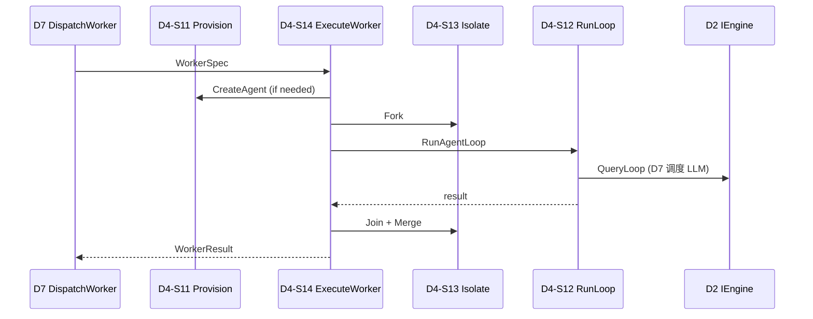

# D4 Multi-Agent — 终态流程指南

**Capability:** d4-multi-agent
**Status:** Active
**Version:** 1.0.0
**Last Updated:** 2026-06-16
**Parent:** `d4-domain.md`
**Complements:** `d7-boundary.md` · `../d7-orchestration/terminal-state-guide.md`

> D4 = **Delegation Execution Follower**。Hub-Spoke 编排与 Flow 发布归 **D7**。

---

## 1. 文档分工

| 主题 | 本文 | SoT |
|------|------|-----|
| D7→D4 Worker 派发时序 | ✅ | `d7-boundary.md` |
| S11–S16 A 树 | ✅ | `a-registry.md` |
| Gherkin / T 全表 | 摘要 | `spec.md` / `t-registry.md` |

---

## 2. 领域定位

**在 D7 给定 Worker 派发参数后，供给 Agent 实例、执行隔离子任务循环、合并结果——不承担 Turn Leader、Flow 发布或 delegate 路由决策。**

---

## 3. 终态 S 层与 A 层（13 A）

| S | Scenario | A 数 | 关键 A |
|---|----------|------|--------|
| **S11** | ProvisionAgent | 3 | CreateAgent · EnhancePrompt · RegisterBuiltin |
| **S12** | RunAgentLoop | 2 | RunAgentLoop · ResolvePermission |
| **S13** | IsolateAndMerge | 3 | ForkAndJoin · ManageSessionView · WrapWorkerEngine |
| **S14** | ExecuteWorker | 1 | ExecuteWorker |
| **S15** | InvokeExternalAgent | 3 | RegisterExternalTool · ExecuteExternalTool · ParseStreamOutput |
| **S16** | ConfigureAgents | 1 | LoadAgentConfig |

---

## 4. D7 派发主路径

```text
D7-S2-A04 DispatchWorker (Hub-Spoke)
  ├── D4-S11 ProvisionAgent（按需 Create + Builtin）
  ├── D4-S14 ExecuteWorker
  │     ├── D4-S13 ForkAndJoin + SessionView COW
  │     ├── D4-S12 RunAgentLoop（经 D2 IEngine，非直调 D3）
  │     └── D4-S13 Join + Merge
  └── D7-S4 SpokeBridge（FlowEvent — D4 不 Publish）
```



---

## 5. 其他路径

| 路径 | D4 参与 |
|------|---------|
| External Agent Tool（CLI/Cursor） | S15 ExecuteExternalTool |
| Builtin fallback | S11 RegisterBuiltin；**路由决策在 D7** |
| Wave 外部 Runner（SubQuery） | **不经 D4**（D2 enforce） |

---

## 6. 硬约束

| 约束 | enforcement |
|------|-------------|
| D4 不 `hub.Publish` FlowEvent | lint + `d7-boundary.md` |
| D4 不 orchestrate delegate 矩阵 | DispatchWorker → D7-S2 |
| LLM 调用 | 经 D2 IEngine / D7 Invoke，D4 不直调 D3 |
| Session 污染 | S13 COW + Join dedup |

---

## 7. 代码路径

| S | scenario-slug | v1.0 路径 |
|---|---------------|-----------|
| S11 | `provision` | `provision/`（factory, collaboration, builtin） |
| S12 | `run` | `run/` |
| S13 | `isolate` | `isolate/` + `run/forkjoin` |
| S14 | `execute` | `execute/`（delegate service） |
| S15 | `external` | `external/`（tool） |
| S16 | `configure` | `shared/config/multiagent.go` |

---

## 8. 相关文档

| 文档 | 关系 |
|------|------|
| `d4-domain.md` | 领域 SoT |
| `d7-boundary.md` | D4↔D7 契约矩阵 |
| `observability-guide.md` | Span↔T、Trace 树 |
