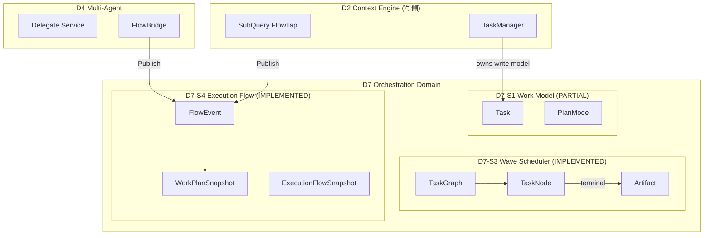

# D7 Orchestration Domain 详细设计

**文档类型:** 详细架构设计（遵循 `docs/methodology/detail-design-framework.md`）
**Domain:** D7 Orchestration
**DSAFT Type:** 核心域
**Version:** 2.0.0
**Status:** Active
**Last Updated:** 2026-06-14
**架构入口:** `openspec/specs/d7-orchestration/spec.md`
**契约 SoT:** `internal/shared/contracts/execution_flow.go`
**Wave 设计参考:** `openspec/changes/devrix-wave-scheduler/design.md`

> **实现说明（2026-06-14）：** D7-S3/S4 已在 `internal/layers/orchestration/` 完整实现；D7-S1/S5 部分实现在 `contextengine/tasks/`；D7-S2 与 `internal/layers/d7/` 包尚未落地。本文档同时描述**现行架构**与**目标架构**。

---

## 文档索引

| 文档 | 用途 |
|------|------|
| `spec.md` | DSAFT 规范 SoT（Scenarios、Requirements） |
| `d7-domain.md` | D7 v1.0 完整需求规格（含 PLANNED 项） |
| 本文档 | 六段式可读架构设计（评审 / onboarding） |
| `layer-delta.md` | 层能力 Delta（现行 vs 目标） |
| `task-planning-design.md` | PlanMode / PlanAgent 专项设计 |
| `a-registry.md` / `f-registry.md` / `t-registry.md` | A/F/T 注册表 |

---

## ① 架构目标

### 业务目标

| 痛点 | 目标能力 | 可观测结果 |
|------|----------|------------|
| 多 Agent 并行执行不可见 | Hub-Spoke 读模型 + IM 进度树 | Leader `delegate_status` 与飞书 worker 卡 |
| 写冲突导致并行任务互相覆盖 | ConflictGuard + file_scope | 同 conflict_group 不并行 |
| DAG 依赖任务派发顺序错误 | TaskGraph.ReadyNodes | 仅 ready 节点被派发 |
| 规划与执行混杂在 QueryLoop | PlanMode 只读探索 + Task 列表 | `/plan` 工作流 |
| D2 承担编排职责导致分层侵蚀 | D7 域升格 + D2 瘦身 | loop.go ≤200 行、零 D4 import |

### 技术目标（量化）

| 指标 | 目标 | 现行测量 |
|------|------|----------|
| WorkerPool 峰值并发 | ≤5（1+1+3 slots） | `scheduler_test.go` ORCH-S2-T10 ✅ |
| 槽位释放后立即重派发 | <1 dispatch loop tick | `scheduler_test.go` ORCH-S2-T15 ✅ |
| FlowEvent 双通道延迟 | 同步 Apply + 异步 IM | `hub_test.go` ✅ |
| D7 快速路径开销（规划） | ≤2ms vs 直连 D2 | 未实现 |
| QueryLoop 行数（规划） | ≤200 行 | 当前 414 行 |

### 约束条件

| 类型 | 约束 | 设计响应 |
|------|------|----------|
| 兼容 | ORCH→D7 迁移期行为不变 | 包路径保留 `orchestration/` 作为桥接 |
| 隔离 | Worker 不继承 Leader 全量历史 | ContextPolicy fresh/upstream/resume |
| 可观测 | 编排操作可追踪 | `orchestration.wave.*` / `orchestration.flow.*` span |
| 默认安全 | execution_flow 默认关闭 | `DefaultExecutionFlowConfig().Enabled=false` |

---

## ② 架构原则

### 设计原则

1. **Hub-Spoke 读模型** — 写侧分散（D2 SubQuery、D4 Delegate），读侧聚合（WorkPlan）
2. **调度与决策分离** — WaveScheduler 不做 LLM 调度决策，只读 TaskGraph ready 节点
3. **Continuous Dispatch (D2)** — 槽位释放即触发重派发，非 batch wave
4. **Context Isolation** — Worker 上下文通过 ContextPolicy 显式物化，禁止隐式继承 Leader 历史
5. **编排上移（目标）** — D7 拥有"做什么/谁来做"，D2 只保留"怎么调 LLM+Tool"

### 命名规范

| 场景 | 格式 | 示例 |
|------|------|------|
| DSAFT Activity | `D7-S{X}-A{NN}` | D7-S3-A01 ScheduleWave |
| FlowEvent Kind | snake_case 动词 | `started`, `tool_call`, `joined` |
| WorkerType | 小写枚举 | `cursor`, `claude_code`, `subagent` |
| ContextPolicy | 小写枚举 | `fresh`, `resume`, `upstream` |
| Span Operation | `orchestration.{module}.{action}` | `orchestration.wave.schedule` |

### 代码风格

- 跨域交互通过 `contracts.ExecutionFlowHub` 接口，禁止 orchestration 直接 import D4 实现
- Hub.Publish 对 nil/禁用配置守卫，不 panic
- WorkerPool.Release 在后台 goroutine 触发 hook，避免 dispatch loop 死锁

---

## ③ 业务流程

### 主路径：FlowEvent 双通道发布

```
D2 SubQuery / D4 Delegate
    └── FlowBridge.Publish(FlowEvent)
            └── flow.Hub.Publish
                    ├── workplan.Service.Apply(ev)     [读模型更新]
                    ├── tasks.TaskManager.linkTask     [若 link_tasks]
                    ├── queue.SessionQueue.Enqueue     [Leader delegate-progress]
                    └── imsink.GatewaySink.Emit        [若 im_progress]
                            └── D1 Gateway worker_progress event
```

### 主路径：Wave DAG 调度

```
Plan Engine / delegate_tools
    └── WaveScheduler.Start(sessionID, TaskGraph)
            └── dispatchLoop (continuous)
                    ├── TaskGraph.ReadyNodes()
                    ├── WorkerPool.Acquire(workerType)
                    ├── ConflictGuard.Allow(candidate)
                    ├── ContextResolver.Resolve(node)
                    ├── WorkerRunner.Run(spec)  [goroutine]
                    │       └── WorkerEvent stream → FlowHub
                    └── on terminal → ArtifactStore.Put → pool.Release → re-dispatch
```

### 异常补偿

| 场景 | 行为 | 幂等 |
|------|------|------|
| Wave reentry（同 session 新 graph） | 取消 prior wave → 启动新 wave | `cancelWaveLocked` |
| CancelWorker | context.Cancel → slot release → status=cancelled | 双 Release 静默忽略 |
| CancelAll | 聚合所有 cancel func → 全部 terminal | `closed` flag 守卫 |
| Hub disabled | Publish 早返回 | NoOp |
| Upstream artifact 缺失 | Resolve 返回 error，task failed | ArtifactStore.Get |

### Plan Mode 分支（D7-S5 部分）

```
用户 /plan <goal>
    └── PlanMode.Enter → PlanAgent (只读)
            └── 探索代码库 → 生成 PlanResult
                    └── state=pending_approval
                            ├── /plan approve → TaskManager 批量创建
                            └── /plan reject  → state=inactive
```

---

## ④ 领域模型

### 聚合与限界上下文



### 核心实体

| 实体 | 归属 | 生命周期 | 持久化 |
|------|------|----------|--------|
| `Task` | D7-S1（现 D2） | pending → in_progress → completed/failed | DiskStore (v2 mode) |
| `TaskNode` | D7-S3 | pending → running → completed/failed/cancelled | 内存（Plan Engine 输入） |
| `FlowEvent` | D7-S4 | append-only 事件流 | 内存 ring buffer (RecentEvents) |
| `Artifact` | D7-S3 | 写入于 worker terminal | 内存 ArtifactStore |
| `PlanMode` | D7-S5 | inactive → active → pending_approval → inactive | 会话内存 |

### TaskNode 关键字段

| 字段 | 用途 |
|------|------|
| `depends_on` | DAG 边 |
| `worker_type` | WorkerPool 槽位类型 |
| `context_policy` | fresh / resume / upstream |
| `conflict_group` | ConflictGuard 互斥组 |
| `file_scope` | 写冲突检测路径 |
| `upstream_task_id` | upstream policy 依赖 |

---

## ⑤ 核心链路图

### 端到端：Delegate Worker 进度可见性

```
用户消息 (Feishu/CLI)
    │ ~0ms
    ▼
D1 Gateway.RouteInbound
    │ ~1ms
    ▼
D2 ContextEngine.Process
    │ delegate_tools 触发
    ▼
D4 Delegate.Service.RunWorker          [~100ms startup]
    │ FlowBridge
    ▼
flow.Hub.Publish(FlowStarted)          [~0.1ms]
    ├─ workplan.Apply                  [内存]
    ├─ SessionQueue.Enqueue            [~0.05ms]
    └─ imsink.EmitWorkerProgress       [~1ms → D1]
    │
    ▼ (parallel)
WaveScheduler.dispatchLoop             [持续]
    └─ WorkerRunner.Run → FlowToolCall/FlowCompleted
```

### 单点风险

| 节点 | 风险 | 缓解 |
|------|------|------|
| `GlobalHub` 单例 | bootstrap 前 NoOp | `NoOpExecutionFlowHub` |
| WorkPlan 纯内存 | 进程重启丢失 | 读模型可重建（FlowEvent 重放设计项） |
| TaskManager 内存 | v2 disk 可选 | `tasks.store_dir` 持久化 |
| 单 session 单 wave | 并发 plan 覆盖 | reentry 取消 prior wave |

---

## ⑥ 接口 / API 设计

### ExecutionFlowHub 契约

```go
// internal/shared/contracts/execution_flow.go
type ExecutionFlowHub interface {
    Publish(ctx context.Context, ev FlowEvent)
    Snapshot(sessionID string) WorkPlanSnapshot
}
```

| 方法 | 幂等 | 错误处理 |
|------|------|----------|
| Publish | ToolCall 节流去重 | nil hub / disabled → 静默返回 |
| Snapshot | 是 | 空 session → 空 snapshot |

### FlowEvent 字段契约

| 字段 | 必填 | 说明 |
|------|------|------|
| SessionID | ✅ | 会话隔离键 |
| Kind | ✅ | 生命周期枚举 |
| WorkerID | 推荐 | 默认作 FlowID |
| TaskID | 可选 | link_tasks 时关联 D2 Task |
| Source | 推荐 | `subquery` / `d4_worker` |

### WaveScheduler 公共 API

| 方法 | 输入 | 输出 | 副作用 |
|------|------|------|--------|
| `Start(ctx, sessionID, graph)` | TaskGraph | error | 注册 wave、启动 dispatchLoop |
| `WaitForCompletion(ctx, sessionID)` | — | []Artifact | 阻塞至全 terminal |
| `CancelWorker(sessionID, taskID)` | — | error | 取消 + 释放槽位 |
| `CancelAll(sessionID)` | — | — | 取消所有 running |

### CLI 命令（D7-S1/S5）

| 命令 | Activity | 状态 |
|------|----------|------|
| `/task create\|list\|get\|update\|delete\|ready\|dep` | D7-S1 ManageTask | IMPLEMENTED |
| `/plan <goal>\|enter\|approve\|reject\|status\|show` | D7-S5 PlanMode | IMPLEMENTED |

### 目标 API（D7 v1.0 规划）

| 方法 | 说明 | 状态 |
|------|------|------|
| `SessionOrchestrator.ProcessMessage` | D1 新主入口 | PLANNED |
| `IntentClassifier.Classify` | 规则+LLM 分类 | PLANNED |
| `TaskDecomposer.Decompose` | 目标→TaskNode DAG | PLANNED |

---

## 附录：ORCH → D7 迁移映射

| 现行 (ORCH) | 目标 (D7) | 代码现状 |
|-------------|-----------|----------|
| ORCH-S1 WorkPlan | D7-S4 + D7-S1 读投影 | `orchestration/workplan/` |
| ORCH-S2 ExecutionFlowHub | D7-S4 | `orchestration/flow/hub.go` |
| ORCH-S3 WaveScheduler | D7-S3 | `orchestration/wave/` |
| D2 tasks/ | D7-S1 写模型 | `contextengine/tasks/` |
| D2 engine.Process | D7-S2 ProcessMessage | 未迁移 |

---

**维护：** 功能变更需同步更新 `spec.md`、注册表与本文档对应章节。
