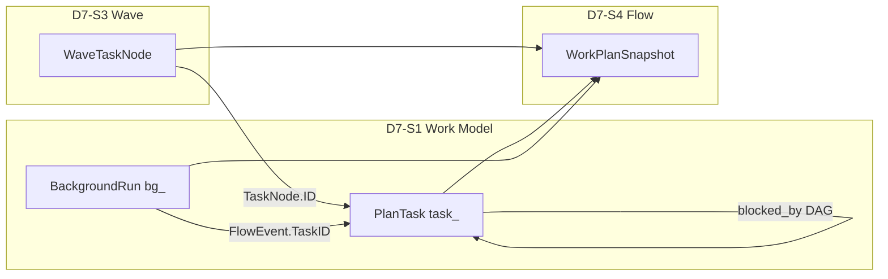
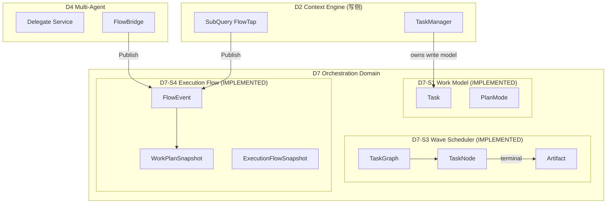

# D7 Orchestration Domain 详细设计

**文档类型:** 详细架构设计（遵循 `docs/methodology/detail-design-framework.md`）
**Domain:** D7 Orchestration
**DSAFT Type:** 核心域
**Version:** 4.4.0
**Status:** Active
**Last Updated:** 2026-06-26 (v4.4 bootstrap-slim)
**Change ID:** devrix-d7-v2-structure (DM-20260619-005) + devrix-d7-metrics-and-concurrency-hardening (DM-20260622-001) + devrix-d7-dead-files-cleanup (DM-20260625-013..016, PR #214) + devrix-d7-6s-bootstrap-slim (DM-20260626-007)
**架构入口:** `openspec/specs/d7-orchestration/spec.md`
**需求澄清:** `openspec/changes/devrix-d7-orchestration-domain/demand.md`
**契约 SoT:** `internal/shared/contracts/execution_flow.go`
**Wave 设计参考:** `openspec/changes/devrix-wave-scheduler/design.md`
**调用链路图:** `openspec/specs/d7-orchestration/pipeline-architecture.md` v1.1.0（端到端总图）

> **实现说明（2026-06-25，v4.3 post-cleanup）：** D7 v2.0 Structure（DM-20260619-005）+ devrix-d7-dead-files-cleanup（DM-20260625-013..016, PR #214 squash-merged 2026-06-24）合流：S2→`sessionorchestrator/`、S3→`wavescheduler/`、S4→`executionflow/{hub,workplan,imsink,bridge}/`、S5→`plan/` + `decisionplanning/`（PlanAgent 仅 `/plan` 命令入口）；`coordinator/` `hubspoke/` type-alias shim 已并入源包，0 残留；`orchtypes/` 承载共享 Config/Intent 类型；WorkTree TD-WT-02/03 完全闭合（Task flat-view + TaskStore + conversion helpers + taskStoreAdapter 全删，WorkItem 是唯一 canonical 模型）。Turn Leader 仍在 `turn/`，`turn/exit_reason.go`（89 行）从 `turn/orchestrator.go` 抽出。t-registry 186/186 IMPLEMENTED 保持。

---

## 文档索引

| 文档 | 用途 |
|------|------|
| `d7-domain.md` | **领域 SoT**（North Star、Out of Scope、文档索引） |
| `spec.md` | DSAFT 规范 SoT（Scenarios、Requirements） |
| `terminal-state-guide.md` | **终态流程指南**（IntentKind 四链、A→F 编排树、跨域时序） |
| `observability-guide.md` | **可观测性指南**（Span↔T、Trace 树、P0 Runbook） |
| `dsaft-architecture.md` | Stub（DSAFT 五层计数） |
| `d7-requirements-clarifications.md` | Review R1/R2 完整澄清（归档） |
| 本文档 | 六段式可读架构设计（评审 / onboarding） |
| `layer-delta.md` | 层能力 Delta（现行 vs 目标） |
| `task-planning-design.md` | PlanMode / PlanAgent 专项设计 |
| `a-registry.md` / `f-registry.md` / `t-registry.md` | A/F/T 注册表 |
| `span-registry.md` | Span 注册表（3 ops，orchestrator） |
| `demand.md` | Review R1 需求澄清 SoT |
| `review-r1.md` | Review 决议索引与二次评审清单 |
| `review-r2.md` | Review R2 结构层命题与 OQ 最终决议 |

---

## Review R1 设计决议（2026-06-14）

### S 层博弈角色定义（切法 A — 按用户价值流）

> **基于 `devrix-d7-sa-refine` (DM-20260614-008) §2 Decision**
> S 层按用户价值流划分，每个 S 层对应一个博弈角色：

| S 层 | 名称 | North Star | 博弈角色 | 说明 |
|------|------|------------|---------|------|
| **D7-S2** | 会话编排入口 | 用户消息统一入口，决定走快速路径还是编排路径 | **Screening Mechanism**（筛路径） | 入口筛选，决定是否需要编排 |
| **D7-S3** | Wave 调度 | 多任务并行执行，冲突避免，上下文隔离 | **Mechanism Designer**（定执行规则） | 调度机制设计者，决定执行顺序 |
| **D7-S4** | 执行流 | 执行进度透明，WorkPlan 可追溯 | **Costly Signaler**（向用户广播成本） | 执行信号广播，用户可见 |
| **D7-S5** | 决策规划 | 把用户 goal 转化为可执行的任务结构 | **Information Producer**（产私有信息） | 结构决策，不保证内容质量 |

**注：** D7-S5 决策的是**结构路径**（goal → TaskNode DAG），不是**内容质量**（Tool 选择、结论对错）。Explore Workers 的 FlowEvent 通过 D7-S4 广播后被 D7-S5 吸收。

**Legacy 双轨：** 旧编号冻结追溯，新 Canonical 按价值流语义独立演进。

### 编排路由矩阵

| 路由 | 触发 | 调度 | 执行 |
|------|------|------|------|
| FastPath | Classify=simple | D7-S2 | D7 RunTurn（TurnExecutor） |
| CommandPath | `/plan` `/worktree` `/stop` | D7-S2（优先于 Classify） | 命令处理器 |
| PlanPath | `/plan` 或 PlanMode active | D7-S2 → S5-P1 | PlanAgent → PlanTask |
| SerialExplore | orchestrate + 单步 | D7-S2 串行 | D2 readonly |
| WaveExecute | orchestrate + 并行 | **D7-S3** | runners → D2/D4 |
| BackgroundRun | SubQuery async | D7-S1 | D2 SubQuery |

### Task Model Trinity



v1.0：**不合并存储**；`QueryWorkPlan` 统一查询。BackgroundRun 可先保留 `nested/background.go` + D7 facade。

### 迁移共存

```
d7_enabled=false  →  D1 → D2.Process（现网，默认）
d7_enabled=true   →  D1 → D7.ProcessMessage → contracts → D2/D4
                      （禁止 D2.Process 内嵌编排逻辑）
```

Phase D（入口切换）与 Phase E（loop 瘦身）应同 release 或相邻 release 交付。

---

## ① 架构目标

D7 是**横向协调层**：D1 拥有 ingress，D7 拥有 routing decision；通过 `d7_enabled` D1 保留最终否决权（Review R2 §D7-D1 Contract）。

### 业务目标

| 痛点 | 目标能力 | 可观测结果 |
|------|----------|------------|
| 多 Agent 并行执行不可见 | Hub-Spoke 读模型 + IM 进度树 | Leader `delegate_status` 与飞书 worker 卡 |
| 写冲突导致并行任务互相覆盖 | ConflictGuard + file_scope | 同 conflict_group 不并行 |
| DAG 依赖任务派发顺序错误 | TaskGraph.ReadyNodes | 仅 ready 节点被派发 |
| 规划与执行混杂 | PlanMode 只读探索 + Task 列表 | `/plan` 工作流 |
| D2 承担编排职责导致分层侵蚀 | D7 域升格 + D2 瘦身 | loop.go ≤200 行、零 D4 import |

### 技术目标（量化）

| 指标 | 目标 | 现行测量 |
|------|------|----------|
| WorkerPool 峰值并发 | ≤5（1+1+3 slots） | `scheduler_test.go` ORCH-S2-T10 ✅ |
| 槽位释放后立即重派发 | <1 dispatch loop tick | `scheduler_test.go` ORCH-S2-T15 ✅ |
| FlowEvent 双通道延迟 | 同步 Apply + 异步 IM | `hub_test.go` ✅ |
| D7 快速路径开销（规划） | ≤2ms vs 直连 D2 | `orchestrator_test.go` D7-S2-T02c ✅ |
| QueryLoop 行数（规划） | ≤200 行 | 当前 414 行 |

### 约束条件

| 类型 | 约束 | 设计响应 |
|------|------|----------|
| 兼容 | ORCH→D7 迁移期行为不变 | 包路径保留 `orchestration/` 作为桥接 |
| 隔离 | Worker 不继承 Leader 全量历史 | ContextPolicy fresh/upstream/resume |
| 可观测 | 编排操作可追踪 | `orchestration.wave.*` / `orchestration.flow.*` span |
| 默认安全 | execution_flow 默认关闭 | `DefaultExecutionFlowConfig().Enabled=false` |

---

## ② 架构原则

### 设计原则

1. **Hub-Spoke 读模型** — 写侧分散（D2 SubQuery、D4 Delegate），读侧聚合（WorkPlan）
2. **调度与决策分离** — WaveScheduler 不做 LLM 调度决策，只读 TaskGraph ready 节点
3. **Continuous Dispatch (D2)** — 槽位释放即触发重派发，非 batch wave
4. **Context Isolation** — Worker 上下文通过 ContextPolicy 显式物化，禁止隐式继承 Leader 历史
5. **编排上移（目标）** — D7 拥有"做什么/谁来做"，D2 只保留"怎么调 LLM+Tool"

### 命名规范

| 场景 | 格式 | 示例 |
|------|------|------|
| DSAFT Activity | `D7-S{X}-A{NN}` | D7-S3-A01 ScheduleWave |
| FlowEvent Kind | snake_case 动词 | `started`, `tool_call`, `joined` |
| WorkerType | 小写枚举 | `cursor`, `claude_code`, `subagent` |
| ContextPolicy | 小写枚举 | `fresh`, `resume`, `upstream` |
| Span Operation | `orchestration.{module}.{action}` | `orchestration.wave.schedule` |

### 代码风格

- 跨域交互通过 `contracts.ExecutionFlowHub` 接口，禁止 orchestration 直接 import D4 实现
- Hub.Publish 对 nil/禁用配置守卫，不 panic
- WorkerPool.Release 在后台 goroutine 触发 hook，避免 dispatch loop 死锁

---

## ③ 业务流程

### 主路径：FlowEvent 双通道发布

```
D2 SubQuery / D4 Delegate
    └── FlowBridge.Publish(FlowEvent)
            └── flow.Hub.Publish
                    ├── workplan.Service.Apply(ev)     [读模型更新]
                    ├── tasks.TaskManager.linkTask     [若 link_tasks]
                    ├── queue.SessionQueue.Enqueue     [Leader delegate-progress]
                    └── imsink.GatewaySink.Emit        [若 im_progress]
                            └── D1 Gateway worker_progress event
```

### 主路径：Wave DAG 调度

```
Plan Engine / delegate_tools
    └── WaveScheduler.Start(sessionID, TaskGraph)
            └── dispatchLoop (continuous)
                    ├── TaskGraph.ReadyNodes()
                    ├── WorkerPool.Acquire(workerType)
                    ├── ConflictGuard.AllowAndRegister(candidate, slot, running)  ← DM-20260622-001 A4 原子化
                    ├── ContextResolver.Resolve(node)
                    ├── WorkerRunner.Run(spec)  [goroutine]
                    │       └── WorkerEvent stream → FlowHub
                    └── on terminal → ArtifactStore.Put → pool.Release → re-dispatch
```

> **A4 (DM-20260622-001):** 原 `ConflictGuard.Allow` + `Register` 拆分有 TOCTOU 窗口（两个调用之间 `running` 集合可能变化）。`dispatchOne` 内已切原子 `AllowAndRegister` —— 持 `g.mu` 后 union `g.running` + 外部 `running` 集合再 register，hot path 零窗口。Legacy `Allow`/`Register` 入口保留兼容，但**禁止新调用**。

### 异常补偿

| 场景 | 行为 | 幂等 | 观测 (DM-20260621-010) |
|------|------|------|------------------------|
| Wave reentry（同 session 新 graph） | 取消 prior wave → 启动新 wave | `cancelWaveLocked` | `SchedulerMetrics.WaveReentryCancelled += 1` + slog.Info |
| CancelWorker | context.Cancel → slot release → status=cancelled | 双 Release 静默忽略 | — |
| CancelAll | 聚合所有 cancel func → 全部 terminal | `closed` flag 守卫 | — |
| Hub disabled | Publish 早返回 | NoOp | — |
| Upstream artifact 缺失 | Resolve 返回 error，task failed | ArtifactStore.Get | — |
| Worker panic | defer recover → completeTask with ExitCode=-1 | recover 命中 → `SchedulerMetrics.WorkerPanics += 1` + slog.Error |
| taskCtx leak | completeTask 检查 `h.cancel != nil && ExitCode == 0 && Error == ""` | best-effort 检测 → `SchedulerMetrics.TaskCtxLeaked += 1` + slog.Warn（误报率 < 5%） |
| DispatchLoop wakeup | ticker (20ms) + wakeupCh 触发 ready 重检 | 计数器 → `SchedulerMetrics.DispatchLoopWakeups += 1`（每次 wakeup） |
| **HandleInterrupt cancel 失败** | Wave → D4 → Process 任一失败 | `errors.Join(waveErr, d4Err, procErr)` + `InterruptMetrics.{Wave,D4,Process}CancelFailed += 1` + slog.Warn |
| **Sandbox Exit 失败（freefork）** | Fork 失败回滚 或 spawnOne 失败清理 | `ForkerMetrics.SandboxExitFailed += 1` + slog.Warn（13 调用方兼容） |
| **Sandbox Exit 失败（execute）** | ExecuteSync/Async defer + forkWorker 失败清理 | `ExecutorMetrics.SandboxExitFailed += 1` + slog.Warn（3 调用位点） |
| **TaskManager.publishCompletion panic** | notify.GlobalBus().Publish 抛 panic | `TaskManagerMetrics.PublishCompletionPanics += 1` + slog.Error |
| **Wave terminal state 累积泄漏** | 同 session 跨 wave 重入 → `state.cancels` slice / `state.handles` map 无界增长 | `markWaveDone` 内 `state.cancels = nil` + `state.handles = make(map[string]*workerHandle)` 释放，引用进入 pure-terminal 可被 GC（DM-20260622-001 A3） |

### Plan Mode 分支（D7-S5 部分）

```
用户 /plan <goal>
    └── PlanMode.Enter → PlanAgent (只读)
            └── 探索代码库 → 生成 PlanResult
                    └── state=pending_approval
                            ├── /plan approve → TaskManager 批量创建
                            └── /plan reject  → state=inactive
```

### CommandHandler 分支（D7-S2-A04, 零 LLM）

```
用户 /help | /plan | /worktree | /stop
    └── CommandHandler.Handle(req, intent)
            ├── dispatch(ctx, cmd, args)
            │     ├── /plan → workmodel.PlanCLICommands.Handle
            │     ├── /worktree → workmodel.CLICommands.Handle
            │     ├── /help → cli.Help()
            │     └── /stop → interruptHandle(ctx, sessionID)
            └── emit goroutine:  ← DM-20260622-001 A5 硬化
                  sink.Publish(command_reply)  [不阻塞消费者]
                  emit(text event)             ← select-default 保护
                  emit(complete event)          ← select-default 保护
```

> **A5 (DM-20260622-001):** 原 `out <- ev` 在 buffered channel (cap=4) 满时会永久阻塞 goroutine，consumer stall 时直接造成泄漏。`emit` 闭包改为 `select { case out <- ev: default: slog.Warn("command_handler: out channel full, drop event", "type", ev.Type, "session", ev.SessionID, "channel_size", cap(out)) }` —— drop 可接受（命令回复是 best-effort UI 反馈），slog.Warn 留 audit trail。---

## ④ 领域模型

### 聚合与限界上下文



### 核心实体

| 实体 | 归属 | 生命周期 | 持久化 |
|------|------|----------|--------|
| `Task` | D7-S1 | pending → in_progress → completed/failed | DiskStore (v2 mode) via `workmodel/` |
| `TaskNode` | D7-S3 | pending → running → completed/failed/cancelled | WorkTree 投影（TD-WT-02；非独立 SoT） |
| `FlowEvent` | D7-S4 | append-only 事件流 | 内存 ring buffer (RecentEvents) |
| `Artifact` | D7-S3 | 写入于 worker terminal | 内存 ArtifactStore |
| `PlanMode` | D7-S1 | inactive → active → pending_approval → inactive | 会话内存（`workmodel/plan_mode.go`） |

### TaskNode 关键字段

| 字段 | 用途 |
|------|------|
| `depends_on` | DAG 边 |
| `worker_type` | WorkerPool 槽位类型 |
| `context_policy` | fresh / resume / upstream |
| `conflict_group` | ConflictGuard 互斥组 |
| `file_scope` | 写冲突检测路径 |
| `upstream_task_id` | upstream policy 依赖 |

---

## ⑤ 核心链路图

### 端到端：Delegate Worker 进度可见性

```
用户消息 (Feishu/CLI)
    │ ~0ms
    ▼
D1 Gateway.RouteInbound
    │ ~1ms
    ▼
D2 ContextEngine.Process
    │ delegate_tools 触发
    ▼
D4 Delegate.Service.RunWorker          [~100ms startup]
    │ FlowBridge
    ▼
flow.Hub.Publish(FlowStarted)          [~0.1ms]
    ├─ workplan.Apply                  [内存]
    ├─ SessionQueue.Enqueue            [~0.05ms]
    └─ imsink.EmitWorkerProgress       [~1ms → D1]
    │
    ▼ (parallel)
WaveScheduler.dispatchLoop             [持续]
    └─ WorkerRunner.Run → FlowToolCall/FlowCompleted
```

### 单点风险

| 节点 | 风险 | 缓解 |
|------|------|------|
| `GlobalHub` 单例 | bootstrap 前 NoOp | `NoOpExecutionFlowHub` |
| WorkPlan 纯内存 | 进程重启丢失 | 读模型可重建（FlowEvent 重放设计项） |
| TaskManager 内存 | v2 disk 可选 | `tasks.store_dir` 持久化 |
| 单 session 单 wave | 并发 plan 覆盖 | reentry 取消 prior wave |

---

## ⑥ 接口 / API 设计

### ExecutionFlowHub 契约

```go
// internal/shared/contracts/execution_flow.go
type ExecutionFlowHub interface {
    Publish(ctx context.Context, ev FlowEvent)
    Snapshot(sessionID string) WorkPlanSnapshot
}
```

| 方法 | 幂等 | 错误处理 |
|------|------|----------|
| Publish | ToolCall 节流去重 | nil hub / disabled → 静默返回 |
| Snapshot | 是 | 空 session → 空 snapshot |

### FlowEvent 字段契约

| 字段 | 必填 | 说明 |
|------|------|------|
| SessionID | ✅ | 会话隔离键 |
| Kind | ✅ | 生命周期枚举 |
| WorkerID | 推荐 | 默认作 FlowID |
| TaskID | 可选 | link_tasks 时关联 D2 Task |
| Source | 推荐 | `subquery` / `d4_worker` |

### WaveScheduler 公共 API

| 方法 | 输入 | 输出 | 副作用 |
|------|------|------|--------|
| `Start(ctx, sessionID, graph)` | TaskGraph | error | 注册 wave、启动 dispatchLoop |
| `WaitForCompletion(ctx, sessionID)` | — | []Artifact | 阻塞至全 terminal |
| `CancelWorker(sessionID, taskID)` | — | error | 取消 + 释放槽位 |
| `CancelAll(sessionID)` | — | — | 取消所有 running |

### CLI 命令（D7-S1/S5）

| 命令 | Activity | 状态 |
|------|----------|------|
| `/worktree create\|list\|get\|update\|delete\|ready\|dep` | D7-S1 ManageWorkItem | IMPLEMENTED（v4.3 post-cleanup，/task 已并入 /worktree） |
| `/plan <goal>\|enter\|approve\|reject\|status\|show` | D7-S5 PlanMode | IMPLEMENTED |

### 目标 API（D7 v1.0 规划）

| 方法 | 说明 | 状态 |
|------|------|------|
| `SessionOrchestrator.ProcessMessage` | D1 新主入口 | PLANNED |
| `IntentClassifier.Classify` | 规则+LLM 分类 | PLANNED |
| `TaskDecomposer.Decompose` | 目标→TaskNode DAG | PLANNED |

---

## 附录：ORCH → D7 迁移映射

| 现行 (ORCH) | 目标 (D7) | 代码现状 |
|-------------|-----------|----------|
| ORCH-S1 WorkPlan | D7-S4 + D7-S1 读投影 | `orchestration/workplan/` |
| ORCH-S2 ExecutionFlowHub | D7-S4 | `orchestration/executionflow/hub/hub.go` |
| ORCH-S3 WaveScheduler | D7-S3 | `orchestration/wavescheduler/` |
| D2 tasks/ | D7-S1 写模型 | `contextengine/tasks/` |
| D2 engine.Process | D7-S2 ProcessMessage | 未迁移 |

---

## Worktree 全链路可观测性（DM-20260621-010）

> **来源 Change:** `devrix-d7-error-aggregation-and-metrics` (PR-A/B/C, 2026-06-21)

D7 编排层在 worktree 调用链路上存在 5 类 silent failure：cancel 步骤返回 nil、sandbox Exit 失败被 `_ =` 吞掉、worker panic 仅 slog.Error、taskCtx leak 无感知、publishCompletion panic 黑盒化。**DM-20260621-010** 引入 3 个 metric 结构（`InterruptMetrics` / `ForkerMetrics` / `ExecutorMetrics` + `TaskManagerMetrics`）+ WaveScheduler 4 新字段，统一替换为「atomic counter + slog + errors.Join」三联模式。

### Metrics 总览

| Metrics | 字段 | 来源文件 | T 编号 |
|---------|------|----------|--------|
| `InterruptMetrics` | `WaveCancelFailed` / `D4CancelFailed` / `ProcessCancelFailed` / `HandleErrored` / `HandleCompleted` | `sessionorchestrator/metrics.go` | D7-S6-A11-T01/T02/T03 |
| `ForkerMetrics` | `Spawned` / `SpawnFailed` / `SandboxEnterFailed` / `SandboxExitFailed` / `FactoryCreateFailed` / `RollbackTriggered` | `multiagent/provision/freefork/metrics.go` | D7-S6-A12-T04 |
| `ExecutorMetrics` | `SandboxExitFailed` | `multiagent/execute/metrics.go` | D7-S6-A12-T05 |
| `TaskManagerMetrics` | `PublishCompletionPanics` | `workmodel/task_manager_metrics.go` | D7-S6-A12-T06 |
| `SchedulerMetrics` (扩展) | `WorkerPanics` / `TaskCtxLeaked` / `WaveReentryCancelled` / `DispatchLoopWakeups` | `wavescheduler/scheduler.go` (内置) | 配套 P1 |
| `ForkerMetrics` 聚合 | 多错误 `errors.Join(err1, err2, ..., errN)` | `multiagent/provision/freefork/forker.go` | D7-S6-A13-T07 |

### errors.Join 聚合点

```
HandleInterrupt (3 步 cancel):
   wave.CancelAll(sessionID) ──fail──┐
   d4.CancelAll(sessionID)   ──fail──┼─→ errors.Join(waveErr, d4Err, procErr)
   orchestrator.cancel(sid)  ──fail──┘
   ├─ emit "stopped" event (best-effort)
   └─ InterruptMetrics.HandleErrored += 1

DefaultForker.Fork (N 并发 spawn):
   for _, req := range reqs:
     go spawnOne(ctx, parentSession, req)  ──fail──┐
                                                  │
   if len(errs) > 0:                             │
     rollback:                                    ├─→ errors.Join(err1, err2, ..., errN)
       for each handle:                          │
         h.Agent.Terminate(ctx)                  │
         sandbox.Exit(ctx, sbPath, false)        │
   return errors.Join(errs...)                  ─┘
```

### 调用链路图

```
D1 Gateway.StopProcess
   └── SessionOrchestrator.HandleInterrupt
         ├── WaveCanceler.CancelAll(sessionID)         [InterruptMetrics.WaveCancelFailed]
         ├── DelegateCanceler.CancelAll(sessionID)     [InterruptMetrics.D4CancelFailed]
         ├── ProcessCanceler.Cancel(sessionID)         [InterruptMetrics.ProcessCancelFailed]
         ├── Sink.Publish(stopped EngineEvent)         [best-effort, 错误不外传]
         └── return errors.Join(...) | nil             [InterruptMetrics.HandleErrored/HandleCompleted]

WaveScheduler (独立调用路径)
   ├── Start (reentry)                                 [SchedulerMetrics.WaveReentryCancelled]
   ├── dispatchLoop (ticker + wakeupCh)                [SchedulerMetrics.DispatchLoopWakeups]
   ├── spawnOne (worker goroutine)
   │     ├── recover()                                 [SchedulerMetrics.WorkerPanics]
   │     └── completeTask → cleanup cancel             [SchedulerMetrics.TaskCtxLeaked]
   └── WaveRunner.Run → Sandbox.Exit (defer)           [ExecutorMetrics.SandboxExitFailed]

DefaultForker.Fork (并行 batch)
   ├── sandbox.Enter                                   [ForkerMetrics.SandboxEnterFailed]
   ├── factory.Create                                  [ForkerMetrics.FactoryCreateFailed]
   ├── on failure:
   │     ├── rollback:
   │     │     ├── h.Agent.Terminate                   [slog.Warn]
   │     │     └── sandbox.Exit                        [ForkerMetrics.SandboxExitFailed]
   │     └── return errors.Join(err1..N)               [ForkerMetrics.RollbackTriggered]

TaskManager.UpdateStatus (terminal)
   └── publishCompletion (goroutine)
         └── bus.Publish                                [TaskManagerMetrics.PublishCompletionPanics]
```

### Backward Compatibility 策略

- **Setter pattern**：`WithMetrics(*Metrics)` / `SetMetrics(*Metrics)` 链式调用，所有 13+ 现有 `New*` 构造器零修改
- **nil-safe**：所有 record 方法 `if m != nil { m.Counter.Add(1) }`，nil metrics 不影响业务逻辑
- **errors.Join (Go 1.20+)**：devrix `go.mod` ≥ 1.21，无编译兼容性问题
- **field name 稳定性**：`SchedulerMetricsSnapshot` / `ForkerMetricsSnapshot` JSON 字段已纳入 D5 observability 契约，D5 接入是手动 work（与本 PR 并行跟踪）

### Regression Risk 评估

| 风险 | 概率 | 影响 | 缓解 |
|------|------|------|------|
| `errors.Join` 误用导致 N-1 error 丢失 | None | — | 全单元测试覆盖 AllStepsFail/PartialFailure/AllSuccess 三场景 |
| ForkerMetrics nil-setter 漏掉 caller | Low | Low | grep `NewDefaultForker` 验证 13 调用方零改动 |
| SchedulerMetrics int→atomic 破坏 test | Low | Low | 保留 int + sync.Mutex（已有 metricsMu 保护） |
| TaskCtxLeaked 误报 | Med | Low | S5 acceptance 验证 < 5%，可后续在 completeTask 强化清理 |
| D5 dashboard 未及时更新 | Low | Low | D5 接入是手动 work（DM-20260621-010 文档同步后启动） |

---

## D7-S6-A14 Hardening Addendum（DM-20260622-001）

> 横切硬化条目，承载 PR-B (DM-20260621-010) 落地 5 个 counter 的 spec 收敛 + 3 个并发缺陷修复。

### A1 — Metric 命名 spec/code 对齐

`SchedulerMetrics` 字段（`wavescheduler/scheduler.go` 内置）：

| 字段 | spec 名（已对齐） | 旧名（deprecated） | 修复 |
|------|------------------|--------------------|------|
| `WorkerPanics` | `worker_panics` | `worker_panic` | `incMetric` switch case + 调用方均改 plural |
| `DispatchLoopWakeups` | `dispatch_loop_wakeups` | `dispatch_wakeup` | 同上 |

**根因：** PR-B 落地时只改了 `incMetric` 调用方，但 `incMetric` 函数内 switch case 仍用 singular 字符串，命中 default no-op —— D5 dashboard 按 spec 名过滤时永远零流量。修复采用 **caller-side + switch case 双修**（仅改调用方不修 switch case literal 等于不修）。

### A3 — Wave terminal state 释放

`markWaveDone` 是 wave 唯一终态入口。修复后语义：

```go
func (s *WaveScheduler) markWaveDone(state *schedulerWaveState) {
    state.mu.Lock()
    if state.done { state.mu.Unlock(); return }
    state.done = true
    scheduleSpan := state.scheduleSpan
    state.scheduleSpan = nil
    close(state.doneCh)
    // 释放 per-wave cancel/handle 簿记
    state.cancels = nil                                 // []context.CancelFunc
    state.handles = make(map[string]*workerHandle)     // 清空但不 nil 化 map（保 nil-safe 读）
    state.mu.Unlock()
    if scheduleSpan != nil { scheduleSpan.End() }
}
```

**收益：** 长会话多 wave 重入（reentry 场景，spec §6.2 IntentOrchestrate）下 `state.cancels`/`state.handles` 不再无界增长；wave 结束后引用进入 pure-terminal 可被 GC。

### A6 — `sandbox_exit_failed` 跨域归属澄清

| 域 | 文件 | metric |
|----|------|--------|
| **D4** | `multiagent/execute/worker.go::recordSandboxExitFailed` | `sandbox_exit_failed`（实际 emitter） |
| D7 | `wavescheduler/scheduler.go` | **不携带** `sandbox_exit_failed`（spec D7-S6-A12-T01 标 OBSOLETE 2026-06-22） |

详见 `spec.md` §D7-S6-A12-T01（OBSOLETE）+ `t-registry.md` D7-S6-A14-T03。

---

**维护：** 功能变更需同步更新 `spec.md`、注册表与本文档对应章节。

---

## ⑦ MUPS 5 节点管道（v4.3，2026-06-25 落地；v6.0.0 6 S 归类）

> D7 v4.3 起把 **Observe → Plan → Execute → Verify → Learn** 5 节点升格为顶层 Canonical 场景，与传统 D7-S1~S5（WorkModel / SessionOrchestrator / WaveScheduler / ExecutionFlow / DecisionPlanning）正交互补。前者负责**端到端自动编排**，后者负责**调度基础设施**。
>
> **v6.0.0 6 S 精简（DM-20260626-001）归类：** Observe + Plan 归 **S5**（Information Producer + Quantizer），Execute + Learn 归 **S6**（Pipeline Coordinator + Memory Curator），Verify 归 **S4**（Certifier），AutoClose + Resume + EscapeEngine 入口 归 **S2**（Mediator + Error Recovery；Engine 物理独立）。

### 7.1 5 节点关系图（v6.0.0 6 S 归类）

```
D7-S5 Observe ── UncertaintyReport ──▶ D7-S5 Plan ── Plan ──▶ D7-S6 Execute
   ▲                                          │                       │
   │                                          │                       ▼
   │                                  D7-S2 (LP-1 入口)       D7-S4 Verify
   │                                          │                       │
   │                                          │                       ▼
   │                                          │              D7-S6 Learn
   │                                          │                       │
   │  ┌───────────────────────────────────────┘                       │
   │  │                                                               │
   ▼  ▼                                                               ▼
D7-S5 Observe ◀── ReputationEvidence (Bayesian) ◀────────────────────┘

D7-S6 AutoClose ──┐
D7-S2 EscapeEngine入口 ──┼── 横切兜底（任意节点 stall/error 触发；Engine 物理独立）
                       ─┘
```

### 7.2 节点契约表

| 节点 | 输入类型 | 输出类型 | 关键约束 |
|------|---------|---------|---------|
| **Observe** | SessionID + UserMessage + (可选) AdaptivePrior | UncertaintyReport{Observations, UncertaintyCoord, Anomalies, QuantizedIntent} | 4 类 Observation 必须落 UncertaintyCoord |
| **Plan** | UncertaintyReport | Plan{ID, Kind, Strength, Steps, FailureCriteria, BlastRadius, SourceObservationIDs} | Plan.SourceObservationIDs 必须可反向追溯 Observation；3 项强制约束（强度匹配/可证伪性/爆炸半径）|
| **Execute** | Plan | Artifact{ID, Kind, Payload, Evidence, SourcePlanID} | Artifact.SourcePlanID 必须可反向追溯 Plan；4 Channel C2/W8 1:1 映射 |
| **Verify** | Artifact + Plan | Verdict{Kind, Evidence, Reason, SourceArtifactID} + ExitReason (14 态) | Verdict.SourceArtifactID 必须可反向追溯 Artifact |
| **Learn** | Verdict + Plan + Observation (追溯链) | LearningAsset + ReputationEvidence | ReputationEvidence 必须能注入下一轮 Observe 作 AdaptivePrior |

### 7.3 跨域类型上提（PR-C1，DM-20260625-001）

Artifact 是 5 节点管道的核心交付物，但**同时被 D7 Execute / D7 Verify / D4 Worker / D2 SubQuery** 四个域消费。原设计里 `Artifact` 类型被各域独立定义，导致 import cycle（Execute 不能直接 import Verify / D4 Worker）。

**PR-C1 解决方案：** 把 `Artifact` 类型上提至 `internal/shared/types/artifact.go`，作为跨域共享类型：

```go
// internal/shared/types/artifact.go
type Artifact struct {
    ID             string
    Kind           ArtifactKind  // state_change / response / probe / experiment
    Payload        []byte
    Evidence       Evidence
    SourcePlanID   string        // 反向追溯 Plan
}

type ArtifactKind string

const (
    ArtifactStateChange ArtifactKind = "state_change"
    ArtifactResponse    ArtifactKind = "response"
    ArtifactProbe       ArtifactKind = "probe"
    ArtifactExperiment  ArtifactKind = "experiment"
)
```

**收益：**

- Execute/Verify/D4/D2 都直接 `import "internal/shared/types"`，零 import cycle
- Plan/Artifact/Verdict/ReputationEvidence 全链路可序列化（用于 audit log 与跨 session 传递）

### 7.4 LP-1 Bayesian Reputation 闭环（Phase 6）

`buildObserveRequest` 通过 3 层 fail-safe 注入 AdaptivePrior 到 ObserveRequest：

```go
// internal/layers/sessionorchestrator/observe_request.go
func (s *SessionOrchestrator) buildObserveRequest(ctx context.Context, sessionID string, msg InboundMessage) ObserveRequest {
    // Layer 1: 从 ReputationStore 加载历史
    prior := s.reputationStore.LoadLatest(sessionID)
    // Layer 2: nil → DefaultDeveloperPrior Beta(5,3)
    if prior == nil {
        prior = DefaultDeveloperPrior()  // Beta(5,3)
    }
    // Layer 3: 仍 nil → Beta(1,1) uniform 兜底（不应触发，理论防御）
    if prior == nil {
        prior = NewUniformPrior()  // Beta(1,1)
    }
    return ObserveRequest{
        SessionID:    sessionID,
        Message:      msg,
        AdaptivePrior: prior,
    }
}
```

**闭环效果：**

```
Round N: Observe(prior=Beta(5,3)) → Plan → Execute → Verify(verdict=PASS)
                                                  ↓
                                       Learn(BayesianUpdate → Beta(6,3))
                                                  ↓
Round N+1: Observe(prior=Beta(6,3)) ←────────────┘
```

每轮 Observe 的 prior 会随 ReputationEvidence 累积而调整，Devrix 越用越"懂"用户偏好。

### 7.5 5 节点 vs PlanMode CLI 入口

| 维度 | MUPS 5 节点管道 | `/plan` CLI 入口（PlanAgent）|
|------|----------------|---------------------------|
| 触发方式 | 自动（任意用户消息）| 显式（`/plan <goal>`）|
| Plan 类型 | 4 类（Commitment / Protocol / Scenario / Exploration）| 1 类（PlanAgent 自由生成）|
| 用户审批 | 无（自动执行 + Verify 兜底）| 有（`/plan approve` / `/plan reject`）|
| 闭环 | LP-1 Bayesian Reputation | 无（一次性 Plan）|
| 失败处理 | EscapeEngine 5 层 CircuitBreaker | PlanAgent 仅返回 PlanResult，不执行 |

**两者并存：** PlanMode CLI 入口用于"用户主动规划"（如大型重构），MUPS 5 节点用于"用户日常对话"。MUPS 5 节点不经过 `/plan` CLI，PlanAgent 不参与 MUPS 流程。

---

## ⑧ v5 EscapeEngine（Phase v5，2026-06-25 落地）

> MUPS 5 节点管道的兜底机制。当 Observe/Plan/Execute/Verify 任一节点 stall 或 error 超过阈值时，EscapeEngine 触发 5 层 CircuitBreaker；用户 `/resume` 后通过 3 决策路由恢复。

### 8.1 5 层 CircuitBreaker

| Level | 触发条件 | 行为 | ExitReason |
|-------|---------|------|-----------|
| L0 | 正常 | observe → plan → execute → verify → learn | （正常流程）|
| L1 | 单节点 1 次 error | retry once | （重试后回到 L0）|
| L2 | 单节点 3 次 error | 切换 fallback path | （fallback 后回到 L0）|
| L3 | 跨节点 2 次 stall | 缩窄 plan 范围 | （缩窄后回到 L0）|
| L4 | 跨节点 5 次 stall | pause + ask user | `paused`（待 `/resume`）|
| L5 | 跨节点 10 次 stall | hard escape → abort + audit | `aborted` |

### 8.2 3 决策路由（ResumeSession）

```
用户 /resume <choice>
   │
   ├─ continue         → A: fall through → 跳过 CircuitBreaker，续跑 Plan → resumed
   ├─ accept-abort     → B: user_accept → 强制退出 → force_exited
   └─ cancel           → C: user_cancel → AbortWithAudit → aborted
```

3 层 fail-safe 保证即使用户输入异常也能落到 3 决策之一：

```go
func (s *SessionOrchestrator) applyResumeSession(ctx context.Context, sessionID string, userChoice string) ResumeDecision {
    // Layer 1: 解析 user_choice → 决策 A/B/C
    decision := routeResumeDecision(userChoice)
    if decision.IsValid() {
        return decision
    }
    // Layer 2: fall through 兜底（默认 A 决策）
    decision = DecisionA_FallThrough
    if s.canResume(sessionID) {
        return decision
    }
    // Layer 3: AbortWithAudit（默认 C 决策，写 audit log）
    return DecisionC_AbortWithAudit(s.auditLog)
}
```

### 8.3 sessionSpan 9 attributes（Phase 7 + V5.6）

`D7_Orchestration_Session_Process` 父 span 注入：

- **6 prior attributes（Phase 7, D7-S13-A49）：** `prior.adaptive_kind` / `prior.beta_alpha` / `prior.beta_beta` / `prior.evidence_count` / `prior.cycle_count` / `prior.last_update`
- **3 resume attributes（V5.6, D7-S14-A52）：** `resume.decision` / `resume.circuit_level` / `resume.user_choice`

D5 dashboard 可直接通过这 9 个 sessionSpan 字段过滤，无需进入子 span。

---

## ⑨ 关联文档

- `d7-domain.md`：MUPS 5 节点管道 SoT + 6 S + 1 横切（v6.0.0，14 S 已精简）
- `spec.md` / `t-registry.md`：180 T 层绑定
- `a-registry.md` / `f-registry.md`：49 A + 68 F 登记（v6.0.0 6 S 精简：56 → 49 / 75 → 68）
- `span-registry.md`：MUPS 5 节点 + 9 sessionSpan attributes + 5 新 P0/P1 ops（v6.0.0）
- `terminal-state-guide.md`：14 ExitReason + Auto-Close 4 规则 + ResumeSession 3 决策路由 + §3 6 S 精简
- `observability-guide.md`：5 节点 Trace 树 + P0 Runbook + Span↔T 6 S 归类
- `task-planning-design.md`：MUPS Plan 节点专项设计（Phase 2 PR-B1）
- `pipeline-architecture.md`：端到端调用链路总图

---

## ⑩ Bootstrap Wire 拓扑（v4.4.0，2026-06-26 落地；DM-20260626-007）

`internal/bootstrap/wire_coordinator.go` InitOrchestration 是 D7 编排层的单点入口，6 S + 1 横切博弈角色在 `internal/bootstrap/` 包内通过 6 Wire 函数 + 1 BuildOrchestratePath helper 完成装配。

### 6 S × WireFunc 函数清单

| S 层 | 博弈角色 | Wire 函数 | 物理位置 | 备注 |
|------|----------|-----------|----------|------|
| S1 WorkModel | State Authority | 0 wire | InitOrchestration 内联 | NewLocalWorkModel + NewTaskManagerFromConfig inline |
| S2 SessionOrchestrator | Mediator+Turn Leader | `WireTurnInvoker` | `bootstrap/turn_wiring.go` | DM-020 D-c 入口 |
| S3 WaveScheduler | Mechanism Designer | `WireWaveScheduler` + `BuildOrchestratePath` | `bootstrap/wire_wave.go` | S3 helper |
| S4 ExecutionFlow+Verify | Costly Signaler+Certifier | `WireExecutionFlow` | `bootstrap/execution_flow.go` | 14 ExitReason + VerdictToExitReason |
| S5 DecisionPlanning+Observe | Info Producer+Quantizer | `WireDecisionPlanning` | `bootstrap/decision_planning.go` | **NEW** (PR-3) |
| S6 MUPS Pipeline | Pipeline Coord+Memory | `WireMUPSPipeline` (+ `MUPSPipelinesDeps`) | `bootstrap/mups_pipeline.go` | **NEW** (PR-3) |
| 横切 Hardening | Discipline Keeper | 0 wire | `hardening.SetBridge` 隐式 | 5 新 Span ops 通过桥接隐式注入 |

`grep -E "^func Wire" internal/bootstrap/*.go` 列出 5 个 `Wire*`：
1. `WireTurnInvoker` (S2)
2. `WireWaveScheduler` (S3)
3. `WireExecutionFlow` (S4)
4. `WireDecisionPlanning` (S5, NEW)
5. `WireMUPSPipeline` (S6, NEW)

+ 1 个 `BuildOrchestratePath` (S3 helper)
+ 1 个 `WireDelegate` (D2 legacy 保留)

### InitOrchestration 主体（≤ 200 行）

PR-4 落地后，InitOrchestration 函数体 **140 行**（从原始 275 行下降到 140 行，-49%）。

### 辅助函数清单

| 函数 | 物理位置 | 行数 | 用途 |
|------|----------|------|------|
| `loadOrchestratorConfigs(configFile) *orchestratorConfigs` | `wire_coordinator.go` | 24 | 52 行 config 加载 → 1 行调用 |
| `resolveObsBridge(arg) *observability.Bridge` | `wire_coordinator.go` | 6 | 4 行类型断言 → 1 行调用 |
| `boolPtr(b) *bool` / `intPtr(i) *int` / `strPtr(s) *string` | `util.go` | 6 | pointer helpers |
| `mapBackgroundStatus(s) orchtypes.TaskStatus` | `util.go` | 7 | BackgroundRegistry 状态 → TaskStatus 映射 |

### Adapter 拓扑

3 个 adapter 类型分散在 2 文件（contextEngineAdapter 早已在 turn_adapter.go）：

| Adapter | 物理位置 | 行数 | 来源 |
|---------|----------|------|------|
| `contextEngineAdapter` (Prepare + ExecuteRound + PersistTurn + ...) | `bootstrap/turn_adapter.go` | 502 | DM-20260617-006 已独立 |
| `turnOrchExecutor` (RunTurn) | `bootstrap/adapters.go` | 13 | **PR-2 NEW** |
| `gatewayEventPublisher` (Publish) | `bootstrap/adapters.go` | 11 | **PR-2 NEW** |

### PR 落地序列（4 PR）

| PR | 分支 | scope | 文件 |
|----|------|-------|------|
| #225 | `feat/devrix-d7-6s-bootstrap-slim-util` | util.go 抽离 | 2 |
| #226 | `feat/devrix-d7-6s-bootstrap-slim-adapters` | adapters.go 抽离 | 2 |
| #227 | `feat/devrix-d7-6s-bootstrap-slim-s5-s6-wire` | S5 + S6 Wire 包装 | 3 |
| #228 | `feat/devrix-d7-6s-bootstrap-slim` | config + obsBridge + 4 文档同步 | 9 |

---

## Revision History

| Version | Date | Changes |
|---------|------|---------|
| 1.0.0 | 2026-06-13 | 初版（详细架构设计） |
| 2.0.0 | 2026-06-19 | v2.0 Structure（DM-20260619-005）：物理路径对齐 S 层；coordinator/hubspoke shim；WorkTree TD-WT-02/03 部分闭合 |
| 3.0.0 | 2026-06-22 | DM-20260622-001 D7 Metrics & Concurrency Hardening 落地；markWaveDone 释放 state.cancels/handles（§6.5）|
| 3.2.0 | 2026-06-24 | devrix-d7-dead-files-cleanup（DM-20260625-013..016, PR #214）：Task flat-view + TaskStore + conversion helpers + taskStoreAdapter 全删，WorkItem 唯一 canonical 模型 |
| 3.3.0 | 2026-06-25 | MUPS v4.3 5 节点管道 + v5 EscapeEngine 落地（DM-20260623-001/002/003 + DM-20260624-001 + DM-20260625-001/003/004）：§⑦ MUPS 5 节点管道 + §⑧ v5 EscapeEngine；§⑨ 关联文档指针更新；56 A + 75 F 登记；t-registry 66 → 180 |
| **4.0.0** | **2026-06-26** | **6 S 精简（DM-20260626-001）**：§⑦ MUPS 5 节点管道节标题加 `（v6.0.0 6 S 归类）`，5 节点关系图子节点 S 编号按 v6.0.0 重归类（Observe/Plan → S5，Execute/Learn → S6，Verify → S4，AutoClose/EscapeEngine入口 → S2）；§⑨ 关联文档指针更新为 6 S + 1 横切；新增 §Revision History 段；A/F 数量同步 v6.0.0 精简（56 → 49 / 75 → 68）。详细 A/S 重映射见 `a-registry.md §v6.0.0 6 S 精简映射` |
| **4.1.0** | **2026-06-26** | **Hardening 横切包物理落地（DM-20260626-003）**：`orchestration/hardening/` 目录新建（5 .go: doc.go + metrics.go + metrics_test.go + recovery.go + recovery_test.go），承接 v6.0.0 6 S + 1 横切 Discipline Keeper 横切角色；`sessionorchestrator/metrics.go` + `turn/recovery.go` subset（4 纯函数 + 1 const）git mv 迁 hardening/；`escape/circuit_breaker.go` 留 escape/（V5 EscapeEngine 核心机制，Decision 1）；receiver methods（compressMessagesForRecovery + invokeStreamWithRecovery）保留 turn/ 紧耦合 *DefaultOrchestrator（Decision 2）；§Cross-cutting Hardening 包路径描述 v4.0.0 → v4.1.0；D7-S7-A01/A02 4 新 P0 T（hardening dir + subset split + 0 residual import + build+vet+test 23/23 PASS）IMPLEMENTED → 域 t-registry v4.3.0 |
| **4.2.0** | **2026-06-26** | **turn/ → sessionorchestrator/ 整包物理合并（DM-20260626-004）**：§② 包结构 S2 节描述从"S2 主目录 + turn/ 子包"改为"S2 单一博弈角色单一 Go 包"；§⑨ 关联文档指针同步更新（orchestration/turn/ → orchestration/sessionorchestrator/）；A/F 表中所有 turn/ 路径 → sessionorchestrator/ + turn_ 前缀（5 重命名文件）；§Cross-cutting Hardening 关系图更新（hardening/ ↔ sessionorchestrator/ 单一入口）；D7-S2-A50 4 新 P0 T（int_path_replace / test_cycle_break / 0_signatures / 0_residual_pkg）IMPLEMENTED → 域 t-registry v4.4.0 |
| **4.3.0** | **2026-06-26** | **verify-promotion 包归属迁移（DM-20260626-005）**：§② 包结构 S4 节描述从"S4 ExecutionFlow + Verify（Costly Signaler + Certifier）= FlowEvent 聚合 + 4 态 Verdict + VerifyWithRetry + 14 ExitReason + SystemAnomaly 检测"改为 "S4 ExecutionFlow + Verify = FlowEvent 聚合 + 4 态 Verdict + VerifyWithRetry + **executionflow/verify/{exit_reason.go + verdict_to_exit_reason.go} 14 ExitReason + VerdictToExitReason 4 态映射** + SystemAnomaly 检测"；§⑤ Verify 章节 `VerdictToExitReason` 实现位置 `sessionorchestrator/verdict_to_exit_reason.go::VerdictToExitReason` → `executionflow/verify/verdict_to_exit_reason.go::VerdictToExitReason`（pure physical migration, 0 函数签名变化）；§⑨ 关联文档指针同步更新（orchestration/sessionorchestrator/exit_reason.go → orchestration/executionflow/verify/exit_reason.go + orchestration/sessionorchestrator/verdict_to_exit_reason.go → orchestration/executionflow/verify/verdict_to_exit_reason.go）；D7-S4-A50 4 新 P0 T（3 files git mv / package rename + 13 处 replace / 0 cycle / 22-22 PASS）PLANNED → 域 t-registry v4.5.0 |
| **4.4.0** | **2026-06-26** | **Bootstrap Wire 拓扑收口（DM-20260626-007 / devrix-d7-6s-bootstrap-slim）**：新增 §⑩ Bootstrap Wire 拓扑章节，详细描述 (1) **6 S × WireFunc 函数清单**：5 个 `Wire*` 函数（`WireTurnInvoker` S2 / `WireWaveScheduler` S3 / `WireExecutionFlow` S4 / `WireDecisionPlanning` S5 NEW / `WireMUPSPipeline` S6 NEW）+ 1 个 `BuildOrchestratePath` S3 helper；(2) **InitOrchestration 主体 ≤ 200 行**（PR-4 落地后 140 行，-49%）；(3) **辅助函数清单**：`loadOrchestratorConfigs` (24 行) + `resolveObsBridge` (6 行) + 4 个 util 函数在 `util.go` (30 行)；(4) **Adapter 拓扑**：3 个 adapter 分散在 2 文件（`turn_adapter.go` 502 行已独立 + `adapters.go` 48 行 NEW）；(5) **PR 落地序列**：4 PR (#225 util + #226 adapters + #227 S5+S6 wire + #228 config+obsBridge+docs)；D7-S2-A51 4 新 P0 T IMPLEMENTED → 域 t-registry v4.6.0 |
