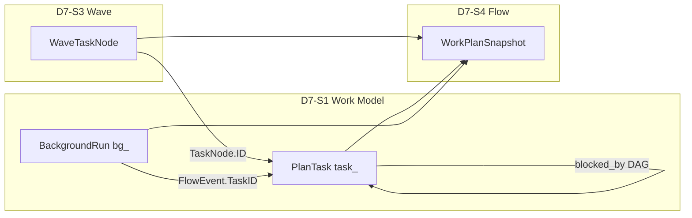
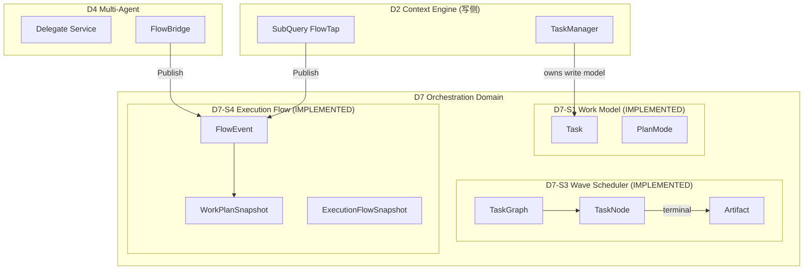

# D7 Orchestration Domain 详细设计

**文档类型:** 详细架构设计（遵循 `docs/methodology/detail-design-framework.md`）
**Domain:** D7 Orchestration
**DSAFT Type:** 核心域
**Version:** 3.0.0
**Status:** Active
**Last Updated:** 2026-06-19
**Change ID:** devrix-d7-v2-structure (DM-20260619-005)
**架构入口:** `openspec/specs/d7-orchestration/spec.md`
**需求澄清:** `openspec/changes/devrix-d7-orchestration-domain/demand.md`
**契约 SoT:** `internal/shared/contracts/execution_flow.go`
**Wave 设计参考:** `openspec/changes/devrix-wave-scheduler/design.md`

> **实现说明（2026-06-19）：** D7 v2.0 Structure 落地（DM-20260619-005）：S2→`sessionorchestrator/`、S3→`wavescheduler/`、S4→`executionflow/{hub,workplan,imsink,bridge}/`、S5→`decisionplanning/`；`coordinator/` 与 `hubspoke/` 保留 type-alias shim；`orchtypes/` 承载共享 Config/Intent 类型；WorkTree TD-WT-02/03 部分闭合。Turn Leader 仍在 `turn/`。t-registry 66/66 IMPLEMENTED 保持。

---

## 文档索引

| 文档 | 用途 |
|------|------|
| `d7-domain.md` | **领域 SoT**（North Star、Out of Scope、文档索引） |
| `spec.md` | DSAFT 规范 SoT（Scenarios、Requirements） |
| `terminal-state-guide.md` | **终态流程指南**（IntentKind 四链、A→F 编排树、跨域时序） |
| `observability-guide.md` | **可观测性指南**（Span↔T、Trace 树、P0 Runbook） |
| `dsaft-architecture.md` | Stub（DSAFT 五层计数） |
| `d7-requirements-clarifications.md` | Review R1/R2 完整澄清（归档） |
| 本文档 | 六段式可读架构设计（评审 / onboarding） |
| `layer-delta.md` | 层能力 Delta（现行 vs 目标） |
| `task-planning-design.md` | PlanMode / PlanAgent 专项设计 |
| `a-registry.md` / `f-registry.md` / `t-registry.md` | A/F/T 注册表 |
| `span-registry.md` | Span 注册表（3 ops，orchestrator） |
| `demand.md` | Review R1 需求澄清 SoT |
| `review-r1.md` | Review 决议索引与二次评审清单 |
| `review-r2.md` | Review R2 结构层命题与 OQ 最终决议 |

---

## Review R1 设计决议（2026-06-14）

### S 层博弈角色定义（切法 A — 按用户价值流）

> **基于 `devrix-d7-sa-refine` (DM-20260614-008) §2 Decision**
> S 层按用户价值流划分，每个 S 层对应一个博弈角色：

| S 层 | 名称 | North Star | 博弈角色 | 说明 |
|------|------|------------|---------|------|
| **D7-S2** | 会话编排入口 | 用户消息统一入口，决定走快速路径还是编排路径 | **Screening Mechanism**（筛路径） | 入口筛选，决定是否需要编排 |
| **D7-S3** | Wave 调度 | 多任务并行执行，冲突避免，上下文隔离 | **Mechanism Designer**（定执行规则） | 调度机制设计者，决定执行顺序 |
| **D7-S4** | 执行流 | 执行进度透明，WorkPlan 可追溯 | **Costly Signaler**（向用户广播成本） | 执行信号广播，用户可见 |
| **D7-S5** | 决策规划 | 把用户 goal 转化为可执行的任务结构 | **Information Producer**（产私有信息） | 结构决策，不保证内容质量 |

**注：** D7-S5 决策的是**结构路径**（goal → TaskNode DAG），不是**内容质量**（Tool 选择、结论对错）。Explore Workers 的 FlowEvent 通过 D7-S4 广播后被 D7-S5 吸收。

**Legacy 双轨：** 旧编号冻结追溯，新 Canonical 按价值流语义独立演进。

### 编排路由矩阵

| 路由 | 触发 | 调度 | 执行 |
|------|------|------|------|
| FastPath | Classify=simple | D7-S2 | D7 RunTurn（TurnExecutor） |
| CommandPath | `/plan` `/task` `/stop` | D7-S2（优先于 Classify） | 命令处理器 |
| PlanPath | `/plan` 或 PlanMode active | D7-S2 → S5-P1 | PlanAgent → PlanTask |
| SerialExplore | orchestrate + 单步 | D7-S2 串行 | D2 readonly |
| WaveExecute | orchestrate + 并行 | **D7-S3** | runners → D2/D4 |
| BackgroundRun | SubQuery async | D7-S1 | D2 SubQuery |

### Task Model Trinity



v1.0：**不合并存储**；`QueryWorkPlan` 统一查询。BackgroundRun 可先保留 `nested/background.go` + D7 facade。

### 迁移共存

```
d7_enabled=false  →  D1 → D2.Process（现网，默认）
d7_enabled=true   →  D1 → D7.ProcessMessage → contracts → D2/D4
                      （禁止 D2.Process 内嵌编排逻辑）
```

Phase D（入口切换）与 Phase E（loop 瘦身）应同 release 或相邻 release 交付。

---

## ① 架构目标

D7 是**横向协调层**：D1 拥有 ingress，D7 拥有 routing decision；通过 `d7_enabled` D1 保留最终否决权（Review R2 §D7-D1 Contract）。

### 业务目标

| 痛点 | 目标能力 | 可观测结果 |
|------|----------|------------|
| 多 Agent 并行执行不可见 | Hub-Spoke 读模型 + IM 进度树 | Leader `delegate_status` 与飞书 worker 卡 |
| 写冲突导致并行任务互相覆盖 | ConflictGuard + file_scope | 同 conflict_group 不并行 |
| DAG 依赖任务派发顺序错误 | TaskGraph.ReadyNodes | 仅 ready 节点被派发 |
| 规划与执行混杂 | PlanMode 只读探索 + Task 列表 | `/plan` 工作流 |
| D2 承担编排职责导致分层侵蚀 | D7 域升格 + D2 瘦身 | loop.go ≤200 行、零 D4 import |

### 技术目标（量化）

| 指标 | 目标 | 现行测量 |
|------|------|----------|
| WorkerPool 峰值并发 | ≤5（1+1+3 slots） | `scheduler_test.go` ORCH-S2-T10 ✅ |
| 槽位释放后立即重派发 | <1 dispatch loop tick | `scheduler_test.go` ORCH-S2-T15 ✅ |
| FlowEvent 双通道延迟 | 同步 Apply + 异步 IM | `hub_test.go` ✅ |
| D7 快速路径开销（规划） | ≤2ms vs 直连 D2 | `orchestrator_test.go` D7-S2-T02c ✅ |
| QueryLoop 行数（规划） | ≤200 行 | 当前 414 行 |

### 约束条件

| 类型 | 约束 | 设计响应 |
|------|------|----------|
| 兼容 | ORCH→D7 迁移期行为不变 | 包路径保留 `orchestration/` 作为桥接 |
| 隔离 | Worker 不继承 Leader 全量历史 | ContextPolicy fresh/upstream/resume |
| 可观测 | 编排操作可追踪 | `orchestration.wave.*` / `orchestration.flow.*` span |
| 默认安全 | execution_flow 默认关闭 | `DefaultExecutionFlowConfig().Enabled=false` |

---

## ② 架构原则

### 设计原则

1. **Hub-Spoke 读模型** — 写侧分散（D2 SubQuery、D4 Delegate），读侧聚合（WorkPlan）
2. **调度与决策分离** — WaveScheduler 不做 LLM 调度决策，只读 TaskGraph ready 节点
3. **Continuous Dispatch (D2)** — 槽位释放即触发重派发，非 batch wave
4. **Context Isolation** — Worker 上下文通过 ContextPolicy 显式物化，禁止隐式继承 Leader 历史
5. **编排上移（目标）** — D7 拥有"做什么/谁来做"，D2 只保留"怎么调 LLM+Tool"

### 命名规范

| 场景 | 格式 | 示例 |
|------|------|------|
| DSAFT Activity | `D7-S{X}-A{NN}` | D7-S3-A01 ScheduleWave |
| FlowEvent Kind | snake_case 动词 | `started`, `tool_call`, `joined` |
| WorkerType | 小写枚举 | `cursor`, `claude_code`, `subagent` |
| ContextPolicy | 小写枚举 | `fresh`, `resume`, `upstream` |
| Span Operation | `orchestration.{module}.{action}` | `orchestration.wave.schedule` |

### 代码风格

- 跨域交互通过 `contracts.ExecutionFlowHub` 接口，禁止 orchestration 直接 import D4 实现
- Hub.Publish 对 nil/禁用配置守卫，不 panic
- WorkerPool.Release 在后台 goroutine 触发 hook，避免 dispatch loop 死锁

---

## ③ 业务流程

### 主路径：FlowEvent 双通道发布

```
D2 SubQuery / D4 Delegate
    └── FlowBridge.Publish(FlowEvent)
            └── flow.Hub.Publish
                    ├── workplan.Service.Apply(ev)     [读模型更新]
                    ├── tasks.TaskManager.linkTask     [若 link_tasks]
                    ├── queue.SessionQueue.Enqueue     [Leader delegate-progress]
                    └── imsink.GatewaySink.Emit        [若 im_progress]
                            └── D1 Gateway worker_progress event
```

### 主路径：Wave DAG 调度

```
Plan Engine / delegate_tools
    └── WaveScheduler.Start(sessionID, TaskGraph)
            └── dispatchLoop (continuous)
                    ├── TaskGraph.ReadyNodes()
                    ├── WorkerPool.Acquire(workerType)
                    ├── ConflictGuard.Allow(candidate)
                    ├── ContextResolver.Resolve(node)
                    ├── WorkerRunner.Run(spec)  [goroutine]
                    │       └── WorkerEvent stream → FlowHub
                    └── on terminal → ArtifactStore.Put → pool.Release → re-dispatch
```

### 异常补偿

| 场景 | 行为 | 幂等 | 观测 (DM-20260621-010) |
|------|------|------|------------------------|
| Wave reentry（同 session 新 graph） | 取消 prior wave → 启动新 wave | `cancelWaveLocked` | `SchedulerMetrics.WaveReentryCancelled += 1` + slog.Info |
| CancelWorker | context.Cancel → slot release → status=cancelled | 双 Release 静默忽略 | — |
| CancelAll | 聚合所有 cancel func → 全部 terminal | `closed` flag 守卫 | — |
| Hub disabled | Publish 早返回 | NoOp | — |
| Upstream artifact 缺失 | Resolve 返回 error，task failed | ArtifactStore.Get | — |
| Worker panic | defer recover → completeTask with ExitCode=-1 | recover 命中 → `SchedulerMetrics.WorkerPanics += 1` + slog.Error |
| taskCtx leak | completeTask 检查 `h.cancel != nil && ExitCode == 0 && Error == ""` | best-effort 检测 → `SchedulerMetrics.TaskCtxLeaked += 1` + slog.Warn（误报率 < 5%） |
| DispatchLoop wakeup | ticker (20ms) + wakeupCh 触发 ready 重检 | 计数器 → `SchedulerMetrics.DispatchLoopWakeups += 1`（每次 wakeup） |
| **HandleInterrupt cancel 失败** | Wave → D4 → Process 任一失败 | `errors.Join(waveErr, d4Err, procErr)` + `InterruptMetrics.{Wave,D4,Process}CancelFailed += 1` + slog.Warn |
| **Sandbox Exit 失败（freefork）** | Fork 失败回滚 或 spawnOne 失败清理 | `ForkerMetrics.SandboxExitFailed += 1` + slog.Warn（13 调用方兼容） |
| **Sandbox Exit 失败（execute）** | ExecuteSync/Async defer + forkWorker 失败清理 | `ExecutorMetrics.SandboxExitFailed += 1` + slog.Warn（3 调用位点） |
| **TaskManager.publishCompletion panic** | notify.GlobalBus().Publish 抛 panic | `TaskManagerMetrics.PublishCompletionPanics += 1` + slog.Error |

### Plan Mode 分支（D7-S5 部分）

```
用户 /plan <goal>
    └── PlanMode.Enter → PlanAgent (只读)
            └── 探索代码库 → 生成 PlanResult
                    └── state=pending_approval
                            ├── /plan approve → TaskManager 批量创建
                            └── /plan reject  → state=inactive
```

---

## ④ 领域模型

### 聚合与限界上下文



### 核心实体

| 实体 | 归属 | 生命周期 | 持久化 |
|------|------|----------|--------|
| `Task` | D7-S1 | pending → in_progress → completed/failed | DiskStore (v2 mode) via `workmodel/` |
| `TaskNode` | D7-S3 | pending → running → completed/failed/cancelled | WorkTree 投影（TD-WT-02；非独立 SoT） |
| `FlowEvent` | D7-S4 | append-only 事件流 | 内存 ring buffer (RecentEvents) |
| `Artifact` | D7-S3 | 写入于 worker terminal | 内存 ArtifactStore |
| `PlanMode` | D7-S1 | inactive → active → pending_approval → inactive | 会话内存（`workmodel/plan_mode.go`） |

### TaskNode 关键字段

| 字段 | 用途 |
|------|------|
| `depends_on` | DAG 边 |
| `worker_type` | WorkerPool 槽位类型 |
| `context_policy` | fresh / resume / upstream |
| `conflict_group` | ConflictGuard 互斥组 |
| `file_scope` | 写冲突检测路径 |
| `upstream_task_id` | upstream policy 依赖 |

---

## ⑤ 核心链路图

### 端到端：Delegate Worker 进度可见性

```
用户消息 (Feishu/CLI)
    │ ~0ms
    ▼
D1 Gateway.RouteInbound
    │ ~1ms
    ▼
D2 ContextEngine.Process
    │ delegate_tools 触发
    ▼
D4 Delegate.Service.RunWorker          [~100ms startup]
    │ FlowBridge
    ▼
flow.Hub.Publish(FlowStarted)          [~0.1ms]
    ├─ workplan.Apply                  [内存]
    ├─ SessionQueue.Enqueue            [~0.05ms]
    └─ imsink.EmitWorkerProgress       [~1ms → D1]
    │
    ▼ (parallel)
WaveScheduler.dispatchLoop             [持续]
    └─ WorkerRunner.Run → FlowToolCall/FlowCompleted
```

### 单点风险

| 节点 | 风险 | 缓解 |
|------|------|------|
| `GlobalHub` 单例 | bootstrap 前 NoOp | `NoOpExecutionFlowHub` |
| WorkPlan 纯内存 | 进程重启丢失 | 读模型可重建（FlowEvent 重放设计项） |
| TaskManager 内存 | v2 disk 可选 | `tasks.store_dir` 持久化 |
| 单 session 单 wave | 并发 plan 覆盖 | reentry 取消 prior wave |

---

## ⑥ 接口 / API 设计

### ExecutionFlowHub 契约

```go
// internal/shared/contracts/execution_flow.go
type ExecutionFlowHub interface {
    Publish(ctx context.Context, ev FlowEvent)
    Snapshot(sessionID string) WorkPlanSnapshot
}
```

| 方法 | 幂等 | 错误处理 |
|------|------|----------|
| Publish | ToolCall 节流去重 | nil hub / disabled → 静默返回 |
| Snapshot | 是 | 空 session → 空 snapshot |

### FlowEvent 字段契约

| 字段 | 必填 | 说明 |
|------|------|------|
| SessionID | ✅ | 会话隔离键 |
| Kind | ✅ | 生命周期枚举 |
| WorkerID | 推荐 | 默认作 FlowID |
| TaskID | 可选 | link_tasks 时关联 D2 Task |
| Source | 推荐 | `subquery` / `d4_worker` |

### WaveScheduler 公共 API

| 方法 | 输入 | 输出 | 副作用 |
|------|------|------|--------|
| `Start(ctx, sessionID, graph)` | TaskGraph | error | 注册 wave、启动 dispatchLoop |
| `WaitForCompletion(ctx, sessionID)` | — | []Artifact | 阻塞至全 terminal |
| `CancelWorker(sessionID, taskID)` | — | error | 取消 + 释放槽位 |
| `CancelAll(sessionID)` | — | — | 取消所有 running |

### CLI 命令（D7-S1/S5）

| 命令 | Activity | 状态 |
|------|----------|------|
| `/task create\|list\|get\|update\|delete\|ready\|dep` | D7-S1 ManageTask | IMPLEMENTED |
| `/plan <goal>\|enter\|approve\|reject\|status\|show` | D7-S5 PlanMode | IMPLEMENTED |

### 目标 API（D7 v1.0 规划）

| 方法 | 说明 | 状态 |
|------|------|------|
| `SessionOrchestrator.ProcessMessage` | D1 新主入口 | PLANNED |
| `IntentClassifier.Classify` | 规则+LLM 分类 | PLANNED |
| `TaskDecomposer.Decompose` | 目标→TaskNode DAG | PLANNED |

---

## 附录：ORCH → D7 迁移映射

| 现行 (ORCH) | 目标 (D7) | 代码现状 |
|-------------|-----------|----------|
| ORCH-S1 WorkPlan | D7-S4 + D7-S1 读投影 | `orchestration/workplan/` |
| ORCH-S2 ExecutionFlowHub | D7-S4 | `orchestration/executionflow/hub/hub.go` |
| ORCH-S3 WaveScheduler | D7-S3 | `orchestration/wavescheduler/` |
| D2 tasks/ | D7-S1 写模型 | `contextengine/tasks/` |
| D2 engine.Process | D7-S2 ProcessMessage | 未迁移 |

---

## Worktree 全链路可观测性（DM-20260621-010）

> **来源 Change:** `devrix-d7-error-aggregation-and-metrics` (PR-A/B/C, 2026-06-21)

D7 编排层在 worktree 调用链路上存在 5 类 silent failure：cancel 步骤返回 nil、sandbox Exit 失败被 `_ =` 吞掉、worker panic 仅 slog.Error、taskCtx leak 无感知、publishCompletion panic 黑盒化。**DM-20260621-010** 引入 3 个 metric 结构（`InterruptMetrics` / `ForkerMetrics` / `ExecutorMetrics` + `TaskManagerMetrics`）+ WaveScheduler 4 新字段，统一替换为「atomic counter + slog + errors.Join」三联模式。

### Metrics 总览

| Metrics | 字段 | 来源文件 | T 编号 |
|---------|------|----------|--------|
| `InterruptMetrics` | `WaveCancelFailed` / `D4CancelFailed` / `ProcessCancelFailed` / `HandleErrored` / `HandleCompleted` | `sessionorchestrator/metrics.go` | D7-S6-A11-T01/T02/T03 |
| `ForkerMetrics` | `Spawned` / `SpawnFailed` / `SandboxEnterFailed` / `SandboxExitFailed` / `FactoryCreateFailed` / `RollbackTriggered` | `multiagent/provision/freefork/metrics.go` | D7-S6-A12-T04 |
| `ExecutorMetrics` | `SandboxExitFailed` | `multiagent/execute/metrics.go` | D7-S6-A12-T05 |
| `TaskManagerMetrics` | `PublishCompletionPanics` | `workmodel/task_manager_metrics.go` | D7-S6-A12-T06 |
| `SchedulerMetrics` (扩展) | `WorkerPanics` / `TaskCtxLeaked` / `WaveReentryCancelled` / `DispatchLoopWakeups` | `wavescheduler/scheduler.go` (内置) | 配套 P1 |
| `ForkerMetrics` 聚合 | 多错误 `errors.Join(err1, err2, ..., errN)` | `multiagent/provision/freefork/forker.go` | D7-S6-A13-T07 |

### errors.Join 聚合点

```
HandleInterrupt (3 步 cancel):
   wave.CancelAll(sessionID) ──fail──┐
   d4.CancelAll(sessionID)   ──fail──┼─→ errors.Join(waveErr, d4Err, procErr)
   orchestrator.cancel(sid)  ──fail──┘
   ├─ emit "stopped" event (best-effort)
   └─ InterruptMetrics.HandleErrored += 1

DefaultForker.Fork (N 并发 spawn):
   for _, req := range reqs:
     go spawnOne(ctx, parentSession, req)  ──fail──┐
                                                  │
   if len(errs) > 0:                             │
     rollback:                                    ├─→ errors.Join(err1, err2, ..., errN)
       for each handle:                          │
         h.Agent.Terminate(ctx)                  │
         sandbox.Exit(ctx, sbPath, false)        │
   return errors.Join(errs...)                  ─┘
```

### 调用链路图

```
D1 Gateway.StopProcess
   └── SessionOrchestrator.HandleInterrupt
         ├── WaveCanceler.CancelAll(sessionID)         [InterruptMetrics.WaveCancelFailed]
         ├── DelegateCanceler.CancelAll(sessionID)     [InterruptMetrics.D4CancelFailed]
         ├── ProcessCanceler.Cancel(sessionID)         [InterruptMetrics.ProcessCancelFailed]
         ├── Sink.Publish(stopped EngineEvent)         [best-effort, 错误不外传]
         └── return errors.Join(...) | nil             [InterruptMetrics.HandleErrored/HandleCompleted]

WaveScheduler (独立调用路径)
   ├── Start (reentry)                                 [SchedulerMetrics.WaveReentryCancelled]
   ├── dispatchLoop (ticker + wakeupCh)                [SchedulerMetrics.DispatchLoopWakeups]
   ├── spawnOne (worker goroutine)
   │     ├── recover()                                 [SchedulerMetrics.WorkerPanics]
   │     └── completeTask → cleanup cancel             [SchedulerMetrics.TaskCtxLeaked]
   └── WaveRunner.Run → Sandbox.Exit (defer)           [ExecutorMetrics.SandboxExitFailed]

DefaultForker.Fork (并行 batch)
   ├── sandbox.Enter                                   [ForkerMetrics.SandboxEnterFailed]
   ├── factory.Create                                  [ForkerMetrics.FactoryCreateFailed]
   ├── on failure:
   │     ├── rollback:
   │     │     ├── h.Agent.Terminate                   [slog.Warn]
   │     │     └── sandbox.Exit                        [ForkerMetrics.SandboxExitFailed]
   │     └── return errors.Join(err1..N)               [ForkerMetrics.RollbackTriggered]

TaskManager.UpdateStatus (terminal)
   └── publishCompletion (goroutine)
         └── bus.Publish                                [TaskManagerMetrics.PublishCompletionPanics]
```

### Backward Compatibility 策略

- **Setter pattern**：`WithMetrics(*Metrics)` / `SetMetrics(*Metrics)` 链式调用，所有 13+ 现有 `New*` 构造器零修改
- **nil-safe**：所有 record 方法 `if m != nil { m.Counter.Add(1) }`，nil metrics 不影响业务逻辑
- **errors.Join (Go 1.20+)**：devrix `go.mod` ≥ 1.21，无编译兼容性问题
- **field name 稳定性**：`SchedulerMetricsSnapshot` / `ForkerMetricsSnapshot` JSON 字段已纳入 D5 observability 契约，D5 接入是手动 work（与本 PR 并行跟踪）

### Regression Risk 评估

| 风险 | 概率 | 影响 | 缓解 |
|------|------|------|------|
| `errors.Join` 误用导致 N-1 error 丢失 | None | — | 全单元测试覆盖 AllStepsFail/PartialFailure/AllSuccess 三场景 |
| ForkerMetrics nil-setter 漏掉 caller | Low | Low | grep `NewDefaultForker` 验证 13 调用方零改动 |
| SchedulerMetrics int→atomic 破坏 test | Low | Low | 保留 int + sync.Mutex（已有 metricsMu 保护） |
| TaskCtxLeaked 误报 | Med | Low | S5 acceptance 验证 < 5%，可后续在 completeTask 强化清理 |
| D5 dashboard 未及时更新 | Low | Low | D5 接入是手动 work（DM-20260621-010 文档同步后启动） |

---

**维护：** 功能变更需同步更新 `spec.md`、注册表与本文档对应章节。
