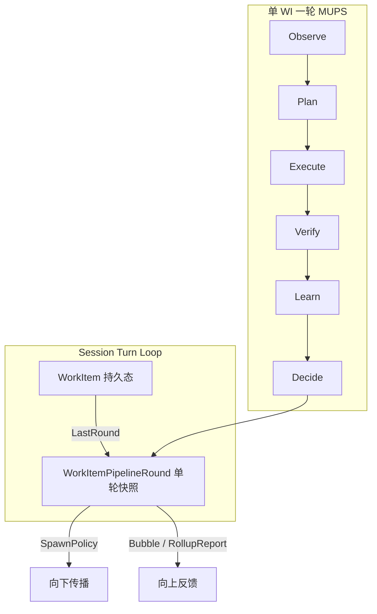
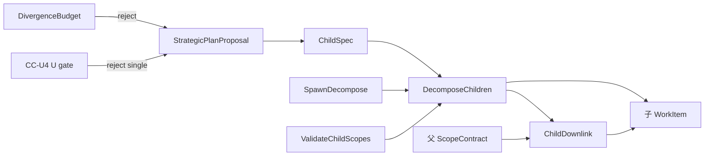
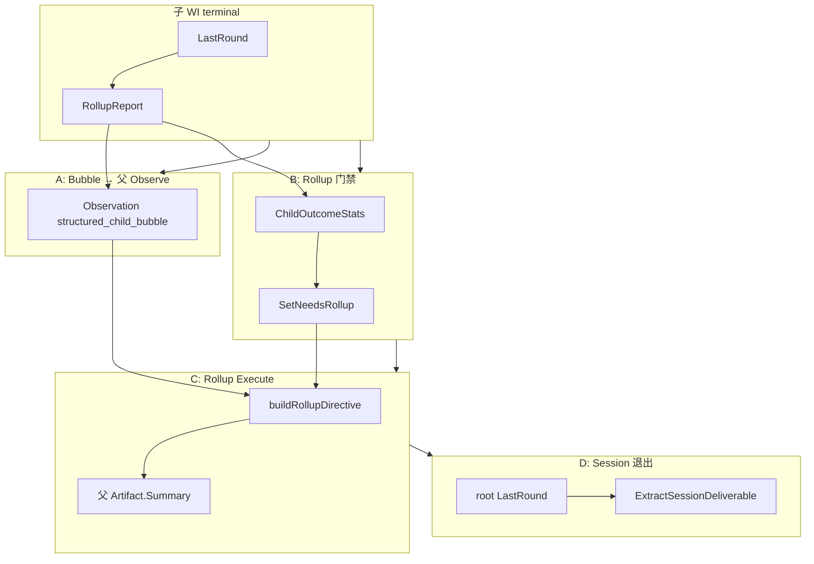
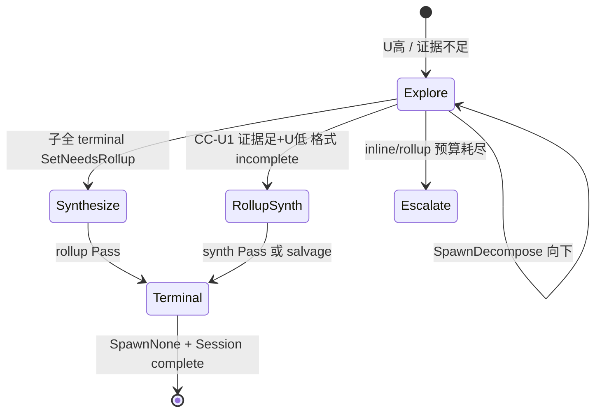

# MUPS 发散/收敛契约 — 数据对象与关系

**Status:** Active  
**Domain:** D7 Orchestration  
**Demand:** DM-20260704-001 · DM-20260703-001  
**Related:** [`uncertainty-spawn-contract.md`](uncertainty-spawn-contract.md) · [`pipeline-architecture.md`](pipeline-architecture.md) §4.1 · [`mups-spawn-sequence-goal-decompose-rollup.md`](mups-spawn-sequence-goal-decompose-rollup.md)

---

## 1. 总览：两层循环 + 枢纽对象

MUPS 嵌在 **WorkTree** 中运行：

**枢纽：** `WorkItemPipelineRound` — 每轮 Observe→Decide 的产物写入 `WorkItem.LastRound`；Spawn、Rollup、Session 退出均读此 struct。

---

## 2. 发散契约 vs 收敛契约

| 契约 | 核心问题 | 主控信号 | 典型 Spawn 输出 |
|------|----------|----------|-----------------|
| **发散（explore）** | U 还高 / 证据不够 / scope 未闭合 | `UncertaintyMean`、`EvidenceProgress`、`PlanKind` exploratory | `SpawnDecompose`、`SpawnParallelExplore`、`SpawnInline`（leaf 补证据） |
| **收敛（converge）** | U 已低 / 证据足 / 子树已 terminal | `DeliverableStatus`、子 `ChildOutcomeStats`、`NeedsRollup` | `SpawnNone`、`NeedsRollup`+rollup synth、`ExtractSessionDeliverable` |

- **CC-1（DM-20260703-001）：** 何时停、何时 rollup、如何退出 session  
- **CC-U（DM-20260704-001）：** Partial 时先按 U+证据决定 RollupSynth，而非 deliverable 格式 alone 驱动 inline 耗尽  

---

## 3. 按五节点展开

### 3.1 Observe

| 对象 | 发散侧 | 收敛侧 | 关系 |
|------|--------|--------|------|
| `Observation` | `ObsUncertainty(RequiresMore=true)` → U↑ → decompose | CC-U5：`deliverable_incomplete`、`evidence_tool_calls` | → `UncertaintyReport` → Plan |
| `UncertaintyReport` | 业务 Obs 强度 → exploratory PlanKind | 高 U 子 WI → 父 `ObsUncertainty`（ChildUncertaintyBubble） | Plan.`SourceObservationIDs` 反向追溯 |
| `AdaptivePrior` | 失败沉淀 → 下轮 prior | Pass 后 reputation → U↓ | Learn.Inject → Observe |
| **向上** | — | `structured_child_bubble` / summary ObsFact | 子 terminal 后父 **下一轮** Observe 消费 |

### 3.2 Plan

| 对象 | 发散侧 | 收敛侧 | 关系 |
|------|--------|--------|------|
| `Plan` | `ExplorationPlan` / `ScenarioPlan` | `CommitmentPlan`；rollup 轮强制 Commitment | Execute 路由 |
| `StrategicPlanProposal` | `decompose` + `ChildSpecs[]` | `single`（CC-U4：`U < SingleModeThreshold`） | budget/U gate 后写 round |
| `ChildSpec` | ScopeIn/Directive/ExpectedReturn | — | → 子 WI + `ChildDownlink` |
| `DeliverableContract` | 只能 narrow | Verify 呈现形状（CC-U2，非 Spawn 主信号） | Execute hint → Verify |
| `DivergenceBudget` | depth/children/daily 上限 | — | `StrategicPlanReject` |
| `ScopeContract` | OpenQuestions 阻塞 decompose | SuccessCriteria 供 rollup directive | 向下经 ChildDownlink 收窄 |

### 3.3 Execute

| 对象 | 发散侧 | 收敛侧 | 关系 |
|------|--------|--------|------|
| `Artifact` | `Metadata["tool_calls"]` → `EvidenceProgress` | rollup/`ModeRollupSynth` 合成 Summary | Verify 输入 |
| `WorkItemExecContext` | `PriorVerifyReason` inline 回灌 | DeliverableContract tag | 连接上轮 Verify |
| `NeedsRollup` | — | true → `buildRollupDirective()` | CC-1.3 / CC-U3 设置 |
| `ChildDownlink` | 子 Directive/ScopeIn | — | Materialize 约束子 Execute |

### 3.4 Verify

| 对象 | 发散侧 | 收敛侧 | 关系 |
|------|--------|--------|------|
| `Verdict` | Partial/Indeterminate → 继续 spawn | Pass + deliverable complete → CC-1.1 terminal | Learn / ExitReason |
| `DeliverableVerifyResult` | incomplete + 低证据 → 探索 | incomplete + 高证据 + 低 U → RollupSynth | 写 round Deliverable* |
| `DeliverablePayload` | — | StructuredDeliverable / salvage | bubble、IM、session |
| `rollupChildStats` | — | 子全 fail 禁假 Pass | 仅 rollup 轮 |

### 3.5 Learn + Decide

| 对象 | 发散侧 | 收敛侧 | 关系 |
|------|--------|--------|------|
| `LearningAsset` / `ReputationEvidence` | 失败沉淀 | Pass → U↓ | 下轮 Observe |
| `UnifiedUncertaintyInput` + `ReconcileUncertainty` | fail rate / conf → U↑ | format failure damp（CC-U5） | `round.UncertaintyMean` |
| `TreeEvalContext` | depth、running、daily | RollupRetries、InlineRetriesAtMaxDepth | SpawnPolicyEvaluator 输入 |
| `SpawnPolicy` | Decompose/Inline/ParallelExplore | None / RollupSynthRequested / EscalateHuman | **发散/收敛最终开关** |
| `WorkItemPipelineRound` | 聚合全链路 ID 与快照 | 同上 | `LastRound` 供 Observe/rollup/session |

---

## 4. 向下传播 — 对象与关系

**定义：** 创建子 WI 或传递 scope/契约（`SpawnDecompose` / `SpawnEscalateHuman`）。

| 对象 | 角色 |
|------|------|
| `StrategicPlanProposal` | LLM 拓扑提案 → `ChildSpec[]` |
| `ChildSpec` | 单子节点规格 |
| `ChildDownlink` | 持久化：Directive、ScopeIn/Out、ExpectedReturn |
| `ScopeContract` | Goal 级 scope；子 ScopeIn ⊆ 父 |
| `SpawnInline/Await/None` | **不**新建 WI |

---

## 5. 向上反馈 — 四条通道

| 通道 | 核心对象 |
|------|----------|
| **A Bubble** | `RollupReport` → ObsFact（verdict、U、spawn、deliverable） |
| **B Rollup gate** | `ChildOutcomeStats` + 父 `SpawnPolicy ∈ {decompose,await}` → `NeedsRollup` |
| **C Rollup synth** | `NeedsRollup` + directive + bubbles → 父 Artifact |
| **D Session** | `ExtractSessionDeliverable` → salvage → `complete.Content` |

---

## 6. 发散 → 收敛闭合

**要点：** `DeliverableContract` 管 Verify 呈现与 Session 提取；Spawn 拓扑主信号为 **`UncertaintyMean` + `EvidenceProgress` + 子树拓扑**（CC-U1～U2）。
