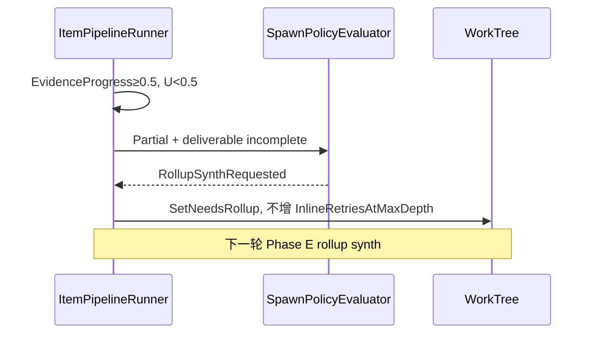

# MUPS 时序：Goal depth-0 decompose → rollup 完成

**Status:** Active  
**Domain:** D7 Orchestration  
**Scenario:** 标准拓扑 — Goal 高 U → decompose → 子 WI 取证 terminal → 父 rollup → session complete  
**Related:** [`mups-spawn-data-objects.md`](mups-spawn-data-objects.md) · [`pipeline-architecture.md`](pipeline-architecture.md) §4

---

## 主时序图

```mermaid
sequenceDiagram
  autonumber
  participant Loop as RunSessionTurnLoop
  participant Parent as Goal WI<br/>(depth=0)
  participant Pipe as ItemPipelineRunner
  participant Tree as WorkTree / TaskManager
  participant Child as 子 WI(s)
  participant SP as StrategicPlanProposer
  participant Obs as observeWorkItem
  participant Dec as SpawnPolicyEvaluator

  Note over Loop,Parent: Phase A — 父 Goal 首轮 MUPS（发散）

  Loop->>Pipe: Run(parent Goal)
  Pipe->>Obs: Observe(parent)
  Obs-->>Pipe: Observation[] ObsUncertainty(U≥0.6)
  Pipe->>SP: StrategicPlanInput{UncertaintyMean, Budget}
  SP-->>Pipe: execution_mode=decompose<br/>child_specs[{ScopeIn, Directive}]
  Pipe->>Pipe: Plan ExplorationPlan
  Pipe->>Pipe: Execute → Artifact{Summary, tool_calls}
  Pipe->>Pipe: Verify → VerdictPartial<br/>DeliverableStatus=incomplete
  Pipe->>Pipe: Learn → round.UncertaintyMean
  Pipe->>Dec: SpawnPolicyEvaluator(round, TreeEvalContext)
  Dec-->>Pipe: SpawnDecompose + ChildSpecs
  Pipe->>Tree: ApplyPipelineRound<br/>LastRound, phase=await_child

  Note over Tree,Child: Phase B — 向下传播

  Pipe->>Tree: DecomposeChildren(ChildSpec[])
  Tree->>Tree: ValidateChildScopes
  Tree->>Child: CreateWorkItem × N
  Tree->>Tree: storeChildDownlink{ScopeIn, ExpectedReturn}

  Note over Loop,Child: Phase C — 子 WI MUPS 直至 terminal

  loop 每个子 WI
    Loop->>Pipe: Run(child)
    Pipe->>Pipe: Execute(downlink.ScopeIn)<br/>tool_calls++
    Pipe->>Pipe: Verify → VerdictPass/Partial
    Pipe->>Tree: child.LastRound, Status=terminal
    Tree->>Tree: ReevaluateParentAfterChild
    alt Running > 0
      Tree->>Parent: ReconcileUncertainty only
    end
  end

  Note over Tree,Parent: Phase D — Rollup 门禁 CC-1.3

  Tree->>Tree: Running=0, spawn∈{decompose,await}
  Tree->>Parent: SetNeedsRollup=true

  Note over Loop,Parent: Phase E — 父 rollup 轮（收敛）

  Loop->>Pipe: Run(parent, NeedsRollup=true)
  Pipe->>Obs: structured_child_bubble ObsFact
  Pipe->>Pipe: Execute buildRollupDirective()<br/>→ Artifact.Summary
  Pipe->>Pipe: verifyRollupArtifact
  Pipe->>Dec: SpawnPolicyEvaluator
  alt VerdictPass
    Dec-->>Pipe: SpawnNone → parent completed
  else RollupRetries ≥ max
    Dec-->>Pipe: SpawnEscalateHuman
  end

  Note over Loop,Parent: Phase F — Session CC-1.5

  Loop->>Loop: buildSessionCompleteEvent
  Loop->>Loop: ExtractSessionDeliverable(root)
```

---

## 阶段字段读写

| 阶段 | 写入 | 读取 |
|------|------|------|
| A 父 Decide | `LastRound.{SpawnPolicy=decompose, ChildSpecs, UncertaintyMean}` | `TreeEvalContext.{Depth, Threshold}` |
| B 向下 | `ChildDownlink`, 子 `WorkItem` | 父 `ScopeContract`, `ChildSpec` |
| C 子轮 | `child.LastRound`, `Artifact.tool_calls` | `ChildDownlink` |
| D Rollup gate | `parent.NeedsRollup`, `parent.Uncertainty` | `ChildOutcomeStats` |
| E 父 rollup | `round.{ArtifactSummary, RollupRetries, SpawnPolicy}` | 子 bubble / RollupReport |
| F Session | `complete.Content` | 根 `StructuredDeliverable`, salvage |

---

## CC-U3 分支（同 WI、无子节点）

证据足 + U 低 + deliverable 格式 incomplete 时，跳过 inline 耗尽，直接 RollupSynth：



详见 [`mups-spawn-sequence-sess-1783138563281-variant.md`](mups-spawn-sequence-sess-1783138563281-variant.md)（真实单 leaf 变体）。
