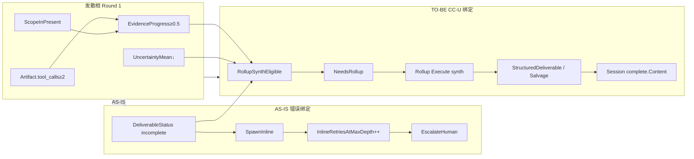

# MUPS 时序变体：sess_1783138563281_8000（单 leaf · 格式失败）

**Status:** Active  
**Domain:** D7 Orchestration  
**Session:** `sess_1783138563281_8000`  
**Demand:** DM-20260704-001（触发会话）  
**User intent:** review d2 领域 kernel 目录下代码（类 explore/review 大 scope 指令）  
**Topology:** depth-0 **单 Goal leaf**，`StrategicPlan execution_mode=single` → `CommitmentPlan`，**无 decompose 子 WI**

---

## 1. 会话事实摘要（复盘）

| 项 | 观察 |
|----|------|
| MUPS 轮次 | 3 轮完整 Observe→Decide |
| Execute | 已读 scope 内文件（tool_calls 有效，探索成功） |
| Verify | 每轮 `DeliverableStatus=incomplete`（planning_meta、findings_json 解析：`issue` vs `title`、fence 提取） |
| U 趋势 | Execute 后 U 实际下降，非「还需大量探索」 |
| Spawn AS-IS | 每轮 `SpawnInline`（deliverable continuation） |
| 终止 | depth-0 `InlineRetriesAtMaxDepth` 耗尽 → `SpawnEscalateHuman` |
| Rationale 误标 | 曾标 `R7: indeterminate retries exhausted`；实为 **CC-1.2 deliverable inline** |
| 向上断裂 | 无子 WI → **CC-1.3 SetNeedsRollup 永不触发**；无 rollup synth 路径 |
| 用户感知 | 飞书卡停在 round-2 planning prose；无 findings 汇总；像「假中断」 |

---

## 2. AS-IS 时序（合入 CC-U 前）

```mermaid
sequenceDiagram
  autonumber
  participant User
  participant D1 as D1 Feishu
  participant Loop as RunSessionTurnLoop
  participant Goal as Goal WI depth=0<br/>无子节点
  participant Pipe as ItemPipelineRunner
  participant SP as StrategicPlanProposer
  participant Exec as WorkItemExecutor
  participant Ver as VerifyDeliverable
  participant Dec as SpawnPolicyEvaluator
  participant Complete as buildSessionCompleteEvent

  User->>D1: review d2 领域 kernel 目录下代码
  D1->>Loop: ProcessMessage → IntentOrchestrate

  Note over Loop,Goal: Round 1 — single 锁拓扑

  Loop->>Pipe: Run(Goal)
  Pipe->>SP: StrategicPlan (U 未门控时)
  SP-->>Pipe: execution_mode=single<br/>CommitmentPlan
  Pipe->>Exec: Execute(scope kernel paths)
  Exec-->>Pipe: Artifact{tool_calls≥2, Summary=规划散文}
  Pipe->>Ver: findings_json + planning_meta check
  Ver-->>Pipe: Partial, DeliverableStatus=incomplete<br/>reason=findings_json_incomplete
  Pipe->>Dec: deliverableContinuationRequired=true
  Note over Dec: ❌ 无 EvidenceProgress 门控<br/>❌ 无 RollupSynth 分支
  Dec-->>Pipe: SpawnInline
  Pipe->>Goal: LastRound.SpawnPolicy=inline<br/>InlineRetriesAtMaxDepth=1

  Note over Loop,Goal: Round 2 — 同 leaf 重跑

  Loop->>Pipe: Run(Goal) focus=inline
  Pipe->>Exec: Execute + PriorVerifyReason
  Exec-->>Pipe: 更多读文件，Summary 仍非合法 JSON
  Ver-->>Pipe: Partial, incomplete
  Dec-->>Pipe: SpawnInline
  Pipe->>Goal: InlineRetriesAtMaxDepth=2
  D1-->>User: 卡片更新 planning 散文（无 findings）

  Note over Loop,Goal: Round 3 — inline 预算耗尽

  Loop->>Pipe: Run(Goal)
  Exec-->>Pipe: Artifact（探索已完成）
  Ver-->>Pipe: Partial, incomplete
  Dec-->>Pipe: SpawnEscalateHuman<br/>rationale CC-1.2 / 误标 R7
  Pipe->>Goal: Status failed / escalate

  Loop->>Complete: EvaluateSessionExit
  Complete->>Complete: ExtractSessionDeliverable
  Note over Complete: structured parse 失败<br/>→ task_incomplete 或空总结
  Complete-->>D1: complete（用户感知：中断）
  D1-->>User: ✅ 任务已完成 / 无 P0-P1 清单
```

### AS-IS 关键对象状态（Round 3 结束）

| 对象 | 值 | 问题 |
|------|-----|------|
| `WorkItem.Children` | 空 | CC-1.3 rollup gate 无触发条件 |
| `EvidenceProgress` | ≥ 0.5（tool_calls + ScopeIn） | **未参与** Spawn 决策 |
| `UncertaintyMean` | < 0.5（探索后） | 仍走 deliverable inline |
| `DeliverableStatus` | incomplete（格式） | 被当作「还需同 leaf 重跑」 |
| `SpawnPolicy` | escalate_human | 非 rollup synth |
| `StructuredDeliverable` | nil / 解析失败 | Session salvage 未救回 |

---

## 3. TO-BE 时序（CC-U1～U6 合入后，同一会话路径）

```mermaid
sequenceDiagram
  autonumber
  participant Loop as RunSessionTurnLoop
  participant Goal as Goal WI depth=0
  participant Pipe as ItemPipelineRunner
  participant SP as StrategicPlanProposer
  participant Exec as WorkItemExecutor
  participant Ver as VerifyDeliverable
  participant Dec as SpawnPolicyEvaluator
  participant Obs as observeDeliverableSignals
  participant Complete as buildSessionCompleteEvent

  Note over Loop,Goal: Round 1 — 探索 + 格式失败

  Loop->>Pipe: Run(Goal)
  Pipe->>SP: StrategicPlan + U gate CC-U4
  alt U ≥ 0.45 at plan time
    SP-->>Pipe: reject single → decompose 可选
  else U low, single accepted
    SP-->>Pipe: execution_mode=single
  end
  Pipe->>Exec: Execute → tool_calls≥2, ScopeInPresent
  Exec-->>Pipe: Artifact
  Pipe->>Ver: Verify JSON body only planning_meta<br/>alias registry issue→Title
  Ver-->>Pipe: Partial, incomplete (format)
  Pipe->>Pipe: EvidenceProgress≥0.5, U<0.5<br/>FormatFailureWithEvidence damp U
  Pipe->>Dec: CC-U1 RollupSynthEligible?
  Dec-->>Pipe: RollupSynthRequested<br/>SpawnInline + SetNeedsRollup
  Pipe->>Goal: NeedsRollup=true<br/>不增 InlineRetriesAtMaxDepth

  Note over Loop,Goal: Round 2 — Rollup synth（收敛相）

  Loop->>Pipe: Run(Goal, NeedsRollup=true)
  Pipe->>Obs: 上轮 deliverable_incomplete ObsSignal
  Pipe->>Exec: buildRollupDirective / ModeRollupSynth<br/>读已有 tool evidence
  Exec-->>Pipe: Artifact.Summary 合成 findings
  Pipe->>Ver: VerifyDeliverable + salvage path
  alt VerdictPass + deliverable complete
    Pipe->>Dec: SpawnNone
    Pipe->>Goal: Status=completed
  else 仍 incomplete
    Pipe->>Dec: RollupRetries++ 或 salvage
  end

  Note over Loop,Goal: Session complete CC-1.5 / CC-U2

  Loop->>Complete: buildSessionCompleteEvent
  Complete->>Complete: ExtractSessionDeliverable<br/>SalvageSessionDeliverable<br/>fence extract + alias registry
  Complete-->>Loop: complete.Content 含 best-effort findings
```

### TO-BE 与 AS-IS 决策差异

| 决策点 | AS-IS | TO-BE (CC-U) |
|--------|-------|----------------|
| Partial + 证据足 + U 低 | `SpawnInline` × N | `RollupSynthRequested` → `NeedsRollup` |
| depth-0 无子 | 无法 CC-1.3 rollup | Path B：同 WI rollup synth |
| inline 预算 | 格式失败耗尽 → escalate | 格式失败 **不** 单独耗尽 inline |
| Verify planning_meta | 全文扫描误杀 | 仅 extracted JSON body |
| findings 字段 | 硬编码 `title` | `DeliverableFindingFieldAliases` |
| Session 退出 | task_incomplete | salvage → IM 可读总结 |
| spawnRationale | 误标 R7 | CC-1.2 准确标签 CC-U6 |

---

## 4. 对象关系（本会话专用）



---

## 5. 验收锚点（L5）

| L5 ID | 本会话路径 |
|-------|------------|
| L5-D7-U-01 | Round1 Partial + 高证据 → RollupSynth，非第 4 次 inline escalate |
| L5-D7-U-03 | escalate rationale 含 CC-1.2，非 R7 |
| L5-D7-U-04 | session complete salvage 非空 |
| L5-D7-U-05 | `issue` 字段 + prose+json fence 解析 |

**Staging 复验（T-ACC-3）：** 在 staging 重放同类指令，确认飞书卡出现 findings 或 salvage 总结，而非 planning 散文 + 假完成。

---

## 6. 关联文档

- 数据对象总览：[`mups-spawn-data-objects.md`](mups-spawn-data-objects.md)
- 标准 decompose→rollup：[`mups-spawn-sequence-goal-decompose-rollup.md`](mups-spawn-sequence-goal-decompose-rollup.md)
- 契约：[`uncertainty-spawn-contract.md`](uncertainty-spawn-contract.md)
- Change 包：`openspec/changes/d7-uncertainty-spawn-decouple/`
