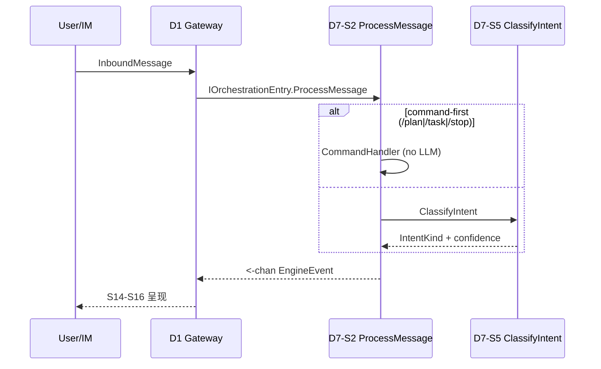
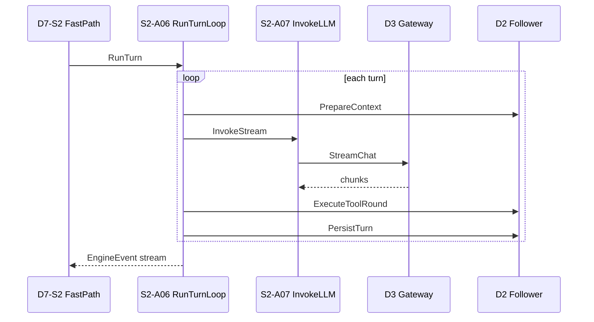
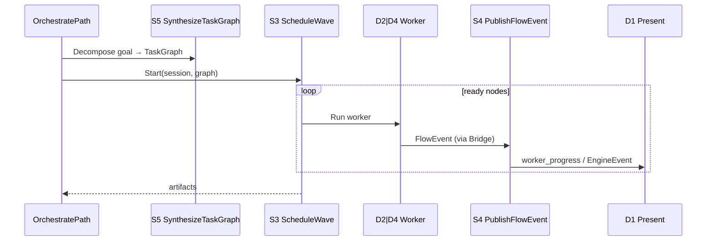

# D7 Orchestration — 终态流程指南

**Capability:** d7-orchestration
**Status:** Active
**Version:** 1.0.0
**Last Updated:** 2026-06-16
**Parent:** `d7-domain.md`
**Complements:** `spec.md` · `a-registry.md` · `f-registry.md` · `../d2-context-engine/d7-boundary.md`

> 本文描述 **Canonical 主路径** 与跨域编排关系；A/F/T 字段登记见各 registry，不重复全表。

---

## 1. 文档分工

| 主题 | 本文 | 其他 SoT |
|------|------|----------|
| S/A 终态树、IntentKind 四链 | ✅ | `a-registry.md` 字段登记 |
| 跨域时序（D1→D7→D2/D3/D4→D1） | ✅ | `cross-domain-boundaries.md` §2.4.4 |
| Gherkin 验收 | 摘要 | `spec.md` |
| 可观测性与 P0 Runbook | 详细 → `observability-guide.md` |
| Review R1 路由矩阵全文 | 摘要 | `d7-requirements-clarifications.md` |
| Wave / Hub 实现细节 | 指针 | `design.md` |

---

## 2. 领域定位（一句话）

D7 = **Orchestration Mediator**：ingress 后唯一编排入口；**Turn Leader** 持有 LLM 调用权（DM-020）；**Hub-Spoke** 唯一 Flow 写侧（DM-018）。

**运行时顺序 ≠ S 编号：** 入口 S2 → 决策 S5 → 并行 S3 → 信号 S4 → 状态 S1。

---

## 3. 终态 S 层与 A 层

### D7-S1 Work Model（State Authority）— 6 A

| A | 名称 | 职责 |
|---|------|------|
| A01 | CreateWorkPlan | goal → Plan + Task DAG |
| A02 | ManageTask | CRUD / 状态迁移 / 依赖 |
| A03 | QueryWorkPlan | WorkPlanSnapshot 聚合 |
| A04 | EnterPlanMode | `/plan` → active |
| A05 | ApprovePlan | pending_approval → 物化 Task |
| A06 | ExecutePlanAgent | PlanAgent 只读探索 |

### D7-S2 Session Orchestrator（Screening + Turn Leader）— 6 A

| A | 名称 | 职责 |
|---|------|------|
| A01 | ProcessMessage | 主入口；4 IntentKind 正交分发 |
| A02 | EvaluateIntent | 路由级评估（command-first → 调 S5） |
| A03 | HandleInterrupt | `/stop` 有序清理 |
| A04 | DispatchWorker | Hub-Spoke 派发矩阵 |
| A06 | RunTurnLoop | Turn 主循环（DM-020） |
| A07 | InvokeLLM | LLM 调用权 → D3（DM-020） |

> 无 A05。S2-A02 消费 S5-A01 分类结果，不重复实现算法。

### D7-S3 Wave Scheduler（Mechanism Designer）— 3 A

| A | 名称 | 职责 |
|---|------|------|
| A01 | ScheduleWave | DAG + WorkerPool（5 slot） |
| A02 | ResolveWorkerContext | fresh / resume / upstream |
| A03 | GuardConflict | conflict_group 互斥 |

### D7-S4 Execution Flow（Costly Signaler）— 5 A

| A | 名称 | 职责 |
|---|------|------|
| A01 | PublishFlowEvent | GlobalHub 双通道（唯一 Flow 写侧） |
| A02 | SnapshotWorkPlan | 读模型快照 |
| A03 | NotifyGateway | worker_progress → D1-S15 |
| A04 | BridgeAgentSpoke | D4 Delegate → Hub |
| A05 | BridgeSubQuerySpoke | D2 SubQuery → Hub |

### D7-S5 Decision & Planning（Information Producer）— 4 A

| A | 名称 | 职责 |
|---|------|------|
| A01 | ClassifyIntent | 规则 + LLM fallback（算法 SoT） |
| A02 | SynthesizeTaskGraph | goal → TaskNode DAG |
| A03 | SelectExecutor | explore→D2 / execute→D4 / parallel→S3 |
| A05 | TailShadowClassify | 尾采样 Shadow（可观测，非路由） |

---

## 4. A→F 编排树（Canonical 摘要）

```
D7-S2-A01 ProcessMessage
├── IntentSkip        → close channel
├── IntentCommand   → CommandHandler (零 LLM)
│     ├─ /plan  → S1-A04 EnterPlanMode → S1-A06 ExecutePlanAgent
│     ├─ /task  → S1-A02 ManageTask
│     └─ /stop  → S2-A03 HandleInterrupt
├── IntentFast      → FastPath → S2-A06 RunTurnLoop
│     ├─ S2-A07 InvokeLLM → D3
│     └─ D2 Prepare / ToolRound / Persist
└── IntentOrchestrate → OrchestratePath
      ├─ S5-A02 SynthesizeTaskGraph
      ├─ S5-A03 SelectExecutor
      ├─ S3-A01 ScheduleWave → D2|D4 runners
      └─ S4-A01 PublishFlowEvent → D1

S2-A04 DispatchWorker → hubspoke.Dispatcher → D4 | D2 SubQuery
S4-A04/A05 SpokeBridge → S4-A01 PublishFlowEvent
```

---

## 5. IntentKind × 跨域 SoT

| IntentKind | 执行链 | D3 LLM | D2 | D4 | D7 S |
|------------|--------|--------|----|----|------|
| **IntentSkip** | 内联 close | ❌ | ❌ | ❌ | S2 |
| **IntentCommand** | CommandHandler | ❌ 零 LLM | 部分 | ❌ | S2 + S1 |
| **IntentFast** | FastPath → RunTurnLoop | ✅ InvokeLLM | ✅ 拆面 | ❌ | S2 |
| **IntentOrchestrate** | OrchestratePath | 可选（拆解） | ✅ Worker | ✅ Delegate | S5→S3→S4 |

**硬约束：**

- command-first：`/plan` `/task` `/stop` **先于** ClassifyIntent，不触发 LLM 分类（D7-S5-T06）
- S2 **不得**串行替代 S3 做并行 DAG
- D4 / D2 **禁止**直 Publish FlowEvent（须经 S4-A04/A05）

---

## 6. 主路径时序

### 6.1 Ingress：D1 → D7 ProcessMessage



### 6.2 IntentFast：Turn Leader 路径



### 6.3 IntentOrchestrate：拆解 + Wave + Flow



### 6.4 HandleInterrupt（/stop）

顺序固定（D7-S2-T04）：

1. `WaveScheduler.CancelAll(sessionID)`
2. D4 active delegates cancel
3. D2 Process context cancel
4. emit `stopped` EngineEvent
5. TaskCancel → WorkerCancel

正常 Process 结束 **不** 取消 Wave（D7-S2-T05 幂等边界）。

---

## 7. 路由矩阵（S2 vs S3）

| 路由 | 条件 | 调度者 | 执行者 |
|------|------|--------|--------|
| FastPath | simple + confidence ≥ 0.9 | S2 | S2 RunTurnLoop → D2/D3 |
| CommandPath | `/plan` `/task` `/stop` | S2 command-first | S1 / interrupt |
| PlanPath | PlanMode active | S2 → S1 | S1 PlanAgent |
| SerialExplore | orchestrate + 单步 | S2 串行 | D2 只读工具 |
| WaveExecute | orchestrate + 多 Worker | **S3** | D2/D4 via runners |
| BackgroundRun | SubQuery async | S1 facade | D2-S19（不经 Wave） |

---

## 8. 代码路径速查

| scenario-slug | Canonical S | 当前路径 |
|---------------|-------------|----------|
| `workmodel` | S1 | `orchestration/workmodel/` + `coordinator/workmodel.go` |
| `sessionorchestrator` | S2 | `orchestration/coordinator/` + `turn/` + `hubspoke/` |
| `wavescheduler` | S3 | `orchestration/wave/` |
| `executionflow` | S4 | `flow/` · `workplan/` · `imsink/` · `hubspoke/` |
| `decisionplanning` | S5 | `coordinator/classifier*` · `decomposer.go` · `executor.go` |

**Bootstrap：** `internal/bootstrap/wire_coordinator.go::WireD7`

---

## 9. DSAFT 计数与 T 摘要

```
D  — D7 Orchestration
S  — 5 Scenarios (S1–S5)
A  — 24 Activities（见 §3）
F  — 见 f-registry.md
T  — 66 Test Points，44 P0（见 t-registry.md）
```

| S | P0 覆盖重点 |
|---|------------|
| S1 | Task 持久化、DAG、PlanMode |
| S2 | ProcessMessage、FastPath SLA、Interrupt、Turn Leader |
| S3 | DAG 并发、Conflict、Context policy |
| S4 | Hub 双通道、SpokeBridge、IM progress |
| S5 | Classify、Synthesize、SelectExecutor、command-first |

---

## 10. 相关文档

| 文档 | 关系 |
|------|------|
| `d7-domain.md` | **领域 SoT** |
| `spec.md` | Gherkin 验收 |
| `design.md` | 六段式实现设计 |
| `d7-requirements-clarifications.md` | Review R1/R2 完整澄清 |
| `../d1-communication/terminal-state-guide.md` | D1 展示侧对称指南 |
| `observability-guide.md` | Span↔T、Trace 树、P0 Runbook |
| `dsaft-architecture.md` | Stub（历史 DSAFT 入口，计数表 only） |
