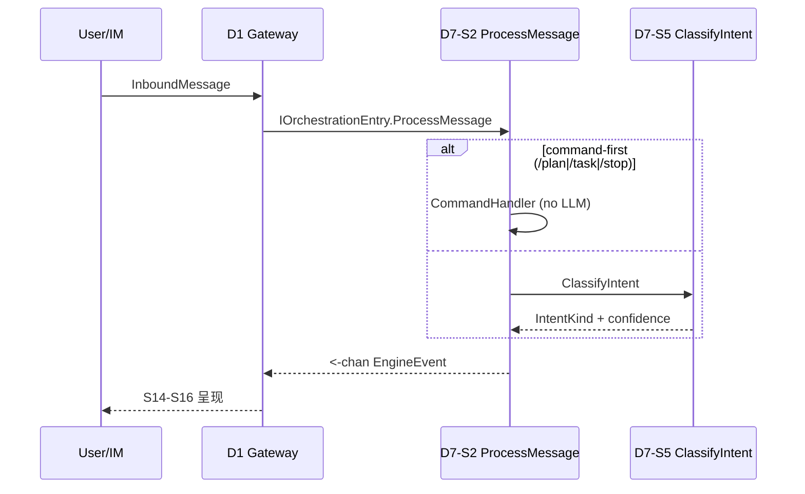
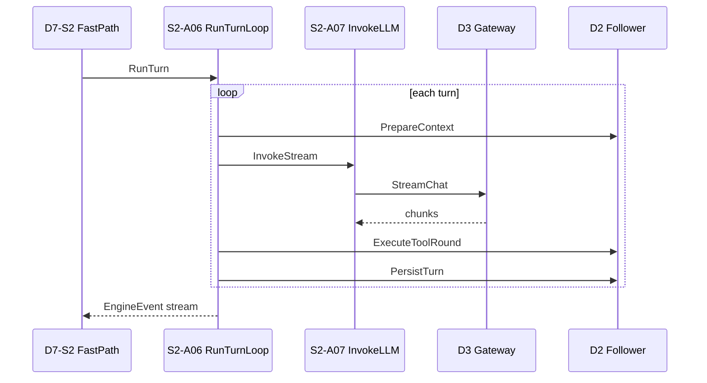
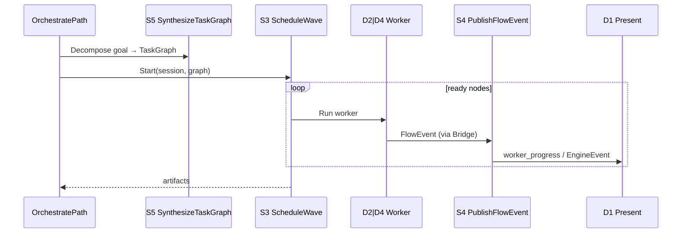

# D7 Orchestration — 终态流程指南

**Capability:** d7-orchestration
**Status:** Active
**Version:** 2.0.0
**Last Updated:** 2026-06-26
**Parent:** `d7-domain.md`
**Complements:** `spec.md` · `a-registry.md` · `f-registry.md` · `../d2-context-engine/d7-boundary.md`

> 本文描述 **Canonical 主路径** 与跨域编排关系；A/F/T 字段登记见各 registry，不重复全表。
>
> **v6.0.0 6 S 精简（DM-20260626-001）：** 本文 §3 终态 S 层从 14 S 重归类为 **6 S + 1 横切**（State Authority / Mediator+Turn Leader+Error Recovery / Mechanism Designer / Costly Signaler+Certifier / Information Producer+Quantizer / Pipeline Coordinator+Memory Curator / 横切 Discipline Keeper）。具体 A/S 重映射见 `a-registry.md §v6.0.0 6 S 精简映射`。

---

## 1. 文档分工

| 主题 | 本文 | 其他 SoT |
|------|------|----------|
| S/A 终态树、IntentKind 四链 | ✅ | `a-registry.md` 字段登记 |
| 跨域时序（D1→D7→D2/D3/D4→D1） | ✅ | `cross-domain-boundaries.md` §2.4.4 |
| Gherkin 验收 | 摘要 | `spec.md` |
| 可观测性与 P0 Runbook | 详细 → `observability-guide.md` |
| Review R1 路由矩阵全文 | 摘要 | `d7-requirements-clarifications.md` |
| Wave / Hub 实现细节 | 指针 | `design.md` |

---

## 2. 领域定位（一句话）

D7 = **Orchestration Mediator**：ingress 后唯一编排入口；**Turn Leader** 持有 LLM 调用权（DM-020）；**Hub-Spoke** 唯一 Flow 写侧（DM-018）。

**运行时顺序 ≠ S 编号：** 入口 S2 → 决策 S5 → 并行 S3 → 信号 S4 → 状态 S1。

---

## 3. 终态 S 层与 A 层（v6.0.0 6 S 精简）

> **v6.0.0（DM-20260626-001，2026-06-26 落地）：** 14 S → **6 S + 1 横切** 博弈角色对齐精简。MUPS 5 节点管道（Observe/Plan/Execute/Verify/Learn）+ v5 EscapeEngine 完整保留；7 个 Legacy A 全部并入 Canonical S。A 总数 49（S1:4 · S2:7 · S3:4 · S4:9 · S5:8 · S6:15 + Hardening:2）。**A/F 详细字段见 `a-registry.md §v6.0.0 6 S 精简映射` + `f-registry.md`**，本节仅给出 S 层归类与职责概要。

### 6 S 归类总览

| 新 S | 博弈角色 | A 数 | 原 14 S 归属 |
|------|---------|------|--------------|
| **D7-S1 WorkModel** | State Authority | 4 | S1 |
| **D7-S2 SessionOrchestrator** | Mediator + Turn Leader + Error Recovery | 7 | S2 + S12 入口 + S13 入口 + S14 入口 |
| **D7-S3 WaveScheduler** | Mechanism Designer | 4 | S3 |
| **D7-S4 ExecutionFlow + Verify** | Costly Signaler + Certifier | 9 | S4 + S10 |
| **D7-S5 DecisionPlanning + Observe** | Information Producer + Quantizer | 8 | S5 + S8 |
| **D7-S6 MUPS Pipeline** | Pipeline Coordinator + Memory Curator | 15 | S7 + S9 + S11 + S12 E2E + S13 兜底 |
| **Cross-cutting Hardening** | Discipline Keeper | 2 | S6 拆 2 A |

### D7-S1 WorkModel（State Authority）— 4 A（归 S1）

> North Star: **WorkItem 事实与状态机**单一权威（v4.3 起 Task flat-view + TaskStore 全删）；产"事实"而非"决策"。

| A | 名称 | 职责 |
|---|------|------|
| A01 | CreateWorkPlan | goal → Plan + WorkItem DAG |
| A02 | ManageWorkItem | CRUD / 状态迁移 / 依赖 |
| A03 | QueryWorkPlan | WorkPlanSnapshot 聚合 |
| A04 | ExecutePlanAgent | PlanAgent 只读探索（原 PlanMode A04/A05 已并入 S2 CommandHandler）|

### D7-S2 SessionOrchestrator（Mediator + Turn Leader + Error Recovery）— 7 A（归 S2）

> North Star: 用户消息统一入口，**拥有 LLM 调用权与 Turn 主循环（DM-020）**；承载 AutoClose + Resume + EscapeEngine 入口（Engine 物理独立，入口归 S2）。

| A | 名称 | 职责 |
|---|------|------|
| A01 | ProcessMessage | 主入口；4 IntentKind 正交分发 |
| A02 | HandleInterrupt | `/stop` 有序清理 |
| A03 | CommandHandler | command-first（`/plan` `/task` `/stop` 先于 ClassifyIntent）|
| A04 | DispatchWorker | Hub-Spoke 派发矩阵 |
| A05 | RunTurnLoop | Turn 主循环（DM-020）|
| A06 | InvokeLLM | LLM 调用权 → D3（DM-020）|
| A07 | AutoClose + Resume + Escape + PriorBuild | AutoClose 兜底 + ResumeSession 3 决策路由 + EscapeEngine 入口 + buildObserveRequest 3 层 fail-safe |

### D7-S3 WaveScheduler（Mechanism Designer）— 4 A（归 S3）

> North Star: 多任务并行执行，冲突避免，上下文隔离；markWaveDone 释放 state.cancels/handles 防跨 wave 累积。

| A | 名称 | 职责 |
|---|------|------|
| A01 | ScheduleWave | DAG + WorkerPool（5 slot） |
| A02 | ResolveWorkerContext | fresh / resume / upstream |
| A03 | GuardConflict | conflict_group 互斥（AllowAndRegister 原子化）|
| A04 | HardenScheduler | markWaveDone 释放 state.cancels/handles |

### D7-S4 ExecutionFlow + Verify（Costly Signaler + Certifier）— 9 A（归 S4）

> North Star: 执行进度透明 + WorkPlan 可追溯 + Verify 节点颁发可信判决（4 态 Verdict + 14 ExitReason）。

| A | 名称 | 职责 |
|---|------|------|
| A01 | PublishFlowEvent | GlobalHub 双通道（唯一 Flow 写侧）|
| A02 | SnapshotWorkPlan | 读模型快照 |
| A03 | NotifyGateway | worker_progress → D1-S15 |
| A04 | BridgeAgentSpoke | D4 Delegate → Hub |
| A05 | BridgeSubQuerySpoke | D2 SubQuery → Hub |
| A06 | VerifyVerdict | 4 态 VerdictKind + AggregateVerdicts + VerifyWithRetry |
| A07 | VerdictToExitReason | 14 ExitReason 映射（8 deterministic + 6 verify-driven）|
| A08 | AggregateVerdicts | Evidence + 完整性校验 |
| A09 | DetectSystemAnomaly | 系统异常检测 + 严重度分级 |

### D7-S5 DecisionPlanning + Observe（Information Producer + Quantizer）— 8 A（归 S5）

> North Star: 用户 goal → 可执行 TaskNode DAG（结构路径，非内容质量）+ Observe 节点产结构化 Observation + UncertaintyReport。

| A | 名称 | 职责 |
|---|------|------|
| A01 | ClassifyIntent | 规则 + LLM fallback（算法 SoT）|
| A02 | SynthesizeTaskGraph | goal → TaskNode DAG |
| A03 | SelectExecutor | explore→D2 / execute→D4 / parallel→S3 |
| A04 | EvaluateIntent | 路由级评估（原 S2-A02 移入 S5）|
| A05 | TailShadowClassify | 尾采样 Shadow（可观测，非路由）|
| A06 | ObserveQuantize | 4 类 Observation + UncertaintyCoord + AnomalyDetector + IntentQuantizer |
| A07 | PlanGenerate | 4 类 Plan（Commitment / Protocol / Scenario / Exploration）+ SourceObservationIDs 必填 |
| A08 | PriorLoad | ObserveRequest + IntentQuantizer WithPrior 变体 |

### D7-S6 MUPS Pipeline（Pipeline Coordinator + Memory Curator）— 15 A（归 S6）

> North Star: 5 节点管道（Execute / Learn / AutoClose / ObserveLearner 闭环）+ Memory 资产 + 兜底机制。

| A | 名称 | 职责 |
|---|------|------|
| A01 | ExecuteArtifact | 4 类 Artifact（StateChangeCert / ResponseRecord / ProbeReport / ExperimentData）|
| A02 | RouteChannel | 4 Channel（sync / async / probe / explore）+ ChannelRouter |
| A03 | ChannelDispatch | 新 P0 span（v6.0.0 新增）|
| A04 | ToolCall | 独立抽出 |
| A05 | RetryPolicy | 独立抽出 |
| A06 | BuildLearningAsset | 4 类 LearningClass（SOP / Protocol / Knowledge / Conclusion）+ TTL |
| A07 | UpdateReputationEvidence | Bayesian Beta 更新 + ReputationStore |
| A08 | BuildAdaptivePrior | DefaultDeveloperPrior Beta(5,3) / DefaultOperatorPrior Beta(8,1) |
| A09 | MemoryPersist | 3 通道记忆（skill / feedback / scheduled）|
| A10 | RunLearner | Learner + AssetBuilder + ReputationStore 串联 |
| A11 | FeedbackPersist | 从 MemoryPersist 拆出 |
| A12 | ScheduledPersist | 从 MemoryPersist 拆出 |
| A13 | CrossSessionLearning | 独立抽出 |
| A14 | ObserveLearnerLoop | E2E LP-1（Observe → Learn → Prior 闭环）|
| A15 | AutoClose | processAutoClose + synthesizeVerdict + 3 层 fail-safe（S6 治理下的兜底）|

### Cross-cutting Hardening（Discipline Keeper）— 2 A（归 横切）

> 横切硬化层，承载 DM-20260622-001 5 fix 一揽子（metric plural + state bound + atomic + select-default + 跨域归属）。

| A | 名称 | 职责 |
|---|------|------|
| Hardening-A01 | HardenMetricsAndConcurrency | 5 fix 一揽子（dispatch_loop_wakeups/worker_panics 复数化 + state.cancels bound + AllowAndRegister 原子化 + CommandHandler select-default + sandbox_exit_failed 跨域归属澄清）|
| Hardening-A02 | HardenCircuitBreakerMonitor | 5 层 CircuitBreaker 状态监控（从 escape 拆分）|

---

## 4. A→F 编排树（Canonical 摘要）

```
D7-S2-A01 ProcessMessage
├── IntentSkip        → close channel
├── IntentCommand   → CommandHandler (零 LLM)
│     ├─ /plan  → S1-A04 EnterPlanMode → S1-A06 ExecutePlanAgent
│     ├─ /task  → S1-A02 ManageTask
│     └─ /stop  → S2-A03 HandleInterrupt
├── IntentFast      → FastPath → S2-A06 RunTurnLoop
│     ├─ S2-A07 InvokeLLM → D3
│     └─ D2 Prepare / ToolRound / Persist
└── IntentOrchestrate → OrchestratePath
      ├─ S5-A02 SynthesizeTaskGraph
      ├─ S5-A03 SelectExecutor
      ├─ S3-A01 ScheduleWave → D2|D4 runners
      └─ S4-A01 PublishFlowEvent → D1

S2-A04 DispatchWorker → hubspoke.Dispatcher → D4 | D2 SubQuery
S4-A04/A05 SpokeBridge → S4-A01 PublishFlowEvent
```

---

## 5. IntentKind × 跨域 SoT

| IntentKind | 执行链 | D3 LLM | D2 | D4 | D7 S |
|------------|--------|--------|----|----|------|
| **IntentSkip** | 内联 close | ❌ | ❌ | ❌ | S2 |
| **IntentCommand** | CommandHandler | ❌ 零 LLM | 部分 | ❌ | S2 + S1 |
| **IntentFast** | FastPath → RunTurnLoop | ✅ InvokeLLM | ✅ 拆面 | ❌ | S2 |
| **IntentOrchestrate** | OrchestratePath | 可选（拆解） | ✅ Worker | ✅ Delegate | S5→S3→S4 |

**硬约束：**

- command-first：`/plan` `/task` `/stop` **先于** ClassifyIntent，不触发 LLM 分类（D7-S5-T06）
- S2 **不得**串行替代 S3 做并行 DAG
- D4 / D2 **禁止**直 Publish FlowEvent（须经 S4-A04/A05）

---

## 6. 主路径时序

### 6.1 Ingress：D1 → D7 ProcessMessage



### 6.2 IntentFast：Turn Leader 路径



### 6.3 IntentOrchestrate：拆解 + Wave + Flow



### 6.4 HandleInterrupt（/stop）

顺序固定（D7-S2-T04）：

1. `WaveScheduler.CancelAll(sessionID)`
2. D4 active delegates cancel
3. D2 Process context cancel
4. emit `stopped` EngineEvent
5. TaskCancel → WorkerCancel

正常 Process 结束 **不** 取消 Wave（D7-S2-T05 幂等边界）。

### 6.5 markWaveDone 终态时序（DM-20260622-001 A3）

Wave 终态唯一入口 `markWaveDone(state)`，执行顺序固定：

```
1. state.mu.Lock
2. if state.done → return (幂等)
3. state.done = true                ← 防重入
4. scheduleSpan := state.scheduleSpan; state.scheduleSpan = nil
5. close(state.doneCh)              ← 唤醒 WaitForCompletion
6. state.cancels = nil              ← 释放 per-wave cancel funcs（D7-S6-A14-T04）
7. state.handles = make(map[string]*workerHandle)  ← 清空 handle 簿记
8. state.mu.Unlock
9. if scheduleSpan != nil { scheduleSpan.End() }
```

**Step 6/7 关键性（DM-20260622-001 A3）：** 长会话中 wave reentry 频繁（同 session 多次新 TaskGraph → 旧 wave 取消），旧实现下 `state.cancels` slice 与 `state.handles` map 无界增长。Step 6/7 把所有引用切到 pure-terminal，wave state 可被 Go GC 安全回收。`markWaveDone` 是**唯一**做此释放的位置（不在 `CancelAll`、不在 `WaitForCompletion`），保证收集器触发点集中。

---

## 7. 路由矩阵（S2 vs S3）

| 路由 | 条件 | 调度者 | 执行者 |
|------|------|--------|--------|
| FastPath | simple + confidence ≥ 0.9 | S2 | S2 RunTurnLoop → D2/D3 |
| CommandPath | `/plan` `/task` `/stop` | S2 command-first | S1 / interrupt |
| PlanPath | PlanMode active | S2 → S1 | S1 PlanAgent |
| SerialExplore | orchestrate + 单步 | S2 串行 | D2 只读工具 |
| WaveExecute | orchestrate + 多 Worker | **S3** | D2/D4 via runners |
| BackgroundRun | SubQuery async | S1 facade | D2-S19（不经 Wave） |

---

## 8. 代码路径速查

| scenario-slug | Canonical S | 当前路径 |
|---------------|-------------|----------|
| `workmodel` | S1 | `orchestration/workmodel/` + `sessionorchestrator/workmodel.go` |
| `sessionorchestrator` | S2 | `orchestration/sessionorchestrator/` + `turn/` |
| `wavescheduler` | S3 | `orchestration/wavescheduler/` |
| `executionflow` | S4 | `executionflow/{hub,workplan,imsink,bridge}/` |
| `decisionplanning` | S5 | `orchestration/decisionplanning/` |
| `coordinator` / `hubspoke` | shim | 1-release type aliases |

**Bootstrap：** `internal/bootstrap/wire_coordinator.go::WireD7`

---

## 9. DSAFT 计数与 T 摘要

```
D  — D7 Orchestration
S  — 14 Scenarios (S1–S14) — 含 MUPS 5 节点管道 S7-S11 + 横切 S12/S13/S14
A  — 56 Activities（见 §3）
F  — 75+ 个 F 点（见 f-registry.md）
T  — 180 Test Points（见 t-registry.md，2026-06-25 v4.9.0 已闭环）
```

| S | P0 覆盖重点 |
|---|------------|
| S1 | WorkItem 持久化、DAG、PlanMode（v4.3 起 Task flat-view 全删）|
| S2 | ProcessMessage、FastPath SLA、Interrupt、Turn Leader |
| S3 | DAG 并发、Conflict、Context policy |
| S4 | Hub 双通道、SpokeBridge、IM progress |
| S5 | Classify、Synthesize、SelectExecutor、command-first |
| S6 | metric plural + state bound + atomic + select-default（横切硬化）|
| S7 | 5 节点管道门面 |
| S8 | Observe 4 类 + UncertaintyReport + UncertaintyCoord（Phase 2）|
| S9 | Execute 4 Artifact + 4 Channel（Phase 3）|
| S10 | Verify 4 态 Verdict + 14 ExitReason（Phase 4）|
| S11 | Learn 4 LearningClass + ReputationEvidence Bayesian（Phase 5）|
| S12 | Observe-Learner 闭环 + 3 层 fail-safe（Phase 6）|
| S13 | Verify Auto-Close + sessionSpan 6 prior attributes（Phase 7）|
| S14 | EscapeEngine 5 层 + ResumeSession 3 决策路由（Phase v5）|

---

## 11. 14 ExitReason（Verify 节点 Phase 4 落地）

D7 编排层通过 **14 ExitReason**（8 deterministic + 6 verify-driven）覆盖所有 session 终态。Phase 4 之前只有 4-6 个 ExitReason；Phase 4 后扩展至 14 个，让 Verify 节点能精细区分失败模式。

### 8 个 deterministic ExitReason（不依赖 Verifier）

| ExitReason | 触发场景 | 节点 |
|------------|---------|------|
| `natural` | Plan 全部 Step 完成且 Artifact 正常 | Execute |
| `succeeded` | FastPath Turn 完成 | Turn Leader |
| `interrupted` | `/stop` 主动中断（HandleInterrupt） | S2-A03 |
| `aborted` | EscapeEngine L5 hard escape | S14-A50 |
| `force_exited` | `/resume` 后用户接受 abort（Decision B） | S14-A51 |
| `auto_closed` | Verify Auto-Close（Phase 7 processAutoClose）| S13-A47 |
| `resumed` | `/resume` 后 fall through 重启（Decision A）| S14-A51 |
| `timeout` | session 超过 max_idle_seconds | SessionOrchestrator |

### 6 个 verify-driven ExitReason（依赖 Verifier 输出）

| ExitReason | 对应 VerdictKind | 触发条件 |
|------------|------------------|---------|
| `unresolved` | ComplianceVerdict: FAIL | Plan.FailureCriteria 不满足 |
| `verifier_abstain` | (无 Verdict) | VerifyWithRetry 3 次均 INDETERMINATE |
| `partially_verified` | ComplianceVerdict: PARTIAL | 部分 Criteria 满足 |
| `statistically_significant` | StatisticalVerdict | 概率阈值 ≥ 0.95 |
| `root_cause_identified` | RootCauseVerdict | 反向追溯到 Observation |
| `resolved_in_window` | TimelinessVerdict | 时间窗口满足 |

### Verdict → ExitReason 映射规则

```
ComplianceVerdict: PASS    → natural
ComplianceVerdict: FAIL    → unresolved
ComplianceVerdict: PARTIAL → partially_verified
TimelinessVerdict: PASS    → resolved_in_window
RootCauseVerdict: PASS     → root_cause_identified
StatisticalVerdict: PASS   → statistically_significant
(无 Verdict, 3 次重试)     → verifier_abstain
```

---

## 12. Auto-Close 4 规则（Verify 节点 Phase 7 落地）

当 ProcessRequest 进入终态但 Verifier 未被触发时，D7-S13-A47 `ProcessAutoClose` 通过 4 条规则判定是否自动关闭 session。

### 4 条 Auto-Close 触发规则

| 规则 | 触发条件 | 行为 |
|------|---------|------|
| R1: idle_timeout | last_activity > `max_idle_seconds`（默认 1800s）| synthesizeVerdict(default=ComplianceVerdict: PASS) + auto_closed |
| R2: plan_exhausted | 所有 Plan.Step 状态 = completed 且无 pending ToolCall | synthesizeVerdict + auto_closed |
| R3: tool_idle | ToolCall pending > `tool_idle_seconds`（默认 300s）| synthesizeVerdict + auto_closed |
| R4: user_afk | 用户离开超过 `user_afk_seconds`（默认 3600s）| synthesizeVerdict + auto_closed |

### 3 层 fail-safe

```
Layer 1: 检查 session state + last activity → 满足任一 R1-R4 触发
Layer 2: synthesizeVerdict(default=ComplianceVerdict: PASS) → ExitReason=auto_closed
Layer 3: 若 Layer 2 失败 → emit sessionSpan{auto_close.failed=true} + 强制 close channel
```

---

## 13. ResumeSession 3 决策路由（EscapeEngine Phase v5 落地）

当 EscapeEngine 触发后，用户输入 `/resume` 指令，D7-S14-A51 `ApplyResumeSession` 通过 **3 决策路由**处理。

### 3 决策路由

| 决策 | 用户输入 | 行为 | ExitReason |
|------|---------|------|-----------|
| **A: fall through** | `/resume continue` | 跳过当前 CircuitBreaker 层，继续执行后续 Plan | `resumed` |
| **B: user_accept** | `/resume accept-abort` | 用户接受 abort，强制退出 | `force_exited` |
| **C: user_cancel** | `/resume cancel` | 用户取消 resume，AbortWithAudit | `aborted` |

### 3 层 fail-safe

```
Layer 1: 解析 user_choice → 决策 A/B/C
         ├── A → fall through: 释放 CircuitBreaker 限制 + 续跑
         ├── B → ForceExit: 清理 in-flight ToolCall + emit sessionSpan{resume.decision=force_exited}
         └── C → AbortWithAudit: 写入 audit log + emit sessionSpan{resume.decision=aborted}
Layer 2: 若 Layer 1 失败 → fall through 兜底（默认 A 决策）
Layer 3: 若 Layer 2 失败 → AbortWithAudit（默认 C 决策，写 audit log）
```

### sessionSpan 3 resume attributes

| 属性 | 取值 | 用途 |
|------|------|------|
| `resume.decision` | `fall_through` / `force_exited` / `aborted` | 决策路由记录 |
| `resume.circuit_level` | `L0`..`L5` | 触发 EscapeEngine 的 CircuitBreaker 层 |
| `resume.user_choice` | 用户原始输入 | 审计追溯 |

---

## 10. 相关文档

| 文档 | 关系 |
|------|------|
| `d7-domain.md` | **领域 SoT** |
| `spec.md` | Gherkin 验收 |
| `design.md` | 六段式实现设计 |
| `d7-requirements-clarifications.md` | Review R1/R2 完整澄清 |
| `../d1-communication/terminal-state-guide.md` | D1 展示侧对称指南 |
| `observability-guide.md` | Span↔T、Trace 树、P0 Runbook |
| `dsaft-architecture.md` | Stub（历史 DSAFT 入口，计数表 only） |

---

## 修订记录

| Version | Date | Changes |
|---------|------|---------|
| 1.0.0 | 2026-06-16 | 初版：Canonical 主路径、IntentKind 四链、跨域时序、HandleInterrupt 顺序 |
| **1.1.0** | **2026-06-22** | **DM-20260622-001 A3**：新增 §6.5 `markWaveDone` 终态时序（step 6/7 释放 `state.cancels`/`state.handles` 防跨 wave 累积） |
| **1.2.0** | **2026-06-25** | **MUPS v4.3 + v5 EscapeEngine 落地（DM-20260623-001/002/003 + DM-20260624-001 + DM-20260625-001/003/004）**：(1) §3 扩展至 14 S 层（S7 5 节点门面 + S8 Observe + S9 Execute + S10 Verify + S11 Learn + S12 跨域闭环 + S13 Verify Auto-Close + S14 EscapeEngine）；(2) §9 DSAFT 计数从 24 A → 56 A，66 T → 180 T；(3) 新增 §11 14 ExitReason（8 deterministic + 6 verify-driven）+ Verdict→ExitReason 映射；(4) 新增 §12 Auto-Close 4 规则 + 3 层 fail-safe；(5) 新增 §13 ResumeSession 3 决策路由（A/B/C）+ 3 层 fail-safe + sessionSpan 3 resume attributes |
| **2.0.0** | **2026-06-26** | **6 S 精简（DM-20260626-001）**：§3 终态 S 层从 14 S 重归类为 **6 S + 1 横切**（State Authority / Mediator+Turn Leader+Error Recovery / Mechanism Designer / Costly Signaler+Certifier / Information Producer+Quantizer / Pipeline Coordinator+Memory Curator / 横切 Discipline Keeper）；每个小节开头加 `（归 S{1-6}/横切）` 注释；新增 6 S 归类总览表；MUPS 5 节点挂载：Observe+Plan 归 S5，Execute+Learn 归 S6，Verify 归 S4，AutoClose+Resume+Escape入口 归 S2。详细 A/S 重映射见 `a-registry.md §v6.0.0 6 S 精简映射` |
