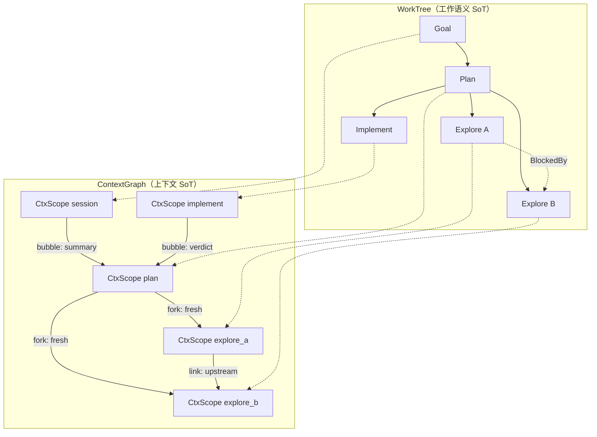

# WorkItem × ContextGraph 分层透传方案设计

**文档类型:** 详细架构设计（目标驱动）
**Domain:** D7 Orchestration（D7-S1 WorkModel + D7-S2 SessionOrchestrator + D7-S3 WaveScheduler + D2 ContextEngine）
**Status:** Active — F1 契约已落地（Review 通过 2026-06-26）
**Version:** 0.2.0
**Last Updated:** 2026-06-26
**Parent:** `d7-domain.md` · `workitem-pipeline-unification-design.md` · `pipeline-architecture.md` · `design.md`
**Related Tech Debt:** `openspec/tech-debt/worktree-v2-deferred.md` (TD-WT-04 跨 Session UI；上下文分区存储待登记)

> **Change 意图（工作标题）：** `devrix-d7-workitem-context-graph`
>
> 在 **WorkTree 工作语义树** 之上引入正交维度 **ContextGraph**：每个 WorkItem 绑定独立 `ContextScope`；子上下文向父、同层 sibling 之间的透传 **默认隔离**，由 LLM 提案 + 规则引擎 materialize（对称于 `SpawnPolicyEvaluator`）。

---

## §0 根本目标（North Star — 不可妥协）

| ID | 根本目标 | 可验证承诺 | 失败即否决 |
|----|----------|------------|------------|
| **CG1** | **每层 WorkItem 有对应 ContextScope** | 每个非 Ephemeral WorkItem 创建时绑定 `ContextScopeID`；Execute 前可 Resolve 出 `ResolvedContext` | 全 session 单桶 history，无法按 WI 审计 |
| **CG2** | **默认隔离，显式链接** | 子/sibling 上下文 **不自动** 合并；任何透传必须产生 `ContextLinkRecord` | 隐式继承 Leader 全量 history |
| **CG3** | **LLM 提案，规则裁决** | Plan 阶段可输出 `ContextLinkSpec` / `ContextBubbleSpec`；**链接/Bubble 种类与 budget 门控** 由规则引擎决定 | LLM 一次调用直接打开 full history 透传 |
| **CG4** | **结构化优先于全文** | 垂直 bubble 默认 `LastRound` + Artifact summary；`full_tail` 需 token budget 且可降级 | 子节点全文无门控灌入父 Observe |
| **CG5** | **WorkTree 仍是工作语义 SoT** | ContextGraph 不替代 Status/Spawn/BlockedBy；Wave `TaskNode` 仅为 Execute 投影 | Context 边驱动 spawn 或 status 迁移 |

### 非目标（Explicit Non-Goals）

| 非目标 | 说明 |
|--------|------|
| 替换 D2 Session 持久化 | D2 仍拥有 message/tool result store；D7 只定义 **分区键与链接语义** |
| 保证 LLM 选对的链接 | D7 负责结构与门控，错误链接由 Verify/Learn 纠正 |
| 一次 PR 落地存储改造 | 分 Phase F1–F6；F1 仅契约 + 单测 |
| 跨 Session 卡片 UI | 归 TD-WT-04；本方案只定义 `SourceSession` 继承时的 Context 复制策略 |

---

## §1 问题陈述（现状 vs 目标）

### 1.1 现状（v0.6 WorkItem Pipeline 合流后）

```
WorkTree (D7-S1)                    Context (D2 + D7-S3)
  ParentID / BlockedBy                Session 级 message 单桶
  LastRound (结构化信号)               Sidechain 按 session/agent，未绑定 wi_*
  SpawnPolicy / RoundPhase              Wave ContextPolicy 仅在 TaskNode 投影时存在
                                      SubTurn brief/fork/full 与 WorkItem 无绑定
```

**缺口：**

1. WorkTree 有层级，Context 无 **1:1 WorkItem 分区**
2. 子 → 父仅 `LastRound` 结构化 bubble，**叙事/关键轮次** 透传无契约
3. 同层 sibling 关系未形式化，无法回答「A 的上下文是否该给 B」
4. `WaveNodesFromSubtree` 对 sibling 一律 `ContextFresh`，**BlockedBy 依赖链** 未自动映射为 `ContextUpstream`

### 1.2 目标态

```
RunItemPipeline(focus)
  Observe  ← MaterializeContext(focus)     // 读 ContextScope + Links
  Plan     → ContextLinkProposer (LLM)     // 提案 sibling/child 链接
          → ContextBubbleProposer (LLM)    // 提案向上 bubble 级别
  Decide   → ContextLinkEvaluator (规则)     // materialize links
          → ContextBubbleEvaluator (规则)
          → SpawnPolicyEvaluator (已有)
  Execute  ← ResolvedContext per WorkItem
  ...
```

---

## §2 两维模型：WorkTree × ContextGraph



| 维度 | 边类型 | 存储位置 | 驱动执行 |
|------|--------|----------|----------|
| **WorkTree** | `ParentID`（垂直） | `workmodel.WorkItem` | focus、spawn、status |
| **WorkTree** | `BlockedBy` / `Blocks`（同层 DAG） | `workmodel.WorkItem` | GetReadyItems、Wave DependsOn |
| **ContextGraph** | `ContextLink`（垂直 bubble / 水平 share） | `workmodel.ContextLinkRecord` | MaterializeContext、Wave ContextPolicy |

**不变式 I-CG1：** 每条 `ContextLink` 必须引用两端 `ContextScopeID` 与 `WorkItemID`。
**不变式 I-CG2：** `ContextLink` 不得单独创建/删除 WorkItem（WorkTree 领先）。
**不变式 I-CG3：** Ephemeral WorkItem（Checklist、ParallelExplore 投影）**无**独立持久 ContextScope。

---

## §3 核心抽象

### 3.1 ContextScope

```go
// 位置建议: workmodel/context_scope.go
type ContextScope struct {
    ID            string
    SessionID     string
    WorkItemID    string              // 1:1；Ephemeral WI 为空
    SidechainKey  string              // D2 sidechain 分区键，建议 "wi_<id>"
    PersistScope  plan.PersistScope   // Transient | Session | Permanent
    CreatedAt     time.Time
}
```

| 字段 | 说明 |
|------|------|
| `SidechainKey` | D2 `SidechainLoader.Load(session, agentID)` 的 agentID 映射 |
| `PersistScope` | 对齐 Plan PP-3；Transient 不参与跨 Turn 全文 bubble |

### 3.2 WorkItem 扩展（v3 建议）

```go
type WorkItem struct {
    // ...existing Status, RoundPhase, LastRound, BlockedBy...
    ContextScopeID string           // 绑定 ContextScope
    ContextPolicy  ContextLinkKind  // 物化后的默认链接策略（规则写入，非 LLM 直写）
}
```

### 3.3 ContextLinkKind（水平 + 物化目标）

```go
type ContextLinkKind string

const (
    LinkFresh         ContextLinkKind = "fresh"          // 无历史，仅 Directive
    LinkUpstream      ContextLinkKind = "upstream"       // 依赖 Artifact / summary
    LinkShareSummary  ContextLinkKind = "share_summary"  // 同层兄弟 LastRound 摘要
    LinkShareScope    ContextLinkKind = "share_scope"    // FileScope / 工具结果子集
    LinkResume        ContextLinkKind = "resume"         // sidechain 续跑
)
```

**与 Wave `ContextPolicy` 映射：**

| ContextLinkKind | Wave ContextPolicy | ResolvedContext 内容 |
|-----------------|-------------------|----------------------|
| `fresh` | `ContextFresh` | Directive + FileScope |
| `upstream` | `ContextUpstream` | Upstream Artifact summary/files |
| `share_summary` | `ContextUpstream`（summary-only） | 兄弟 `LastRound` 压缩摘要 |
| `share_scope` | `ContextFresh` + System 注入 | scope 字符串，无全文 history |
| `resume` | `ContextResume` | sidechain.Load + Directive |

### 3.4 ContextBubbleKind（垂直：子 → 父/祖先）

```go
type ContextBubbleKind string

const (
    BubbleNone        ContextBubbleKind = "none"
    BubbleStructured  ContextBubbleKind = "structured"   // 仅 LastRound LP-5（规则强制）
    BubbleSummary     ContextBubbleKind = "summary"      // + Artifact.Summary
    BubbleKeyMessages ContextBubbleKind = "key_messages" // LLM 标注关键轮次
    BubbleFullTail    ContextBubbleKind = "full_tail"    // 最后 N 轮，budget 门控
)
```

### 3.5 提案与审计结构

```go
type ContextLinkSpec struct {
    FromWorkItemID string
    ToWorkItemID   string
    Kind           ContextLinkKind
    MaxTokens      int
    Rationale      string            // 审计；非决策依据
}

type ContextBubbleSpec struct {
    TargetWorkItemID string            // 父或指定祖先
    Kind             ContextBubbleKind
    MaxTokens        int
    Rationale        string
}

type ContextLinkRecord struct {
    ID           string
    FromScopeID  string
    ToScopeID    string
    Kind         ContextLinkKind
    ProposedBy   string              // "llm" | "rule:R2_dependency" | ...
    TokenCost    int
    AppliedAt    time.Time
}
```

---

## §4 WorkTree 层级 ↔ 默认 Context 策略

| 层级 | WorkKind 示例 | 默认 ContextPolicy | PersistScope 建议 |
|------|---------------|-------------------|-------------------|
| L0 | Session / Goal | 继承 SessionContext（用户消息 + prior） | Session |
| L1 | Plan、高 uncertainty Goal | `ForkFromParent(summary)` | Session |
| L2 | Explore（decompose 子项） | `fresh` | Session 或 Transient |
| L2 | Implement | `fresh`；有 BlockedBy → `upstream` | Session |
| L2 | Verify / HumanReview | `fresh` + 注入父 Structured | Transient |
| — | Checklist / ParallelExplore ephemeral | **无** ContextScope | Transient |

---

## §5 同层 Sibling 关系 Taxonomy

**定义：** `Sibling(a,b) ⟺ a.ParentID == b.ParentID` 且均非 Ephemeral（R6 除外）。

| ID | 关系 | 识别条件 | 典型场景 | 默认 Context | LLM 可提案 |
|----|------|----------|----------|--------------|------------|
| **R1** | 独立并行 | 无互指 BlockedBy；`SpawnDecompose` 创建 | 假设 A/B | **隔离**（各自 fresh） | `share_summary`（需规则批准） |
| **R2** | 依赖链 | `b.BlockedBy ∋ a.ID` | 顺序 implement | **upstream(a→b)** 自动 | 不可关闭 |
| **R3** | 并行批次 | 同 Parent + `ExecPolicyParallelOK` | Wave batch | 隔离；父聚合 Artifact | 否 |
| **R4** | 竞争探索 | `SpawnParallelExplore` | Scenario 探测 | 无持久 WI；写父 LastRound | 不适用 |
| **R5** | 审查门控 | `IsHumanReviewItem` | daily limit escalate | 只读父 Structured | 否 |
| **R6** | 清单投影 | `WorkKindChecklist` + Ephemeral | todo_write | 无 LLM ctx | 否 |

### 5.1 分类算法（规则层）

```go
func ClassifySiblingRelation(a, b *WorkItem) SiblingRelation {
    if contains(a.BlockedBy, b.ID) { return DependentFrom(b, a) }
    if contains(b.BlockedBy, a.ID) { return DependentFrom(a, b) }
    if a.Ephemeral || b.Ephemeral { return Projection }
    if a.Policy == ExecPolicyParallelOK && b.Policy == ExecPolicyParallelOK {
        return ParallelBatch
    }
    return Independent
}
```

### 5.2 同层链接决策表

| 关系 | 默认链接 | LLM `ContextLinkSpec` | 规则裁决 |
|------|----------|----------------------|----------|
| R1 独立并行 | 无 | 可提案 `share_summary` | CL3: 需 Parent LastRound.SpawnDecompose |
| R2 依赖链 | `upstream` | 不允许关闭 | CL0: 强制 materialize |
| R3 并行批次 | 无 | 拒绝 | CL4 |
| R5 审查 | 无 | 拒绝 | CL5 |
| R6 | 无 | 拒绝 | CL6 |

---

## §6 垂直透传：子 Context → 父 Context

### 6.1 结构化通道（规则强制 — 与 Pipeline 已有能力对齐）

```
Child.LastRound ──► Parent 聚合 / ReevaluateParentAfterChild
                  ──► Parent 下一轮 Observe 输入（LP-5 字段）
```

**字段：** `ObservationIDs`, `PlanID`, `VerdictID`, `VerdictKind`, `UncertaintyMean`, `SpawnPolicy`

**特点：** 等价于 `BubbleStructured`；**不可**被 LLM 关闭（对齐 Pipeline G2）。

### 6.2 叙事通道（LLM 提案 + ContextBubbleEvaluator）

**插入点：** `Plan` 之后、`Execute` 之前（与 Spawn 决策同级）。

| 规则 | 条件 | 裁决 |
|------|------|------|
| **CB0** | 默认 | `BubbleStructured` only |
| **CB1** | child `PersistScope=Transient` | 禁止 `full_tail` / `key_messages` |
| **CB2** | `depth >= MaxDecomposeDepth` | 最高 `BubbleSummary` |
| **CB3** | 提案 token > budget | 降级 `full_tail` → `summary` → `structured` |
| **CB4** | `VerdictFail` + exploratory PlanKind | 允许 `BubbleKeyMessages` |
| **CB5** | `IsHumanReviewItem` pending | `BubbleNone`（防泄露） |
| **CB6** | EscapeEngine budget 耗尽 | `BubbleStructured` only |

---

## §7 水平透传：ContextLinkEvaluator 规则（草案 CL0–CL8）

| 规则 | 条件 | 裁决 |
|------|------|------|
| **CL0** | R2 依赖链 | 强制 `LinkUpstream(From→To)` |
| **CL1** | R1 + LLM 提案 `share_summary` + Parent SpawnDecompose | 允许；写 `ContextLinkRecord` |
| **CL2** | R1 + 无提案 | 无链接 |
| **CL3** | 跨层链接（非 sibling） | 拒绝（仅 vertical bubble 允许） |
| **CL4** | R3 ParallelBatch | 拒绝 sibling 链接 |
| **CL5** | R5 HumanReview | 拒绝 |
| **CL6** | R6 Ephemeral | 拒绝 |
| **CL7** | `MaxTokens` 超限 | 降级为 `share_summary` 或拒绝 |
| **CL8** | 形成 Context 环 | 拒绝 |

---

## §8 与 MUPS Pipeline 集成

### 8.1 节点扩展（相对 `workitem-pipeline-unification-design.md`）

```
Observe → Plan → [ContextProposer] → Execute → Verify → Learn → Decide
                      ↓
            ContextLinkEvaluator + ContextBubbleEvaluator
                      ↓
            MaterializeContextLinks + ApplySpawnPolicy
```

### 8.2 Plan 输出扩展

```go
type ItemPlanOutput struct {
    Plan             *plan.Plan
    ChildSpecs       []ChildSpec           // 已有
    ContextLinkSpecs []ContextLinkSpec     // 新增
    ContextBubbleSpec *ContextBubbleSpec   // 新增
}
```

### 8.3 Decide 阶段顺序（不可乱序）

1. `EvaluateContextLinks(round, specs)` → 写 link records + `WorkItem.ContextPolicy`
2. `EvaluateContextBubble(round, spec)` → 写 bubble 级别至 `LastRound` 扩展字段或 sidecar
3. `EvaluateSpawnPolicy(round, treeCtx)` — 已有
4. `ApplyContextLinks` → `ApplySpawnPolicy` — 已有 spawn；新增 link apply

### 8.4 MaterializeContext（Execute 前）

```go
func MaterializeContext(sessionID string, item *WorkItem, tm *TaskManager) (wavescheduler.ResolvedContext, error)
```

实现路径：
1. 读 `item.ContextScopeID` → 加载 messages/sidechain
2. 读入站 `ContextLinkRecord`（upstream / share_summary）
3. 合并为 `ResolvedContext`（与 `ContextResolver.Resolve` 同构）

---

## §9 与现有代码映射

| 现有组件 | 文件 | 本方案中的角色 |
|----------|------|----------------|
| WorkTree / WorkItem | `workmodel/workitem.go` | 工作语义 SoT；扩展 ContextScopeID |
| BlockedBy | `workmodel/work_tree.go` | R2 依赖链 → CL0 自动 upstream |
| LastRound | `workmodel/pipeline_round.go` | BubbleStructured 载体 |
| ContextResolver | `wavescheduler/context.go` | MaterializeContext 物化引擎 |
| ContextPolicy | `wavescheduler/types.go` | LinkKind 投影目标 |
| SubTurn brief/fork/full | `sessionorchestrator/subturn.go` | ContextScope 历史加载模式 |
| WaveNodesFromSubtree | `workmodel/worktree_wave.go` | 应读 `WorkItem.ContextPolicy` 而非写死 Fresh |
| PersistScope | `plan/` PP-3 | ContextScope 生命周期 |
| SpawnPolicyEvaluator | `workmodel/spawn_policy.go` | 对称设计参考 |

---

## §10 可观测与审计

| Span | 标签 |
|------|------|
| `orchestration.context.link` | `from_wi`, `to_wi`, `kind`, `proposed_by`, `token_cost` |
| `orchestration.context.bubble` | `from_wi`, `to_wi`, `kind`, `downgraded` |
| `orchestration.context.materialize` | `wi_id`, `policy`, `message_count` |

**ResolveHint 扩展（建议）：**

```
Resolve: sibling wi_a upstream wi_b (rule:R2) — artifact summary injected.
Resolve: bubble to parent = summary (LLM proposed, rule CB3 clamped).
```

---

## §11 分 Phase 交付

| Phase | 交付 | 验收目标 | Feature Flag |
|-------|------|----------|--------------|
| **F1** | `ContextScope` + `ContextLinkKind` + Sibling taxonomy 单测 | CG1 契约 | — |
| **F2** | `ContextBubbleEvaluator` CB0–CB6；父 Observe 读 structured bubble | CG4 | — |
| **F3** | R2 自动 `LinkUpstream`；decompose 兄弟默认隔离 | CG2 | `D7_WORKITEM_CONTEXT_GRAPH=1` |
| **F4** | Plan `ContextLinkSpec` / `ContextBubbleSpec` + LLM proposer + CL0–CL8 | CG3 | 同上 |
| **F5** | D2 sidechain 分区 `wi_<id>`；ContextScope 持久化 | CG1 运行时 | 同上 |
| **F6** | `/task context show`、ResolveHint、集成测试 | 可运维 | 同上 |

**依赖：** Phase F3+ 建议在 `D7_WORKITEM_PIPELINE=1` 启用前提下验收（ingress 已走 `RunSessionTurnLoop`）。

---

## §12 验收场景（Gherkin 摘要）

```gherkin
Scenario: 同层 decompose 兄弟默认隔离 (CG2)
  Given 父 WorkItem SpawnDecompose 创建 wi_a 与 wi_b，无 BlockedBy
  When MaterializeContext(wi_a) 与 MaterializeContext(wi_b)
  Then 两者 Messages 均不含对方 sidechain 全文
  And 无 ContextLinkRecord 除非 LLM 提案且 CL1 通过

Scenario: BlockedBy 自动 upstream (R2 / CL0)
  Given wi_b.BlockedBy 含 wi_a，且 wi_a 已完成并产生 Artifact
  When MaterializeContext(wi_b)
  Then ResolvedContext 含 wi_a 的 upstream summary
  And ContextLinkRecord.proposed_by = "rule:R2_dependency"

Scenario: 结构化 bubble 不可关闭 (CG4 / CB0)
  Given 子 WorkItem 完成 pipeline 产生 LastRound
  When ContextBubbleEvaluator 运行且 LLM 提案 BubbleNone
  Then 父 Observe 仍收到 BubbleStructured（VerdictID + PlanID）

Scenario: full_tail 超 budget 降级 (CB3)
  Given LLM 提案 BubbleFullTail max_tokens=8000，session budget=2000
  When ContextBubbleEvaluator 运行
  Then 裁决为 BubbleSummary
  And span 标记 downgraded=true
```

---

## §13 开放问题（待 Review 拍板）

| OQ | 问题 | 建议默认 | 影响目标 |
|----|------|----------|----------|
| OQ-CG-1 | ContextScope 物理存储：WorkTree disk store 内嵌 vs 独立 store | **WorkTree v3 字段 + D2 sidechain 分区** | CG1 |
| OQ-CG-2 | `share_summary` 是否允许 sibling 间互相链接 | **仅单向：已完成 → pending** | CG2 防环 |
| OQ-CG-3 | BubbleKeyMessages 谁标注关键轮次 | **Plan LLM 输出 message_id 列表，Verify 校验存在** | CG3 |
| OQ-CG-4 | Wave 投影：ContextPolicy 来自 WorkItem 还是 Plan | **WorkItem.ContextPolicy SoT，Plan 仅提案** | CG5 |
| OQ-CG-5 | 与 SubTurn brief/fork/full 的统一 | **ContextScope.LoadMode 枚举映射** | 实现复杂度 |

---

## §14 与 Pipeline 统一方案的关系

| Pipeline 目标 | ContextGraph 关系 |
|---------------|-------------------|
| G1 递归探索 | R1 兄弟隔离 + 父 Structured bubble 汇总 |
| G2 可审计信号 | BubbleStructured = LastRound；Link/Bubble Proposal 入审计 |
| G3 LLM 不独断 | 对称 SpawnPolicy：ContextLink/Bubble Evaluator |
| G4 WorkTree SoT | ContextGraph 正交，不新增工作语义边 |
| G5 Turn Loop | MaterializeContext 在每次 `RunItemPipeline` Observe 前 |

**阅读顺序：** 先 `workitem-pipeline-unification-design.md`（纵轴 spawn），再本文（横/纵 Context 透传）。

---

## §15 修订记录

| Version | Date | Changes |
|---------|------|---------|
| 0.1.0 | 2026-06-26 | 初稿：CG1–CG5、Sibling taxonomy R1–R6、Bubble/Link 规则、Phase F1–F6、OQ-CG-1..5 |
