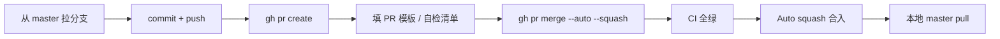

# Git 与 PR 工作流规范（单人团队）

**版本:** 1.0.0
**状态:** Active
**最后更新:** 2026-06-16
**所属阶段:** S4 实现 → S6 交付
**关联规范:** `master.md` · `review-code.md` · `archiving.md`
**适用对象:** 人类开发者 · **Cursor Agent** · **Claude Code** · 其他 IDE Agent

> **权威 SoT：** 本文件是 Devrix 仓库 Git/PR/CI/Auto-merge 的**唯一规范入口**。Agent 执行 push、开 PR、盯 CI、合入时**必须先读本文件**，不得凭记忆操作。

---

## 1. 团队模型与门禁哲学

Devrix 当前为 **单人维护**（solo maintainer）。GitHub **不允许 PR 作者 approve 自己的 PR**，因此：

| 门禁层 | 单人团队策略 | 说明 |
|--------|-------------|------|
| **必须走 PR** | ✅ 保留 | 禁止直接 push `master` |
| **CI 全绿** | ✅ 保留 | 3 项 required checks（见 §4） |
| **他人 Approve** | ❌ 关闭（count = 0） | 用 **Agent 自检 + CI** 替代人工 Review |
| **S4-Gate 代码审查** | ✅ 保留（流程内） | Agent 按 `review-code.md` 清单自检并写入 PR 描述 |

团队扩大后：将 `required_approving_review_count` 改回 `1`（见 §9）。

---

## 2. 仓库设置（Canonical）

以下配置已在 `fqntxmqee/devrix` 落地，变更前须在 PR 中说明理由。

### 2.1 分支保护 — `master`

| 项 | 值 |
|----|-----|
| Require PR before merging | ✅ |
| Required status checks (strict) | `unit tests` · `integration / e2e / acceptance` · `layer-lint (strict gate)` |
| Require approvals | ✅（count = **0**） |
| Dismiss stale reviews | ✅ |
| Require code owner reviews | ❌ |
| Enforce admins | ✅ |
| Allow force pushes | ❌ |
| Allow deletions | ❌ |

### 2.2 合并与 Auto-merge

| 项 | 值 |
|----|-----|
| Allow auto-merge | ✅ |
| 默认合并方式 | **Squash merge** |
| Delete head branch after merge | 推荐（`gh pr merge --delete-branch` 或 GitHub 默认） |

### 2.3 禁止操作

- ❌ `git push origin master`（直接推主分支）
- ❌ `git push --force` 到 `master`
- ❌ 跳过 CI 合并（`--admin` 绕过除非紧急热修且事后补验收）
- ❌ 未跑关联 T 测试就标 PR ready

---

## 3. 分支命名

采用 **GitHub Flow**（见 `master.md` §3.1）：

```
main / master          # 生产分支（本仓库为 master）
├── feat/<change-id>   # 功能 / 需求变更
├── fix/<change-id>    # 缺陷修复
├── docs/<topic>       # 仅文档（如 docs/domain-terminal-guides）
├── refactor/<scope>   # 重构
└── hotfix/<desc>      # 紧急修复（48h 内补 demand + 归档）
```

规则：**一个 Change 一个分支**；从 `origin/master` 拉出，合回 `master`。

---

## 4. CI 必过检查

PR 合并前以下检查必须 **SUCCESS**：

| Check | Workflow | 说明 |
|-------|----------|------|
| `unit tests` | `ci` | 单元测试 |
| `integration / e2e / acceptance` | `ci` | 集成 / 验收 |
| `layer-lint (strict gate)` | `layer-lint` | 分层 import 硬门禁 |

可选参考（非 required）：`layer-lint (warn)`、`coverage`。

查看状态：

```bash
gh pr checks <PR_NUMBER>
gh pr view <PR_NUMBER> --json mergeStateStatus,statusCheckRollup
```

---

## 5. 标准 PR 生命周期



### 5.1 PR 标题

```
<type>(<scope>): <subject>
```

或 OpenSpec Change 场景：

```
<change-id>: <简短描述（≤50 字）>
```

遵循 Conventional Commits（见 `master.md` §3.2）。

### 5.2 PR 描述必含

| 章节 | 内容 |
|------|------|
| Summary | 1–3 条变更摘要 |
| 关联 | `Demand: DM-YYYYMMDD-NNN` · `Change: <change-id>` · 关联 L5/T ID |
| Test plan | 可勾选 checklist |
| S4-Gate 自检 | Agent 按 `review-code.md` 填「已检查 / 不适用」表（单人团队替代他人 Review） |
| 领域文档同步 | 若动规格，列出更新的 `openspec/specs/` 路径（对齐 `acceptance-report` §领域文档同步） |

### 5.3 Draft → Ready

- **S3 设计完成**：可建 Draft PR（`gh pr create --draft`）
- **S4 任务完成 + 本地测试绿**：`gh pr ready`

---

## 6. Auto-merge 操作手册

### 6.1 开启 Auto-merge（Agent 默认在 CI 前开启）

```bash
# 确保仓库已 allow_auto_merge（一次性，仓库 Settings 或 API）
gh api repos/fqntxmqee/devrix --jq .allow_auto_merge

# 对当前 PR 开启 squash auto-merge
gh pr merge <PR_NUMBER> --auto --squash
```

### 6.2 阻塞原因排查

| `mergeStateStatus` | 常见原因 | 处理 |
|--------------------|----------|------|
| `BLOCKED` | CI pending / failed | `gh pr checks`；失败则修代码 push |
| `BLOCKED` | `REVIEW_REQUIRED` 且 count ≥ 1 | 将 count 改为 0（§9.1）或请他人 approve |
| `BLOCKED` | 冲突 | `git fetch && git rebase origin/master` 后 force-with-lease push 到**功能分支** |

### 6.3 合入后本地同步

```bash
git checkout master
git pull origin master
```

---

## 7. Agent 执行清单（Cursor / Claude）

用户要求交付、push、合 PR 时，Agent **按序执行**，无需逐步向用户确认（除非破坏性操作）：

1. **确认分支** — 不在 `master` 上开发；无分支则 `git checkout -b <type>/<topic>`
2. **提交** — 仅当用户明确要求或交付管线 S4 完成时 commit；message 用 Conventional Commits
3. **Push** — `git push -u origin HEAD`
4. **开 PR** — `gh pr create --base master`；body 含 §5.2 章节
5. **开 Auto-merge** — `gh pr merge <N> --auto --squash`
6. **盯 CI** — `gh pr checks <N>` 直至 required 三项全 pass
7. **汇报** — 给出 PR URL、CI 结果、合入 commit SHA；合入后提醒 `git pull`

**不得：** 直接 `git push origin master`；未经用户要求 `git push --force`；在 CI 失败时绕过保护合并。

### 7.1 命令速查

```bash
# 创建并推送分支
git checkout -b feat/my-change
git push -u origin HEAD

# 创建 PR
gh pr create --base master --title "feat(scope): subject" --body "$(cat <<'EOF'
## Summary
- ...

## Test plan
- [ ] ...

## S4-Gate 自检
- [ ] OpenSpec 文件齐全
- [ ] 关联 T 已登记
- [ ] layer-lint 本地通过
EOF
)"

# Auto-merge + 盯 CI
gh pr merge --auto --squash
gh pr checks
gh pr view --json state,mergedAt,mergeStateStatus
```

---

## 8. 单人团队的 S4-Gate 替代

无第二 Reviewer 时，**不降低质量标准**，只改变签收方式：

| 原 S4-Gate | 单人替代 |
|------------|----------|
| 他人 Code Review | Agent 按 `review-code.md` §2 全表自检 |
| Approve PR | CI 全绿 + `required_approving_review_count: 0` |
| 审查记录 | PR 描述「S4-Gate 自检」章节 + CI 链接 |

安全/权限类变更：自检清单 **全部勾选** 并在 PR 中附测试结果链接。

---

## 9. 团队扩大时的升级路径

### 9.1 恢复人工 Review

```bash
gh api repos/fqntxmqee/devrix/branches/master/protection -X PUT --input - <<'EOF'
{
  "required_status_checks": {
    "strict": true,
    "checks": [
      {"context": "unit tests", "app_id": 15368},
      {"context": "integration / e2e / acceptance", "app_id": 15368},
      {"context": "layer-lint (strict gate)", "app_id": 15368}
    ]
  },
  "enforce_admins": true,
  "required_pull_request_reviews": {
    "dismiss_stale_reviews": true,
    "require_code_owner_reviews": false,
    "required_approving_review_count": 1
  },
  "restrictions": null,
  "required_linear_history": false,
  "allow_force_pushes": false,
  "allow_deletions": false
}
EOF
```

### 9.2 仍建议保留

- PR 门禁 + 3 项 CI
- Squash merge
- Auto-merge（Review 通过后自动合入）

---

## 10. 修订记录

| 版本 | 日期 | 变更 |
|------|------|------|
| 1.0.0 | 2026-06-16 | 初版：单人团队 PR + CI + Auto-merge；固化 master 分支保护与 Agent 清单 |
